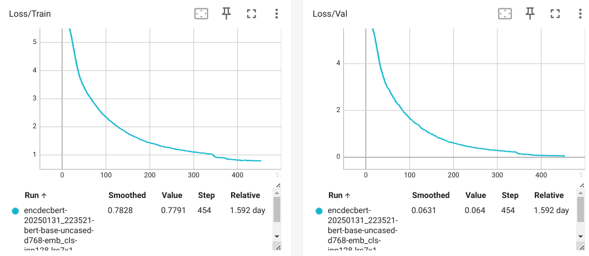

# MLLM - LLM with Memory
<!-- ## GPT
https://huggingface.co/docs/transformers/en/model_doc/openai-gpt
```
pip install spacy ftfy==4.4.3
python -m spacy download en
``` -->
## Approach
### Goal
Reduce LLM parametric memory at the expence of keeping data in nonparametric memory storage.

#### Previous work
Retrieval-Augmented Generation (RAG):
1. Indexing. Documents are split into chunks, encoded into vectors, and stored in a vector database.
2. Retrieval. Retrieve the Top k chunks most relevant to the question based on semantic similarity.
3. Generation. Input the original question and the retrieved chunks together into LLM to generate the final answer.

[Retrieval-Augmented Generation for Large Language Models: A Survey](https://arxiv.org/abs/2312.10997)

#### Current approach
1. Memory stored in embeddings forming hierarchical structure.
2. Higher level embeddings aggregate information of lower leveles.
3. Set of Encoders processing lower level embeddings into higher level. The process starts from document tokens.
4. Set of decoders processing Query embedding and higher level embeddings into ranks showing relevance of input. Decoders "show" direction to relevant documents (parts of the documents).


### Encoder
Encoder 1 properties:
1. Encoder takes limited chunk size (# of tokens) and produces embedding in `CLS` token. For example, for BERTA-like models this embedding has the size of 768 float32 numbers.
2. Lightweight architecture.
3. Chunks-to-document backtracking.
<br>


Encoders hierarchy:
1. `log(N)` encoders, where `N` - size of tokenized index.
2. Encoders standing upper in hierarchy can have more layers as their input decreases exponentially.
3. Encoder output embedding accumulates information of `L` embeddings from previous level.
<br>


### Decoder
Query processing:
1. Query tokenization and embedding are done with `Encoder 1` using the same process as for document index processing. When Query contains more than `L` embeddings it can be represented as embedding chunk.
2. Decoder outputs rank values for input embeddings. For top rank values embedding chunks of Level N+1 retrieved.


### Ranking
1. Each decoder of Level `K-1` takes Query embedding chunk & embedding chunk of level `K`.
2. Decoder `K-1` outputs relevance ranks for each of incoming non-query embeddings.
3. Top `t` embeddings of level `K` are picked as an argmax from Decoder output. For each of these top embeddings corresponding embedding chunk of the next level retrieved.
4. `t` chunks from previous step serve as an input (alongside with Query embedding chunk) to the next Decoder.
5. Level 1 embeddings give the set of relevant documents.
<br>


### LLM
1. The same hierarchy of Decoder-rankers as in previous setup.
2. Top ranked embeddings are gathered from all levels.
3. Resulting LLM gets in its input information of different granularity, from high-level `N+1` embeddings to low-level `1` embeddings.
<br>


### Training
* End-to-end training for levels 1, 2.
* End-to-end training for levels 2, 3.
<br>...
* End-to-end training for levels N, N+1.


### Expected advantages
1. Real-time LLM + Real-time Memory retrieval with the quality of big LLM.
2. Memory mechanism allows to attend any token in a database with log(N) time complexity, where N - size of document database.
3. The memory is easily expandable.
4. Any part of the memory can be removed completely or masked out temporary.


## Experiments
### Encoder-Decoder convergence
Input tokens: 128. d_model=512.

Snapshot: `encdechg-20241216_224415-inp128-pos_emb-lrs7x1-rdc_avg-enh_mmbeg-step2-d512-h8-t1`  
Input texts example:
```
000 Yangliuqing () is a market town in Xiqing District, in the western suburbs of Tianjin, People's Republic of China. Despite its relatively small size, it has been named since 2006 in the "famous historical and cultural market towns in China".\n\nIt is best known in China for creating nianhua or Yangliuqing nianhua. For more than 400 years, Yangliuqing has in effect specialised in the creation of these woodcuts for the New Year.  wood block prints using vivid colourschemes to portray traditional scenes of children's games often interwoven with
001 Orana Australia Ltd is a not-for-profit organisation that provides a diverse range of training and support services to over 650 people with disabilities and their families in South Australia.\n\nHistory\nThe Mentally Retarded Children’s Society of SA Inc. was established in 1950 by a group of parents who wanted education, employment and accommodation opportunities for their children within the local community at a time when institutionalised care in Adelaide was their only alternative.\n\nThe society’s aims were to seek education or training facilities for people with intellectual disabilities, to establish sheltered workshops, and to establish residential hostels.\n\nA number
002 The St. Mary's Church is a church owned by the Church of Denmark in Sønderborg, Denmark and the church of the parish with the same name. Thanks to its location on a hill, the church building is very iconic for the city.\n\nHistory \nIn the Middle Ages there was a leper colony on a hill just outside the city. It was named after Saint George and around 1300 the chapel of this leper colony stood in the place of the present St. Mary's Church. After the old parish church of the city, the St. Nicholas Church, was demolished around 1530, the Saint-George
003 Kalitta may refer to:\n\nConnie Kalitta (born 1938), a retired American drag racer and CEO of the eponymous Kallita Air.\nDoug Kalitta (born 1964), an American drag racer, nephew of Connie Kalitta and owner of Kalitta Charters.\nScott Kalitta (1962-2008), an American drag racer and son of Connie Kalitta.\nKalitta Air, a cargo airline flying Boeing 747 aircraft.\nKalitta Charters, a cargo airline flying medium-sized aircraft.<|pad|><|pad|><|pad|><|pad|><|pad|><|pad|><|pad|><|pad|><|pad|><|pad|><|pad|><|pad|><|pad|><|pad|><|pad|><|pad|><|pad|><|pad|><|pad|><|pad|><|pad|>
004 Where Is Freedom? () is a 1954 Italian comedy-drama film directed by Roberto Rossellini. \n \nThe film had a troubled production because, after shooting some scenes, Rossellini lost interest in the film and abandoned the set. The work was completed after about a year, mainly from Mario Monicelli, with some scenes also shot by Lucio Fulci and Federico Fellini. Despite that, Rossellini is the sole credited director of the film.\n\nPlot \nDifficulties and troubles of an ex-convict. Embittered and disillusioned by life, he will soon plan his
```
Encdec output:
```
000 qliuqing () is a market town in Meiqing District, in the western suburbs of Tianjin, People's Republic of China. Despite its relatively very size, it has been named since 2006 in the "traditional historical and cultural cultural market in China".\n\nIt is best known for names for Qu nianian or Chunghuqing nianian. For more than 400 years, iminguqing, in improved specialised in the creation of these woodcuts for the New States.  Many wood roofs using wide metalesues to display traditional styles of children's games with intersuoven to
001  Hawthana Australia ) is a not-for-profit organisation that provides a diverse range of training and support services to around 650 people with disabilities and their families in South Australia.\n\nHistory\nThe Retally Retarded Children’s Society of SA Inc. was established in 1950 by a group of parents who wanted education, employment and housing opportunities for their children within the local community at a time when institutionalised care in Adelaide was this's work.\n\nThe society’s aims there to providing education or training facilities for people to educational disabilities, to establish community accommodation, and to establish residential hostels.\n\nA number
002  The St. Mary's Church is a church owned by the Church of Denmark in Sønderborg, Denmark and the church of the parish with the same name. Thanks to its location on a hill, the church today is very alternative for the city.\n\nHistory \nIn the Middle Ages there was a leper parish on a hill just outside the city. It was named after Saint George and 12 1300 the priest of this leper parish stood in the place of the time St. Mary's Church. After the old parish church of the city, the St. Nicholas Church, was demolished around 1530, the Saint-St
003 Kalitta may refer to:\n\nOlnie Kalitta (born 1938), a retired American drag racer and CEO of the eponymous Kallitta AG.\nDoug Kalitta (born 1934), an American aircraft builder, nephew of Kelly Kalitta and son of Kalitta Kalters.\nScott Kalitta (1932-1960), an American drag constructor and son of Felix Kalitta.\nKalitta Air, a cargo cargo aircraft aircraft 747 aircraft.,Kalitta Halters, a specialty receivers operating medium-sized aircraft.<|pad|><|pad|><|pad|><|pad|><|pad|><|pad|><|pad|><|pad|><|pad|><|pad|><|pad|><|pad|><|pad|><|pad|><|pad|><|pad|><|pad|><|pad|><|pad|><|pad|><|pad|>
004  Were Is Victory? () is a 1954 Italian comedy-drama film directed by Roberto Rossellini. \n \nThe film had a troubled production because, after shooting some scenes, Rossellini finds interest in the film and abandoned the set. The work was completed after about a year, production from Mario Malicelli, with some scenes also credited by Gustavio Fantini and Federico Fellini. Despite that, Rossellini is the sole accomplished director of the film.\n\nPlot \nConticulties and collaborators of an ex-convict. Emby and disillusioned by life, he will soon resume his
```

### BertEncoder-Decoder convergence
Input tokens: 128. d_model=768. BERT model: `bert-base-uncased`

Snapshot: `encdecbert-20250131_223521-bert-base-uncased-d768-emb_cls-inp128-lrs7x1-enh_mmbb-step2-h12-dp0-t0.0`  
Input texts example:
```
000 [CLS] yangliuqing ( ) is a market town in xiqing district, in the western suburbs of tianjin, people's republic of china. despite its relatively small size, it has been named since 2006 in the " famous historical and cultural market towns in china ". it is best known in china for creating nianhua or yangliuqing nianhua. for more than 400 years, yangliuqing has in effect specialised in the creation of these woodcuts for the new year. wood block prints using vivid colourschemes to portray traditional scenes of children's games often interwoven with auspicious [SEP]
001 [CLS] orana australia ltd is a not - for - profit organisation that provides a diverse range of training and support services to over 650 people with disabilities and their families in south australia. history the mentally retarded children ’ s society of sa inc. was established in 1950 by a group of parents who wanted education, employment and accommodation opportunities for their children within the local community at a time when institutionalised care in adelaide was their only alternative. the society ’ s aims were to seek education or training facilities for people with intellectual disabilities, to establish sheltered workshops, and to establish residential hostels. a number of sheltered workshops were established, and [SEP]
002 [CLS] the st. mary's church is a church owned by the church of denmark in sønderborg, denmark and the church of the parish with the same name. thanks to its location on a hill, the church building is very iconic for the city. history in the middle ages there was a leper colony on a hill just outside the city. it was named after saint george and around 1300 the chapel of this leper colony stood in the place of the present st. mary's church. after the old parish church of the city, the st. nicholas church, was demolished around 1530, the saint - george [SEP]
003 [CLS] kalitta may refer to : connie kalitta ( born 1938 ), a retired american drag racer and ceo of the eponymous kallita air. doug kalitta ( born 1964 ), an american drag racer, nephew of connie kalitta and owner of kalitta charters. scott kalitta ( 1962 - 2008 ), an american drag racer and son of connie kalitta. kalitta air, a cargo airline flying boeing 747 aircraft. kalitta charters, a cargo airline flying medium - sized aircraft. [SEP] [PAD] [PAD] [PAD] [PAD] [PAD] [PAD] [PAD] [PAD] [PAD] [PAD] [PAD] [PAD] [PAD] [PAD] [PAD] [PAD] [PAD] [PAD] [PAD] [PAD] [PAD] [PAD] [PAD] [PAD] [PAD] [PAD] [PAD]
004 [CLS] where is freedom? ( ) is a 1954 italian comedy - drama film directed by roberto rossellini. the film had a troubled production because, after shooting some scenes, rossellini lost interest in the film and abandoned the set. the work was completed after about a year, mainly from mario monicelli, with some scenes also shot by lucio fulci and federico fellini. despite that, rossellini is the sole credited director of the film. plot difficulties and troubles of an ex - convict. embittered and disillusioned by life, he will soon plan his return to prison. cast to [SEP]
```
Bert Encdec output:
```
000 [CLS] yangliuqing ( ) is a market town in xiqing district, in the western suburbs of tianjin, people's republic of china. despite its relatively small size, it has been named since 2006 in the " famous historical and cultural market towns in china ". it is best known in china for creating nianhua or yangliuqing nianhua. for more than 400 years, yangliuqing has in effect specialised in the creation of these woodcuts for the new year. wood block prints using vivid colourschemes to portray traditional scenes of children's games often interwoven with auspicious [SEP]
001 [CLS] orana australia ltd is a not - for - profit organisation that provides a diverse range of training and support services to over 650 people with disabilities and their families in south australia. history the mentally retarded children ’ s society of sa inc. was established in 1950 by a group of parents who wanted education, employment and accommodation opportunities for their children within the local community at a time when institutionalised care in adelaide was their only alternative. the society ’ s aims were to seek education or training facilities for people with intellectual disabilities, to establish processing workshops, and to establish residential hostels. a number of sheltered workshops were established, and [SEP]
002 [CLS] the st. mary's church is a church owned by the church of denmark in sønderborg, denmark and the church of the parish with the same name. thanks to its location on a hill, the church building is very iconic for the city. history in the middle ages there was a leper colony on a hill just outside the city. it was named after saint george and around 1300 the chapel of this leper colony stood in the place of the present st. mary's church. after the old parish church of the city, the st. nicholas church, was demolished around 1530, the saint - george [SEP]
003 [CLS] kalitta may refer to : connie kalitta ( born 1938 ), a retired american drag racer and ceo of the eponymous kallita air. doug kalitta ( born 1964 ), an american drag racer, nephew of connie kalitta and owner of kalitta charters. scott kalitta ( 1962 - 2008 ), an american drag racer and son of connie kalitta. kalitta air, a cargo airline flying boeing 747 aircraft. kalitta charters, a cargo airline flying medium - sized aircraft. [SEP] [PAD] [PAD] [PAD] [PAD] [PAD] [PAD] [PAD] [PAD] [PAD] [PAD] [PAD] [PAD] [PAD] [PAD] [PAD] [PAD] [PAD] [PAD] [PAD] [PAD] [PAD] [PAD] [PAD] [PAD] [PAD] [PAD] [PAD]
004 [CLS] where is freedom? ( ) is a 1954 italian comedy - drama film directed by roberto rossellini. the film had a troubled production because, after shooting some scenes, rossellini lost interest in the film and abandoned the set. the work was completed after about a year, mainly from mario monicelli, with some scenes also shot by lucio fulci and federico fellini. despite that, rossellini is the sole credited director of the film. plot difficulties and troubles of an ex - convict. embittered and disillusioned by life, he will soon stop his return to prison. according to [SEP]
```

