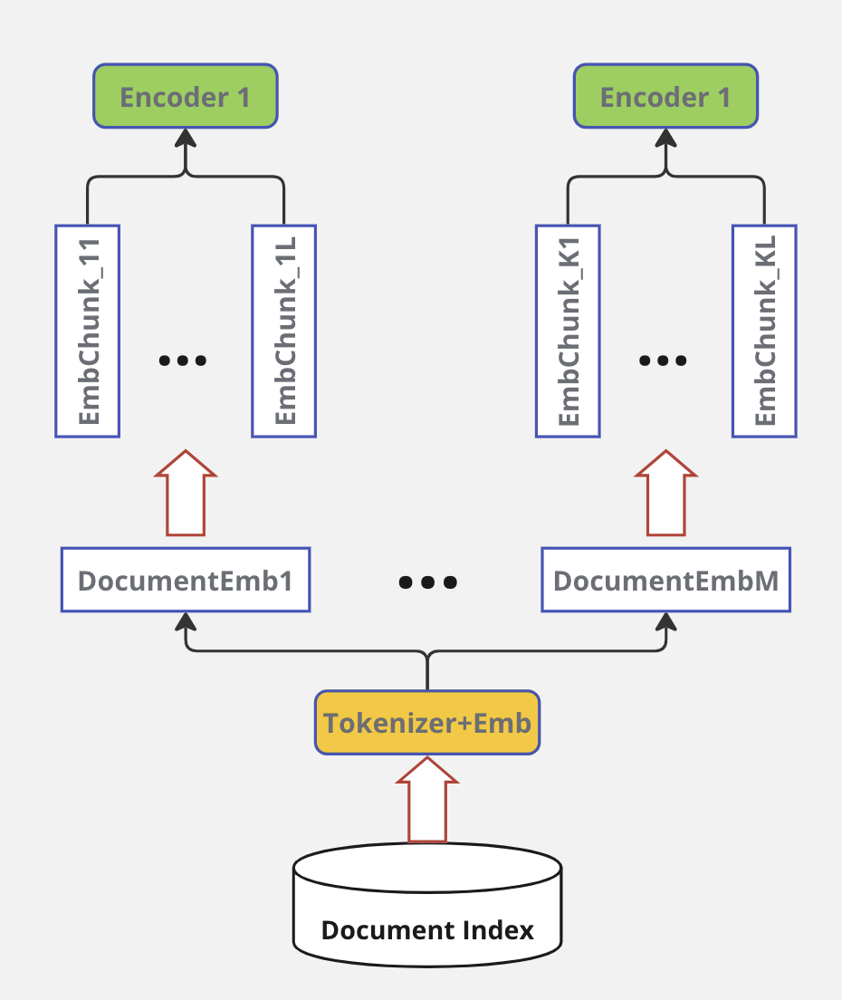
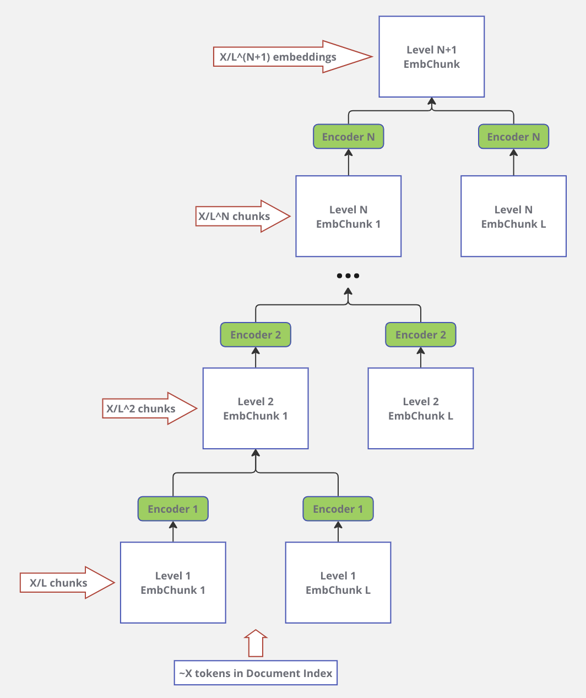
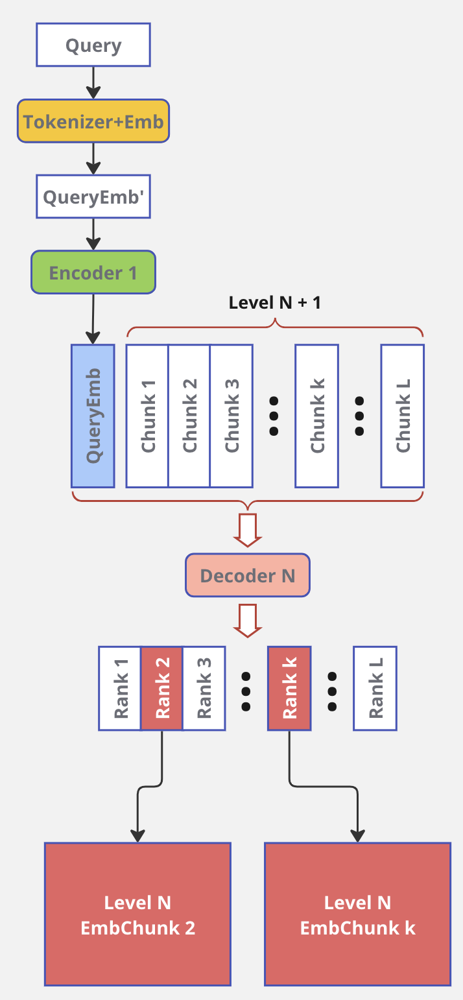
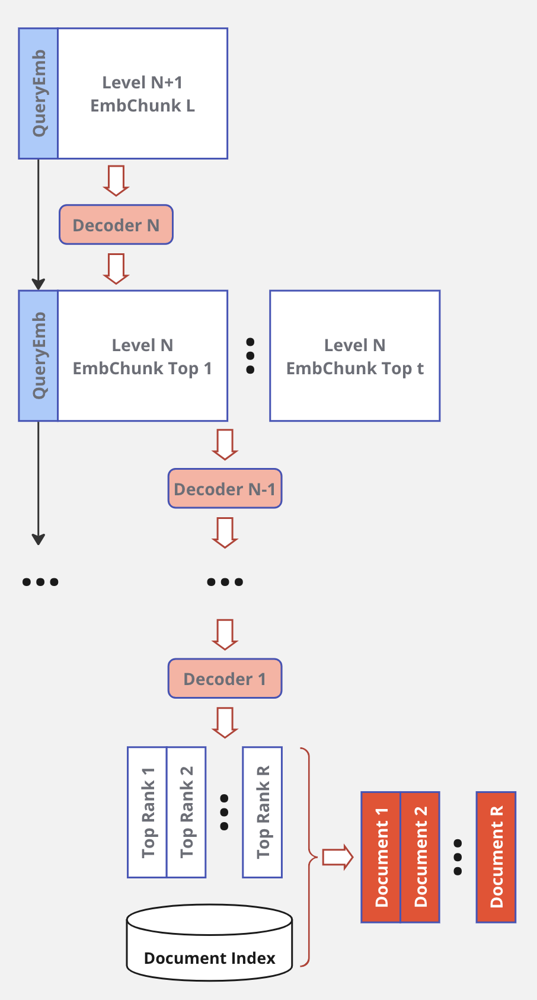
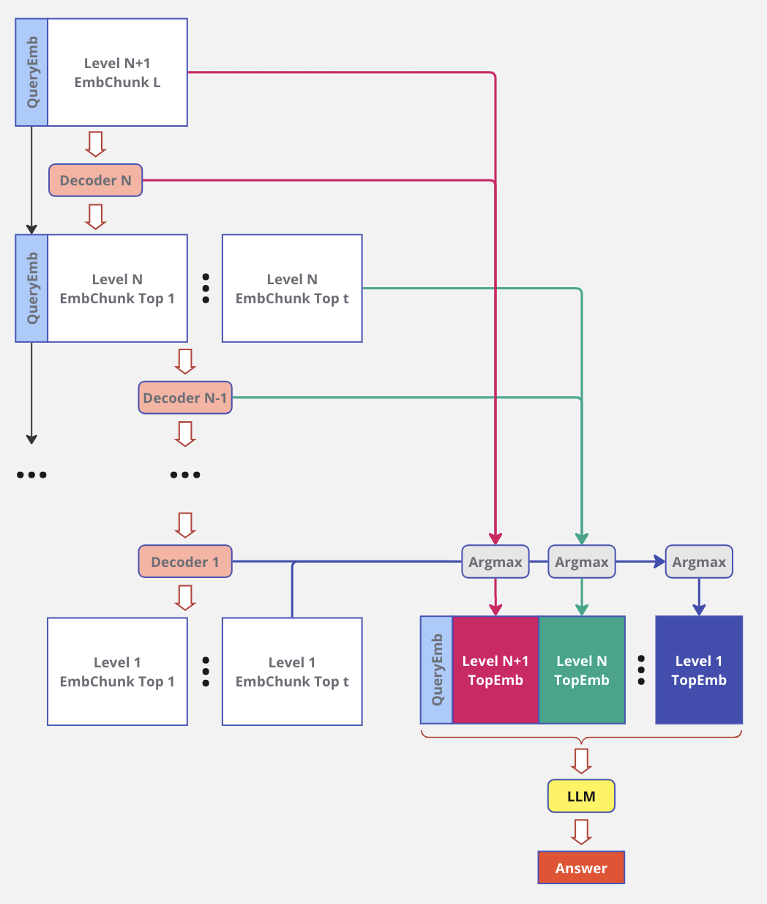

# MLLM - LLM with Memory
<!-- ## GPT
https://huggingface.co/docs/transformers/en/model_doc/openai-gpt
```
pip install spacy ftfy==4.4.3
python -m spacy download en
``` -->
## Approach
### Goal
Reduce LLM parametric memory at the expence of keeping data in nonparametric memory storage.

### Encoder
Encoder 1 properties:
1. Encoder takes limited chunk size (# of tokens) and produces embedding in `CLS` token. For example, for BERTA-like models this embedding has the size of 768 float32 numbers.
2. Lightweight architecture.
3. Chunks-to-document backtracking.
<br>


Encoders hierarchy:
1. `log(N)` encoders, where `N` - size of tokenized index.
2. Encoders standing upper in hierarchy can have more layers as their input decreases exponentially.
3. Encoder output embeding embeds information of `L` embeddings from previous level.
<br>


### Decoder
Query processing:
1. Query tokenization and embedding are done with `Encoder 1` using the same process as for docuement index processing. When Query contains more than `L` embedding it can be represented as embedding chunk.
2. Decoder outputs rank values for input embeddings. For top rank values embedding chunks of Level N+1 retrieved.


### Ranking


### LLM


### Training
Challenging

### Expected advantages
1. Real-time LLM + Real-time Memory retrieval with the quality of big LLM.
2. Memory mechanism allows to attend all tokens in a database with log(N) time complexity, where N - size of document database.
3. The memory is easily expandable.
4. Any part of the memory can be removed completely or masked out temporary.
