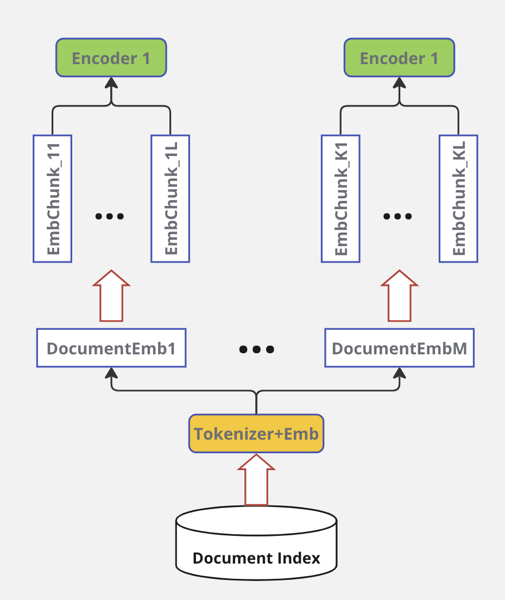
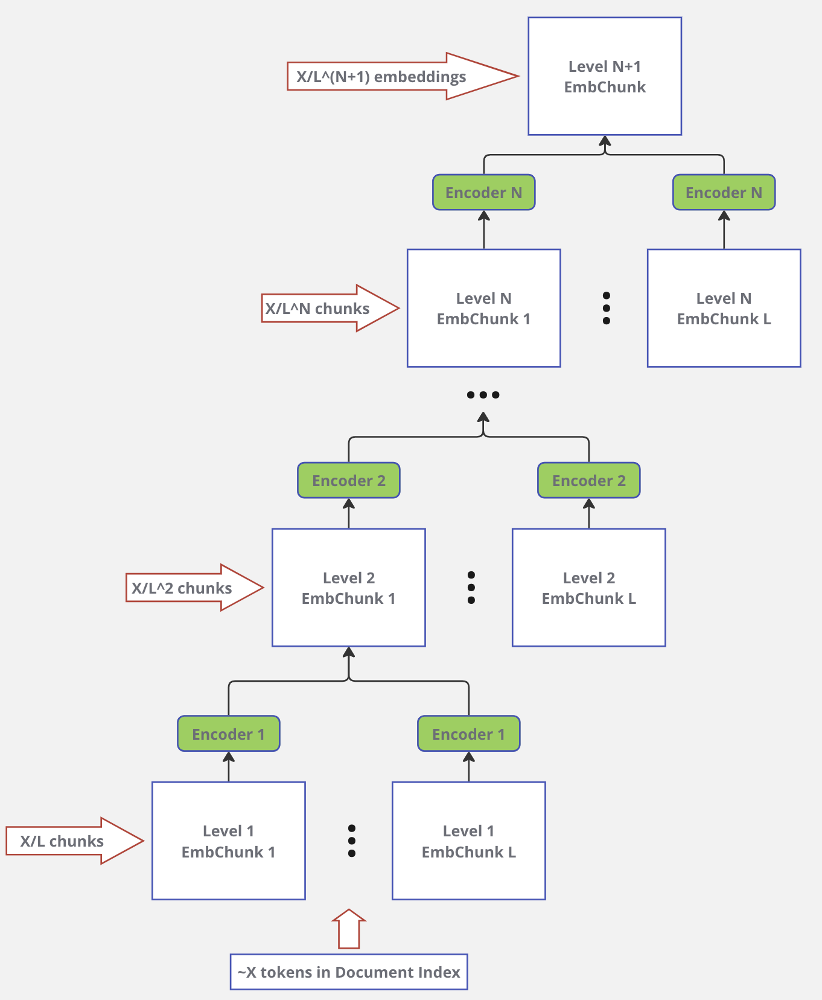
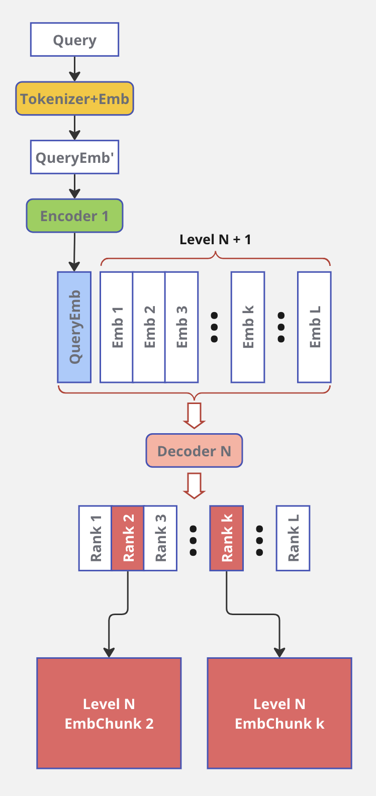
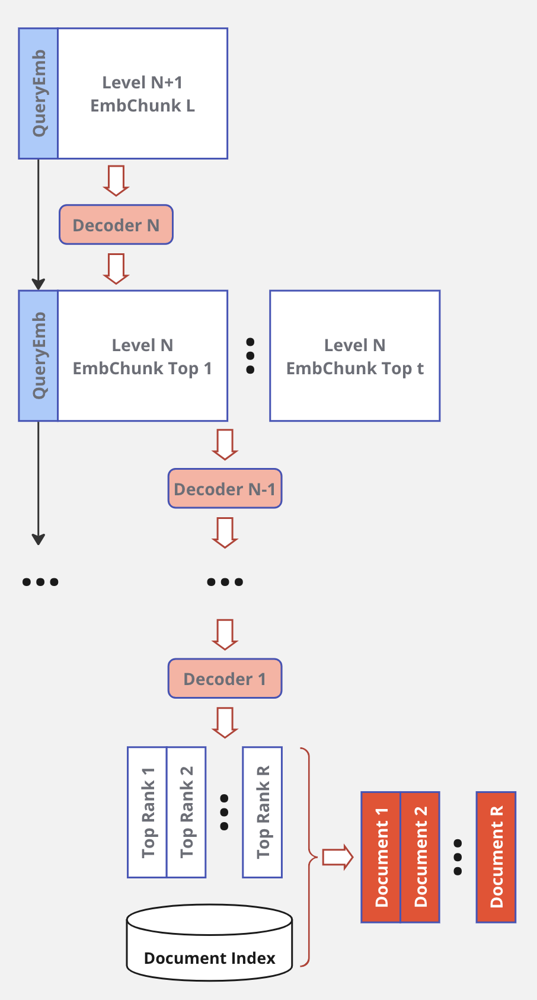
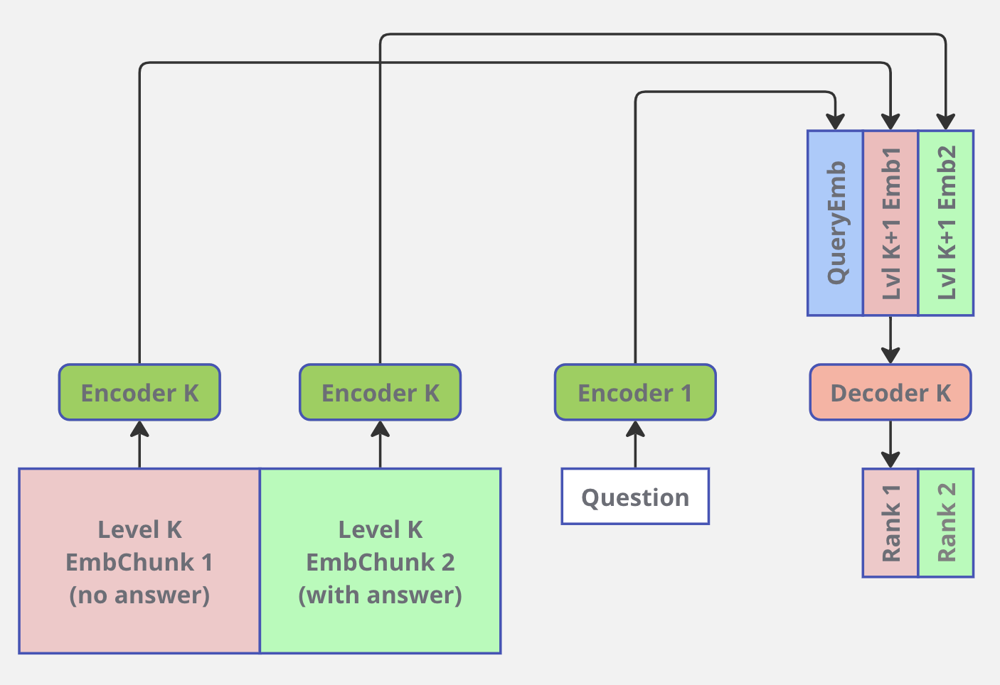
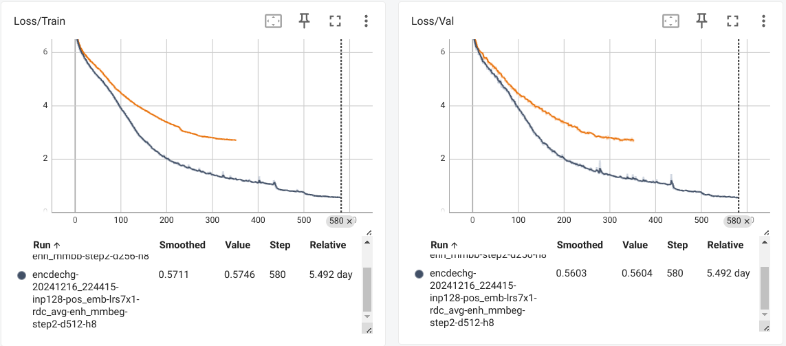

# MLLM - LLM with Memory
<!-- ## GPT
https://huggingface.co/docs/transformers/en/model_doc/openai-gpt
```
pip install spacy ftfy==4.4.3
python -m spacy download en
``` -->
## Approach
### Goal
Reduce LLM parametric memory at the expence of keeping data in nonparametric memory storage.

#### Previous work
Retrieval-Augmented Generation (RAG):
1. Indexing. Documents are split into chunks, encoded into vectors, and stored in a vector database.
2. Retrieval. Retrieve the Top k chunks most relevant to the question based on semantic similarity.
3. Generation. Input the original question and the retrieved chunks together into LLM to generate the final answer.

[Retrieval-Augmented Generation for Large Language Models: A Survey](https://arxiv.org/abs/2312.10997)

#### Current approach
1. Memory stored in embeddings forming hierarchical structure.
2. Higher level embeddings aggregate information of lower leveles.
3. Set of Encoders processing lower level embeddings into higher level. The process starts from document tokens.
4. Set of decoders processing Query embedding and higher level embeddings into ranks showing relevance of input. Decoders "show" direction to relevant documents (parts of the documents).


### Encoder
Encoder 1 properties:
1. Encoder takes limited chunk size (# of tokens) and produces embedding in `CLS` token. For example, for BERTA-like models this embedding has the size of 768 float32 numbers.
2. Lightweight architecture.
3. Chunks-to-document backtracking.
<br>


Encoders hierarchy:
1. `log(N)` encoders, where `N` - size of tokenized index.
2. Encoders standing upper in hierarchy can have more layers as their input decreases exponentially.
3. Encoder output embedding accumulates information of `L` embeddings from previous level.
<br>


### Decoder
Query processing:
1. Query tokenization and embedding are done with `Encoder 1` using the same process as for document index processing. When Query contains more than `L` embeddings it can be represented as embedding chunk.
2. Decoder outputs rank values for input embeddings. For top rank values embedding chunks of Level N+1 retrieved.


### Ranking
1. Each decoder of Level `K-1` takes Query embedding chunk & embedding chunk of level `K`.
2. Decoder `K-1` outputs relevance ranks for each of incoming non-query embeddings.
3. Top `t` embeddings of level `K` are picked as an argmax from Decoder output. For each of these top embeddings corresponding embedding chunk of the next level retrieved.
4. `t` chunks from previous step serve as an input (alongside with Query embedding chunk) to the next Decoder.
5. Level 1 embeddings give the set of relevant documents.
<br>


### LLM
1. The same hierarchy of Decoder-rankers as in previous setup.
2. Top ranked embeddings are gathered from all levels.
3. Resulting LLM gets in its input information of different granularity, from high-level `N+1` embeddings to low-level `1` embeddings.
<br>


### Training
* End-to-end training for levels 1, 2.
* End-to-end training for levels 2, 3.
<br>...
* End-to-end training for levels N, N+1.



### Expected advantages
1. Real-time LLM + Real-time Memory retrieval with the quality of big LLM.
2. Memory mechanism allows to attend any token in a database with log(N) time complexity, where N - size of document database.
3. The memory is easily expandable.
4. Any part of the memory can be removed completely or masked out temporary.


## Experiments
### Encoder-Decoder convergence
Input tokens: 128. d_model=512.

Input texts example:
```
000 "Yangliuqing" Yangliuqing () is a market town in Xiqing District, in the western suburbs of Tianjin, People's Republic of China. Despite its relatively small size, it has been named since 2006 in the "famous historical and cultural market towns in China".\n\nIt is best known in China for creating nianhua or Yangl
001 "Orana Australia Ltd" Orana Australia Ltd is a not-for-profit organisation that provides a diverse range of training and support services to over 650 people with disabilities and their families in South Australia.\n\nHistory\nThe Mentally Retarded Children’s Society of SA Inc. was established in 1950 by a group of parent
002 "St. Mary's Church, Sønderborg" The St. Mary's Church is a church owned by the Church of Denmark in Sønderborg, Denmark and the church of the parish with the same name. Thanks to its location on a hill, the church building is very iconic for the city.\n\nHistory \nIn the Middle Ages there was a leper colony on a hill just outside 
003 "Kalitta" Kalitta may refer to:\n\nConnie Kalitta (born 1938), a retired American drag racer and CEO of the eponymous Kallita Air.\nDoug Kalitta (born 1964), an American drag racer, nephew of Connie Kalitta and owner of Kalitta Charters.\nScott Kalitta (1962-2008), an American drag racer and son of Connie Kal
004 "Where Is Freedom?" Where Is Freedom? () is a 1954 Italian comedy-drama film directed by Roberto Rossellini. \n \nThe film had a troubled production because, after shooting some scenes, Rossellini lost interest in the film and abandoned the set. The work was completed after about a year, mainly from Mario Monicelli, wi
```
Encdec output:
```
000 qliuqing Yangliuqing () is a market mall in Fengqing District, in the western suburbs of Tianjin, People's Republic of China. Despite its relatively very size, it has been named since 2006 in the "most historical and cultural cultural market in China".\n\nIt is best known in China in Chinese nian culture or qinguqing nyhua.
001  Fareana Australia Australia Orana Australia ) is a not-for-profit organisation that provides a diverse range of training and support people to provide 650 people with disabilities and their families in South Australia.\n\nHistory\nThe Retally Retarded Society’s Society of SA Inc. was established in 1985 by a group of parents
002 St. Mary's Church, Sønderborg The St. Mary's Church is a church owned by the Church of Denmark in Sønderborg, Denmark and the church of the parish with the same name. Similar to its location on a hill, the church building is very alternative for the city.\n\nHistory \nIn the Middle Ages there was a leper parish on a hill just outside
003 Kalitta Kalitta may refer to:\n\nOlitta Kalitta (born 1929), a retired American drag racer and CEO of the eponymous Kallitta Medal.\nDoug Kalitta (born 1934), American American cargo racer, nephew of Felix Kalitta and owner of Kalitta Charters.\nScott Kalitta (1962-1973), an American aircraft racer and son of Felix Kalitta.
004  Answer Is Victory? Where Is Right?? is a 1954 Italian comedy-drama film directed by Roberto Rossellini. \n \nThe film had a troubled production due, after many some scenes, Rossellini lost interest in the film and abandoned the set. The work was completed after about a year, mainly by Mario Malicelli, with some scenes
```