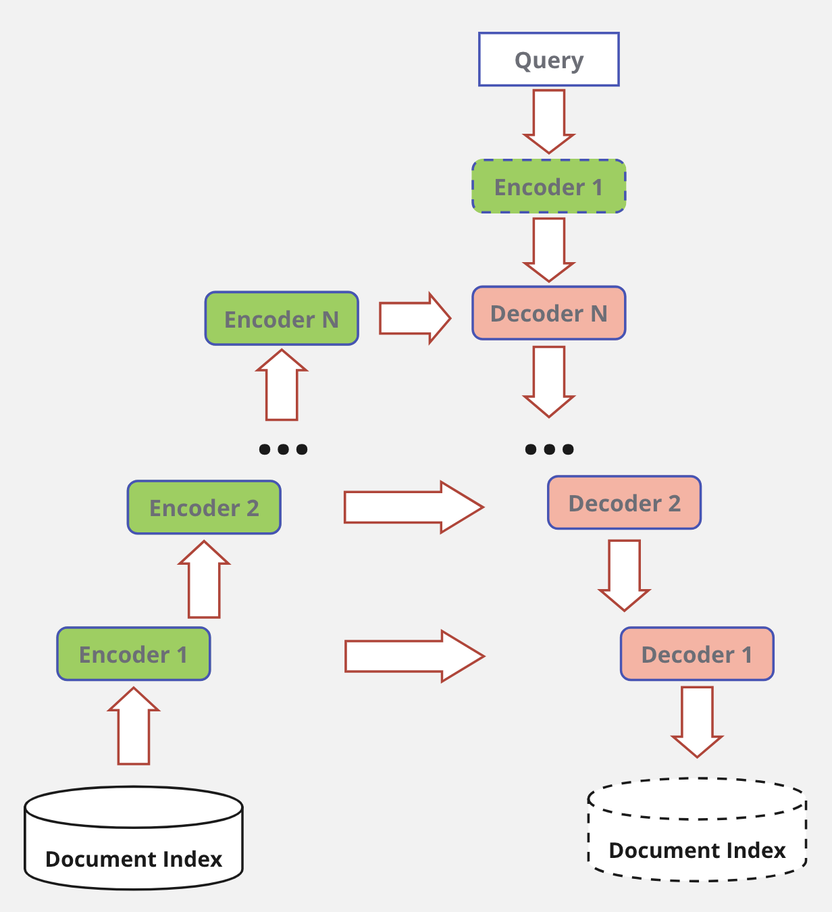

# MLLM - LLM with Memory
<!-- ## GPT
https://huggingface.co/docs/transformers/en/model_doc/openai-gpt
```
pip install spacy ftfy==4.4.3
python -m spacy download en
``` -->
## Approach
### Goal
Reduce LLM parametric memory at the expence of keeping data in nonparametric memory storage.

#### Previous work
Retrieval-Augmented Generation (RAG):
1. Indexing. Documents are split into chunks, encoded into vectors, and stored in a vector database.
2. Retrieval. Retrieve the Top k chunks most relevant to the question based on semantic similarity.
3. Generation. Input the original question and the retrieved chunks together into LLM to generate the final answer.

[Retrieval-Augmented Generation for Large Language Models: A Survey](https://arxiv.org/abs/2312.10997)

#### Current approach
1. Memory stored in embeddings forming hierarchical structure.
2. Higher level embeddings aggregate information of lower leveles.
3. Set of Encoders processing lower level embeddings into higher level. The process starts from document tokens.
4. Set of decoders processing Query embedding and higher level embeddings into ranks showing relevance of input. Decoders "show" direction to relevant documents (parts of the documents).



### Encoder
Encoder 1 properties:
1. Encoder takes limited chunk size (# of tokens) and produces embedding in `CLS` token. For example, for BERTA-like models this embedding has the size of 768 float32 numbers.
2. Lightweight architecture.
3. Chunks-to-document backtracking.
<br>


Encoders hierarchy:
1. `log(N)` encoders, where `N` - size of tokenized index.
2. Encoders standing upper in hierarchy can have more layers as their input decreases exponentially.
3. Encoder output embedding accumulates information of `L` embeddings from previous level.
<br>


### Decoder
Query processing:
1. Query tokenization and embedding are done with `Encoder 1` using the same process as for document index processing. When Query contains more than `L` embeddings it can be represented as embedding chunk.
2. Decoder outputs rank values for input embeddings. For top rank values embedding chunks of Level N+1 retrieved.


### Ranking
1. Each decoder of Level `K-1` takes Query embedding chunk & embedding chunk of level `K`.
2. Decoder `K-1` outputs relevance ranks for each of incoming non-query embeddings.
3. Top `t` embeddings of level `K` are picked as an argmax from Decoder output. For each of these top embeddings corresponding embedding chunk of the next level retrieved.
4. `t` chunks from previous step serve as an input (alongside with Query embedding chunk) to the next Decoder.
5. Level 1 embeddings give the set of relevant documents.
<br>


### LLM
1. The same hierarchy of Decoder-rankers as in previous setup.
2. Top ranked embeddings are gathered from all levels.
3. Resulting LLM gets in its input information of different granularity, from high-level `N+1` embeddings to low-level `1` embeddings.
<br>


### Training
* End-to-end training for levels 1, 2.
* End-to-end training for levels 2, 3.
<br>...
* End-to-end training for levels N, N+1.


### Expected advantages
1. Real-time LLM + Real-time Memory retrieval with the quality of big LLM.
2. Memory mechanism allows to attend any token in a database with log(N) time complexity, where N - size of document database.
3. The memory is easily expandable.
4. Any part of the memory can be removed completely or masked out temporary.
