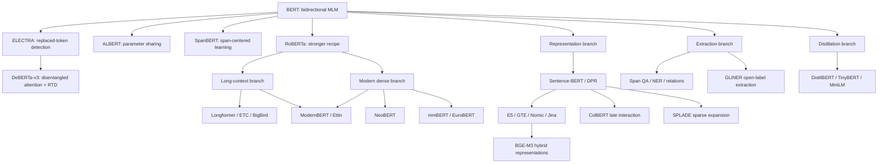

# BERT-family encoders — architecture, long context, representations, extraction, training, and applications

> **Research status:** September 2026  
> **Scope:** Bidirectional Transformer encoders descended from BERT, modern long-context backbones, embedding and retrieval systems, token/span extraction, encoder-based decoding, pretraining, fine-tuning, distillation, deployment, evaluation, and applications.

---

## 1. How to read this overview

“BERT family” no longer means a single sequence of checkpoints that can be ranked from oldest to newest. It now describes a design space whose branches optimize different things: sample-efficient language understanding, long-document processing, multilingual transfer, retrieval geometry, token-level extraction, or low-cost deployment. A raw masked-language-model checkpoint and a retrieval-tuned embedding model may share an encoder body, but they expose different interfaces and should not be treated as interchangeable products.

This review is organized as a decision map. Sections 2–7 explain the historical and architectural choices; Sections 8–11 explain how representations become predictions; Sections 12–15 cover training, deployment, evaluation, and applications. Descriptive in-text citations link directly to entries in the final section, where sources are grouped into named research directions showing how each area developed and where to read next.

## 2. Executive synthesis

### 2.1 Encoders still have a distinct role

BERT made bidirectional pretraining practical by corrupting complete inputs and asking a Transformer to recover hidden tokens [BERT paper](#ref-bert). Because every visible token can interact with both its left and right context, the resulting states are naturally suited to classification, retrieval, reranking, token labeling, and span extraction. Causal decoders can be adapted to many of these tasks, but their native objective and triangular attention mask optimize continuation rather than symmetric interpretation of an already available input.

Controlled evidence now makes this distinction clearer. The paired Ettin suite holds architecture, data, scale, and schedule nearly constant while changing bidirectional MLM into causal CLM; native encoders win classification and retrieval, while native decoders win generation [Ettin paired study](#ref-ettin). Reverse-objective continued training narrows some gaps but does not generally erase them. The practical conclusion is not that one architecture is universally superior, but that the attention pattern and objective should match the operation performed most often.

### 2.2 Modern BERT is a stack of improvements, not one trick

RoBERTa showed that removing next-sentence prediction, increasing data, using dynamic corruption, and training longer could improve BERT without introducing a radically new network [RoBERTa recipe](#ref-roberta). Later families added parameter sharing, span corruption, replaced-token detection, disentangled positions, and task-specific pretraining through [ALBERT](#ref-albert), [SpanBERT](#ref-spanbert), [ELECTRA](#ref-electra), [DeBERTa](#ref-deberta), and [DeBERTa-v3](#ref-deberta-v3). The 2024–2026 revival then imported mature decoder-LLM engineering through [ModernBERT](#ref-modernbert), [NeoBERT](#ref-neobert), [Ettin](#ref-ettin), [mmBERT](#ref-mmbert), and [EuroBERT](#ref-eurobert): rotary positions, pre-normalization, gated MLPs, bias-free projections, FlashAttention, unpadding, sequence packing, hardware-aligned dimensions, trillion-token corpora, and staged learning-rate decay.

The most important empirical warning is that architecture diagrams explain only part of performance. NeoBERT’s controlled ablations found that replacing its small, older corpus with much larger and more diverse web data produced the largest gain, while scaling the model produced the next-largest gain [NeoBERT ablations](#ref-neobert). A “modern” block trained on weak or mismatched data can therefore lose to an older block trained with a better corpus and downstream recipe.

### 2.3 Long context is a learned capability

Long context has three separate requirements: a positional representation defined at the target length, an attention implementation that fits in memory, and training data that forces use of distant positions. RoPE or a larger configuration value only solves the first requirement. [Longformer](#ref-longformer), [ETC](#ref-etc), [BigBird](#ref-bigbird), [Linformer](#ref-linformer), and [Reformer](#ref-reformer) reduce attention cost through different structural assumptions, while [ModernBERT](#ref-modernbert) and [Ettin](#ref-ettin) alternate local and global layers to retain periodic document-wide communication.

Effective context must be measured rather than inferred from a model card. [ModernBERT](#ref-modernbert), [NeoBERT](#ref-neobert), [Ettin](#ref-ettin), [mmBERT](#ref-mmbert), and [EuroBERT](#ref-eurobert) all perform explicit long-sequence continuation or annealing after shorter-context pretraining. Even then, long-context retrieval, exact recall, and multi-hop reasoning can behave differently. A model that accepts 8,192 tokens without error may still ignore evidence near the end or lose a rare number during pooling.

### 2.4 Pooling is often the real bottleneck

An encoder produces one contextual vector per input token. Reducing those states to one `[CLS]` or mean vector creates a second bottleneck after attention has already done its work. [Sentence-BERT](#ref-sentence-bert) and [DPR](#ref-dpr) made single-vector retrieval scalable, but [ColBERT](#ref-colbert) showed why retaining token vectors and delaying interaction improves fine-grained matching.

This distinction matters in any compressed representation system. Replacing BERT with a newer encoder can improve token states, but projecting one pooled vector into several output vectors cannot create independent stores of information. A learned multi-query resampler over the complete token-state matrix increases addressable capacity; a linear expansion of one vector increases only the output shape.

### 2.5 The best default depends on the task

| Need | Starting point | Interpretation and next reading |
|---|---|---|
| English classification and general NLU | ModernBERT-base, Ettin-Enc-150M, or NeoBERT | [ModernBERT](#ref-modernbert) emphasizes efficient 8K processing; [Ettin](#ref-ettin) offers unusually open paired experiments; [NeoBERT](#ref-neobert) keeps width 768 and full attention through 4K. Read the corresponding model-family section before choosing because their tokenizers and attention patterns differ. |
| Broad multilingual encoding | mmBERT | [mmBERT](#ref-mmbert) targets more than 1,800 languages and uses staged language introduction rather than treating every language equally throughout training. It is the natural next read when coverage of low-resource languages matters more than a compact vocabulary. |
| European languages, code, and mathematics | EuroBERT | [EuroBERT](#ref-eurobert) combines multilingual text, parallel data, code, and mathematics, and documents trade-offs between retrieval and classification. Its ablations are especially useful for deciding what data should enter an encoder’s final annealing phase. |
| Ready-to-use multilingual retrieval | BGE-M3 or mGTE | These are retrieval-trained systems rather than bare MLM checkpoints. [BGE-M3](#ref-bge-m3) exposes dense, sparse, and late-interaction signals, while [mGTE](#ref-mgte) pairs long-context representation learning with reranking. |
| Exact entity and phrase matching | ColBERT-style late interaction | A vector is retained for each query and document token, and MaxSim performs selective matching at query time in [ColBERT](#ref-colbert) and [ColBERTv2](#ref-colbert-v2). Read this branch when one-vector systems retrieve the right topic but miss the exact entity, number, or relation. |
| Compact deployment | MiniLM or a small Ettin encoder | [MiniLM](#ref-minilm) transfers attention relations from a larger teacher, whereas [Ettin](#ref-ettin) provides natively pretrained encoders at several small scales. Benchmark on the real sequence-length distribution because parameter count alone does not determine latency. |
| Free-form generation | A causal decoder or encoder-decoder model | [BART](#ref-bart) and [T5](#ref-t5) add a causal decoding process rather than forcing an MLM encoder to invent a stopping rule. Use an encoder to supply evidence, not as a default replacement for an autoregressive generator. |

The table is a shortlist, not a leaderboard. Model cards report different fine-tuning data, benchmark versions, pooling rules, and maximum lengths. Section 15 describes the controls needed before any of these candidates can be compared fairly.

## 3. Taxonomy and evolution

The diagram has several convergence points. ModernBERT is both a general-purpose backbone and a long-context design [ModernBERT](#ref-modernbert). BGE-M3 is simultaneously dense, sparse, multilingual, and multi-vector [BGE-M3](#ref-bge-m3). A model family should therefore be selected by its trained interface and evidence, not by assigning it to one exclusive box.

## 4. Foundations: what changed after BERT

### 4.1 BERT: bidirectional masked modeling

Given tokens $x=(x_1,\ldots,x_n)$ and a sampled mask set $\mathcal M$, BERT minimizes

$$
\mathcal L_{\mathrm{MLM}}
= -\sum_{i\in\mathcal M}
\log p_\theta(x_i\mid x_{\setminus\mathcal M}).
$$

The model can inspect visible context on both sides of each hidden position. Original BERT combines this objective with next-sentence prediction, learned absolute position embeddings, segment embeddings, post-LayerNorm blocks, GELU MLPs, WordPiece tokenization, and a 512-token limit [BERT paper](#ref-bert). Its 15% corruption policy sends 80% of selected tokens to `[MASK]`, replaces 10% with random tokens, and leaves 10% unchanged.

The final token matrix $H\in\mathbb R^{n\times d}$ is more fundamental than the pooler. Sequence classification commonly reads the first token, but token labeling and span extraction read every row. Treating BERT as inherently a “one-vector model” confuses one downstream head with the encoder’s actual output.

### 4.2 RoBERTa: recipe before novelty

RoBERTa removes next-sentence prediction, uses dynamic masking, trains on more and more varied text, increases batch size, and carefully revisits sequence length [RoBERTa](#ref-roberta). This work established a durable experimental standard: compare objectives only after controlling data, optimization, and compute. Many apparent architectural breakthroughs are smaller once an undertrained BERT baseline is replaced by a RoBERTa-quality recipe.

RoBERTa is still limited by learned absolute positions and a short default context. Its importance is methodological rather than as the final deployment recommendation in 2026. Readers planning pretraining should study RoBERTa before modern model reports because it explains why corpus and schedule choices cannot be treated as implementation details.

### 4.3 ALBERT: reducing parameters without reducing depth

ALBERT factorizes the vocabulary embedding matrix and shares Transformer parameters across layers [ALBERT](#ref-albert). Factorization decouples vocabulary width from hidden width, while sharing greatly reduces stored parameters. It also replaces NSP with sentence-order prediction, which distinguishes correctly ordered adjacent segments from swapped segments.

Parameter sharing does not eliminate repeated computation. A 12-step shared block still executes twelve times, so disk size and parameter count can fall without a proportional latency reduction. ALBERT is the next read when memory capacity for weights is constrained, but it is not automatically the best answer to throughput constraints.

### 4.4 SpanBERT: make corruption resemble extraction

SpanBERT masks contiguous spans instead of isolated subwords and trains boundary representations to predict the removed content [SpanBERT](#ref-spanbert). This changes the semantic unit of pretraining from an individual token to a phrase-like region. The design is aligned with extractive QA, coreference, and relation extraction, where predictions concern spans and their boundaries.

The broader lesson is that a corruption objective induces a representation geometry. If downstream work asks the model to preserve names, dates, and relations, span- or entity-aware masking may supply a more direct signal than uniform token masking. Systems that aggressively pool or compress text must still address the separate capacity constraint introduced after encoding.

### 4.5 ELECTRA: supervise every position

ELECTRA uses a small masked generator to propose replacements and trains a discriminator to decide whether each observed token is original or generated [ELECTRA](#ref-electra). If $y_i=1$ denotes an original token, the replaced-token-detection loss is

$$
\mathcal L_{\mathrm{RTD}}
= -\sum_i
\left[y_i\log D(h_i)+(1-y_i)\log(1-D(h_i))\right].
$$

MLM computes prediction loss only at selected positions, while RTD supplies a binary signal at almost every position. This makes ELECTRA sample-efficient and strong for discriminative tasks. The discriminator does not, however, learn a conventional token-generation head, and excellent classification does not guarantee that mean-pooled embeddings form a useful retrieval space.

### 4.6 DeBERTa and DeBERTa-v3: disentangle content and position

DeBERTa represents token content and relative position separately inside attention, allowing content-to-content, content-to-position, and position-to-content interactions [DeBERTa](#ref-deberta). It also adds an enhanced mask decoder so positional information can participate explicitly in token recovery. This is a deeper architectural change than merely replacing an absolute position table.

DeBERTa-v3 combines disentangled attention with ELECTRA-style RTD and gradient-disentangled embedding sharing [DeBERTa-v3](#ref-deberta-v3). It remains a strong classification baseline, but modern retrieval studies repeatedly show that its untuned embedding geometry can be weak. The next read after DeBERTa-v3 should therefore depend on the target: ModernBERT or Ettin for a newer general backbone, and E5/GTE/BGE for retrieval-ready representations.

## 5. Long-context encoding

### 5.1 The cost problem

Dense self-attention forms an $n\times n$ score matrix:

$$
A=\operatorname{softmax}
\left(\frac{QK^\top}{\sqrt{d_h}}+M\right),
\qquad H'=AV.
$$

Its arithmetic cost is $O(n^2d)$ and the naive score storage is $O(n^2)$. FlashAttention reduces memory traffic and avoids materializing the complete score matrix, but it computes exact dense attention and does not change the quadratic arithmetic class. At several thousand tokens, optimized dense attention can still be simpler and faster than an irregular theoretical approximation; beyond that range, structural sparsity becomes increasingly attractive.

### 5.2 Sliding windows and global tokens

Longformer gives most tokens a fixed local window and designates selected tokens for global attention [Longformer](#ref-longformer). With window width $w$ and $g$ global tokens, the approximate cost becomes $O(nw+ng)$ rather than $O(n^2)$. Local windows preserve nearby syntax, while global tokens act as communication hubs for classification labels, questions, or document summaries.

This design requires a task-informed choice of global positions. If no token can gather the evidence needed for the output, distant local regions communicate only through repeated layers. Longformer is therefore a useful next read for document QA and classification where global roles are explicit, while alternating local/global models are simpler when every token periodically needs global access.

ETC generalizes the two-stream idea by maintaining regular tokens and a smaller global-memory sequence, with structured relative positions connecting document organization to attention [ETC](#ref-etc). It is especially relevant when inputs have sentences, sections, tables, entities, or other hierarchy. Its lesson is that long-context efficiency can exploit known structure rather than treating a document as one flat stream.

### 5.3 Sparse graphs

BigBird combines local windows, random edges, and a small set of global tokens [BigBird](#ref-bigbird). The mixture creates short communication paths while keeping the number of attention edges approximately linear in sequence length. Its theoretical analysis shows that the sparse construction can preserve universal-approximation and Turing-completeness properties associated with full attention.

Random and block-sparse patterns trade kernel simplicity for asymptotic savings. They are compelling at lengths where dense global layers dominate cost, but implementation quality and hardware utilization decide real throughput. BigBird should be read after Longformer because it explains why local and global edges alone are not the only sparse graph available.

### 5.4 Low-rank and hashing approximations

Linformer assumes the attention matrix can be approximated at low rank and projects keys and values from length $n$ to rank $k$, producing approximately $O(nk)$ attention [Linformer](#ref-linformer). It is attractive when a fixed low-dimensional sequence basis captures the task. Its risk is that rare, sharply localized interactions may not obey the assumed rank structure.

Reformer groups similar queries and keys with locality-sensitive hashing and uses reversible residual layers to reduce activation storage [Reformer](#ref-reformer). Its approximate attention cost is $O(n\log n)$, but hashing introduces bucket construction and irregular access. Reformer is worth reading when memory reduction and algorithmic novelty matter; for ordinary 4K–8K encoding, current FlashAttention or local/global implementations are often easier to deploy.

### 5.5 Alternating local and global attention

ModernBERT and Ettin use 128-token local windows in most layers and full global attention every third layer [ModernBERT](#ref-modernbert), [Ettin](#ref-ettin). Local layers cheaply refine nearby information, while each global layer restores direct document-wide communication. The average cost is lower than all-global attention, although periodic dense layers mean the asymptotic cost is not linear.

This pattern is a pragmatic compromise for 8K encoders. It uses mature dense and sliding-window kernels and avoids manually selected global tokens. It may nevertheless underperform full attention on tasks requiring continuous global interaction, so NeoBERT provides a useful matched-width alternative when 4K context is sufficient [NeoBERT](#ref-neobert).

### 5.6 Position encoding and actual context use

RoPE rotates query and key coordinates by position. For positions $m$ and $n$,

$$
(R_mq)^\top(R_nk)=q^\top R_{n-m}k,
$$

so attention depends naturally on relative displacement. Raising the RoPE base or applying an extension changes the frequencies available at long positions; it does not teach the network which distant evidence matters.

A credible long-context model therefore includes explicit long-sequence training. ModernBERT trains primarily at 1,024 tokens and then spends hundreds of billions of tokens on 8K extension and decay [ModernBERT training](#ref-modernbert). NeoBERT continues from 1,024 to 4,096 with batches deliberately sampled from long documents [NeoBERT training](#ref-neobert). EuroBERT uses random lengths up to 8,192 during annealing and reports that variable-length training beats fixed-length training [EuroBERT training](#ref-eurobert).

## 6. The 2024–2026 encoder revival

### 6.1 ModernBERT

ModernBERT is an English encoder released in base and large sizes [ModernBERT](#ref-modernbert). Base has 149M parameters, 22 layers, width 768, 12 heads, and a 2,304-wide GLU expansion; large has 395M parameters, 28 layers, width 1,024, 16 heads, and a 5,248-wide GLU expansion. Both support 8,192 tokens and use pre-LayerNorm, an embedding norm, GeGLU, RoPE, mostly bias-free projections, unpadding, sequence packing, and alternating local/global attention.

Training proceeds in three conceptual phases. Approximately 1.7T tokens establish the 1,024-token model, 250B tokens extend context to 8K, and 50B higher-quality tokens decay the learning rate. The objective is MLM without NSP at a 30% masking rate, and the corpus includes web, scientific, and code data.

ModernBERT is a strong default when English throughput, code, and long-context token representations matter. Its published results are especially strong for ColBERT-style long retrieval, suggesting that local layers and well-trained token states work well with late interaction. Dense single-vector long retrieval can still require adapted fine-tuning, so an 8K model card should not be read as a guarantee that untuned pooling works at 8K.

### 6.2 NeoBERT

NeoBERT is a 250M-parameter, 28-layer encoder that retains BERT’s width of 768 and 12 attention heads [NeoBERT](#ref-neobert). It uses full attention, RoPE, pre-RMSNorm, SwiGLU, bias-free projections, FlashAttention, and the approximately 30K BERT WordPiece tokenizer. The final checkpoint supports 4,096 tokens and is convenient for systems whose bridges already expect 768-dimensional states.

The model is trained on RefinedWeb for a theoretical 2.1T tokens. Stage one runs at a maximum of 1,024 tokens; stage two adds 100B theoretical tokens at 4,096 and intentionally samples documents longer than 1,024 and 2,048 tokens. The objective masks 20% of tokens and always replaces selected positions with `[MASK]`, rather than using BERT’s 80/10/10 corruption.

NeoBERT’s ablations are as valuable as its checkpoint. More and better-diversified data gives the largest gain, scaling to 250M gives the second-largest gain, switching to a LLaMA tokenizer hurts GLUE in the tested setting, and packing without cross-sequence isolation causes a large loss. The paper reports GLUE 89.0 and controlled-protocol MTEB gains, but its CDE result uses a much more elaborate embedding recipe and must not be attributed to the bare MLM checkpoint.

### 6.3 Ettin / Seq vs Seq

Ettin is a matched suite of encoder and decoder pairs at approximately 17M, 32M, 68M, 150M, 400M, and 1B parameters [Ettin / Seq vs Seq](#ref-ettin). At each size, the pair shares shape, data order, tokenizer, and schedule; the principal differences are bidirectional MLM versus causal CLM. This design makes Ettin unusually useful for architecture studies because common confounders are intentionally removed.

The 150M and 400M encoders match ModernBERT’s principal shapes: 22×768 and 28×1,024. The family uses a 50,368-token vocabulary, pre-norm LayerNorm, GLU layers, RoPE, a 128-token local window, global attention every third layer, and unpadding. Training uses about 1.7T broad tokens, 250B context-extension tokens, and 50B decay tokens; the 1B model receives less data because of compute limits.

Native encoders outperform matched decoders on classification and retrieval, while native decoders dominate generative evaluations. Fifty billion tokens of reverse-objective continuation do not generally erase the native advantage. Ettin is therefore an unusually clean source for deciding between encoder and decoder architectures without conflating that decision with model shape or training data.

### 6.4 mmBERT

mmBERT extends the modern-encoder recipe to more than 1,800 languages and approximately 3T tokens [mmBERT](#ref-mmbert). Its central idea is annealed language learning: start with a manageable high-resource language set, expand coverage in stages, reduce the sampling temperature, and introduce more than 1,700 low-resource languages during decay. This avoids spending the entire training budget uniformly across languages with radically different data availability.

The reported stages move from 60 languages and 30% masking, to 110 languages and 15% masking with 8K context, and finally to 1,833 languages and 5% masking. Sampling temperature decreases from roughly 0.7 to 0.5 to 0.3, increasing the relative weight of lower-resource languages late in training. The architecture follows the ModernBERT family while using a large Gemma-derived multilingual vocabulary, so total parameter count is strongly affected by embeddings.

mmBERT is the next read for broad cross-lingual classification and retrieval. It also illustrates why total parameters can mislead: the small and base variants devote many parameters to vocabulary coverage rather than Transformer computation. Token-level tasks require separate fertility analysis because a semantically capable model may still split names into inconvenient subword chains.

### 6.5 EuroBERT

EuroBERT provides 210M, 610M, and 2.1B multilingual encoders with 8K context [EuroBERT](#ref-eurobert). The family adopts a LLaMA-like dense block with RMSNorm, SwiGLU, RoPE, no biases, and grouped-query attention in larger sizes. A 128K LLaMA 3 tokenizer supports multilingual text and code but makes embedding parameters a substantial part of smaller models.

The training corpus contains 4.8T pretraining tokens and 200B annealing tokens across 15 principal natural languages, 38 programming languages, mathematics, and translation-parallel data. Pretraining uses 2,048-token packing and 50% masking. Annealing raises the RoPE base, samples lengths from 12 to 8,192, lowers masking to 10%, and shifts the data mixture toward a balanced downstream compromise.

Its ablations expose useful tensions. More code and mathematics improve multilingual retrieval but can reduce sentence classification; more parallel data improves both; lower late-stage masking helps classification but hurts retrieval; instruction data hurts the encoder in this setup; and filtering only for assistant-style educational quality creates domain mismatch. EuroBERT is therefore not just a multilingual checkpoint family but a guide to designing encoder-specific data mixtures.

## 7. Multilinguality, tokenization, and domains

### 7.1 The curse of multilinguality

A fixed-capacity model must distribute parameters across languages, scripts, and domains. Adding languages increases coverage but can create interference, particularly for low-resource languages whose representations share subwords and layers with dominant languages. Increasing capacity, balancing sampling, adding parallel text, and staged language introduction are complementary responses rather than mutually exclusive solutions [mmBERT](#ref-mmbert), [EuroBERT](#ref-eurobert).

The next model to read depends on the coverage target. mmBERT studies extreme language breadth and late introduction [mmBERT](#ref-mmbert). EuroBERT studies a smaller named language set with code, mathematics, parallel text, and scale [EuroBERT](#ref-eurobert). mGTE is more appropriate when the required output is already a multilingual retrieval vector or reranker score [mGTE](#ref-mgte).

### 7.2 Tokenizer fertility

Tokenizer fertility is the average number of subword tokens used to express a word or entity. High fertility increases sequence length and forces token-level labels to be reconciled across more pieces. Both mmBERT and EuroBERT report that tokenization behavior can limit NER even when sequence-level transfer is strong [mmBERT](#ref-mmbert), [EuroBERT](#ref-eurobert).

A larger vocabulary lowers fertility for represented languages but increases embedding parameters and memory. Byte fallback improves coverage of unseen scripts but can fragment ordinary words. Tokenizer selection should therefore be evaluated with per-language fertility, unknown/byte rates, entity-boundary fragmentation, code-token efficiency, and downstream accuracy—not vocabulary size alone.

### 7.3 Domain-specific continuation

SciBERT demonstrates that scientific vocabulary and in-domain pretraining improve scientific NLP [SciBERT](#ref-scibert). BioBERT continues BERT on biomedical corpora, while PubMedBERT trains from scratch on PubMed text with an in-domain vocabulary [BioBERT](#ref-biobert), [PubMedBERT](#ref-pubmedbert). Their comparison shows that continued pretraining is economical, but a domain-built tokenizer can matter when terminology differs substantially from general web text.

CodeBERT applies bimodal pretraining to natural language and programming language [CodeBERT](#ref-codebert). ModernBERT and EuroBERT instead mix code into a broader encoder corpus [ModernBERT](#ref-modernbert), [EuroBERT](#ref-eurobert). A dedicated code encoder is the next read when code is the primary modality; a mixed encoder is preferable when one index or classifier must cover both prose and code.

## 8. From token states to useful representations

### 8.1 Token states are the lossless interface

An encoder returns

$$
H=(h_1,\ldots,h_n)\in\mathbb R^{n\times d}.
$$

Keeping $H$ preserves token identity, position, and local distinctions needed by extraction and late interaction. The cost is downstream storage and attention proportional to $n$. Before designing a pooler, a system should establish whether its target needs exact entities and spans or only global semantics.

### 8.2 `[CLS]`, mean, and learned pooling

`[CLS]` pooling uses $e=h_{\mathrm{CLS}}$. It is cheap and works when downstream training explicitly teaches that state to aggregate the task. MLM alone provides no guarantee that the first state is an optimal sentence vector, because token-recovery losses are concentrated at masked positions.

Mean pooling uses

$$
e(x)=\frac{\sum_i m_i h_i}{\sum_i m_i},
$$

where $m_i$ excludes padding. It spreads gradient across visible tokens and is a strong baseline for contrastive embedding tuning, but it can dilute a rare decisive fact in a long document. Both `[CLS]` and mean pooling must therefore be evaluated rather than selected by model-family convention.

A learned query pooler computes

$$
\alpha_i=\operatorname{softmax}_i
\left(\frac{q^\top W_kh_i}{\sqrt d}\right),
\qquad e=\sum_i\alpha_iW_vh_i.
$$

Multiple queries $q_1,\ldots,q_K$ produce $K$ independently addressable slots. This is the appropriate bridge when a downstream decoder needs several facts but cannot afford all token states.

### 8.3 Single-vector embeddings

Sentence-BERT turns BERT into a siamese encoder so each sentence can be embedded once and compared cheaply [Sentence-BERT](#ref-sentence-bert). DPR applies the same independent-encoding principle to open-domain QA, learning query and passage vectors whose dot product retrieves evidence [DPR](#ref-dpr). Both make approximate-nearest-neighbor indexing practical because documents do not need to be re-encoded for every query.

The compression cost is semantic competition: every entity, relation, and qualification must fit in one vector. [Contriever](#ref-contriever) shows that contrastive learning can produce useful unsupervised dense retrieval, while [E5](#ref-e5) and [GTE](#ref-gte) scale weakly supervised text-pair training and task instructions. These works should be read in sequence when building a custom retriever: first understand the bi-encoder interface, then the negative-sampling objective, then large multi-task pair mixtures.

Nomic Embed trains a reproducible long-context English embedding system and publishes weights, data, and code [Nomic Embed](#ref-nomic-embed). Jina Embeddings 2 similarly targets 8K document embeddings, while Jina Embeddings 3 adds multilingual task-specific LoRA adapters [Jina Embeddings v3](#ref-jina-v3). These systems illustrate that long-context backbone support and embedding-specific contrastive training are both necessary; either one alone is insufficient.

### 8.4 Contrastive training

For query $q_i$, positive document $d_i^+$, negatives $N_i$, similarity $s$, and temperature $\tau$, InfoNCE is

$$
\mathcal L_i=-\log
\frac{\exp(s(q_i,d_i^+)/\tau)}
{\exp(s(q_i,d_i^+)/\tau)+
\sum_{d^-\in N_i}\exp(s(q_i,d^-)/\tau)}.
$$

In-batch negatives make other documents in the batch serve as negatives, improving efficiency but risking false negatives. Hard-negative mining selects documents that look relevant but are labeled non-relevant, sharpening the boundary while amplifying annotation errors. Task-homogeneous batches prevent the model from solving the loss through superficial dataset or format differences.

Instruction prefixes specify whether similarity means question answering, duplication, topic, or semantic equivalence, as emphasized by [E5](#ref-e5) and [GTE](#ref-gte). The prefix is part of the learned model interface rather than optional prose. Removing or changing it at inference can move embeddings into a geometry that was not trained for the requested comparison.

### 8.5 Sparse lexical representations

SPLADE predicts a sparse vocabulary-space representation by aggregating contextual token logits [SPLADE v2](#ref-splade-v2). A common form is

$$
w_t(d)=\max_i\log\left(1+\operatorname{ReLU}(z_{i,t})\right),
$$

where $z_{i,t}$ is the score for vocabulary term $t$ at position $i$. Learned expansion can activate terms not literally present while retaining compatibility with inverted-index retrieval.

Sparse systems preserve exact lexical cues and expose interpretable term weights. Their costs are large vocabulary outputs and the need for sparsity regularization so postings lists remain manageable. They are the next read when dense retrieval misses identifiers, rare names, or domain terminology.

### 8.6 Multi-vector late interaction

ColBERT independently encodes queries and documents but retains projected token vectors [ColBERT](#ref-colbert). Relevance is computed with MaxSim:

$$
s(q,d)=\sum_i\max_j q_i^\top d_j.
$$

Each query token selects its best document-token match, preserving fine-grained addressability without a full cross-encoder. ColBERTv2 reduces storage using residual compression and improves training through denoised supervision [ColBERTv2](#ref-colbert-v2).

Late interaction sits between dense retrieval and cross-encoding. It uses more index space and query-time computation than one vector, but documents remain precomputable and exact terms survive. Its broader lesson is that several content-specific vectors remain more addressable than one global gist.

### 8.7 Hybrid and contextual embeddings

BGE-M3 produces dense, sparse, and multi-vector representations from one multilingual 8K model and uses self-knowledge distillation across those modes [BGE-M3](#ref-bge-m3). It is useful when a project wants to compare or fuse retrieval strategies without maintaining unrelated backbones. The three outputs still have different indexing and serving costs, so “one model” does not imply one retrieval engine.

mGTE combines multilingual long-context representations with a reranking model and uses RoPE and unpadding for 8K processing [mGTE](#ref-mgte). It is the next read when multilingual retrieval and cross-encoder reranking must be designed together. As with all embedding families, use the retrieval checkpoint rather than assuming its MLM ancestor exposes equivalent vectors.

Contextual Document Embeddings condition a document on a sample of its surrounding corpus rather than embedding it in isolation [Contextual Document Embeddings](#ref-cde). This can resolve collection-dependent ambiguity, but indexing becomes more complex because a representation depends on context selection. CDE is appropriate when corpus context provides meaningful disambiguation and offline processing can absorb the extra cost.

Nomic Embed v2 introduces sparse mixture-of-experts layers into multilingual embedding training [Nomic Embed v2 MoE](#ref-nomic-embed-v2). It has roughly 475M total and 305M active parameters, eight experts with top-two routing, 768-dimensional Matryoshka-capable outputs, and a 512-token limit. It should be studied as an active-compute and multilingual-capacity design, not as a long-context successor to Nomic Embed v1.

## 9. Prediction heads and in-text extraction

### 9.1 Sequence classification and regression

A pooled representation feeds a linear or MLP head:

$$
p(y\mid x)=\operatorname{softmax}(We(x)+b).
$$

This supports sentiment, intent, routing, topic, entailment, toxicity, and quality classification. Regression replaces cross-entropy with a continuous objective for similarity, translation quality, or document scoring. Pair classification can concatenate two segments inside one encoder so every token participates in cross-input interaction.

### 9.2 Token classification

Token classification applies a shared head to each contextual state:

$$
p(y_i\mid x)=\operatorname{softmax}(Wh_i+b).
$$

It supports NER, PII detection, POS tagging, slot filling, moderation spans, and layout labels. Training must mask padding and define how word labels map to subwords; common choices label only the first subword or copy the label to all pieces. Fertility and boundary fragmentation should be reported with F1 because tokenization can explain cross-language failures [mmBERT](#ref-mmbert), [EuroBERT](#ref-eurobert).

### 9.3 Extractive question answering

Extractive QA predicts start and end positions:

$$
p_s(i)=\operatorname{softmax}(w_s^\top h_i),\qquad
p_e(i)=\operatorname{softmax}(w_e^\top h_i).
$$

A valid span maximizes $\log p_s(i)+\log p_e(j)$ subject to $i\le j$ and a maximum span length. This head is efficient and grounded because its answer must point into the input. It cannot directly synthesize an answer absent from the passage, so retrieval quality and handling of unanswerable examples become part of system quality.

### 9.4 Relation and entity-aware extraction

LUKE represents words and entities jointly and uses entity-aware self-attention to improve entity-centric tasks [LUKE](#ref-luke). Span markers and boundary pooling offer a cheaper alternative: insert special tokens around candidate entities, encode the sequence, and classify the resulting pair. Document-level relation extraction additionally needs coreference and multi-hop aggregation across distant mentions.

GLiNER frames open-label NER as matching textual label representations against token or span representations [GLiNER](#ref-gliner). Unlike a fixed classifier, it can accept new entity descriptions at inference without generating free-form text. It is the next read when the required schema changes frequently but deterministic span outputs remain preferable to LLM prompting.

### 9.5 Cross-encoder reranking

A cross-encoder jointly reads

$$
[\mathrm{CLS}]\;q\;[\mathrm{SEP}]\;d\;[\mathrm{SEP}]
$$

and predicts one relevance score. Joint attention captures exact phrase alignment and relation-sensitive evidence better than independent vectors. The cost is that each query-document pair requires a fresh forward pass, so cross-encoders normally rerank a shortlist produced by sparse, dense, or late-interaction retrieval.

This division of labor is important for model selection. A strong bi-encoder optimizes corpus-scale recall; a cross-encoder optimizes precision among candidates. Reporting only final reranked quality can hide a weak first stage, while reporting only first-stage recall ignores the quality available from deeper interaction.

## 10. Encoding versus decoding

### 10.1 Why MLM is not ordinary generation

A causal language model factorizes

$$
p(x)=\prod_t p(x_t\mid x_{<t}),
$$

which defines a natural left-to-right sampler and stopping process. MLM instead predicts selected positions conditioned on visible text on both sides. It does not define a unique generation order or a calibrated probability for when arbitrary-length output should stop.

BERT can still generate through iterative mask filling, fixed mask slots, insertion, or repeated remasking. “BERTs are generative in-context learners” demonstrates that sufficiently trained encoders possess nontrivial generative behavior [BERT generative ICL](#ref-bert-generative-icl). These methods are useful for infilling and controlled editing, but repeated full-sequence passes and awkward EOS calibration make them poor default choices for unconstrained generation.

### 10.2 Add a decoder when output is open-ended

BART corrupts text and trains an encoder-decoder to reconstruct it, combining bidirectional input understanding with autoregressive output [BART](#ref-bart). T5 casts tasks into a text-to-text format and uses span corruption with sentinel tokens [T5](#ref-t5). Both preserve a clear boundary: the encoder understands all input positions, while the decoder owns ordered generation.

For retrieval-augmented generation, the encoder can remain independently optimized for retrieval or evidence compression. A causal decoder can then consume retrieved text, cross-attend to encoder states, or read learned soft tokens. This modularity is preferable to weakening both operations in a single attention mask unless deployment constraints demand one backbone.

## 11. Pretraining objectives and data design

### 11.1 Masking rate and corruption unit

The original 15% mask rate is not universally optimal. Controlled work finds that larger masking rates can improve learning at sufficient model capacity, motivating 20% in NeoBERT, 30% in ModernBERT, and 50% during EuroBERT pretraining [mask-rate study](#ref-mask-15-percent). EuroBERT then lowers the rate during annealing because its experiments find a retrieval/classification trade-off [EuroBERT](#ref-eurobert).

Dynamic mask schedules lower or otherwise vary corruption during training rather than fixing one difficulty throughout [dynamic masking schedules](#ref-dynamic-masking). Span masking, whole-word masking, and entity-biased masking change which dependencies receive gradient. The correct choice depends on whether the model must preserve local lexical detail, phrase boundaries, global semantics, or rare entities.

### 11.2 MLM, CLM, and biphasic training

A large controlled study of MLM and CLM trains dozens of models from roughly 210M to 1B parameters [MLM versus CLM study](#ref-mlm-vs-clm). It finds that CLM is more data-efficient and often easier to fine-tune early, while MLM generally reaches better final representation quality. Training first with CLM and then with MLM can exploit both properties under a fixed compute budget.

Ettin adds a complementary result: after full native training, 50B-token objective conversion does not make an adapted model equivalent to the native architecture [Ettin objective conversion](#ref-ettin). Together these findings suggest two valid strategies. Train a native MLM encoder when representation quality is the end goal; use a CLM-to-MLM path when an existing causal checkpoint or early data efficiency materially lowers cost, while retaining realistic expectations about residual architectural differences.

### 11.3 Data mixture and annealing

Modern encoder corpora combine filtered web text, books, Wikipedia, scientific literature, code, mathematics, parallel text, and sometimes instruction-like data, as documented by [ModernBERT](#ref-modernbert), [NeoBERT](#ref-neobert), [Ettin](#ref-ettin), [mmBERT](#ref-mmbert), and [EuroBERT](#ref-eurobert). Each source changes the downstream Pareto frontier. Code can improve code retrieval and even multilingual retrieval, but EuroBERT shows that it can reduce sentence-classification performance if overrepresented [EuroBERT data ablations](#ref-eurobert).

Warmup-stable-decay schedules separate a long stable learning-rate phase from a late decay on higher-quality data. Annealing is not simply “use the cleanest documents”: a quality classifier trained for assistant behavior may reject text that resembles classification or retrieval inputs. Final data should be selected against encoder-specific validation tasks and domain coverage.

### 11.4 Packing correctness

Packing improves accelerator utilization by concatenating examples into fixed-size blocks. The attention mask must remain block diagonal or carry sequence-length metadata so tokens from different examples cannot interact. NeoBERT’s ablation shows that naive concatenation with cross-example attention produces a large downstream decline [NeoBERT packing ablation](#ref-neobert).

Correctness tests should compare packed and unpacked logits on the same examples, inspect attention boundaries, and include position resets where required. Efficiency optimizations that alter the effective training distribution belong in model evaluation, not only in infrastructure profiling.

## 12. Fine-tuning and adaptation

### 12.1 Full fine-tuning

Full fine-tuning remains practical for many 100M–400M encoders. It adapts every layer and usually provides the highest task-specific ceiling, but small datasets can overfit or erase transferable geometry. Learning rate, batch size, warmup, weight decay, maximum length, pooling, and random seed all materially affect results.

Layerwise learning-rate decay uses smaller updates in lower layers:

$$
\eta_\ell=\eta_{\mathrm{top}}\gamma^{L-\ell},\qquad 0<\gamma<1.
$$

This preserves lower-level representations while allowing task-specific upper layers to move more aggressively. It is a useful first intervention when full tuning is unstable but freezing most layers loses quality.

### 12.2 Adapters and LoRA

Bottleneck adapters insert small trainable modules into each frozen Transformer layer [bottleneck adapters](#ref-adapters). They make task switching explicit because each task loads a different adapter, at the cost of added sequential operations. Adapter fusion can combine tasks but introduces another learned routing problem.

LoRA freezes a weight matrix and learns a low-rank update [LoRA](#ref-lora):

$$
W'=W+\frac{\alpha}{r}BA,
$$

where $A\in\mathbb R^{r\times d_{\mathrm{in}}}$, $B\in\mathbb R^{d_{\mathrm{out}}\times r}$, rank $r$ controls capacity, and $\alpha$ controls update scale. Encoder LoRA commonly targets attention projections and sometimes MLP projections. It reduces optimizer state and checkpoint size but does not guarantee lower inference latency unless updates are merged.

Prefix- and prompt-tuning learn continuous vectors that steer frozen layers [Prefix-Tuning](#ref-prefix-tuning). They are attractive when the base must remain immutable, but consume sequence or layer-prefix capacity and can be weaker than LoRA on small encoders. Input-dependent soft-token compressors are mechanically related, although they encode an input rather than a task-constant instruction.

### 12.3 Retrieval fine-tuning

Retrieval tuning should explicitly control positive pairs, false negatives, hard negatives, task mixture, and prefixes. Large effective batches increase the negative pool, but gradient caching may be required to fit them. A model selected on one BEIR subset can overfit the selection suite, so held-out domains and long-document tasks must remain untouched until final evaluation [BEIR](#ref-beir).

Dense, sparse, multi-vector, and cross-encoder heads should be trained and reported separately before fusion. Otherwise it becomes impossible to know whether a gain comes from the backbone, a new representation, a stronger teacher, or score interpolation.

## 13. Distillation and compression

### 13.1 What can be distilled

Classical knowledge distillation matches a teacher’s softened distribution rather than only hard labels [knowledge distillation](#ref-knowledge-distillation):

$$
\mathcal L_{\mathrm{KD}}
=T^2\operatorname{KL}
\left(\operatorname{softmax}(z_t/T)\;\|\;
\operatorname{softmax}(z_s/T)\right).
$$

The temperature $T$ exposes relative probabilities among non-target classes. A complete student objective often combines this loss with hard-label loss and intermediate-representation alignment. The teacher must itself use the desired evidence; otherwise the student merely distills the teacher’s shortcut.

### 13.2 DistilBERT, TinyBERT, and MiniLM

DistilBERT combines language-model loss, teacher-distribution matching, and cosine alignment while reducing BERT’s layer count [DistilBERT](#ref-distilbert). It demonstrates that substantial capability survives architectural compression, but its shorter context and older data remain inherited constraints. It is a deployment baseline rather than a modern long-context baseline.

TinyBERT distills embeddings, hidden states, attention maps, and output logits in both general and task-specific stages [TinyBERT](#ref-tinybert). This richer supervision is useful when a student must reproduce internal computation, although exact layer mapping becomes awkward when teacher and student depths differ. TinyBERT is the next read for multi-level distillation pipelines.

MiniLM distills self-attention relations, particularly query-key and value relations, rather than requiring identical hidden widths [MiniLM](#ref-minilm). This makes the objective portable across architectures and produces strong compact encoders. It is the next read when the teacher and student have different dimensions or when attention behavior matters more than matching every activation.

### 13.3 Retrieval and compression distillation

A cross-encoder can teach a bi-encoder by scoring the same candidate set. A late-interaction model can teach a dense student, and BGE-M3 uses self-knowledge distillation to align dense, sparse, and multi-vector signals [BGE-M3](#ref-bge-m3). Distillation examples should include hard candidates where teacher score differences encode meaningful ranking knowledge.

For context compression generally, a full-context teacher can supervise a compressed-context student at every target token. Output KL is denser than answer-only cross-entropy, while hidden-state matching can align how a downstream model incorporates evidence. Renamed entities, random keys, and counterfactual facts are necessary so neither teacher nor student can solve the task from parametric memory alone.

## 14. Deployment and efficiency

### 14.1 Measure the complete path

Encoder latency depends on sequence length, padding distribution, batch size, tokenizer speed, attention kernel, precision, and output representation. A 149M local/global model may outrun a smaller dense model at 8K while losing on batches of 32-token requests. Report tokens per second, request latency, peak memory, maximum stable batch, and preprocessing time at production-like lengths.

Retrieval deployment also includes index cost. One 768-dimensional vector per document is cheap; ColBERT stores many compressed token vectors; SPLADE stores postings; a cross-encoder stores no document vectors but spends compute per candidate. Quality-per-parameter ignores these dominant system costs.

### 14.2 Precision, quantization, and export

Bfloat16 is a robust accelerator default because its exponent range reduces overflow risk. Int8 dynamic or weight-only quantization often works well for encoders, while int4 weight-only methods require task-specific validation because small similarity distortions can reorder nearest neighbors. Calibration data should match languages, domains, and sequence lengths used in production.

ONNX Runtime, TensorRT, OpenVINO, and compiled PyTorch can improve deployment, but custom local-attention or unpadding paths may not export identically. Validate numerical parity for pooled vectors and token states, then validate task metrics; matching logits within a tolerance does not guarantee an unchanged top-$k$ retrieval set.

## 15. Evaluation and application decisions

### 15.1 Benchmark families

MTEB evaluates embedding models across retrieval, classification, clustering, pair classification, semantic similarity, reranking, and summarization-style similarity [MTEB](#ref-mteb). MMTEB extends this idea across many languages and tasks [MMTEB](#ref-mmteb). Scores depend on benchmark version, task inclusion, prompts, pooling, and fine-tuning data, so an average without protocol metadata is not reproducible.

BEIR measures zero-shot heterogeneous retrieval and exposes domain transfer failures hidden by MS MARCO [BEIR](#ref-beir). MLDR targets multilingual long-document retrieval and enables analysis by document length [MLDR](#ref-mldr). RULER provides synthetic long-context tasks such as retrieval, tracing, and aggregation, although generative scoring must be adapted carefully for encoders [RULER](#ref-ruler).

### 15.2 What to report

A classification study should report per-task scores, seed variance, and tuning budget rather than only a GLUE mean. A retrieval study should report recall before reranking, nDCG after each stage, index size, query latency, and document-encoding cost. A long-context study should stratify by evidence position and length, because a single mean can hide end-of-context collapse.

An extraction study should report exact span F1 together with tokenizer fertility and boundary policy. A compression study should report exact entities, numbers, dates, reconstruction, and memory-shuffle sensitivity. These measurements reveal whether a model preserves addressable facts or only topic-level semantics.

### 15.3 Application-to-method map

**Semantic search and RAG.** Start with an instruction-trained dense encoder for inexpensive recall, following [E5](#ref-e5), [GTE](#ref-gte), [Nomic Embed](#ref-nomic-embed), [Jina Embeddings v3](#ref-jina-v3), [BGE-M3](#ref-bge-m3), or [mGTE](#ref-mgte). Add sparse fusion when exact identifiers matter [SPLADE v2](#ref-splade-v2), late interaction when entity-level matching remains weak [ColBERT](#ref-colbert), [ColBERTv2](#ref-colbert-v2), and a cross-encoder when final precision justifies per-candidate compute.

**Classification, routing, and guardrails.** Start with a native modern encoder such as [ModernBERT](#ref-modernbert), [NeoBERT](#ref-neobert), or [Ettin](#ref-ettin). Use full tuning when labels and data are stable; use [LoRA](#ref-lora) or [bottleneck adapters](#ref-adapters) when many tenants or tasks share one base. Evaluate calibration and adversarial shift, not only accuracy.

**NER, PII, and relation extraction.** Preserve token states and choose a tokenizer with acceptable fertility, as emphasized by [mmBERT](#ref-mmbert) and [EuroBERT](#ref-eurobert). Use span- or entity-aware methods when relationships among mentions matter [SpanBERT](#ref-spanbert), [GLiNER](#ref-gliner), [LUKE](#ref-luke). A pooled sentence vector is not an adequate interface for exact offsets.

**Long-document understanding.** Choose full attention when the target length fits and arbitrary global interaction is important [NeoBERT](#ref-neobert). Choose alternating local/global attention for a practical 8K balance [ModernBERT](#ref-modernbert), [Ettin](#ref-ettin), and structured sparse attention when lengths or document hierarchy make dense layers unacceptable [Longformer](#ref-longformer), [ETC](#ref-etc), [BigBird](#ref-bigbird).

**Free-form answering and summarization.** Use the encoder to retrieve, select, or represent evidence, then use a causal decoder or encoder-decoder for generation [BART](#ref-bart), [T5](#ref-t5). This preserves grounding and generation as separately measurable components.

## 16. References

### 16.1 From masked bidirectionality to stronger encoder objectives

BERT established bidirectional masked pretraining and a universal token-state interface. RoBERTa then demonstrated that data, masking, batching, and training duration explained major gains without a new block. ALBERT, SpanBERT, ELECTRA, and DeBERTa explored different bottlenecks: parameter storage, span semantics, sparse MLM supervision, and content-position entanglement. Read this section first to understand why “BERT improvement” can mean an objective, a corpus recipe, or an architectural change.

-  **BERT.** Devlin et al. *BERT: Pre-training of Deep Bidirectional Transformers for Language Understanding.* NAACL 2019. [Local review](../papers/bert-encoder_2018_bert-pretraining.md) · [Code](https://github.com/google-research/bert)

-  **RoBERTa.** Liu et al. *RoBERTa: A Robustly Optimized BERT Pretraining Approach.* 2019. [Local review](../papers/bert-training_2019_roberta.md) · [Code](https://github.com/facebookresearch/fairseq/tree/main/examples/roberta)

-  **ALBERT.** Lan et al. *ALBERT: A Lite BERT for Self-supervised Learning of Language Representations.* ICLR 2020. [Local review](../papers/bert-efficient_2019_albert.md) · [Code](https://github.com/google-research/albert)

-  **SpanBERT.** Joshi et al. *SpanBERT: Improving Pre-training by Representing and Predicting Spans.* TACL 2020. [Local review](../papers/bert-span_2019_spanbert.md) · [Code](https://github.com/facebookresearch/SpanBERT)

-  **ELECTRA.** Clark et al. *ELECTRA: Pre-training Text Encoders as Discriminators Rather Than Generators.* ICLR 2020. [Local review](../papers/bert-objective_2020_electra.md) · [Code](https://github.com/google-research/electra)

-  **DeBERTa.** He et al. *DeBERTa: Decoding-enhanced BERT with Disentangled Attention.* ICLR 2021. [Local review](../papers/bert-attention_2020_deberta.md) · [Code](https://github.com/microsoft/DeBERTa)

-  **DeBERTa-v3.** He et al. *DeBERTaV3: Improving DeBERTa using ELECTRA-Style Pre-Training with Gradient-Disentangled Embedding Sharing.* ICLR 2023. [Local review](../papers/bert-objective_2021_deberta-v3.md) · [Code](https://github.com/microsoft/DeBERTa)

### 16.2 Making bidirectional attention survive long documents

The first long-context branch changed the attention graph. Longformer and ETC divide computation into local and global channels; BigBird adds random sparse edges with theoretical guarantees; Linformer and Reformer instead approximate or reorganize attention through low rank and hashing. These papers expose the assumptions behind “linear attention” and should be read before choosing an implementation solely from asymptotic notation.

-  **Longformer.** Beltagy, Peters, and Cohan. *Longformer: The Long-Document Transformer.* 2020. [arXiv](https://arxiv.org/abs/2004.05150) · [Code](https://github.com/allenai/longformer)

-  **ETC.** Ainslie et al. *ETC: Encoding Long and Structured Inputs in Transformers.* EMNLP 2020. [arXiv](https://arxiv.org/abs/2004.08483) · [Code](https://github.com/google-research/google-research/tree/master/etcmodel)

-  **BigBird.** Zaheer et al. *Big Bird: Transformers for Longer Sequences.* NeurIPS 2020. [arXiv](https://arxiv.org/abs/2007.14062) · [Code](https://github.com/google-research/bigbird)

-  **Linformer.** Wang et al. *Linformer: Self-Attention with Linear Complexity.* 2020. [arXiv](https://arxiv.org/abs/2006.04768)

-  **Reformer.** Kitaev, Kaiser, and Levskaya. *Reformer: The Efficient Transformer.* ICLR 2020. [arXiv](https://arxiv.org/abs/2001.04451) · [Code](https://github.com/google/trax/tree/master/trax/models/reformer)

### 16.3 The modern encoder revival

ModernBERT reassembled modern LLM components into an efficient English bidirectional encoder. NeoBERT chose a deeper full-attention 768-wide design and published unusually informative ablations. Ettin then trained paired encoders and decoders under matched conditions, clarifying where native objectives retain advantages. mmBERT and EuroBERT extended the revival into complementary multilingual regimes: extreme language breadth versus a scaled European/global/code/math mixture.

-  **ModernBERT.** Warner et al. *Smarter, Better, Faster, Longer: A Modern Bidirectional Encoder for Fast, Memory Efficient, and Long Context Finetuning and Inference.* 2024. [arXiv](https://arxiv.org/abs/2412.13663) · [Code](https://github.com/AnswerDotAI/ModernBERT) · [Models](https://huggingface.co/answerdotai)

-  **NeoBERT.** Le Breton et al. *NeoBERT: A Next-Generation BERT.* 2025. [arXiv](https://arxiv.org/abs/2502.19587) · [Code](https://github.com/chandar-lab/NeoBERT)

-  **Ettin / Seq vs Seq.** Weller et al. *Seq vs Seq: An Open Suite of Paired Encoders and Decoders.* ICLR 2026. [arXiv](https://arxiv.org/abs/2507.11412) · [Models](https://huggingface.co/jhu-clsp)

-  **mmBERT.** Marone et al. *mmBERT: A Modern Multilingual Encoder with Annealed Language Learning.* 2025. [arXiv](https://arxiv.org/abs/2509.06888) · [Models](https://huggingface.co/jhu-clsp)

-  **EuroBERT.** Colombo et al. *EuroBERT: Scaling Multilingual Encoders for European Languages.* 2026 revision. [arXiv](https://arxiv.org/abs/2503.05500) · [Models](https://huggingface.co/EuroBERT)

### 16.4 From one-vector semantics to trained retrieval geometry

Sentence-BERT made reusable sentence vectors practical, and DPR specialized the bi-encoder pattern for open-domain evidence retrieval. Contriever investigated unsupervised contrastive retrieval, while E5 and GTE scaled weakly supervised pairs and instruction-conditioned similarity. Nomic Embed and Jina Embeddings then combined retrieval training with long-context backbones. This section explains why a raw MLM checkpoint and an embedding checkpoint with the same body can behave very differently.

-  **Sentence-BERT.** Reimers and Gurevych. *Sentence-BERT: Sentence Embeddings using Siamese BERT-Networks.* EMNLP 2019. [arXiv](https://arxiv.org/abs/1908.10084) · [Code](https://github.com/UKPLab/sentence-transformers)

-  **DPR.** Karpukhin et al. *Dense Passage Retrieval for Open-Domain Question Answering.* EMNLP 2020. [arXiv](https://arxiv.org/abs/2004.04906) · [Code](https://github.com/facebookresearch/DPR)

-  **Contriever.** Izacard et al. *Unsupervised Dense Information Retrieval with Contrastive Learning.* TMLR 2022. [arXiv](https://arxiv.org/abs/2112.09118) · [Code](https://github.com/facebookresearch/contriever)

-  **E5.** Wang et al. *Text Embeddings by Weakly-Supervised Contrastive Pre-training.* 2022. [arXiv](https://arxiv.org/abs/2212.03533) · [Models](https://huggingface.co/intfloat)

-  **GTE.** Li et al. *Towards General Text Embeddings with Multi-stage Contrastive Learning.* 2023. [arXiv](https://arxiv.org/abs/2308.03281) · [Models](https://huggingface.co/thenlper)

-  **Nomic Embed.** Nussbaum et al. *Nomic Embed: Training a Reproducible Long Context Text Embedder.* 2024. [arXiv](https://arxiv.org/abs/2402.01613) · [Code](https://github.com/nomic-ai/contrastors) · [Models](https://huggingface.co/nomic-ai)

-  **Jina Embeddings v3.** Sturua et al. *jina-embeddings-v3: Multilingual Embeddings With Task LoRA.* 2024. [arXiv](https://arxiv.org/abs/2409.10173) · [Models](https://huggingface.co/jinaai)

### 16.5 Dense, sparse, late-interaction, and contextual retrieval diverge

One-vector retrieval is efficient but compresses every matching signal into one point. BGE-M3 and mGTE broaden that interface with hybrid, multilingual, long-context, and reranking capabilities. ColBERT preserves token vectors and delays interaction, SPLADE maps contextual evidence back into a sparse lexical index, and CDE conditions embeddings on corpus context. Nomic Embed v2 adds sparse experts to increase representational capacity without activating every parameter.

-  **BGE-M3.** Chen et al. *BGE M3-Embedding: Multi-Linguality, Multi-Functionality, Multi-Granularity Text Embeddings Through Self-Knowledge Distillation.* ACL Findings 2024. [arXiv](https://arxiv.org/abs/2402.03216) · [Code](https://github.com/FlagOpen/FlagEmbedding)

-  **mGTE.** Zhang et al. *mGTE: Generalized Long-Context Text Representation and Reranking Models for Multilingual Text Retrieval.* EMNLP Industry 2024. [Paper](https://aclanthology.org/2024.emnlp-industry.103/) · [Models](https://huggingface.co/Alibaba-NLP)

-  **ColBERT.** Khattab and Zaharia. *ColBERT: Efficient and Effective Passage Search via Contextualized Late Interaction over BERT.* SIGIR 2020. [arXiv](https://arxiv.org/abs/2004.12832) · [Code](https://github.com/stanford-futuredata/ColBERT)

-  **ColBERTv2.** Santhanam et al. *ColBERTv2: Effective and Efficient Retrieval via Lightweight Late Interaction.* NAACL 2022. [arXiv](https://arxiv.org/abs/2112.01488) · [Code](https://github.com/stanford-futuredata/ColBERT)

-  **SPLADE v2.** Formal et al. *SPLADE v2: Sparse Lexical and Expansion Model for Information Retrieval.* 2021. [arXiv](https://arxiv.org/abs/2109.10086) · [Code](https://github.com/naver/splade)

-  **Contextual Document Embeddings.** Morris and Rush. *Contextual Document Embeddings.* 2024. [arXiv](https://arxiv.org/abs/2410.02525) · [Code](https://github.com/jxmorris12/cde)

-  **Nomic Embed v2 MoE.** Nussbaum and Duderstadt. *Training Sparse Mixture of Experts Text Embedding Models.* 2025. [arXiv](https://arxiv.org/abs/2502.07972) · [Code](https://github.com/nomic-ai/contrastors)

### 16.6 From fixed token labels to entity-aware and open-label extraction

Classic token classification assumes a fixed label head over contextual states. LUKE adds explicit entity representations and entity-aware attention, while GLiNER represents label descriptions and matches them to spans, allowing the schema to change at inference. This section is the next reading path for systems that need exact offsets and entities rather than global document vectors.

-  **GLiNER.** Zaratiana et al. *GLiNER: Generalist Model for Named Entity Recognition using Bidirectional Transformer.* NAACL 2024. [arXiv](https://arxiv.org/abs/2311.08526) · [Code](https://github.com/urchade/GLiNER)

-  **LUKE.** Yamada et al. *LUKE: Deep Contextualized Entity Representations with Entity-aware Self-attention.* EMNLP 2020. [arXiv](https://arxiv.org/abs/2010.01057) · [Code](https://github.com/studio-ousia/luke)

### 16.7 Domain encoders: vocabulary and corpus specialization

Scientific, biomedical, and code language contain terms and structures underrepresented in general corpora. SciBERT and BioBERT show the value of domain continuation, PubMedBERT tests training from scratch with a domain vocabulary, and CodeBERT treats natural and programming languages jointly. These papers help decide whether to adapt a modern general backbone or choose a specialized tokenizer and corpus.

-  **SciBERT.** Beltagy, Lo, and Cohan. *SciBERT: A Pretrained Language Model for Scientific Text.* EMNLP 2019. [arXiv](https://arxiv.org/abs/1903.10676) · [Code](https://github.com/allenai/scibert)

-  **BioBERT.** Lee et al. *BioBERT: A Pre-trained Biomedical Language Representation Model for Biomedical Text Mining.* Bioinformatics 2020. [arXiv](https://arxiv.org/abs/1901.08746) · [Code](https://github.com/dmis-lab/biobert)

-  **PubMedBERT.** Gu et al. *Domain-Specific Language Model Pretraining for Biomedical Natural Language Processing.* ACL 2021. [arXiv](https://arxiv.org/abs/2007.15779) · [Models](https://huggingface.co/microsoft/BiomedNLP-PubMedBERT-base-uncased-abstract-fulltext)

-  **CodeBERT.** Feng et al. *CodeBERT: A Pre-Trained Model for Programming and Natural Languages.* EMNLP Findings 2020. [arXiv](https://arxiv.org/abs/2002.08155) · [Code](https://github.com/microsoft/CodeBERT)

### 16.8 Restoring generation with a decoder, and probing generation without one

BART and T5 retain a bidirectional encoder but add an autoregressive decoder, making generation order and stopping explicit. Later work shows that BERT-like encoders can perform iterative in-context generation, but this remains a different operating regime from native causal decoding. Read this section when deciding whether a task is truly extraction/infilling or requires open-ended generation.

-  **BART.** Lewis et al. *BART: Denoising Sequence-to-Sequence Pre-training for Natural Language Generation, Translation, and Comprehension.* ACL 2020. [arXiv](https://arxiv.org/abs/1910.13461) · [Code](https://github.com/facebookresearch/fairseq)

-  **T5.** Raffel et al. *Exploring the Limits of Transfer Learning with a Unified Text-to-Text Transformer.* JMLR 2020. [arXiv](https://arxiv.org/abs/1910.10683) · [Code](https://github.com/google-research/text-to-text-transfer-transformer)

-  **BERTs are Generative In-Context Learners.** Samuel. *BERTs are Generative In-Context Learners.* NeurIPS 2024. [arXiv](https://arxiv.org/abs/2406.04823) · [Code](https://github.com/ltgoslo/bert-gen)

### 16.9 Mask schedules and the MLM-versus-CLM question

Once MLM became standard, later work revisited how much text should be hidden and whether corruption difficulty should remain fixed. Dynamic schedules make masking a curriculum. Large controlled MLM-versus-CLM studies then show that CLM can learn efficiently early while MLM often produces stronger final representations, motivating biphasic training instead of a binary choice.

-  **Should You Mask 15%?** Wettig et al. *Should You Mask 15% in Masked Language Modeling?* EACL 2023. [arXiv](https://arxiv.org/abs/2202.08005)

-  **Dynamic Masking Rate Schedules.** Ankner et al. *Dynamic Masking Rate Schedules for MLM Pretraining.* EACL 2024. [Paper](https://aclanthology.org/2024.eacl-short.42/)

-  **MLM versus CLM.** Gisserot-Boukhlef et al. *Should We Still Pretrain Encoders with Masked Language Modeling?* 2026 revision. [arXiv](https://arxiv.org/abs/2507.00994) · [Artifacts](https://huggingface.co/MLMvsCLM)

### 16.10 Parameter-efficient adaptation

Adapters make task-specific capacity modular by inserting small bottlenecks into a frozen network. LoRA shifts adaptation into low-rank weight updates that can often be merged for inference. Prefix tuning instead expresses adaptation through learned continuous states, connecting ordinary PEFT to soft-token conditioning and continuous-control interfaces.

-  **Bottleneck adapters.** Houlsby et al. *Parameter-Efficient Transfer Learning for NLP.* ICML 2019. [arXiv](https://arxiv.org/abs/1902.00751)

-  **LoRA.** Hu et al. *LoRA: Low-Rank Adaptation of Large Language Models.* ICLR 2022. [arXiv](https://arxiv.org/abs/2106.09685) · [Code](https://github.com/microsoft/LoRA)

-  **Prefix-Tuning.** Li and Liang. *Prefix-Tuning: Optimizing Continuous Prompts for Generation.* ACL 2021. [arXiv](https://arxiv.org/abs/2101.00190) · [Code](https://github.com/XiangLi1999/PrefixTuning)

### 16.11 Distilling predictions, layers, and attention relations

Classical distillation transfers the teacher’s full probability distribution rather than only its winning label. DistilBERT applies that principle during language-model compression, TinyBERT expands supervision to embeddings, states, and attention maps, and MiniLM distills attention relations that remain meaningful across different hidden widths. This progression provides a general menu for transferring knowledge into smaller encoders or compressed-context students.

-  **Knowledge distillation.** Hinton, Vinyals, and Dean. *Distilling the Knowledge in a Neural Network.* 2015. [arXiv](https://arxiv.org/abs/1503.02531)

-  **DistilBERT.** Sanh et al. *DistilBERT, a Distilled Version of BERT: Smaller, Faster, Cheaper and Lighter.* 2019. [arXiv](https://arxiv.org/abs/1910.01108) · [Model](https://huggingface.co/distilbert/distilbert-base-uncased)

-  **TinyBERT.** Jiao et al. *TinyBERT: Distilling BERT for Natural Language Understanding.* EMNLP Findings 2020. [arXiv](https://arxiv.org/abs/1909.10351) · [Code](https://github.com/huawei-noah/Pretrained-Language-Model/tree/master/TinyBERT)

-  **MiniLM.** Wang et al. *MiniLM: Deep Self-Attention Distillation for Task-Agnostic Compression of Pre-Trained Transformers.* NeurIPS 2020. [arXiv](https://arxiv.org/abs/2002.10957) · [Code](https://github.com/microsoft/unilm/tree/master/minilm)

### 16.12 Benchmarks expand from sentence semantics to multilingual and long-context behavior

MTEB turns embedding evaluation into a multi-task suite, and MMTEB expands it across languages. BEIR emphasizes zero-shot domain transfer rather than one in-domain retrieval set. MLDR and RULER address long-context retrieval and synthetic capability measurement, exposing the gap between accepted context length and useful context length.

-  **MTEB.** Muennighoff et al. *MTEB: Massive Text Embedding Benchmark.* EACL 2023. [arXiv](https://arxiv.org/abs/2210.07316) · [Code](https://github.com/embeddings-benchmark/mteb)

-  **MMTEB.** Enevoldsen et al. *MMTEB: Massive Multilingual Text Embedding Benchmark.* 2025. [arXiv](https://arxiv.org/abs/2502.13595) · [Code](https://github.com/embeddings-benchmark/mteb)

-  **BEIR.** Thakur et al. *BEIR: A Heterogeneous Benchmark for Zero-shot Evaluation of Information Retrieval Models.* NeurIPS Datasets and Benchmarks 2021. [arXiv](https://arxiv.org/abs/2104.08663) · [Code](https://github.com/beir-cellar/beir)

-  **MLDR.** Chen et al. *Long-Context Retrieval Models with Document Compression.* MLDR dataset and benchmark resources. [Dataset](https://huggingface.co/datasets/Shitao/MLDR)

-  **RULER.** Hsieh et al. *RULER: What’s the Real Context Size of Your Long-Context Language Models?* COLM 2024. [arXiv](https://arxiv.org/abs/2404.06654) · [Code](https://github.com/NVIDIA/RULER)
