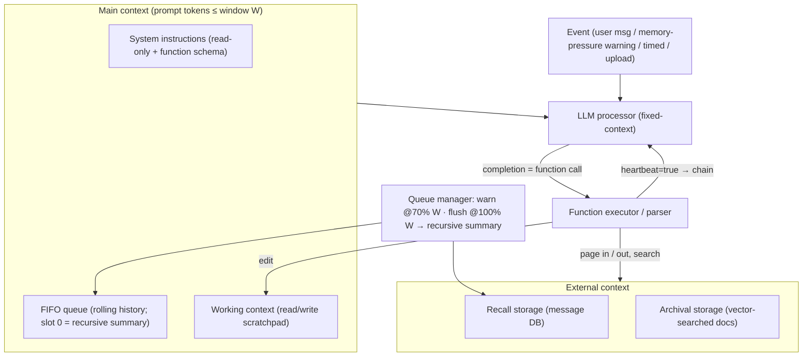

# MemGPT: Towards LLMs as Operating Systems — Packer et al., 2023

> **arXiv:** 2310.08560v2 · **Venue:** preprint (later ICLR/COLM-adjacent; project became **Letta**) · **Affiliation:** UC Berkeley (Sky Computing Lab)

## TL;DR
MemGPT treats a fixed-context LLM like the CPU of an **operating system** and gives it a
**virtual-memory** abstraction: a small in-window **main context** (RAM) plus an unbounded
out-of-window **external context** (disk), with the LLM itself issuing **function calls** to page
data between them. A queue manager raises **memory-pressure** interrupts when the window fills,
and the model self-edits its working memory and searches archival storage — yielding the illusion
of unbounded context on document analysis and multi-session chat while the underlying model stays
fixed-length.

## Problem & motivation
Transformer context windows are fixed and expensive to grow (self-attention is quadratic), and
even long-context models struggle to *use* the middle of a long window
([Lost in the Middle](benchmark_2023_lost-in-the-middle.md)). Two workloads expose this hard:

- **Conversational agents** that should persist over weeks/months exceed the window after a few
  dozen turns and lose **consistency** (contradict earlier facts) and **engagement** (fail to
  recall the user).
- **Document analysis** over reports, legal filings, or corpora that individually or collectively
  blow past even 128K-token windows.

Rather than enlarge the window, MemGPT asks: can an LLM **manage its own limited context** the way
an OS manages limited physical memory — paging what it needs in and out on demand?

## Key idea
Borrow **virtual memory / paging** from operating systems. Define two tiers and let the LLM move
data between them through tool calls it emits itself:

$$
\underbrace{c_{\text{main}}}_{\text{prompt tokens = RAM}}
\;\;\xleftrightarrow[\text{function calls}]{\text{page in / evict}}\;\;
\underbrace{c_{\text{ext}}}_{\text{external store = disk}}
$$

- $c_{\text{main}}$ — everything **in-context** and visible to the LLM this step. It is capped by
  the model's window $W$ (e.g. 8K–128K tokens).
- $c_{\text{ext}}$ — everything **out-of-context**; it must be *explicitly* paged into
  $c_{\text{main}}$ before the model can read it.

The LLM is the "processor": each step it reads $c_{\text{main}}$ and emits an output that the
**function executor** parses. Valid calls edit working memory or query storage; results (and any
runtime errors) are fed back, closing a self-editing feedback loop. Control is **interrupt-driven**
— user messages, system warnings, document-upload events, and timed events all trigger inference.

## How it works

### Main context — the three regions of the prompt (§2.1)
The prompt tokens are split into three contiguous regions:

1. **System instructions** — read-only; describe the MemGPT control flow, the memory hierarchy,
   and the **function schema** (with natural-language descriptions) the model may call.
2. **Working context** — a fixed-size **read/write scratchpad** of unstructured text, editable
   *only* through function calls. Holds durable facts: the user persona, key preferences, the
   agent's own persona.
3. **FIFO queue** — a rolling message history (user↔agent messages, system warnings, function
   I/O). Its **first slot stores a recursive summary** of everything already evicted.

### External context (§2)
- **Recall storage** — the full message database (conversation history), searchable.
- **Archival storage** — a read/write database of arbitrary-length text objects (documents),
  queried by **vector search** (the paper uses PostgreSQL + `pgvector`, HNSW index, over
  `text-embedding-ada-002` embeddings).

### Queue manager & memory pressure (§2.2)
The queue manager appends new messages, runs inference, and writes both the incoming message and
the completion to recall storage. It enforces two thresholds on the window budget:

- **Warning token count** (e.g. **70%** of $W$): insert a *memory-pressure* system message so the
  LLM can proactively save important content from the FIFO queue into working context or archival
  storage.
- **Flush token count** (e.g. **100%** of $W$): **evict** a chunk (e.g. 50% of the window),
  fold the evicted messages into a **new recursive summary**, and keep the raw evicted messages in
  recall storage (still retrievable, no longer in-context).


### Function executor & self-directed editing (§2.3)
Completion tokens are interpreted as function calls. Editing and retrieval are **entirely
self-directed**: the model decides when to move items between tiers and when to rewrite working
context. Parsed calls are validated, executed, and their outputs (including errors like "main
context full") are appended back so the model can correct itself.

### Control flow & function chaining (§2.4)
A special keyword argument **`request_heartbeat=true`** lets the model **chain calls**: after a
function returns, control comes straight back to the processor (its output appended to main
context) instead of yielding to the user. This enables **multi-step retrieval** — e.g. paging
through several pages of search results, or collating facts from multiple documents — before
finally answering.




## Training / data
MemGPT is an **inference-time scaffold**, not a fine-tuned model: it wraps a frozen function-calling
LLM (GPT-3.5 Turbo, GPT-4, GPT-4 Turbo). All behavior comes from **system-prompt instructions plus
a function schema**; the appendix gives the exact personas and judge prompts. The authors release
augmented benchmark data: an extended **Multi-Session Chat (MSC)** set with a 6th "deep memory"
session, a **nested key-value** dataset, and embeddings for **20M Wikipedia** articles.

## Results
Numbers below are from the paper's tables/figures (v2). GPT-4 judge + ROUGE-L used for scoring.

| Benchmark | Metric | MemGPT | Base LLM | Source |
|---|---|---|---|---|
| Deep Memory Retrieval (MSC, GPT-4) | Accuracy | **92.5%** | 32.1% | §3.1, Table 2 |
| Deep Memory Retrieval (MSC, GPT-4 Turbo) | Accuracy | **93.4%** | 35.3% | §3.1, Table 2 |
| Deep Memory Retrieval (MSC, GPT-3.5) | Accuracy | **66.9%** | 38.7% | §3.1, Table 2 |
| Nested KV retrieval | Solve ≥3 nesting levels | **only method that holds** | 0% by 3 levels | §3.2.2, Fig. 7 |
| Document QA (NaturalQuestions-Open) | Accuracy vs. context length | **flat (paginated recall)** | capped by retriever | §3.2.1, Fig. 5 |

Key qualitative findings: MemGPT's accuracy on document QA is **unaffected by growing context**
because it pages through archival storage instead of stuffing the window; on nested KV lookups it
is the **only approach that survives beyond 2 nesting levels** by re-querying main context in a
loop; and it exceeds even the human-written conversation-opener baseline on engagement.

## Limitations & follow-ups
- **Depends on strong function-calling.** With GPT-3.5's weaker tool use, MemGPT's document-QA
  performance degrades sharply; it works best on GPT-4.
- **Heuristic memory policies.** Warning/flush thresholds and eviction fractions are hand-tuned,
  not learned — a natural target for a learned controller.
- **Summarization is lossy.** Evicted-message recursive summaries can drop detail that only exact
  recall (a later search) recovers.
- **Successors.** MemGPT became **[Letta](https://github.com/letta-ai/letta)**. Later agentic
  memory systems refine *organization* rather than paging: **[A-Mem](agentic_2025_a-mem.md)**
  (self-linking Zettelkasten notes) and **[MemoryBank](agentic_2023_memorybank.md)** (Ebbinghaus
  decay). **[Recursive Language Models](agentic_2025_recursive-lm.md)** push the opposite extreme —
  the *model itself* writes code to page/recurse over the prompt in a REPL, with no explicit
  hierarchy. In this repo, MemGPT is the paging controller that
  [LCLM](../context/ctx_compression.md)'s `EXPAND(i)` op slots into: compressed latents as *main
  context*, exact re-tokenization as the *page-in*.

## Links
- **arXiv:** [abs](https://arxiv.org/abs/2310.08560) · [html (ar5iv)](https://ar5iv.labs.arxiv.org/html/2310.08560) · [pdf](https://arxiv.org/pdf/2310.08560)
- **Code / project:** [research.memgpt.ai](https://research.memgpt.ai/) · [github.com/letta-ai/letta](https://github.com/letta-ai/letta) (formerly MemGPT)
- **BibTeX:**
  ```bibtex
  @article{packer2023memgpt,
    title   = {MemGPT: Towards LLMs as Operating Systems},
    author  = {Packer, Charles and Wooders, Sarah and Lin, Kevin and Fang, Vivian and Patil, Shishir G. and Stoica, Ion and Gonzalez, Joseph E.},
    journal = {arXiv preprint arXiv:2310.08560},
    year    = {2023}
  }
  ```
- **Related papers:** [MemoryBank](agentic_2023_memorybank.md) · [A-Mem](agentic_2025_a-mem.md) · [Recursive Language Models](agentic_2025_recursive-lm.md) · [Lost in the Middle](benchmark_2023_lost-in-the-middle.md) · [RULER](benchmark_2024_ruler.md)
- **In-repo:** [Agentic memory & frameworks thread](../context/agentic_memory/agentic_memory.md) · [Soft-token compression thread](../context/soft_token/soft_token.md) · [LCLM context-compression survey](../context/ctx_compression.md) · [SGLang runtime](systems_2023_sglang.md)
