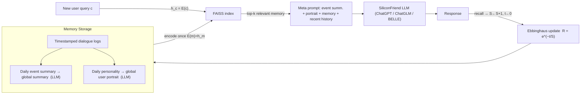

# MemoryBank: Enhancing Large Language Models with Long-Term Memory — Zhong et al., 2023

> **arXiv:** 2305.10250v3 · **Venue:** AAAI 2024 (vol. 38, pp. 19724–19731) · **Affiliation:** Sun Yat-sen University · Harbin Institute of Technology · KTH

## TL;DR
MemoryBank is a plug-in **long-term memory** module for LLMs built from three parts — **storage**
(timestamped dialogue logs plus LLM-summarized event and personality digests), **retrieval**
(dense dual-encoder search with FAISS), and **updating** (a psychologically grounded
**Ebbinghaus forgetting curve** that lets memories decay or strengthen over time). It is
demonstrated in **SiliconFriend**, a bilingual (EN/CN) AI-companion chatbot that recalls user
facts across many sessions and adapts to the user's evolving personality.

## Problem & motivation
Vanilla LLMs are **stateless across sessions**: once a conversation scrolls past the context
window, everything is forgotten. For long-term companions, tutors, or assistants this breaks
**continuity** — the model cannot recall a user's preferences from days ago, cannot track how a
relationship or the user's mood evolves, and treats every session as a cold start. Prior retrieval
augmentation adds documents but has **no notion of time or salience**: nothing decays, nothing is
reinforced, and stored turns pile up flatly. MemoryBank's thesis: a useful long-term memory must
not only *store and retrieve* but also **forget selectively**, mimicking how human memory fades
unless reinforced.

## Key idea
Three cooperating mechanisms, with the human-memory model supplying the update rule.

**1. Hierarchical summarization for storage.** Raw multi-turn logs are condensed by the LLM into a
two-level hierarchy — per-day **event summaries** and a rolling **global summary** — plus per-day
and global **personality/portrait** digests. This turns a flat transcript into queryable,
salience-ranked memory.

**2. Dense dual-encoder retrieval.** Every memory piece $m$ is pre-encoded once by an encoder
$E(\cdot)$ into a vector $h_m$. The whole store $M$ becomes
$$
\mathbf{M}=\{\,h_{m_0},\,h_{m_1},\,\dots,\,h_{m_{|M|}}\,\},\qquad h_m = E(m),
$$
indexed with **FAISS**. At query time the current context $c$ is encoded to $h_c=E(c)$ and the
nearest memories are returned — the same **dual-tower** scheme as
[DPR](retrieval_2020_colbert-late-interaction.md) (Karpukhin et al. 2020). The encoder is
swappable: MiniLM for English, Text2vec for Chinese (wired through LangChain).

**3. Ebbinghaus forgetting curve for updating.** Memory retention follows
$$
R = e^{-\,t/S},
$$
where $R\in(0,1]$ is the fraction retained, $t$ is the time elapsed since the memory was last seen,
$e\approx 2.71828$, and $S$ is the **memory strength**. $S$ is a discrete counter initialized to
$1$ when a memory is first created; each time the memory is **recalled**, $S \leftarrow S+1$ and the
clock resets $t \leftarrow 0$. Frequently used memories thus decay slowly and persist; unused ones
fade and can be dropped — giving the store an automatic salience/recency prior.

## How it works


### Storage (§2.1)
- **Chronological logs.** Multi-turn dialogues are stored verbatim with timestamps.
- **Hierarchical event summary.** The LLM condenses dialogues into a **daily event summary** and
  then into a **global summary**, prompted with *"Summarize the events and key information in the
  content [dialog / events]."*
- **Dynamic personality understanding.** Daily personality insights are distilled (*"Based on the
  following dialogue, please summarize the user's personality traits and emotions. [dialog]"*) and
  merged into a **global user portrait**.

### Retrieval (§2.2)
Encode each memory once → FAISS index. At turn time, encode the current context as the query,
retrieve top matches, and inject them into the prompt.

### Updating (§2.3)
Apply $R=e^{-t/S}$ per memory; recall increments $S$ and resets $t$. Memories whose retention falls
below threshold are forgotten, so the store stays compact and salience-weighted.



### SiliconFriend — the demonstrator (§3)
An AI-companion chatbot in **two stages**:

1. **Empathy tuning.** Parameter-efficient **LoRA** fine-tuning (rank $r=16$, 3 epochs, single
   A100) on **38k psychological-dialogue** examples, applied to open backbones **ChatGLM-6.2B** and
   **BELLE-7B** (LLaMA-based). LoRA reparameterizes a weight update as a low-rank product:
   $$
   y = Wx + BAx,\qquad W\in\mathbb{R}^{d\times k},\; B\in\mathbb{R}^{d\times r},\; A\in\mathbb{R}^{r\times k},\; r\ll\min(d,k),
   $$
   so only $A,B$ are trained while $W$ stays frozen.
2. **Memory integration.** MemoryBank is attached, giving cross-session recall. SiliconFriend also
   supports closed **ChatGPT** and is **bilingual** (EN/CN).

## Training / data
- **LoRA data:** 38k psychological-counseling dialogues; tuned only on open backbones (ChatGLM,
  BELLE) so the release is fully open.
- **Evaluation memory:** a synthetic long-horizon benchmark — **10 days × 15 virtual users**, with
  ChatGPT role-playing each user, then **194 probing questions** (97 EN + 97 CN) testing recall of
  facts introduced days earlier.

## Results
From the paper (§4, Table 2). Metrics: **Retrieval Accuracy** $\in\{0,1\}$, **Response Correctness**
$\in\{0,0.5,1\}$, **Contextual Coherence** $\in\{0,0.5,1\}$, and **Model Ranking Score** $s=1/r$
(reciprocal rank across compared models).

| Language · Backbone | Retrieval Acc. | Response Corr. | Ctx. Coherence | Ranking $s$ | Source |
|---|---|---|---|---|---|
| EN · SiliconFriend-ChatGLM | 0.809 | 0.438 | 0.680 | 0.498 | §4, Table 2 |
| EN · SiliconFriend-BELLE | 0.814 | 0.479 | 0.582 | 0.517 | §4, Table 2 |
| EN · SiliconFriend-ChatGPT | 0.763 | **0.716** | **0.912** | **0.818** | §4, Table 2 |
| CN · SiliconFriend-ChatGLM | 0.840 | 0.418 | 0.428 | 0.510 | §4, Table 2 |
| CN · SiliconFriend-BELLE | **0.856** | 0.603 | 0.562 | 0.565 | §4, Table 2 |
| CN · SiliconFriend-ChatGPT | 0.711 | 0.655 | 0.675 | 0.758 | §4, Table 2 |

Retrieval accuracy is high (~0.8) across all backbones, confirming the dense memory index works;
the strongest backbone (ChatGPT) then converts retrieved memory into the most **correct and
coherent** responses. A qualitative study shows the forgetting curve producing human-like recall
that degrades gracefully rather than abruptly.

## Limitations & follow-ups
- **Summarization bottleneck.** Storage quality hinges on the LLM's summaries; errors compound over
  many days.
- **Flat memory (no structure).** Unlike [A-Mem](agentic_2025_a-mem.md), memories are independent
  vectors — there are no links between them, so multi-hop reasoning over memory is weak.
- **Synthetic evaluation.** The benchmark is ChatGPT-simulated users, not real long-term
  deployments.
- **Relation to neighbors.** MemoryBank contributes the **decay/salience** signal that
  [MemGPT](agentic_2023_memgpt.md)'s hand-tuned eviction lacks and that A-Mem's linking
  complements. In this repo it suggests *what to keep compressed vs. drop* — a density/recency prior
  for adaptive-ratio [context compression](../context/ctx_compression.md).

## Links
- **arXiv:** [abs](https://arxiv.org/abs/2305.10250) · [html](https://arxiv.org/html/2305.10250v3) · [pdf](https://arxiv.org/pdf/2305.10250)
- **Code:** [github.com/zhongwanjun/MemoryBank-SiliconFriend](https://github.com/zhongwanjun/MemoryBank-SiliconFriend)
- **BibTeX:**
  ```bibtex
  @inproceedings{zhong2024memorybank,
    title     = {MemoryBank: Enhancing Large Language Models with Long-Term Memory},
    author    = {Zhong, Wanjun and Guo, Lianghong and Gao, Qiqi and Ye, He and Wang, Yanlin},
    booktitle = {Proceedings of the AAAI Conference on Artificial Intelligence},
    volume    = {38},
    pages     = {19724--19731},
    year      = {2024}
  }
  ```
- **Related papers:** [MemGPT](agentic_2023_memgpt.md) · [A-Mem](agentic_2025_a-mem.md) · [Recursive Language Models](agentic_2025_recursive-lm.md) · [DPR / late-interaction retrieval](retrieval_2020_colbert-late-interaction.md)
- **In-repo:** [Agentic memory & frameworks thread](../context/agentic_memory/agentic_memory.md) · [LCLM context-compression survey](../context/ctx_compression.md) · [Soft-token compression thread](../context/soft_token/soft_token.md)
