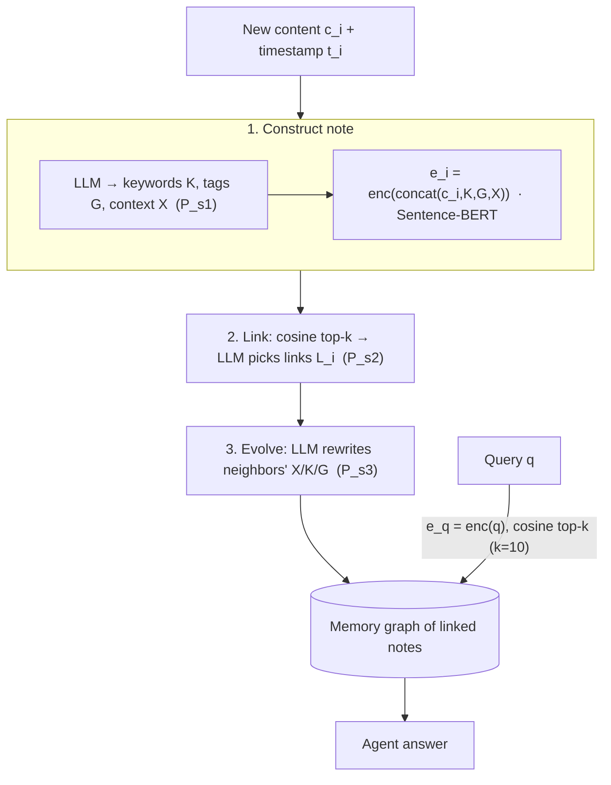

# A-Mem: Agentic Memory for LLM Agents — Xu et al., 2025

> **arXiv:** 2502.12110v1 · **Venue:** preprint · **Affiliation:** Rutgers University · Ant Group · Salesforce Research

## TL;DR
A-Mem is a **self-organizing agentic memory** for LLM agents, inspired by the **Zettelkasten**
note-taking method. Every new memory becomes a structured **note** (content + LLM-generated
keywords, tags, and a contextual description + an embedding). New notes are **linked** to their
nearest neighbors by an LLM, and — crucially — the act of adding a note can **evolve** existing
notes (rewriting their context/keywords/tags). The result is a memory graph that continually
reorganizes itself, beating fixed-structure memory (MemGPT, MemoryBank) on long-conversation QA,
especially **multi-hop** questions, while using far fewer tokens.

## Problem & motivation
Existing agent memories impose a **fixed, hand-designed structure**: MemoryBank has flat episodic
vectors, [MemGPT](agentic_2023_memgpt.md) has OS-style tiers with predefined access rules. That
works for the workflows the designer anticipated, but it **cannot reorganize itself** as new
information arrives — memories stay isolated, links are never formed, and older notes never benefit
from later context. Human note-takers (Luhmann's **Zettelkasten**) instead build an evolving web:
each new card is *filed next to related cards*, *cross-referenced*, and *reinterpreted* in light of
what came before. A-Mem asks: can an LLM agent maintain its memory the same way — dynamically
linking and updating notes — instead of dumping turns into a static store?


## Key idea
Represent memory as a graph of rich **notes** and run three LLM-driven operations — **construct**,
**link**, **evolve** — every time something new is stored, plus a similarity **retrieval** at query
time.

**Note (atomic memory unit).** Each memory $m_i$ is a 7-tuple (Eq. 1):
$$
m_i = \{\,c_i,\; t_i,\; K_i,\; G_i,\; X_i,\; e_i,\; L_i\,\},
$$
where $c_i$ = raw content, $t_i$ = timestamp, $K_i$ = LLM-extracted **keywords**, $G_i$ =
LLM-extracted **tags**, $X_i$ = LLM-written **contextual description**, $e_i$ = dense **embedding**,
and $L_i$ = the set of **links** to other notes.

**Construction (§3.1).** The structured fields are generated by one LLM call over the content and
prompt $P_{s1}$ (Eq. 2), then the embedding is computed over the concatenation of content and the
generated fields (Eq. 3):
$$
K_i, G_i, X_i \leftarrow \mathrm{LLM}\big(c_i \,\|\, t_i \,\|\, P_{s1}\big),
\qquad
e_i = f_{\text{enc}}\big[\mathrm{concat}(c_i, K_i, G_i, X_i)\big],
$$
with $f_{\text{enc}}$ a Sentence-BERT encoder (`all-MiniLM-L6-v2`). Embedding the *generated*
fields — not just raw text — is what makes retrieval semantically richer.

**Link generation (§3.2).** For a new note $n$, cosine similarity to every stored note $j$ (Eq. 4):
$$
s_{n,j} = \frac{e_n \cdot e_j}{\lVert e_n\rVert\,\lVert e_j\rVert},
$$
selects the top-$k$ nearest set $\mathcal{M}_{\text{near}}^{\,n}$ (Eq. 5). An LLM then decides which
of those to actually link, writing $L_i$ (Eq. 6):
$$
L_i \leftarrow \mathrm{LLM}\big(m_n \,\|\, \mathcal{M}_{\text{near}}^{\,n} \,\|\, P_{s2}\big).
$$

**Memory evolution (§3.3).** The new note can *rewrite* its neighbors. Each neighbor $m_j$ is
updated (Eq. 7):
$$
m_j^{*} \leftarrow \mathrm{LLM}\big(m_n \,\|\, (\mathcal{M}_{\text{near}}^{\,n}\setminus m_j) \,\|\, m_j \,\|\, P_{s3}\big),
$$
which may revise the neighbor's **context $X_j$, keywords $K_j$, or tags $G_j$** in light of the new
information — the mechanism absent from flat memories.

**Retrieval (§3.4).** A query $q$ is encoded $e_q=f_{\text{enc}}(q)$ (Eq. 8), scored by cosine
$s_{q,i}$ (Eq. 9), and the top-$k$ notes are returned (Eq. 10), with default $k=10$.

## How it works




Per new memory: **1 construction call + 1 link call + (up to $k$) evolution updates**; retrieval is
a single embedding + nearest-neighbor lookup. The prompts $P_{s1}, P_{s2}, P_{s3}$ are given
verbatim in Appendix C.

## Training / data
A-Mem is **training-free** — it orchestrates a frozen LLM plus a frozen sentence encoder. Evaluation
uses **LoCoMo** (Maharana et al. 2024): very long dialogues (avg ~9K tokens, up to 35 sessions,
7,512 QA pairs) across five categories — **single-hop, multi-hop, temporal, open-domain,
adversarial**. Six backbones are tested (GPT-4o-mini, GPT-4o, Qwen2.5-1.5B/3B, Llama3.2-1B/3B).
Metrics: **F1** and **BLEU-1** (with ROUGE-2/L, METEOR, and SBERT similarity in the appendix).

## Results
From the paper (Table 1), GPT-4o-mini backbone. Baselines: LoCoMo (full-context), ReadAgent,
MemoryBank, MemGPT.

| Question type | Metric | A-Mem | MemGPT | LoCoMo (full-ctx) | Source |
|---|---|---|---|---|---|
| Multi-hop | F1 | **45.85** | 25.52 | 18.41 | §4, Table 1 |
| Multi-hop | BLEU-1 | **36.67** | 19.44 | 14.77 | §4, Table 1 |
| Single-hop | F1 | 27.02 | — | — | §4, Table 1 |
| Temporal | F1 | 12.14 | — | — | §4, Table 1 |
| Open-domain | F1 | 44.65 | — | — | §4, Table 1 |
| Adversarial | F1 | 50.03 | — | — | §4, Table 1 |
| Avg. context length | tokens | **~2,520** | ~16,977 | — | §4, Table 1 |

A-Mem's biggest win is **multi-hop** (~1.8× MemGPT's F1), exactly where inter-note **links** pay
off — and it does so with **~6.7× fewer tokens** than MemGPT because it retrieves a handful of
compact notes instead of paging large histories. An ablation (Table 2) removing **Link Generation**
and **Memory Evolution** confirms both matter, with the largest drop on multi-hop questions.

## Limitations & follow-ups
- **LLM-call overhead.** Every write triggers construction + linking + up to $k$ evolution calls —
  more expensive per stored item than a plain vector insert.
- **Error propagation via evolution.** A bad rewrite can corrupt neighbors' attributes, since
  evolution mutates existing notes in place.
- **Fixed $k$ and encoder.** Link/retrieval breadth ($k$) and the Sentence-BERT encoder are static
  hyperparameters, not learned.
- **Relation to neighbors.** A-Mem adds the **structure** that flat
  [MemoryBank](agentic_2023_memorybank.md) lacks and the **self-reorganization** that
  [MemGPT](agentic_2023_memgpt.md)'s fixed tiers lack; it is complementary to
  [Recursive Language Models](agentic_2025_recursive-lm.md), which recurse over a *single* giant
  prompt rather than curate a persistent store. In this repo, compressed latents could serve as the
  **note payloads** the agent links and expands (see the
  [agentic-memory thread](../context/agentic_memory/agentic_memory.md)).

## Links
- **arXiv:** [abs](https://arxiv.org/abs/2502.12110) · [html](https://arxiv.org/html/2502.12110v1) · [pdf](https://arxiv.org/pdf/2502.12110)
- **Code:** [github.com/WujiangXu/AgenticMemory](https://github.com/WujiangXu/AgenticMemory)
- **BibTeX:**
  ```bibtex
  @article{xu2025amem,
    title   = {A-Mem: Agentic Memory for LLM Agents},
    author  = {Xu, Wujiang and Liang, Zujie and Mei, Kai and Gao, Hang and Tan, Juntao and Zhang, Yongfeng},
    journal = {arXiv preprint arXiv:2502.12110},
    year    = {2025}
  }
  ```
- **Related papers:** [MemGPT](agentic_2023_memgpt.md) · [MemoryBank](agentic_2023_memorybank.md) · [Recursive Language Models](agentic_2025_recursive-lm.md)
- **In-repo:** [Agentic memory & frameworks thread](../context/agentic_memory/agentic_memory.md) · [LCLM context-compression survey](../context/ctx_compression.md) · [Soft-token compression thread](../context/soft_token/soft_token.md)
