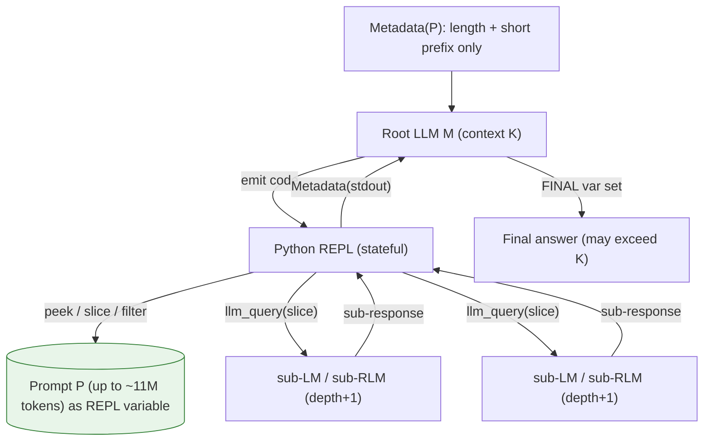

# Recursive Language Models — Zhang et al., 2025

> **arXiv:** 2512.24601v3 · **Venue:** preprint (CC BY 4.0) · **Affiliation:** MIT CSAIL

## TL;DR
Recursive Language Models (RLMs) let a bounded-context LLM answer over **effectively unbounded**
inputs by handing it a persistent **Python REPL** in which the giant prompt is stored as a
**variable**. The root model writes code to peek at, slice, and transform that variable, and can
**recursively call itself** (or a cheaper sub-model) on programmatic sub-spans, stitching the
partial answers into a final result. Only *constant-size metadata* of the prompt ever enters the
root's context, so RLMs scale to inputs of **6–11M tokens** and beat strong long-context baselines
(GPT-5, Claude Code, compaction agents) — median **+26%** over a compaction agent on the paper's
suite.

## Problem & motivation
Two hard ceilings limit long-context LLMs. First, the **input** cannot exceed the context window
$K$ — you cannot even *fit* a 10M-token codebase or a 1000-document research corpus. Second, even
within the window, tasks with a **long semantic horizon** (needing to relate facts spread across the
whole input, or produce output longer than $K$) degrade badly. Retrieval-augmentation and
context-compaction agents help but throw away detail up front. RLM reframes the input not as tokens
to be stuffed into a window but as an **environment** the model *programmatically explores* — the
model decides, in code, what to read and when to recurse, so neither input length, output length,
nor semantic horizon is bounded by $K$.

## Key idea
Treat the prompt $P\in\Sigma^{\star}$ (arbitrarily long) as part of an external **environment**
$\mathcal{E}$, exposed to the root LLM $\mathcal{M}$ (max context $K$) through a stateful REPL. $P$
lives as a **variable**, not as tokens in $\mathcal{M}$'s context. The root iteratively:

1. reads only **constant-size metadata** of $P$ (its length, a short prefix);
2. emits **code** that inspects/decomposes/transforms $P$ (`print(prompt[:100])`,
   `prompt.split(...)`, regex filters, …);
3. optionally issues **recursive sub-calls** — `llm_query(...)` to a sub-LM, or a full sub-RLM at
   greater depth — over programmatic slices of $P$;
4. accumulates intermediate variables and finally sets a `FINAL` variable, which is returned.

The three design choices that make this work (vs. an "ineffective" naive variant, Algorithm 2):
**(a)** $P$ is a *symbolic handle*, never copied into context; **(b)** the answer is *not generated
directly* by the root, so it may exceed $K$; **(c)** recursion is *symbolic* — sub-calls happen
inside code loops rather than being verbalized into the transcript.

**Algorithm 1 (root loop).**
$$
\begin{aligned}
&\texttt{state} \leftarrow \mathrm{InitREPL}(\text{prompt}=P);\quad \texttt{state}\leftarrow\mathrm{AddFunction}(\texttt{state},\ \text{sub-RLM }\mathcal{M})\\
&\texttt{hist} \leftarrow [\ \mathrm{Metadata}(\texttt{state})\ ]\\
&\textbf{while True:}\\
&\quad \texttt{code} \leftarrow \mathrm{LLM}_{\mathcal{M}}(\texttt{hist})\\
&\quad (\texttt{state},\ \texttt{stdout}) \leftarrow \mathrm{REPL}(\texttt{state},\ \texttt{code})\\
&\quad \texttt{hist} \leftarrow \texttt{hist}\ \Vert\ \texttt{code}\ \Vert\ \mathrm{Metadata}(\texttt{stdout})\\
&\quad \textbf{if } \texttt{state}[\texttt{Final}]\text{ is set: } \textbf{return } \texttt{state}[\texttt{Final}]
\end{aligned}
$$
Because only $\mathrm{Metadata}(\cdot)$ (constant size) of both $P$ and each `stdout` enters
$\texttt{hist}$, the root's context stays bounded **regardless of $|P|$**. The scheme targets
unbounded input ($|P|\gg K$), unbounded output, and a semantic horizon of $\Omega(|P|)$ or even
$\Omega(|P|^2)$ work.

## How it works

![Figure 2 (RLM): the REPL environment. The root RLM (depth=0) sees the LM plus a Python environment where the long prompt is loaded as a variable (the model is blocked from ingesting it wholesale — red ✗). It runs `print(prompt[:100])` to peek, then `prompt.split("Chapter 2")` and `llm_query(...)` to dispatch sub-spans to two depth=1 RLMs whose sub-responses ("The silver flask…", "Herod's ring…") are stitched into the `FINAL_ANSWER` and returned.](_assets/agentic_2025_recursive-lm/repl-env.png)

- **Instantiation.** A Python REPL with the sub-LM / sub-RLM exposed as callable modules; helper
  `llm_query` for recursive calls; `FINAL()` / `FINAL_VAR()` tags to set the answer.
- **Depth control.** `RLM(model, depth=N)`: depth 0 = no sub-calls (root reasons over slices
  itself); depth 1 = calls a sub-**LM**; depth > 1 = calls a sub-**RLM** (true recursion). For the
  GPT-5 experiments the root is GPT-5 and recursive calls use GPT-5-mini.
- **Emergent trajectory patterns.** Across tasks the root discovers reusable strategies: **regex/
  programmatic filtering** to shrink $P$, **recursive decomposition** into sub-queries, and
  **output stitching** of sub-responses.




## Training / data
RLM is primarily an **inference-time scaffold** over frozen models (GPT-5 / GPT-5-mini, Qwen3-Coder,
etc.). The paper also shows the recipe can be **distilled**: **RLM-Qwen3-8B** is a rejection-sampled
**SFT** fine-tune of Qwen3-8B on **1,000 filtered RLM(Qwen3-Coder-480B-A35B) trajectories** over
LongBenchPro, trained with the `prime-rl` library (batch 64, 300 steps, ~48 H100-hours). It gains
**+28.3% median** over base Qwen3-8B and runs **>3×** faster than calling the teacher. A separate
MRCRv2 RLVR experiment (Qwen3-4B) studies length generalization.

## Results
From the paper (Table 1). Tasks: **CodeQA** (LongBench-v2, 23K–4.2M tokens), **BrowseComp-Plus**
(1K docs, 6–11M tokens, multi-hop deep research), **OOLONG** (`trec_coarse`, linear), **OOLONG-Pairs**
(quadratic). Accuracy (%).

| System | CodeQA | BrowseComp+ | OOLONG | OOLONG-Pairs | Source |
|---|---|---|---|---|---|
| GPT-5 (base) | 24.0* | 0.0* | 44.0 | 0.1 | §3, Table 1 |
| Compaction agent | 58.0 | 70.5 | 46.0 | 0.1 | §3, Table 1 |
| Claude Code (+offloading) | 62.0 | 84.0 | 48.0 | 6.5 | §3, Table 1 |
| **RLM (GPT-5, depth=1)** | 62.0 | 91.3 | 56.0 | 58.0 | §3, Table 1 |
| **RLM (GPT-5, depth=2)** | 66.0 | 92.0 | 56.5 | 65.5 | §3, Table 1 |
| **RLM (GPT-5, depth=3)** | 58.0 | 92.0 | 58.0 | **76.0** | §3, Table 1 |
| RLM (Qwen3-Coder-480B, depth=1) | 56.0 | 44.7 | 48.0 | 23.1 | §3, Table 1 |

\* base GPT-5 truncates / cannot fit the largest inputs. Abstract-level summary: RLM's gains over
GPT-5 are **median +26% vs. a compaction agent, +130% vs. CodeAct-with-sub-calls, +13% vs. Claude
Code**. On OOLONG-Pairs (quadratic horizon) only RLM scales meaningfully, and deeper recursion
helps most there. A separate Table 2 (LongCoT-mini) shows RLM(GPT-5.2, depth=1)+decomposition hints
at **65.6 avg vs. 38.7** for base GPT-5.2.

## Limitations & follow-ups
- **Latency & cost.** Recursion spawns many model calls; depth > 1 trades wall-clock and token cost
  for accuracy, and the best depth is task-dependent (depth 3 helps OOLONG-Pairs but *hurts*
  CodeQA).
- **Needs a code-capable root.** The root must reliably write correct REPL code; weaker models (e.g.
  Qwen3-Coder on BrowseComp+) lag GPT-5 sharply.
- **Sandbox dependence.** Requires a persistent, secure Python execution environment — an
  engineering and safety surface absent from pure-prompt methods.
- **Relation to neighbors.** RLM is the **divide-and-conquer / recursion** cousin of the persistent
  memory stores ([MemGPT](agentic_2023_memgpt.md), [A-Mem](agentic_2025_a-mem.md),
  [MemoryBank](agentic_2023_memorybank.md)): those *curate* what to keep across sessions, RLM
  *recurses* over one giant input on the fly. The [LCLM](../context/ctx_compression.md) authors
  explicitly flag composing LCLMs with RLM — RLM chooses *which spans*, LCLM makes each span **cheap
  to hold** as latents (breadth × depth without OOM); its S-NIAH task comes from
  [RULER](benchmark_2024_ruler.md). Its multi-call trajectories are the workload a runtime like
  [SGLang](systems_2023_sglang.md) executes.

## Links
- **arXiv:** [abs](https://arxiv.org/abs/2512.24601) · [html](https://arxiv.org/html/2512.24601v3) · [pdf](https://arxiv.org/pdf/2512.24601)
- **Code:** [github.com/alexzhang13/rlm](https://github.com/alexzhang13/rlm)
- **BibTeX:**
  ```bibtex
  @article{zhang2025recursive,
    title   = {Recursive Language Models},
    author  = {Zhang, Alex L. and Kraska, Tim and Khattab, Omar},
    journal = {arXiv preprint arXiv:2512.24601},
    year    = {2025}
  }
  ```
- **Related papers:** [MemGPT](agentic_2023_memgpt.md) · [A-Mem](agentic_2025_a-mem.md) · [MemoryBank](agentic_2023_memorybank.md) · [RULER](benchmark_2024_ruler.md)
- **In-repo:** [Agentic memory & frameworks thread](../context/agentic_memory/agentic_memory.md) · [LCLM context-compression survey](../context/ctx_compression.md) · [SGLang runtime](systems_2023_sglang.md) · [Soft-token compression thread](../context/soft_token/soft_token.md)
