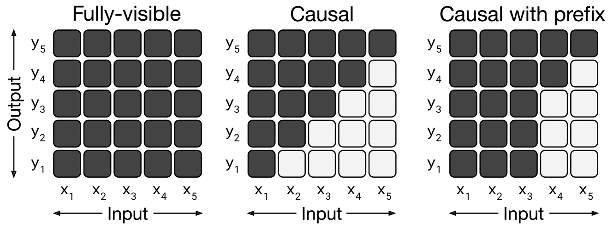
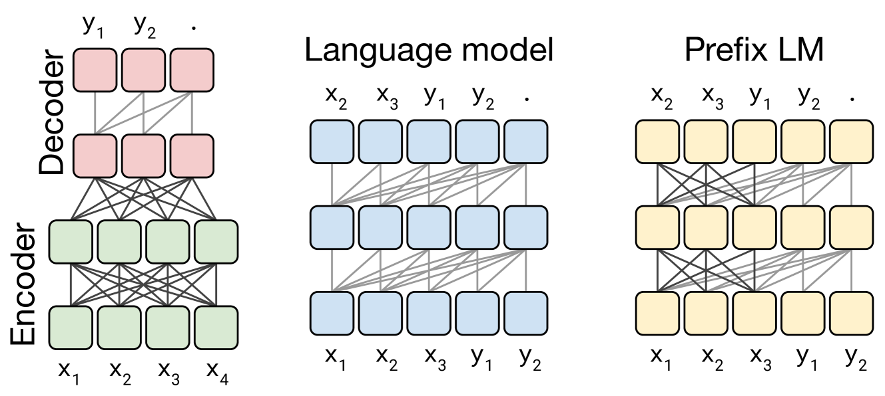

# T5 & the Prefix-LM: Unified Text-to-Text Transfer Learning — Raffel et al., 2019/2020

> **arXiv:** 1910.10683 · **Title:** *Exploring the Limits of Transfer Learning with a Unified
> Text-to-Text Transformer* · **Authors:** Colin Raffel, Noam Shazeer, Adam Roberts, Katherine Lee,
> Sharan Narang, Michael Matena, Yanqi Zhou, Wei Li, Peter J. Liu (Google) ·
> **Venue:** JMLR 21 (2020) · **Code:** github.com/google-research/text-to-text-transfer-transformer ·
> **Data:** C4 (Colossal Clean Crawled Corpus)

## TL;DR
T5 casts **every** NLP task — translation, classification, QA, summarization — as
**text → text**, letting one encoder-decoder Transformer, one loss, and one decoding procedure
handle them all. A massive systematic study (objectives, architectures, corpora, scaling) crowns
**encoder-decoder + span-corruption denoising** as the best recipe, scaled to **11B params** for
SOTA on GLUE/SuperGLUE/SQuAD. For this repo the pivotal contribution is §3.2's **architecture /
attention-mask comparison**, which isolates the **prefix-LM** — a single decoder stack that reads a
prefix **bidirectionally** and generates the continuation **causally** — the conceptual ancestor of
the repo's soft-token conditioning.

## Why this matters for the backbone thread
The repo's [MixedDecoder](../mixed_decoder/mixed_decoder.md) conditions a causal decoder on a
bidirectionally-encoded context (soft tokens). T5 is where that design space was mapped precisely:
- **Encoder-decoder** — separate bidirectional encoder + causal decoder with cross-attention.
- **Prefix-LM** — *one* stack; a **fully-visible** mask over the prefix + a **causal** mask over the
  target (see [backbone thread](../context/backbone/backbone.md)).

The finding — encoder-decoder ≳ prefix-LM ≳ causal LM under a fixed compute budget — directly
motivates using a strong encoder ([Qwen3-Embedding](backbone_2025_qwen3-embedding.md)) feeding a
causal decoder ([Qwen3](backbone_2025_qwen3.md)).

## Problem & motivation
Transfer-learning NLP in 2019 was a patchwork of task-specific heads, losses, and architectures,
making apples-to-apples comparison of "what actually helps" nearly impossible. T5's thesis: fix a
**single text-to-text format** so that objectives, model shapes, datasets, and scale can be ablated
on equal footing — then run that study at scale.

## Key ideas
1. **Text-to-text everything.** Prepend a task prefix (e.g. `translate English to German:`,
   `stsb sentence1: … sentence2: …`) and train the model to emit the answer as text — even
   regression targets are string-encoded.
2. **Span-corruption denoising.** Mask contiguous spans (15 % tokens, mean span 3), replace each
   with a unique **sentinel**, and train the decoder to emit the dropped spans. Cheaper targets than
   BERT-style token-level masking and best in the ablation.
3. **Architecture / attention-mask taxonomy.** The same layers can implement encoder-decoder, a
   causal LM, or a prefix-LM purely by changing the **attention mask**.
4. **Simplified Transformer components** — T5-LayerNorm (no bias, no mean-subtraction; the RMSNorm
   precursor, cf. [RMSNorm](attention_2019_rmsnorm.md)) and **relative position bias** (shared,
   bucketed) instead of absolute/sinusoidal embeddings.

## Attention masks & architectures (reimplementation-grade)
Given queries/keys at positions $i,j$, a mask $M$ sets which keys each query attends to:
$$\text{fully-visible: } M_{ij}=1\ \forall i,j; \qquad \text{causal: } M_{ij}=\mathbb{1}[j\le i].$$
The **prefix-LM** is the hybrid: for a prefix of length $p$,
$$M_{ij}=\begin{cases}1 & j\le p \quad\text{(prefix: fully visible)}\\ \mathbb{1}[j\le i] & j> p \quad\text{(target: causal)}.\end{cases}$$

*Figure 1 (paper Fig. 3) — Dark = attend, light = masked. Left: fully-visible (encoder). Middle:
causal (decoder LM). Right: causal-with-prefix (**prefix-LM**) — the prefix region is fully visible
while the target region stays causal.*

*Figure 2 (paper Fig. 4) — Left: encoder-decoder (bidirectional encoder + causal decoder joined by
cross-attention). Middle: decoder-only LM (everything causal). Right: prefix-LM (one stack;
bidirectional over input `x`, causal over target `y`).*

**Relative position bias (T5-RPE).** Add a learned scalar to each attention logit, shared across
layers, indexed by a log-bucketed relative distance:
$$\text{logit}_{ij}=\frac{q_i\!\cdot\!k_j}{\sqrt{d}}+r_{\text{bucket}(j-i)},\qquad 32\ \text{log-spaced buckets}.$$

**T5-LayerNorm.** RMS-style scale only (no bias, no mean-subtraction):
$$\bar{x}=\frac{x}{\sqrt{\tfrac{1}{d}\sum_k x_k^2+\epsilon}}\odot g.$$

## Objective & data
- **Span corruption:** corrupt 15 % of tokens, mean span length 3, unique sentinel per span; the
  target is the concatenation of dropped spans with sentinels.
- **C4:** ~750 GB of cleaned Common Crawl (dedup, language-filtered, boilerplate-stripped) — released
  as part of the study.

## Results
**Architecture ablation (Table 2, denoising objective, matched compute):**
| Architecture | GLUE | SQuAD (EM) | CNN/DM (ROUGE-2) | SuperGLUE |
|---|---:|---:|---:|---:|
| **Encoder-decoder** | **84.0** | **83.9** | **20.0** | **75.0** |
| Prefix-LM | 82.9 | 82.5 | 19.4 | 73.6 |
| Language model (causal) | 82.3 | 79.7 | 18.3 | 72.0 |

→ Encoder-decoder wins; **prefix-LM is a close second (−1.1 GLUE)** and clearly beats the causal LM —
bidirectional context over the input matters even in a single stack.

**Scaled T5 (model sizes Small ~60M → 11B; the 11B uses $d_{ff}$ 65 536, 128 heads):**
| Task | T5-11B |
|---|---:|
| GLUE (avg) | 90.3 |
| SuperGLUE (avg) | 88.9 |
| SQuAD (EM) | 86.3 |
| CNN/DM (ROUGE-2) | 21.6 |

SOTA on **18/24** tasks at release.

## Limitations & follow-ups
- The 11B model is expensive to serve; most gains come from **scale + denoising**, not architecture
  tricks.
- English-centric (C4); multilingual variants (mT5) came later.
- The prefix-LM lost narrowly to encoder-decoder here, but its single-stack simplicity influenced
  later unified decoders — including this repo's soft-token conditioning.
- **Relation to the repo.** Prefix-LM is the theoretical bridge between a bidirectional encoder and a
  causal decoder; the repo's stack pairs a dedicated encoder
  ([Qwen3-Embedding](backbone_2025_qwen3-embedding.md)) with a causal decoder
  ([Qwen3](backbone_2025_qwen3.md)), the encoder-decoder end of this same spectrum. See the
  [backbone thread](../context/backbone/backbone.md) and [ctx compression](../context/ctx_compression.md).

## Links
- **arXiv:** [abs](https://arxiv.org/abs/1910.10683) · [html](https://arxiv.org/html/1910.10683v4) · [pdf](https://arxiv.org/pdf/1910.10683)
- **Code / data:** https://github.com/google-research/text-to-text-transfer-transformer · C4 dataset
- **Venue:** Journal of Machine Learning Research 21 (2020)
- **Related:** [Qwen3](backbone_2025_qwen3.md) · [Qwen3-Embedding](backbone_2025_qwen3-embedding.md) · [RMSNorm](attention_2019_rmsnorm.md) · [RoPE](positional_2021_rope-roformer.md) · [Transformer](attention_2017_transformer.md) · [backbone thread](../context/backbone/backbone.md) · [MixedDecoder](../mixed_decoder/mixed_decoder.md)
