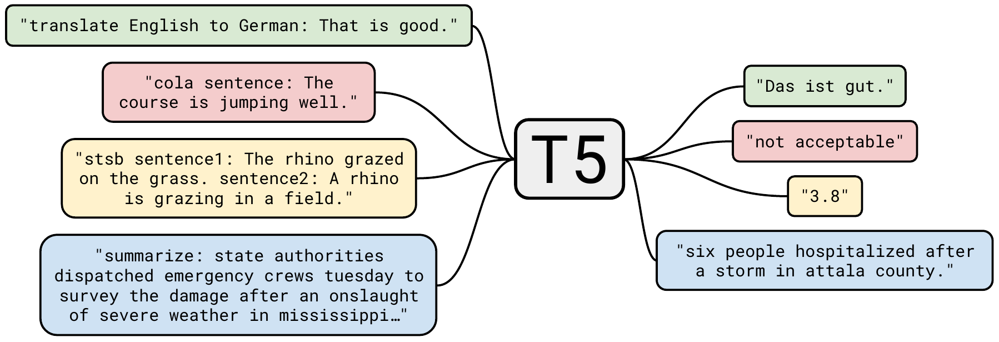
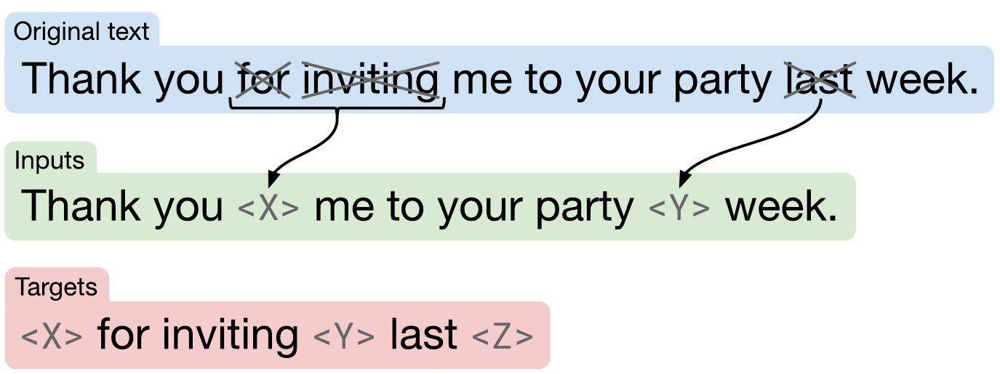
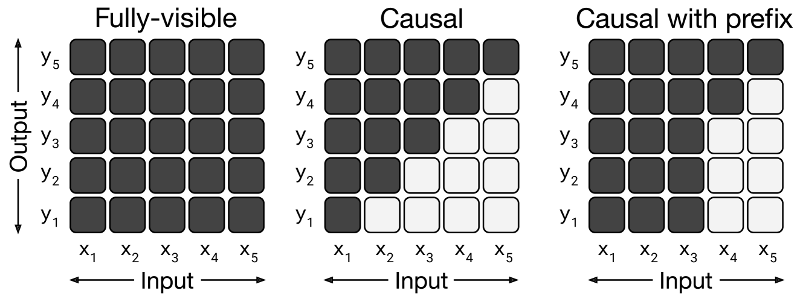
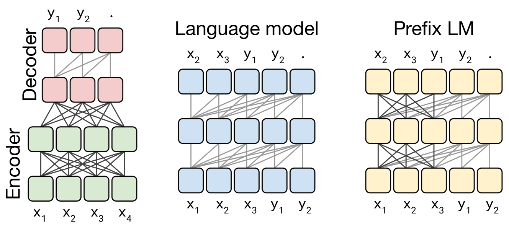
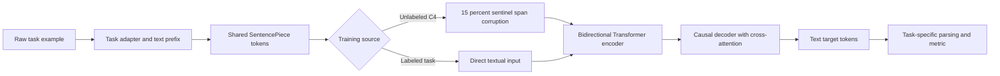

# T5: Unified Text-to-Text Transfer Learning — Raffel et al., 2020

> **arXiv:** 1910.10683v4 · **Venue:** Journal of Machine Learning Research 21(140), 2020 · **Affiliation:** Google

## TL;DR

T5 turns classification, question answering, translation, summarization, and unsupervised pretraining into the same operation: map an input string to an output string with an encoder-decoder Transformer. The paper couples that interface with a large controlled study of architectures, corruption objectives, corpora, transfer strategies, and scaling, then settles on sentinel-based span corruption over the new C4 web corpus. Scaling the resulting recipe from 60M to 11B parameters and to roughly one trillion pretraining tokens produced state-of-the-art results on 18 of 24 reported tasks at publication.

## Problem & motivation

Transfer learning in NLP had become effective but fragmented. BERT-style encoders used masked-token losses and task-specific prediction heads; autoregressive language models generated text but could not inspect future input context; encoder-decoder systems were natural for translation but were not the default for classification. Differences in architecture, objective, data, fine-tuning, and scale were often changed together, making it hard to know which ingredient caused an improvement.

T5 asks two linked questions:

1. Can every language task use one model interface, loss, and decoding procedure?
2. Under a controlled experimental setup, which choices of architecture, unsupervised objective, corpus, transfer method, and scale work best?

The answer to the first question is the **text-to-text** framework. An input receives a short task prefix, and its target is always represented as text: a class name such as `entailment`, a numeric string such as `3.8`, an answer span, a summary, or a translated sentence. This removes task-specific output heads without claiming that the tasks themselves are identical.

The answer to the second question is empirical rather than a single novel layer. The paper runs most comparisons with a 220M-parameter baseline and a fixed token budget, then combines the strongest and most efficient choices in final models ranging from about 60M to 11B parameters. This separation matters: T5 is both a framework and a systematic study, not merely an 11B model.

*Paper Figure 1. Translation, acceptability classification, semantic similarity regression, and summarization all expose the same string-in/string-out API. The prefixes identify the requested transformation; they are ordinary input tokens, not separate task heads.*

## Key idea

For a task $t$, preprocessing converts a raw example into an input token sequence $x^{(t)}=(x_1,\ldots,x_n)$ and target sequence $y^{(t)}=(y_1,\ldots,y_m)$. A shared encoder-decoder with parameters $\theta$ maximizes the same autoregressive conditional likelihood for every task:

$$
p_\theta(y\mid x)=\prod_{i=1}^{m}p_\theta(y_i\mid y_{<i},x),
\qquad
\mathcal{L}_{\text{text-to-text}}(\theta)
=-\sum_{i=1}^{m}\log p_\theta(y_i\mid y_{<i},x).
$$

Here $x$ includes any task prefix, $y_{<i}$ is the gold target prefix used by teacher forcing, and $m$ is allowed to vary by task. At inference, the model autoregressively emits target tokens until an end-of-sequence token.

For unsupervised pretraining, T5 corrupts spans rather than asking the decoder to reproduce every input token. Let $s_1,\ldots,s_k$ be non-overlapping spans sampled from a document $z$, and let $\sigma_1,\ldots,\sigma_k$ be distinct sentinel tokens. The corruption transform constructs

$$
x=C(z)=z\text{ with each }s_j\text{ replaced by }\sigma_j,
\qquad
y=\sigma_1\,s_1\,\sigma_2\,s_2\cdots\sigma_k\,s_k\,\sigma_{k+1}.
$$

The final sentinel marks the end of the last missing span. The selected recipe corrupts 15% of source tokens with mean span length 3. Predicting only removed spans makes the target substantially shorter than the original document, so denoising spends less decoder computation on already-visible text.

*Paper Figure 2. Each contiguous missing span is represented by one distinct sentinel in the encoder input. The target concatenates each sentinel with its removed text and ends with another sentinel, preserving span identity and order without reconstructing unchanged tokens.*

## How it works

### 1. Normalize every task into strings

Each dataset adapter creates one input string and one target string. Translation uses a prefix such as `translate English to German:`; summarization uses `summarize:`; GLUE and SuperGLUE examples use task-specific prefixes and verbalized labels. Because output spaces are textual, the same vocabulary, softmax, maximum-likelihood loss, and decoder apply to all tasks. Evaluation still uses each benchmark's native metric after parsing the generated string.

### 2. Tokenize with one shared vocabulary

The paper trains a 32,000-piece SentencePiece vocabulary on a mixture of ten parts English C4 and one part each German, French, and Romanian web text. Encoder input embeddings, decoder input embeddings, and output-softmax weights share this vocabulary. The multilingual sampling exists to support the three translation benchmarks; pretraining text itself remains English C4.

### 3. Encode bidirectionally and decode causally

The chosen model is a standard Transformer encoder-decoder. Encoder self-attention is fully visible, decoder self-attention is causal, and each decoder block also cross-attends to all encoder states. For query position $i$ and key position $j$, additive masking can be written as

$$
\operatorname{Attention}(Q,K,V)
=\operatorname{softmax}\!\left(\frac{QK^\top}{\sqrt{d_k}}+B+M\right)V,
$$

where $d_k$ is the key dimension, $B$ contains learned relative-position biases, and $M_{ij}=0$ for visible pairs and $-\infty$ for masked pairs. Encoder self-attention has $M_{ij}=0$ everywhere; decoder self-attention has $M_{ij}=0$ only when $j\le i$.

The architecture study also evaluates a decoder-only **prefix LM**. If positions $1,\ldots,p$ contain the input and later positions contain the target, its visibility indicator is

$$
A_{ij}=\mathbb{1}[j\le p\ \lor\ j\le i].
$$

Thus every position can inspect the entire input prefix, while a target position can inspect only earlier target tokens. This is an ablation in the T5 paper; the final T5 models use a separate encoder and decoder.

*Paper Figure 3. The causal-with-prefix mask gives a single decoder stack bidirectional access inside the input region while retaining left-to-right target generation. The controlled experiment uses it to isolate whether explicit encoder-decoder cross-attention is useful.*

*Paper Figure 4. The selected encoder-decoder separates source encoding from target generation. The other two diagrams concatenate input and target in one stack, differing only in whether input tokens can attend bidirectionally.*

### 4. Apply T5's Transformer modifications

T5 places normalization before each sublayer and adds the sublayer result through a residual connection. Its normalization rescales by root mean square without subtracting the mean and without an additive bias:

$$
\operatorname{Norm}(h)=g\odot
\frac{h}{\sqrt{\frac{1}{d}\sum_{r=1}^{d}h_r^2+\epsilon}},
$$

where $h\in\mathbb{R}^d$, $g\in\mathbb{R}^d$ is learned, and $\epsilon$ provides numerical stability. The architecture otherwise retains multi-head attention, position-wise feed-forward layers with ReLU in the original T5 configurations, dropout, residual connections, and a final vocabulary projection.

Instead of adding absolute position vectors to token embeddings, attention head $a$ receives a learned scalar bias selected from a bucketed relative distance:

$$
B^{(a)}_{ij}=b^{(a)}_{\rho(j-i)}.
$$

The bucket function $\rho$ preserves exact small offsets and groups increasingly distant offsets logarithmically, with 32 buckets and distances beyond 128 sharing the most distant buckets. Bidirectional encoder attention allocates buckets to both signs; causal decoder attention needs only non-positive visible offsets. The bias changes attention logits, not token representations.

### 5. Construct a span-corruption example

1. Pack or crop tokenized C4 text to a maximum source length of 512.
2. Select 15% of tokens for corruption in randomly located contiguous spans whose mean length is 3.
3. Replace each whole span in the source with a different sentinel token.
4. Build the target from the ordered sentinel/span pairs and append a final sentinel.
5. Encode the corrupted source once; train the decoder with teacher forcing only on the compact target.

For example, `A B C D E F G H`, with spans `C D` and `G`, becomes source `A B <X> E F <Y> H` and target `<X> C D <Y> G <Z>`.

### 6. Fine-tune and decode through the same interface

Fine-tuning updates all model parameters by default. Classification labels must be generated exactly like other targets, so an invalid label string counts as an error. The controlled experiments use greedy decoding. The paper also studies adapters, gradual unfreezing, multi-task-only training, and mixtures followed by fine-tuning; updating all parameters and pretraining followed by supervised fine-tuning is the strongest general default in its comparisons.

```mermaid
flowchart LR
    A[Raw task example] --> B[Task adapter and text prefix]
    B --> C[Shared SentencePiece tokens]
    C --> D{Training source}
    D -->|Unlabeled C4| E[15 percent sentinel span corruption]
    D -->|Labeled task| F[Direct textual input]
    E --> G[Bidirectional Transformer encoder]
    F --> G
    G --> H[Causal decoder with cross-attention]
    H --> I[Text target tokens]
    I --> J[Task-specific parsing and metric]
```

### 7. Scale one architecture family

The final family changes depth, width, feed-forward capacity, and attention heads while keeping the interface and objective fixed:

| Variant | Encoder / decoder layers | $d_{\text{model}}$ | $d_{\text{ff}}$ | Heads | Parameters |
|---|---:|---:|---:|---:|---:|
| Small | 6 / 6 | 512 | 2,048 | 8 | 60M |
| Base | 12 / 12 | 768 | 3,072 | 12 | 220M |
| Large | 24 / 24 | 1,024 | 4,096 | 16 | 770M |
| 3B | 24 / 24 | 1,024 | 16,384 | 32 | 3B |
| 11B | 24 / 24 | 1,024 | 65,536 | 128 | 11B |

Configuration values are from paper §3.1.1 and §3.7; parameter counts are the labels used in Table 14.

## Training / data

### C4 construction

The **Colossal Clean Crawled Corpus (C4)** is built from the April 2019 Common Crawl web extraction. Starting from roughly 20 TB of extracted text, heuristic cleaning retains about 750 GB of English text. Filters remove non-English pages, pages without terminal punctuation on most lines, short lines, boilerplate and code-like material, pages containing words from a blocklist, and duplicate lines occurring across the corpus. The paper emphasizes that this is heuristic cleaning, not a guarantee of factuality, representativeness, or safety.

The data study compares C4 with unfiltered C4, Wikipedia, Wikipedia plus Toronto Books Corpus, and RealNews-like and WebText-like subsets. Domain-focused filtering can help matching tasks, but smaller corpora degrade when repeated heavily. C4 is chosen as a large, diverse corpus that lets the final runs consume about a trillion tokens without repeatedly cycling through a small dataset.

### Controlled baseline

Most ablations use the 220M encoder-decoder baseline: 12 encoder and 12 decoder layers, $d_{\text{model}}=768$, $d_{\text{ff}}=3072$, 12 attention heads, and dropout 0.1. It is pretrained for $2^{19}=524{,}288$ steps with batches of 128 packed sequences of maximum length 512, approximately $2^{16}=65{,}536$ tokens per batch and $2^{35}\approx34$ billion tokens total.

Optimization uses AdaFactor and the inverse-square-root schedule

$$
\eta(n)=\frac{1}{\sqrt{\max(n,10^4)}},
$$

which gives a constant learning rate 0.01 for the first $10^4$ steps and then decays. Controlled fine-tuning runs for up to $2^{18}=262{,}144$ steps with the same 128-by-512 batch shape, a constant learning rate of 0.001, checkpoints every 5,000 steps, and selection by validation performance. These deliberately uniform settings support comparisons; they are not task-by-task optimal recipes.

### Final scaled recipe

The final T5 variants use 15% span corruption with mean span length 3 and train for one million steps. Each batch contains 2,048 length-512 sequences, so pretraining processes roughly $2^{20}$ tokens per step and about one trillion tokens overall. The final recipe also mixes supervised tasks into pretraining using examples-proportional sampling with a cap so very large datasets do not dominate, followed by separate fine-tuning on each downstream task. Apart from these changes and model scale, it retains the baseline optimizer, schedule, dropout, vocabulary, and text-to-text formulation described above.

The paper reports results across GLUE, SuperGLUE, SQuAD, CNN/DailyMail summarization, and WMT English-to-German, English-to-French, and English-to-Romanian translation. Its ablations generally report validation results; the final comparison reports test results except SQuAD, which uses the validation set.

## Results

### Controlled findings before scaling

The architecture comparison holds approximate compute fixed and shows that both architecture and objective matter. The full encoder-decoder with denoising is best on every aggregate in the selected rows; a prefix LM is competitive but consistently lower, and an ordinary causal LM is substantially worse on understanding tasks.

| Architecture and objective | GLUE | CNN/DM ROUGE-2 | SQuAD EM | SuperGLUE | WMT EnDe BLEU |
|---|---:|---:|---:|---:|---:|
| Encoder-decoder, denoising | 83.28 | 19.24 | 80.88 | 71.36 | 26.98 |
| Prefix LM, denoising | 81.82 | 18.61 | 78.94 | 68.11 | 26.43 |
| Causal LM, denoising | 74.70 | 17.93 | 61.14 | 55.02 | 25.09 |
| Encoder-decoder, LM objective | 79.56 | 18.59 | 76.02 | 64.29 | 26.27 |

All values are validation-set aggregates from paper Table 2. The encoder-decoder has about twice the parameters of the $P$-parameter single-stack models but approximately the same FLOPs under the paper's sequence-length accounting; the comparison therefore does not establish that it is more parameter-efficient.

Span corruption is a modest quality choice and a clearer efficiency choice, not a dramatic benchmark leap. At a fixed 15% corruption rate, mean span length 3 scores 83.49 GLUE, 19.62 CNN/DailyMail ROUGE-2, 81.84 SQuAD EM, and 72.53 SuperGLUE, versus 83.28, 19.24, 80.88, and 71.36 for independent-token corruption (paper Table 7). The paper concludes that denoising objectives differ much more from language modeling or deshuffling than the tested denoising variants differ from one another; compact targets motivate the final selection.

Longer training is not the whole result. With matched 220M scale, extending the baseline from about 34B to one trillion tokens raises GLUE from 83.28 to 84.80 and SuperGLUE from 71.36 to 73.90, while the complete T5-Base recipe reaches 85.97 and 75.64 respectively (validation results, paper Table 15). The non-scaling choices still contribute after token budget is controlled.

### Final scaled models

| Benchmark / metric | Previous best | T5-3B | T5-11B | Source |
|---|---:|---:|---:|---|
| GLUE average | 89.4 | 89.7 | **90.3** | Table 14, test |
| SuperGLUE average | 84.6 | 86.4 | **88.9** | Table 14, test |
| SQuAD exact match | 90.1 | 88.53 | **91.26** | Table 14, validation |
| SQuAD F1 | 95.5 | 94.95 | **96.22** | Table 14, validation |
| CNN/DailyMail ROUGE-2 | 20.30 | 21.02 | **21.55** | Table 14, test |
| WMT English-German BLEU | **33.8** | 31.8 | 32.1 | Table 14, test |
| WMT English-French BLEU | **43.8** | 42.6 | 43.4 | Table 14, test |
| WMT English-Romanian BLEU | **38.5** | 28.2 | 28.1 | Table 14, test |

T5-11B is the best T5 size on every reported task and establishes state of the art on 18 of 24 tasks (paper §3.7.2). It improves the then-best SuperGLUE average by 4.3 points and nearly reaches the paper's cited human score of 89.8. Scale is especially important: T5-3B exceeds some previous bests, but the 11B model supplies most headline records.

Translation is the conspicuous exception. English-only C4 pretraining and a vocabulary merely extended to cover the target languages do not beat systems trained with stronger multilingual or translation-specific setups. The English-German comparison is also not strictly matched because the cited previous best uses the larger WMT 2018 training set (paper §3.7.2).

## Limitations & follow-ups

- **Compute and deployability.** The strongest model has 11B parameters and consumes roughly one trillion pretraining tokens. The paper reports quality gains from model size, training duration, and ensembling, but does not make the final system inexpensive to train or serve.
- **English-centric data.** C4 is English-only, while a fixed SentencePiece vocabulary is manually broadened for three European target languages. Translation trails specialized systems, and the authors explicitly call for language-agnostic models. [mT5](https://arxiv.org/abs/2010.11934) later extends the framework to 101 languages.
- **Heuristic web filtering.** C4 inherits biases, offensive material, private information, duplication, and factual unreliability from web data. Its English and blocklist filters can also remove dialectal or identity-related language disproportionately; these concerns became clearer in later C4 audits.
- **Coordinate-ascent study design.** The paper changes one factor at a time around a baseline. Interactions between architecture, objective, data, model size, and optimization may therefore be missed, and choices that win at 220M parameters need not rank identically at 11B.
- **Metric limitations.** Exact string generation can turn formatting variants into classification errors. The paper also notes that ROUGE gains need not imply more coherent summaries, CNN/DailyMail rewards extraction, and some SuperGLUE metrics may favor machine-style answers.
- **No factuality or controllability mechanism.** Maximum-likelihood text generation does not ensure grounded, non-repetitive, calibrated, or safe outputs. The work standardizes transfer learning rather than solving generation reliability.
- **Original T5 is a specific recipe.** T5 v1.1 changes activation and pretraining details; FLAN-T5 adds instruction tuning; LongT5 changes long-context attention. Those are successors, not details of the model evaluated here.

The paper's durable contribution is the combination of a universal interface, a carefully measured denoising recipe, a reusable cleaned corpus, and evidence that scale amplifies good non-scaling choices. It also leaves a useful negative result: within the tested family, endlessly adjusting small denoising details appears less promising than improving data, efficiency, language coverage, and transfer methods.

## Links

- **arXiv:** [abs](https://arxiv.org/abs/1910.10683v4) · [html](https://arxiv.org/html/1910.10683v4) · [pdf](https://arxiv.org/pdf/1910.10683v4)
- **Code:** [google-research/text-to-text-transfer-transformer](https://github.com/google-research/text-to-text-transfer-transformer)
- **Hugging Face:** [Google T5 collection](https://huggingface.co/google-t5) · [C4 dataset](https://huggingface.co/datasets/allenai/c4)
- **Project page:** [T5 on Google Research](https://research.google/blog/exploring-transfer-learning-with-t5-the-text-to-text-transfer-transformer/)
- **Blog posts:** [Google Research overview](https://research.google/blog/exploring-transfer-learning-with-t5-the-text-to-text-transfer-transformer/)
- **Talks / videos:** [JMLR paper page](https://www.jmlr.org/papers/v21/20-074.html)
- **OpenReview / venue page:** [JMLR 21(140)](https://www.jmlr.org/papers/v21/20-074.html)
- **Papers-with-Code:** [T5](https://paperswithcode.com/paper/exploring-the-limits-of-transfer-learning)
- **BibTeX:** [JMLR BibTeX](https://www.jmlr.org/papers/v21/20-074.bib)
- **Related / successor papers:** [BART](bert-generation_2019_bart.md) · [BERT generative ICL](bert-generation_2024_bert-generative-icl.md) · [Transformer](attention_2017_transformer.md) · [RMSNorm](attention_2019_rmsnorm.md) · [Longformer / LED](bert-long-context_2020_longformer.md) · [mT5](https://arxiv.org/abs/2010.11934) · [FLAN-T5](https://arxiv.org/abs/2210.11416) · [LongT5](https://arxiv.org/abs/2112.07916) · [BERT-family overview](../bert/overview.md#168-restoring-generation-with-a-decoder-and-probing-generation-without-one) · [backbone context](../context/backbone/backbone.md)