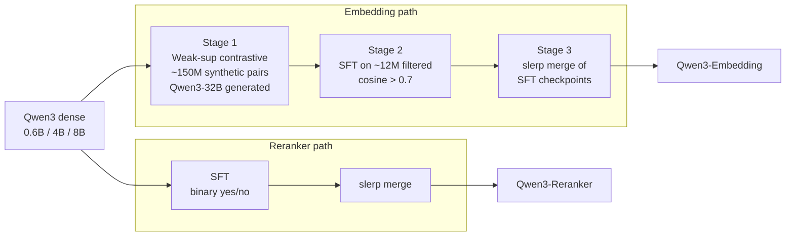

# Qwen3-Embedding: Text Embedding & Reranking on the Qwen3 Backbone — Tongyi Lab, 2025

> **arXiv:** 2506.05176 · **Title:** *Qwen3 Embedding: Advancing Text Embedding and Reranking
> Through Foundation Models* · **Authors:** Tongyi Lab, Alibaba Group ·
> **Venue:** arXiv preprint (cs.CL), Jun 2025 (v3) · **License:** Apache-2.0 ·
> **Code:** https://github.com/QwenLM/Qwen3-Embedding · **Models:** https://huggingface.co/Qwen

## TL;DR
Qwen3-Embedding turns the [Qwen3](backbone_2025_qwen3.md) decoder into **state-of-the-art embedding
and reranking models** (0.6B / 4B / 8B) via a three-stage recipe: (1) **weakly-supervised
contrastive pre-training** on ~150 M query–document pairs **synthesized by Qwen3-32B**, (2)
**supervised fine-tuning** on ~12 M high-quality filtered pairs, and (3) **slerp model merging** of
fine-tuning checkpoints. Embeddings use **[EOS] last-token pooling**; rerankers reuse the LLM chat
template as a **binary yes/no** judge. The 8B embedder scores **70.58 on MTEB-Multilingual** and
**80.68 on MTEB-Code**, beating Gemini-Embedding. It is the **encoder backbone** the repo's
[LCLM](../context/ctx_compression.md) stack uses to produce soft tokens.

## Why this matters for the backbone thread
In the repo's stack ([backbone thread](../context/backbone/backbone.md)) the encoder compresses a
long document into soft tokens that the [Qwen3](backbone_2025_qwen3.md) decoder consumes.
Qwen3-Embedding is the recommended encoder: it is instruction-aware, supports **Matryoshka (MRL)**
dimensions, shares the Qwen3 tokenizer/architecture with the decoder (easy weight reuse), and is
trained with a contrastive objective ideal for retrieval-conditioned generation.

## Problem & motivation
LLM-based embedders inherit rich world knowledge and multilingual/reasoning ability that encoder-only
BERT models lack, but training them well requires large, diverse, high-quality relevance data —
scarce for low-resource languages and specialized tasks. Prior work (GTE, E5, BGE) mines weak pairs
from Q&A forums / web dumps, which caps controllability. Qwen3-Embedding instead **synthesizes**
weak-supervision data directly from a foundation model, giving precise control over task, language,
length, and difficulty — then filters and merges to lock in robustness.

## Architecture (reimplementation-grade)
Built on the **dense** Qwen3 models; three sizes:

| Model | Size | Layers | Seq len | Emb. dim | MRL | Instruction-aware |
|---|---|---|---|---|---|---|
| Qwen3-Embedding-0.6B | 0.6B | 28 | 32K | 1024 | yes | yes |
| Qwen3-Embedding-4B | 4B | 36 | 32K | 2560 | yes | yes |
| Qwen3-Embedding-8B | 8B | 36 | 32K | 4096 | yes | yes |
| Qwen3-Reranker-0.6B / 4B / 8B | — | 28 / 36 / 36 | 32K | — | — | yes |

**Embedding model.** Causal LLM; append an `[EOS]` token and take the **last-layer hidden state at
`[EOS]`** as the embedding. Instruction and query are concatenated (document left unchanged):
```
{Instruction} {Query}<|endoftext|>
```

**Reranking model.** Point-wise relevance framed as binary classification inside the chat template:
```
<|im_start|>system
Judge whether the Document meets the requirements based on the Query and the Instruct provided.
Note that the answer can only be "yes" or "no".<|im_end|>
<|im_start|>user
<Instruct>: {Instruction}
<Query>: {Query}
<Document>: {Document}<|im_end|>
<|im_start|>assistant
<think>\n\n</think>\n\n
```
The score is the normalized likelihood of the next token being "yes":
$$\text{score}(q,d)=\frac{e^{P(\text{yes}\mid I,q,d)}}{e^{P(\text{yes}\mid I,q,d)}+e^{P(\text{no}\mid I,q,d)}}.$$


*Figure 1 — Embedding (left): `[EOS]` last-token pooling on `{Instruction} {Query}`. Reranker
(right): chat-template LLM emitting a yes/no judgment.*

## Training objectives
**Embedding — improved InfoNCE.** For a batch of $N$ instances,
$$L_{\text{embedding}}=-\frac{1}{N}\sum_i^N \log\frac{e^{s(q_i,d_i^+)/\tau}}{Z_i},$$
where $s(\cdot,\cdot)$ is cosine similarity, $\tau$ a temperature, and $Z_i$ aggregates the positive
against $K$ hard negatives **plus** in-batch queries/documents:
$$Z_i=e^{s(q_i,d_i^+)/\tau}+\sum_k^K m_{ik}\,e^{s(q_i,d_{i,k}^-)/\tau}+\sum_{j\ne i} m_{ij}\,e^{s(q_i,q_j)/\tau}+\sum_{j\ne i} m_{ij}\,e^{s(d_i^+,d_j)/\tau}+\cdots$$
A **false-negative mask** removes accidental positives from the denominator:
$$m_{ij}=\begin{cases}0 & \text{if } s_{ij}>s(q_i,d_i^+)+0.1 \ \text{ or } \ d_j==d_i^+,\\[2pt] 1 & \text{otherwise.}\end{cases}$$

**Reranker — SFT.** With prompt template $\mathcal{P}(q,d)$ and label $l\in\{\text{yes},\text{no}\}$,
$$L_{\text{reranking}}=-\log p\big(l\mid \mathcal{P}(q,d)\big).$$

**Model merging — slerp.** After SFT, spherically interpolate checkpoints $\theta_1,\theta_2$
(angle $\Omega$):
$$\theta_{\text{merged}}(t)=\frac{\sin((1-t)\Omega)}{\sin\Omega}\,\theta_1+\frac{\sin(t\Omega)}{\sin\Omega}\,\theta_2.$$

## Multi-stage pipeline


*Figure 2 — Embedding: 3 stages (weak-supervised synthetic pre-train → SFT on high-quality +
synthetic → slerp merge). Reranker: 2 stages (SFT → merge; **no** stage-1 weak supervision).*



- **Synthetic data.** Qwen3-32B synthesizes retrieval / bitext-mining / classification / STS pairs.
  A two-stage prompt first picks *(Question-Type, Difficulty, Character)* — the persona drawn from
  the top-5 Persona-Hub roles for the document — then generates the query with controlled length &
  language. ~**150 M** pairs total.
- **Filtering.** Keep pairs with cosine similarity **> 0.7** → ~**12 M** high-quality pairs for SFT.

## Results
**MTEB Multilingual (Table 2):**
| Model | Size | Mean (Task) | Mean (Type) |
|---|---|---:|---:|
| Gemini-Embedding | — | 68.37 | 59.59 |
| Qwen3-Embedding-0.6B | 0.6B | 64.33 | 56.00 |
| Qwen3-Embedding-4B | 4B | 69.45 | 60.86 |
| **Qwen3-Embedding-8B** | 8B | **70.58** | **61.69** |

**MTEB English v2 / CMTEB / MTEB-Code (Table 3):**
| Model | MTEB(eng,v2) | CMTEB | MTEB(Code) |
|---|---:|---:|---:|
| Gemini-Embedding | 73.30 | — | 74.66 |
| gte-Qwen2-7B-instruct | 70.72 | 71.62 | — |
| **Qwen3-Embedding-8B** | **75.22** | **73.83** | **80.68** |

- All three **rerankers** beat every baseline (Jina, mGTE, BGE-m3); Qwen3-Reranker-8B tops most tasks
  (e.g., MMTEB-R 72.94, MTEB-Code 81.22).
- **Ablation (0.6B, MMTEB mean-task):** full pipeline **64.33** vs **62.56** without model-merge vs
  **61.21** without synthetic pre-training — both stages are essential.

## Limitations & follow-ups
- Synthetic-data quality is bounded by the Qwen3-32B generator; low-resource languages remain harder.
- Reranker path skips weak-supervision, relying on labeled + high-quality synthetic SFT.
- Point-wise reranking (yes/no) is simple and parallel but ignores list-level interactions.
- **Relation to the repo.** Pairs with [Qwen3](backbone_2025_qwen3.md) (decoder) as the encoder in
  the [backbone thread](../context/backbone/backbone.md) for the
  [LCLM](../context/ctx_compression.md) / [MixedDecoder](../mixed_decoder/mixed_decoder.md) stack.

## Links
- **arXiv:** [abs](https://arxiv.org/abs/2506.05176) · [html](https://arxiv.org/html/2506.05176v3) · [pdf](https://arxiv.org/pdf/2506.05176)
- **Code / models:** https://github.com/QwenLM/Qwen3-Embedding · https://huggingface.co/Qwen
- **Venue:** arXiv preprint (cs.CL), 2025 · Apache-2.0
- **Related:** [Qwen3](backbone_2025_qwen3.md) · [T5 / prefix-LM](backbone_2019_t5-prefix-lm.md) · [RoPE](positional_2021_rope-roformer.md) · [RMSNorm](attention_2019_rmsnorm.md) · [GQA](attention_2023_gqa.md) · [backbone thread](../context/backbone/backbone.md) · [ctx compression](../context/ctx_compression.md) · [Qwen overview](../qwen/overview.md)
