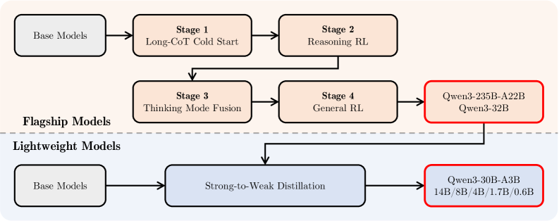

# Qwen3: A Unified Thinking / Non-Thinking LLM Family — Qwen Team, 2025

> **arXiv:** 2505.09388 · **Title:** *Qwen3 Technical Report* · **Authors:** Qwen Team, Alibaba ·
> **Venue:** arXiv preprint (cs.CL), May 2025 · **License:** Apache-2.0 ·
> **Models:** [huggingface.co/Qwen](https://huggingface.co/Qwen) · github.com/QwenLM/Qwen3

## TL;DR
Qwen3 is an open-weight LLM family (0.6B–235B) that **unifies thinking and non-thinking modes in
one model** — toggled by `/think` `/no_think` chat tags — so users no longer choose between a chat
model and a reasoning model. It adds a **thinking-budget** control (cap the reasoning tokens to
trade latency for accuracy), trains light models by **strong-to-weak distillation** (~1/10 the GPU
hours of full RL), scales pre-training to **36 T tokens across 119 languages**, and ships two MoE
models (30B-A3B, 235B-A22B) plus six dense models. It is the **decoder backbone** the repo's
[LCLM](../context/ctx_compression.md) stack fine-tunes to consume soft tokens.

## Why this matters for the backbone thread
Qwen3-4B-Instruct-2507 is the **decoder** in the repo's compression stack
([backbone thread](../context/backbone/backbone.md)): it is fully fine-tuned to read soft tokens
like ordinary embeddings. This recap records the exact architecture primitives that stack inherits
— [RoPE](positional_2021_rope-roformer.md), [RMSNorm](attention_2019_rmsnorm.md) pre-norm,
[SwiGLU](attention_2020_swiglu.md), [GQA](attention_2023_gqa.md), [QK-Norm](attention_2020_qk-norm.md),
[YaRN](positional_2023_yarn-context-extension.md) window extension, and
[FlashAttention-2](attention_2023_flash-attention-2.md) kernels.

## Problem & motivation
Before Qwen3, users had to pick a **chat-optimized** model (fast, shallow) *or* a **reasoning**
model (QwQ, DeepSeek-R1: accurate, slow) up front — fragmenting deployment and cost. Small models
also lagged because full multi-stage post-training is expensive per model. Qwen3 sets out to
(1) put both regimes in **one** model with runtime control, (2) make reasoning depth a **budget**
knob, (3) broaden languages 29 → 119, and (4) make small models strong via distillation.

## Key ideas
1. **Unified thinking / non-thinking.** A single post-training pipeline fuses a reasoning model and
   a chat model so one checkpoint answers directly *or* emits a `<think>…</think>` chain, selected
   per-request by chat tags. A non-thinking reply keeps an **empty** thinking block for format
   consistency.
2. **Thinking budget.** At inference, cap the thinking tokens at $B$; on reaching it the model is
   forced to close the block ("Considering the limited time…\n</think>") and answer from the
   reasoning so far. Accuracy rises **monotonically** with $B$ — a smooth latency/quality dial.
3. **Strong-to-weak distillation.** Instead of running the full 4-stage RL pipeline on every small
   model, distill the flagship's **logits** (off-policy + on-policy) into the light models — ~1/10
   the GPU hours, with *higher* Pass@1 and Pass@64 than RL-from-scratch.
4. **Dense + MoE lineup with global-batch load balancing.** MoE uses 128 experts, top-8, **no
   shared expert** (a change from Qwen2.5-MoE), with a global-batch balancing loss.

*Figure 1 — Flagship models go through 4 post-training stages (Long-CoT cold start → Reasoning RL →
Thinking-Mode Fusion → General RL); the resulting Qwen3-235B-A22B / 32B then act as teachers for
**strong-to-weak distillation** into the lightweight 30B-A3B / 14B / 8B / 4B / 1.7B / 0.6B models.*

## Architecture (reimplementation-grade)
Decoder-only transformer with:
- **[GQA](attention_2023_gqa.md)** attention; **[RMSNorm](attention_2019_rmsnorm.md)** pre-norm;
  **[SwiGLU](attention_2020_swiglu.md)** MLP; **[RoPE](positional_2021_rope-roformer.md)** with base
  frequency raised $10^4\to10^6$ (ABF) for long context.
- **[QK-Norm](attention_2020_qk-norm.md)** added (new in Qwen3) for training stability; the Qwen2
  **QKV bias is removed**.
- **Tokenizer:** byte-level BPE, vocab ≈151,669 (adds `<think>`/`</think>`).
- **Context:** 32K native → **128K** via [YaRN](positional_2023_yarn-context-extension.md) + Dual
  Chunk Attention at inference.

| Model | Layers | Q/KV heads | Experts (act.) | Context | Tie emb. |
|---|---|---|---|---|---|
| Qwen3-0.6B / 1.7B | 28 | 16 / 8 | — | 32K | yes |
| Qwen3-4B / 8B | 36 | 32 / 8 | — | 128K | 4B yes / 8B no |
| Qwen3-14B | 40 | 40 / 8 | — | 128K | no |
| Qwen3-32B | 64 | 64 / 8 | — | 128K | no |
| Qwen3-30B-A3B | 48 | 32 / 4 | 128 (8) | 128K | no |
| Qwen3-235B-A22B | 94 | 64 / 4 | 128 (8) | 128K | no |

## Training pipeline
**Pre-training — 36 T tokens, 3 stages:**
1. **General** (~30 T, seq 4 K): language + world knowledge over 119 languages.
2. **Reasoning** (~5 T higher-quality): up-weight STEM/code/reasoning + synthetic data.
3. **Long-context** (~100 s of B, seq 32 K): extend 4 K → 32 K (75 % at 16–32 K).

Instance-level data-mixture optimization guided by proxy-model ablations; scaling laws set LR/batch
per size.

**Post-training — 4 stages (flagship):**
1. **Long-CoT cold start** — SFT on verified math/code/STEM CoT, aggressively filtered.
2. **Reasoning RL** — **GRPO** on 3,995 query–verifier pairs; AIME'24 climbs **70.1 → 85.1** over
   170 steps.
3. **Thinking-Mode Fusion** — SFT mixing rejection-sampled thinking data with diverse non-thinking
   data; the `/think` `/no_think` control and thinking budget emerge here.
4. **General RL** — broad-domain RL for instruction-following, tools, safety.

Light models: **logit distillation** from the flagship instead of stages 1–4.

Conceptually, thinking-budget truncation: for reasoning length $t$ and budget $B$,
$$t \ge B \ \Rightarrow\ \text{force close } \texttt{</think>} \ \text{and decode the answer from the partial reasoning}.$$

## Results
| Benchmark | Qwen3-235B-A22B (base) | DeepSeek-V3 (base) | Qwen3-32B (base) | Qwen2.5-72B (base) |
|---|---:|---:|---:|---:|
| MMLU-Pro | **68.18** | 59.84 | 65.54 | 58.07 |
| GSM8K | **94.39** | 87.57 | 93.40 | 91.50 |
| MATH | **71.84** | 62.62 | 61.62 | 62.12 |
| BBH | **88.87** | 86.22 | 87.38 | 86.30 |
| EvalPlus | **77.60** | 63.75 | 72.05 | 65.93 |

- The flagship **235B-A22B** beats DeepSeek-V3 on **14/15** base benchmarks with ~**1/3 the total**
  and ~**2/3 the activated** parameters; **Qwen3-32B** beats Qwen2.5-72B (2.25× larger) on 10/15.
- **Thinking mode (post-trained):** AIME'24 **85.7**, AIME'25 **81.5**, LiveCodeBench-v5 **70.7**,
  CodeForces Elo **2056**, BFCL-v3 **70.8**.
- **Thinking budget** yields consistent gains as the token cap grows across AIME/GPQA/LiveCodeBench.

## Limitations & follow-ups
- Thinking-budget control is **emergent**, not explicitly optimized — edge cases can be uneven.
- Per-language data diversity is uneven despite 119-language coverage.
- Thinking mode adds latency; the budget knob mitigates but complicates serving.
- **Relation to the repo.** Qwen3 (decoder) + [Qwen3-Embedding](backbone_2025_qwen3-embedding.md)
  (encoder) are the [backbone thread](../context/backbone/backbone.md)'s recommended defaults for
  the [LCLM](../context/ctx_compression.md) / [MixedDecoder](../mixed_decoder/mixed_decoder.md)
  stack; see the [Qwen overview](../qwen/overview.md) for the full family.

## Links
- **arXiv:** [abs](https://arxiv.org/abs/2505.09388) · [html](https://arxiv.org/html/2505.09388v1) · [pdf](https://arxiv.org/pdf/2505.09388)
- **Models / code:** https://huggingface.co/Qwen · https://github.com/QwenLM/Qwen3 · https://modelscope.cn/organization/qwen
- **Venue:** arXiv preprint (cs.CL), 2025 · Apache-2.0
- **Related:** [Qwen3-Embedding](backbone_2025_qwen3-embedding.md) · [T5 / prefix-LM](backbone_2019_t5-prefix-lm.md) · [RoPE](positional_2021_rope-roformer.md) · [YaRN](positional_2023_yarn-context-extension.md) · [RMSNorm](attention_2019_rmsnorm.md) · [SwiGLU](attention_2020_swiglu.md) · [GQA](attention_2023_gqa.md) · [QK-Norm](attention_2020_qk-norm.md) · [FlashAttention-2](attention_2023_flash-attention-2.md) · [backbone thread](../context/backbone/backbone.md) · [Qwen overview](../qwen/overview.md)
