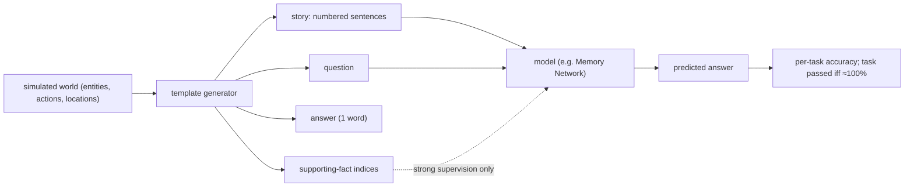

# Towards AI-Complete Question Answering: A Set of Prerequisite Toy Tasks (bAbI) — Weston et al., 2015

> **arXiv:** 1502.05698 (v10) · **Venue:** ICLR 2016 · **Affiliation:** Facebook AI Research

## TL;DR
bAbI is a suite of **20 synthetic question-answering tasks**, each isolating **one** reasoning skill a
system needs before it can plausibly converse: chaining supporting facts, counting, coreference, deduction,
induction, spatial/temporal/size reasoning, path finding, agent motivations, and more. Stories and
questions are **auto-generated** from a tiny simulated world with a small vocabulary, so a task is
"solved" only when accuracy is essentially perfect — a system failing a task exposes a concrete missing
capability. The paper also strengthens **Memory Networks** (adaptive memory, N-gram modeling, nonlinear
matching) and shows they solve many but **not all** tasks (e.g. multi-fact/position/path-finding remain
hard), establishing bAbI as a **unit-test-style diagnostic** for reasoning and long-range memory.

## Problem & motivation
Real QA/dialogue datasets are large and messy: a model can score well by exploiting surface statistics
while lacking basic reasoning, and failures are hard to attribute. The authors argue for a battery of
**proxy tasks** that (a) are **prerequisites** for AI-complete dialogue, (b) each test a **single, named**
skill, and (c) are generated by a controllable simulator so results are clean and diagnostic. The aim is
not leaderboard chasing but **classifying where systems fail** so researchers can fix specific weaknesses.

## Key idea
Each example is a short **story** (a list of numbered sentences), one or more **questions**, an **answer**
(usually a single word), and — crucially — the indices of the **supporting facts** needed to answer. This
enables two supervision regimes:

- **Strong supervision:** the model is told which facts support the answer (used by Memory Networks).
- **Weak supervision:** only (story, question, answer) — the harder, more realistic setting.

The 20 tasks, each isolating one skill:

| # | Task | Skill probed |
|---|---|---|
| 1 | Single supporting fact | retrieve one relevant fact |
| 2 | Two supporting facts | chain two facts |
| 3 | Three supporting facts | chain three facts (long-range memory) |
| 4 | Two-argument relations | subject vs object (e.g. direction) |
| 5 | Three-argument relations | who-gave-what-to-whom |
| 6 | Yes/no questions | boolean answers |
| 7 | Counting | count objects held |
| 8 | Lists / sets | enumerate a set |
| 9 | Simple negation | handle "not" |
| 10 | Indefinite knowledge | "maybe" / uncertainty |
| 11 | Basic coreference | single pronoun resolution |
| 12 | Conjunction | "and" over subjects |
| 13 | Compound coreference | multiple/plural references |
| 14 | Time reasoning | order of events |
| 15 | Basic deduction | syllogism (X are Y; Y are Z) |
| 16 | Basic induction | generalize from examples |
| 17 | Positional reasoning | left/right/above/below |
| 18 | Size reasoning | bigger/smaller/fits-in |
| 19 | Path finding | route between locations |
| 20 | Agent's motivations | why did X go somewhere |

A task counts as **passed** only above a high accuracy threshold (≈95%); anything less means the skill is
not reliably acquired. Datasets ship in **1,000** and **10,000** training-example-per-task versions
(English, plus Hindi and shuffled-vocab variants to check language-independence and rule out lexical
memorization).

## How it works


**Improved Memory Networks (MemNN).** The paper extends the base MemNN with: **adaptive memory** (learn how
many supporting facts / "hops" to read per question rather than a fixed number), **N-gram modeling** of
inputs (word-order sensitivity), and **nonlinear matching** (a small nonlinearity in the
question↔memory scoring instead of a bare dot product). Reading proceeds as a sequence of attention hops
over the story memory, each hop retrieving the next supporting fact, then decoding a one-word answer.

## Training / data
Fully synthetic, controllable, small vocabulary. Standard split: **1000** train / 1000 test per task (a
**10k** version reduces data-scarcity confounds). Baselines: an **N-gram** classifier and an **LSTM**
reader (both weakly supervised) versus **strongly-supervised MemNN** variants. Because tasks are generated,
performance ceilings are near-perfect, making residual errors informative.

## Results
- **N-gram / LSTM baselines** solve only the easiest tasks; they fail whenever multi-fact chaining,
  counting, or relational/spatial reasoning is required — evidence that surface statistics are
  insufficient.
- **Strongly-supervised MemNN** with the adaptive-memory + N-gram + nonlinear upgrades **solves a large
  subset** of the 20 tasks (single/two supporting facts, yes/no, basic coreference, deduction, etc.).
- **Persistent failures** even for improved MemNN include tasks needing **many supporting facts**
  (task 3), **positional/size reasoning** (17, 18), **path finding** (19), and aspects of
  **induction/motivation** — the tasks demanding longer chains or richer structure.
- Shuffled-vocabulary and multilingual variants confirm models are learning **structure**, not memorizing
  specific tokens.

The lasting contribution is the **methodology**: a set of minimal, attributable skill tests where "solved
= ~100%," turning reasoning evaluation into a checklist of concrete capabilities.

## Limitations & follow-ups
- **Synthetic and templated** — high bAbI scores don't guarantee real-language competence; the tasks are
  necessary-but-not-sufficient probes.
- Small vocabulary and fixed grammar make it **saturable**: later models (End-to-End Memory Networks,
  DMN, Entity/Recurrent-Entity Networks, Relation Networks) solve nearly all 20 tasks, so bAbI became a
  **sanity check** rather than a frontier benchmark.
- Strong supervision (given supporting facts) is unrealistic; the weakly-supervised setting is the one that
  matters and is harder.
- Conceptual ancestor of later diagnostic/probing suites for memory and reasoning —
  [CLUTRR](../mixed_decoder/mixed_decoder.md) (relational reasoning), long-context recall probes like
  [MQAR/Zoology](benchmark_2023_zoology-mqar.md), passkey retrieval
  ([Landmark Attention](longseq_2023_landmark-attention.md)), and [RULER](benchmark_2024_ruler.md).

## Links
- **arXiv:** [abs](https://arxiv.org/abs/1502.05698) · [html](https://arxiv.org/html/1502.05698v10) · [pdf](https://arxiv.org/pdf/1502.05698)
- **Code / data:** bAbI tasks — <https://github.com/facebookarchive/bAbI-tasks>
- **BibTeX:**
  ```bibtex
  @inproceedings{weston2016babi,
    title     = {Towards AI-Complete Question Answering: A Set of Prerequisite Toy Tasks},
    author    = {Weston, Jason and Bordes, Antoine and Chopra, Sumit and Rush, Alexander M. and van Merri{\"e}nboer, Bart and Joulin, Armand and Mikolov, Tomas},
    booktitle = {International Conference on Learning Representations (ICLR)},
    year      = {2016},
    url       = {https://arxiv.org/abs/1502.05698}
  }
  ```
- **Related papers:** [MQAR / Zoology](benchmark_2023_zoology-mqar.md) ·
  [RULER](benchmark_2024_ruler.md) · [Landmark Attention](longseq_2023_landmark-attention.md)
- **In-repo:** [§6.7 in mixed_decoder](../mixed_decoder/mixed_decoder.md)
