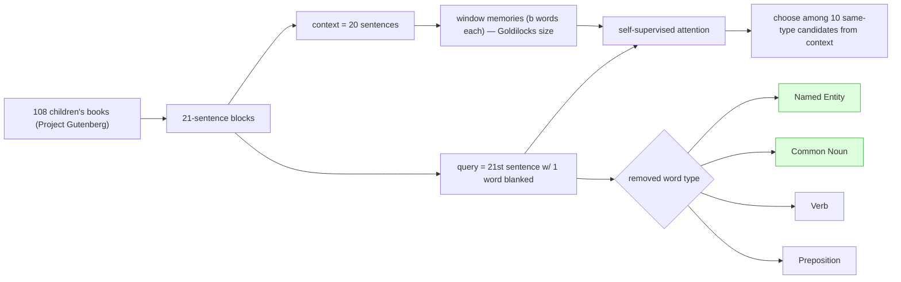

# The Goldilocks Principle: Reading Children's Books with Explicit Memory Representations (CBT) — Hill et al., 2016

> **arXiv:** 1511.02301v4 · **Venue:** ICLR 2016 · **Affiliation:** Facebook AI Research

## TL;DR
The **Children's Book Test (CBT)** is a cloze benchmark built from freely available children's novels that
**separates predicting function words from predicting content words**. Each example gives **20 consecutive
sentences** as context, a **21st query sentence** with one word blanked, and **10 candidate** answers; the
removed word is one of four types — **Named Entity, Common Noun, Verb, Preposition** — yielding four
subtasks of increasing/decreasing context-dependence. The paper's "**Goldilocks Principle**" finding: when
attention operates over **window-based memories** (a few words each), there's a **sweet spot** — not single
words, not whole sentences — that best captures meaning, and it can be **trained by self-supervision**.
Models with **explicit memory** beat neural LMs on **semantic** content words (NE, CN) but **not** on
syntactic function words (V, P), and the same recipe reached **SOTA on the CNN QA** benchmark.

## Problem & motivation
Standard language-model perplexity mixes together **easy syntactic** predictions (articles, prepositions —
predictable from local context) and **hard semantic** ones (names, nouns — needing broader memory), so it
doesn't reveal whether a model actually captures meaning. CBT is designed to **disentangle** these by
word class and to study **how much text a single memory slot should encode** for reading comprehension.

## Key idea
From each book, take a sliding block of **21 sentences**:

- **Context** $S = \{s_1,\dots,s_{20}\}$ (20 sentences).
- **Query** $q = s_{21}$ with one token replaced by a blank.
- **Candidates** $C$: **10** words of the **same syntactic type** as the answer, all appearing in the
  context $S$ (the true answer + 9 distractors).

Task: pick $\hat a = \arg\max_{a\in C} P(a \mid S, q)$. **Four subtasks** by the removed word's POS:
**Named Entities**, **Common Nouns**, **Verbs**, **Prepositions**. NE/CN require tracking entities across
many sentences (semantic, memory-hungry); V/P are largely fixable from local syntax.

**Window memories + the Goldilocks sweet spot.** Rather than storing each word or each full sentence as a
memory, store a **window** of $b$ words centered on candidate mentions. Attention over these windows works
best at an **intermediate $b$** — hence "Goldilocks." Crucially, the window-memory attention can be
learned **self-supervised** (no extra labels), by predicting held-out words.

## How it works


## Training / data
Source: **108** freely available children's books (Project Gutenberg). Large train set of blocks plus dev/
test, with the four POS-typed subtasks scored separately. Candidate answers are restricted to words of the
correct type occurring in the context, so a random baseline is 10%. Models compared: **$n$-gram / neural
LMs**, **LSTMs**, and **Memory Networks** (window-memory + self-supervised attention), with **human**
performance measured for reference.

## Results
- **Explicit memory helps semantics, not syntax.** Memory-Network models with window memories
  **outperform** LSTM/neural LMs on **Named Entities** and **Common Nouns**, but show **no advantage** on
  **Verbs** and **Prepositions** — confirming the split between memory-dependent (semantic) and
  locally-predictable (syntactic) words.
- **Goldilocks window size.** Encoding **windows** of a few words per memory beats both **single-word** and
  **full-sentence** memories — an intermediate granularity retains the most useful signal, and the
  attention over these windows trains well **self-supervised**.
- **Transfers to news QA.** Applying the same window-memory recipe to the **CNN** reading-comprehension
  benchmark (identifying anonymized named entities in article summaries) achieved **state-of-the-art**
  performance at the time.
- **Humans** remain well above models on the semantic subtasks, marking headroom.

## Limitations & follow-ups
- **Cloze with in-context candidates** can be partially gamed by frequency/recency heuristics; later work
  showed some CBT subtasks are easier than intended, so NE/CN became the focus.
- **Domain-specific** (children's literature) and **saturable** — subsequent attention readers pushed NE/CN
  accuracy high, moving CBT toward a **diagnostic** rather than a frontier benchmark.
- Shares authors and philosophy with [bAbI](benchmark_2015_babi.md) (skill-isolating probes) and pairs
  naturally with the discourse test [LAMBADA](benchmark_2016_lambada.md) and the news cloze
  [CNN/DailyMail](benchmark_2015_cnn-dailymail.md); the memory/attention ideas anticipate modern
  long-context recall probes ([MQAR](benchmark_2023_zoology-mqar.md), [RULER](benchmark_2024_ruler.md)).

## Links
- **arXiv:** [abs](https://arxiv.org/abs/1511.02301) · [html](https://arxiv.org/html/1511.02301v4) · [pdf](https://arxiv.org/pdf/1511.02301)
- **Data:** CBT (part of the bAbI project) — <https://research.facebook.com/downloads/babi/>
- **BibTeX:**
  ```bibtex
  @inproceedings{hill2016cbt,
    title     = {The Goldilocks Principle: Reading Children's Books with Explicit Memory Representations},
    author    = {Hill, Felix and Bordes, Antoine and Chopra, Sumit and Weston, Jason},
    booktitle = {International Conference on Learning Representations (ICLR)},
    year      = {2016},
    url       = {https://arxiv.org/abs/1511.02301}
  }
  ```
- **Related papers:** [LAMBADA](benchmark_2016_lambada.md) ·
  [CNN/DailyMail cloze](benchmark_2015_cnn-dailymail.md) · [bAbI](benchmark_2015_babi.md)
- **In-repo:** [§6.7 in mixed_decoder](../mixed_decoder/mixed_decoder.md)
