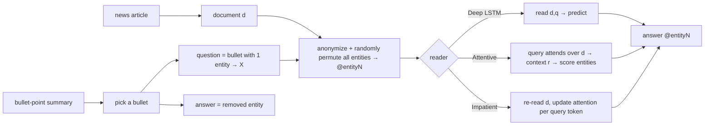

# Teaching Machines to Read and Comprehend (CNN/DailyMail cloze) — Hermann et al., 2015

> **arXiv:** 1506.03340v3 · **Venue:** NeurIPS 2015 · **Affiliation:** Google DeepMind / Univ. of Oxford

## TL;DR
This paper solves the "no large-scale reading-comprehension data" bottleneck with a clever
**data-generation trick**: pair each **news article** (CNN, Daily Mail) with its human-written **bullet-
point summary**, then turn each bullet into a **cloze question** by removing one **entity** — the answer is
the removed entity, the document is the article. To stop models from cheating with world knowledge or a
plain language model, **all named entities are anonymized to markers (`@entity1…`) and randomly permuted
per example**, so the answer can only be found by **reading the specific document**. This yields **~1M**
question–document pairs and enables **attention-based readers** (Attentive Reader, Impatient Reader) that
substantially beat symbolic NLP baselines — an early, influential demonstration of neural machine reading.

## Problem & motivation
Supervised reading comprehension needs large (document, question, answer) corpora, which didn't exist at
scale. Hand-labeling is expensive; existing sets were tiny. The insight: **news summaries are free
supervision** — a bullet point is an abstractive paraphrase of the article, so blanking an entity in the
bullet creates a question whose answer is grounded in (but not copied verbatim from) the document. The
**anonymization** step is what makes the task genuinely about *reading*: without it, a language model could
guess frequent entities from priors; with permuted `@entityN` markers, only document-level coreference
resolves the blank.

## Key idea
For a document $d$ with summary bullets, take a bullet $b$, choose an entity mention in it, and form:

- **Question** $q = b$ with that entity replaced by a placeholder `X`.
- **Answer** $a$ = the removed entity.
- **Document** $d$ = the full article.

Anonymization/permutation: every named entity in $(d,q)$ is replaced by an abstract id from a set
`{@entity0, @entity1, …}` that is **re-shuffled for every example**, so ids carry no persistent identity —
the model must map `X` to the correct `@entityN` **using the article's evidence**. Training maximizes
$P(a \mid d, q)$ over the entities present in $d$.

**Models.** Three neural readers:
- **Deep LSTM Reader** — read $d$ then $q$ (or concatenated) through a deep LSTM, predict the answer entity
  from the final state (no explicit attention).
- **Attentive Reader** — encode $q$ into a query vector, compute **attention** over token representations
  of $d$, form a context vector $r$, and combine with the query to score entities:
  $$ a = \mathrm{softmax}\big(W\,\tanh(W_r r + W_g\, u_q)\big),\quad r=\sum_i \alpha_i\, y_i,\ \ \alpha=\mathrm{softmax}(\text{score}(y_i,u_q)). $$
- **Impatient Reader** — re-reads the document, updating attention **token-by-token as it processes the
  query**, accumulating evidence incrementally.

## How it works


The random per-example permutation is the crux: it **destroys world-knowledge shortcuts**, so accuracy
reflects **in-document reasoning** (coreference, paraphrase matching), not memorized entity frequencies.

## Training / data
Two corpora from online news + their editor-written summaries. Approximate scale: **CNN** ≈ 93k articles /
**~380k** questions; **Daily Mail** ≈ 220k articles / **~880k** questions — together **~1M** cloze
instances, split into train/dev/test. Answers are always one of the anonymized entities occurring in the
document. Baselines include **majority/frequency**, **word-distance**, and **frame-semantic** symbolic
models; the neural readers are trained end-to-end with cross-entropy over entity candidates.

## Results
Test accuracy (pick the correct `@entityN`); attention-based readers dominate the symbolic baselines:

| Model | CNN | Daily Mail | Source |
|---|---:|---:|---|
| Frame-semantic / word-distance baselines | ~50s | ~55–60 | §Results |
| Deep LSTM Reader | 57.0 | 62.2 | §Results |
| **Attentive Reader** | 63.0 | 69.0 | §Results |
| **Impatient Reader** | **63.8** | 68.0 | §Results |

- **Attention is essential:** the Attentive/Impatient Readers beat the attention-free Deep LSTM by ~6
  points and clearly outperform symbolic pipelines, showing neural nets can learn to **read real documents
  with minimal linguistic priors**.
- **Daily Mail easier than CNN** (longer summaries / more redundancy), a pattern that persisted in later
  work.
- **Foundational impact:** the cloze-from-summary methodology and anonymization scheme seeded a wave of
  attention readers (AS Reader, GA Reader, Attention-over-Attention) and directly influenced later RC
  datasets; the CNN/DailyMail articles were subsequently repurposed as a standard **abstractive
  summarization** corpus.

## Limitations & follow-ups
- **Cloze + anonymization** makes an artificial task — later analyses found many questions solvable by
  shallow heuristics, and anonymization discards useful semantics; this motivated **span-extraction** RC
  (SQuAD) and free-form QA.
- **Single-entity answers** only; no multi-hop or generative answers.
- The **Children's Book Test** ([benchmark_2015_cbt.md](benchmark_2015_cbt.md)) applied the same
  window-memory attention idea to this CNN QA benchmark for SOTA; discourse-level cousins include
  [LAMBADA](benchmark_2016_lambada.md), and the reasoning-probe lineage continues through
  [bAbI](benchmark_2015_babi.md), [CLUTRR](benchmark_2019_clutrr.md), and long-context recall tests like
  [MQAR](benchmark_2023_zoology-mqar.md) / [RULER](benchmark_2024_ruler.md).

## Links
- **arXiv:** [abs](https://arxiv.org/abs/1506.03340) · [html](https://arxiv.org/html/1506.03340v3) · [pdf](https://arxiv.org/pdf/1506.03340)
- **Code / data:** <https://github.com/deepmind/rc-data>
- **BibTeX:**
  ```bibtex
  @inproceedings{hermann2015teaching,
    title     = {Teaching Machines to Read and Comprehend},
    author    = {Hermann, Karl Moritz and Ko\v{c}isk\'y, Tom\'a\v{s} and Grefenstette, Edward and Espeholt, Lasse and Kay, Will and Suleyman, Mustafa and Blunsom, Phil},
    booktitle = {Advances in Neural Information Processing Systems (NeurIPS)},
    year      = {2015},
    url       = {https://arxiv.org/abs/1506.03340}
  }
  ```
- **Related papers:** [Children's Book Test](benchmark_2015_cbt.md) ·
  [LAMBADA](benchmark_2016_lambada.md) · [bAbI](benchmark_2015_babi.md)
- **In-repo:** [§6.7 in mixed_decoder](../mixed_decoder/mixed_decoder.md)
