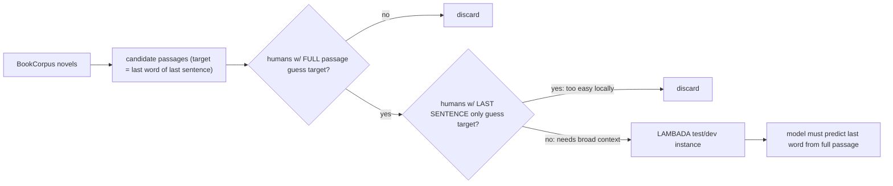

# The LAMBADA Dataset: Word Prediction Requiring a Broad Discourse Context — Paperno et al., 2016

> **arXiv:** 1606.06031v1 · **Venue:** ACL 2016 · **Affiliation:** CIMeC Univ. Trento / Univ. Amsterdam

## TL;DR
LAMBADA (LAnguage Modeling Broadened to Account for Discourse Aspects) is a **last-word prediction**
benchmark built so that humans can guess the final word **only when given the whole passage** (≈4–5
sentences), and **cannot** guess it from the **last sentence alone**. This construction forces a model to
integrate **broad discourse context**, not just local $n$-gram cues. At release, **no** state-of-the-art
language model exceeded **~1%** accuracy — versus near-100% for humans with full context — making LAMBADA a
stark demonstration that LMs of the era failed at genuine long-range understanding. It later became a
standard **zero-shot** benchmark (GPT-2/GPT-3 report LAMBADA accuracy).

## Problem & motivation
Standard LM perplexity rewards getting the *easy, frequent* tokens right and doesn't isolate whether a
model actually **tracks discourse**. The authors wanted a test where success **provably requires** context
beyond the immediate sentence. Their filter operationalizes exactly that: keep only passages where the
target word is (a) **guessable by humans with the full passage** but (b) **not guessable from the last
sentence** — so any model that ignores the broader context must fail.

## Key idea
Each instance is a **narrative passage** from unpublished novels (BookCorpus); the **target** is the
**last word of the last sentence**. Passages pass a two-stage **human filter**:

- **Full-context solvable:** independent human subjects, shown the whole passage, correctly produce the
  target word (multiple subjects must agree).
- **Local-context unsolvable:** subjects shown **only the last sentence** (the sentence containing the
  target, minus the target) **fail** to produce it.

Formally, a model predicts $w_T = \arg\max_w P(w \mid \text{context})$ where the context is the full
passage; the design guarantees the answer is **underdetermined** by the final sentence, so the signal must
come from earlier sentences. Passages exhibit a **range of linguistic phenomena** — coreference,
long-range dependency, discourse/world-knowledge inference — and targets skew toward **content words**
(often proper names and nouns) rather than easy function words.

## How it works


Evaluation is **accuracy** (exact match of the final word), a harsh metric that (unlike perplexity)
directly reflects whether the model recovered the specific discourse-determined token. A separate large
**BookCorpus training set** (same domain, no human filter) is provided so models can be trained/tuned in
the target genre before being scored on the filtered test set.

## Training / data
Source: **BookCorpus** unpublished novels (~5k+ books). The evaluated benchmark is the **human-filtered**
set (≈10k passages across dev/test), each averaging a few sentences of context before the target. A much
larger unfiltered in-domain corpus accompanies it for language-model training. Baselines at release: a
spread of **$n$-gram** and **neural (RNN/LSTM)** language models, plus **memory-augmented** variants.

## Results
- **LMs fail almost completely.** None of the tested state-of-the-art models exceeded **~1%** accuracy on
  LAMBADA — despite being competitive on ordinary perplexity — confirming that local statistics dominate
  their predictions.
- **Humans succeed by construction.** With the full passage, subjects reliably produce the target (the
  dataset only *contains* such passages); with the last sentence they cannot, quantifying the
  context-dependence.
- **Phenomena analysis.** Correctly predicting the target typically requires **coreference resolution**,
  tracking entities/events across sentences, and discourse-level inference — exactly the capabilities LMs
  lacked.
- **Legacy metric.** LAMBADA became a canonical **zero-shot** yardstick; large models (GPT-2, GPT-3) later
  reported strong LAMBADA accuracy, using it as evidence of improved long-range modeling — a direct
  reversal of the near-0% baselines from 2016.

## Limitations & follow-ups
- **Accuracy-only, single-token** target — a narrow (if incisive) probe; doesn't measure generation quality
  or multi-step reasoning.
- **Human-filter bias:** the "unsolvable from last sentence" criterion selects an unusual slice of language
  and can favor certain word classes (proper names), so scores don't translate directly to general
  comprehension.
- Domain-limited to **narrative fiction**.
- Ancestor of broad-context and long-range probes — complements local-vs-global reading tests like the
  [Children's Book Test](benchmark_2015_cbt.md) and [CNN/DailyMail cloze](benchmark_2015_cnn-dailymail.md),
  and modern long-context suites ([RULER](benchmark_2024_ruler.md),
  [MQAR / Zoology](benchmark_2023_zoology-mqar.md)).

## Links
- **arXiv:** [abs](https://arxiv.org/abs/1606.06031) · [html](https://arxiv.org/html/1606.06031v1) · [pdf](https://arxiv.org/pdf/1606.06031)
- **Data:** <https://zenodo.org/record/2630551> (LAMBADA dataset)
- **BibTeX:**
  ```bibtex
  @inproceedings{paperno2016lambada,
    title     = {The {LAMBADA} Dataset: Word Prediction Requiring a Broad Discourse Context},
    author    = {Paperno, Denis and Kruszewski, Germ\'an and Lazaridou, Angeliki and Pham, Quan Ngoc and Bernardi, Raffaella and Pezzelle, Sandro and Baroni, Marco and Boleda, Gemma and Fern\'andez, Raquel},
    booktitle = {Proceedings of the 54th Annual Meeting of the Association for Computational Linguistics (ACL)},
    year      = {2016},
    url       = {https://arxiv.org/abs/1606.06031}
  }
  ```
- **Related papers:** [Children's Book Test](benchmark_2015_cbt.md) ·
  [CNN/DailyMail cloze](benchmark_2015_cnn-dailymail.md) · [RULER](benchmark_2024_ruler.md)
- **In-repo:** [§6.7 in mixed_decoder](../mixed_decoder/mixed_decoder.md)
