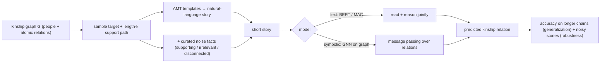

# CLUTRR: A Diagnostic Benchmark for Inductive Reasoning from Text — Sinha et al., 2019

> **arXiv:** 1908.06177v2 · **Venue:** EMNLP 2019 · **Affiliation:** McGill / Mila / Facebook AI Research

## TL;DR
CLUTRR (Compositional Language Understanding and Text-based Relational Reasoning) is a **procedurally
generated** benchmark that asks a model to infer the **kinship relation** between two characters in a short
story, where the answer requires **composing a chain of atomic kinship rules** (e.g. *mother's mother =
grandmother*). Because stories are synthesized from an underlying kinship **graph**, the paper can dial
two knobs precisely: **systematic generalization** — train on reasoning chains of length ≤$k$, test on
**longer** unseen chains — and **robustness** — inject curated **noise facts**. The headline finding: a
**graph neural network** operating on the symbolic graph generalizes and resists noise far better than
strong text models (**BERT**, **MAC**), exposing that NLU models latch onto surface patterns rather than
learning the underlying logic.

## Problem & motivation
NLU models post impressive scores yet fail to **generalize systematically** — they don't reliably
recombine known rules into novel compositions, and they're brittle to irrelevant content. Natural datasets
can't cleanly measure this because you can't control which rule combinations appear in train vs test.
Inspired by **inductive logic programming**, CLUTRR builds a controllable world of family relations where
the target is an unambiguous logical consequence of the stated facts, and train/test splits can withhold
specific **combinations of rules** and specific **chain lengths**.

## Key idea
Represent each story's family as a **kinship graph** $G=(V,E)$ where nodes are people and edges are atomic
relations. Kinship composes: a **resolution/clause** like

$$
\text{parent}(X,Y)\wedge\text{parent}(Y,Z)\ \Rightarrow\ \text{grandparent}(X,Z)
$$

lets a **path** of $k$ atomic relations between two entities be reduced to a single **target relation**.
CLUTRR:

1. **Samples** a target relation and a supporting path of length $k$ (the reasoning chain).
2. **Verbalizes** the path's facts into a natural-language story via **crowdsourced (AMT) templates**, so
   the surface form varies while the logic is fixed.
3. The model reads the story and must output the target relation — i.e. it must both **extract** relations
   from text *and* **apply** the composition rules.

Two evaluation axes:
- **Systematic generalization:** train on chains up to length $k$, **test on lengths $k{+}1, k{+}2,\dots$**
  and on held-out rule combinations — measuring extrapolation of *composition*, not memorization.
- **Robustness:** add **noise facts** of three curated kinds — *supporting* (extra valid facts),
  *irrelevant* (unrelated to the query pair), and *disconnected* (a separate family) — and measure
  accuracy degradation.

## How it works


The comparison is deliberate: text models (**BERT** fine-tuned; **MAC**, a compositional attention network)
must recover the graph *from language*, whereas the **GNN** is handed the symbolic graph and only has to
learn the composition — isolating how much of the difficulty is reasoning vs. extraction.

## Training / data
Fully synthetic and parameterized by **chain length $k$** and **noise type/amount**, so arbitrarily many
train/test splits can be generated with controlled overlap. Relations are drawn from a kinship ontology;
stories are short (a handful of sentences). Splits explicitly hold out longer chains and unseen rule
combinations for the generalization tests. Models compared: BERT, MAC (text) vs. a graph attention /
message-passing network (symbolic).

## Results
- **Systematic generalization gap.** All models do well when test chain length matches training, but text
  models (BERT, MAC) **degrade sharply on longer, unseen chains**; the **GNN generalizes far better**,
  indicating it captures the compositional rule structure rather than length-specific patterns.
- **Robustness gap.** Adding noise facts hurts the text models substantially more than the symbolic GNN —
  BERT/MAC are distracted by irrelevant/disconnected facts, while message passing over the clean relation
  graph is comparatively stable.
- **Diagnosis, not leaderboard.** The controlled setup pinpoints *where* NLU models fail (composition
  length + distractors), reframing the question from "how high is accuracy" to "does the model learn the
  underlying logic."

## Limitations & follow-ups
- **Synthetic kinship domain** — high CLUTRR scores don't certify broad reasoning; it's a targeted probe of
  compositional/relational generalization.
- The strong GNN result relies on **access to symbolic graph structure**; the harder, realistic setting is
  reasoning **directly from text**, which remains open.
- Widely reused to test **systematic generalization** of LMs and neuro-symbolic methods; conceptual sibling
  of the reasoning-skill probing in [bAbI](benchmark_2015_babi.md), and of recall/length-generalization
  probes like [MQAR / Zoology](benchmark_2023_zoology-mqar.md) and [RULER](benchmark_2024_ruler.md).

## Links
- **arXiv:** [abs](https://arxiv.org/abs/1908.06177) · [html](https://arxiv.org/html/1908.06177v2) · [pdf](https://arxiv.org/pdf/1908.06177)
- **Code / data:** <https://github.com/facebookresearch/clutrr>
- **BibTeX:**
  ```bibtex
  @inproceedings{sinha2019clutrr,
    title     = {CLUTRR: A Diagnostic Benchmark for Inductive Reasoning from Text},
    author    = {Sinha, Koustuv and Sodhani, Shagun and Dong, Jin and Pineau, Joelle and Hamilton, William L.},
    booktitle = {Proceedings of the 2019 Conference on Empirical Methods in Natural Language Processing (EMNLP)},
    year      = {2019},
    url       = {https://arxiv.org/abs/1908.06177}
  }
  ```
- **Related papers:** [bAbI](benchmark_2015_babi.md) · [MQAR / Zoology](benchmark_2023_zoology-mqar.md) ·
  [RULER](benchmark_2024_ruler.md)
- **In-repo:** [§6.7 in mixed_decoder](../mixed_decoder/mixed_decoder.md)
