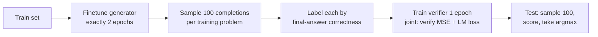

# Training Verifiers to Solve Math Word Problems (GSM8K) — Cobbe et al., 2021

> **arXiv:** 2110.14168v2 · **Venue:** preprint (cs.LG / cs.CL) · **Affiliation:** OpenAI

## TL;DR
This paper introduces **GSM8K** — 8,500 high-quality, linguistically diverse grade-school math
word problems (7.5K train / 1K test), each with a natural-language, step-by-step solution and
inline **calculator annotations** — and shows that **training a separate verifier to rank many
sampled solutions** scales far better than ordinary finetuning. A 6B model + verifier
(**40.7%**) matches a 175B finetuned model (**55.1%** — actually exceeds the 6B finetuning baseline
by ~3×), implying verification is worth roughly a **30× increase in model size**. GSM8K became the
standard multi-step arithmetic-reasoning benchmark.

## Problem & motivation
Autoregressive LLMs decode token-by-token with **no error-correction**: a single early arithmetic
slip dooms the whole solution. On multi-step math, plain finetuning **scales poorly** — naive
extrapolation of the finetuning curve suggests ~$10^{16}$ parameters would be needed to reach 80%
on grade-school math. The goal is **robust multi-step reasoning** on conceptually simple but
compositionally deep problems, plus a clean dataset to study it.

## Key idea
Instead of trusting a single greedy decode, **sample many candidate solutions and let a learned
verifier pick the best one**. The verifier is trained on model-generated solutions labeled by
final-answer correctness, so test-time compute (more samples + ranking) substitutes for parameter
count.

$$
s^\star = \arg\max_{i \in \{1,\dots,N\}} \; \operatorname{Verifier}(q, s_i), \qquad
s_i \sim p_{\text{gen}}(\cdot \mid q),\; T = 0.7,\; N = 100
$$

where $q$ is the problem, $s_i$ the $i$-th sampled solution, and $\operatorname{Verifier}$ scores
its likely correctness.

## How it works

### The GSM8K dataset
- **8,500 problems** (7,500 train / 1,000 test), each solvable in **2–8 steps** using only
  elementary arithmetic ($+,-,\times,\div$); "a bright middle-school student should solve every
  one."
- **Natural-language solutions** (not bare equations), written by human contractors with
  extensive multi-stage agreement checks (independent re-solving; disagreements repaired or
  dropped) → estimated **<2% breaking-error rate** (~1.7% contractor disagreement).
- **High diversity** enforced via pairwise-similarity feedback to avoid templated problems.


**Calculator annotations.** Solutions embed `<<expression=value>>` spans, e.g.
`Natalia sold 48/2 = <<48/2=24>>24 clips`. At training these are ordinary tokens; **at test time,
when the model emits a well-formed annotation the calculator evaluates it (Python `eval`) and
overrides sampling**, removing most raw arithmetic errors. Annotations are auto-generated by
hard-coded logic plus a finetuned LM (not hand-written).

### Baseline: finetuning
Standard cross-entropy over all solution tokens, then low-temperature ($T{=}0$) single decode:

$$
L_{\text{ft}} = -\sum_{t=1}^{T} \log p_\theta\!\left(x_t \mid x_{1:t-1}\right)
$$

Larger models help, but scaling is **not log-linear** in data; 175B reaches ~55.1% on full GSM8K.

### The verifier pipeline



1. **Generator finetuning — exactly 2 epochs.** Longer collapses solution diversity and breeds
   overconfidence; 2 epochs balances coverage vs. overfitting.
2. **Generate + label.** Sample **100 completions** per training problem; label each **correct/
   incorrect by final answer only** (a known source of false positives: right answer via flawed
   reasoning).
3. **Verifier training — 1 epoch, joint objective.** The verifier is a language model with a small
   scalar head (bias + gain on a special token's logits), usually **initialized from the
   generator**. It is trained on a 50/50 mix of the original language data and the verifier data
   (effectively upsampling the LM data 100×):

$$
L = L_{\text{verifier}} + L_{\text{LM}}, \qquad
L_{\text{verifier}} = \frac{1}{T}\sum_{t=1}^{T}\bigl(\hat{c}_t - c\bigr)^2
$$

where $\hat{c}_t \in [0,1]$ is the predicted correctness score at token $t$ and $c \in \{0,1\}$ is
the solution's final-answer label. **Token-level** verifiers (predict after every token, like a
value function) beat **solution-level** (single score at the end): harder to train but less prone
to overfitting and better long-term (Fig. 6a).

4. **Test-time inference.** Sample $N{=}100$ completions at $T{=}0.7$, score all with the verifier,
   return the argmax (optionally majority-vote the top-$k$).

### Design choices that matter
- **Large generator + small verifier > small generator + large verifier** (Fig. 6c): candidate
  diversity matters more than verifier sophistication.
- **Joint LM + verification objective > verification-only** (Fig. 6b).
- **Dropout (20% on residual paths)** is a strong regularizer, especially for solution-level
  verifiers and for finetuning (Fig. 8); GPT-3 models get extra dropout-pretraining first to
  avoid distribution shift.
- **Test-time compute:** accuracy rises to ~400 completions then declines (adversarial solutions
  fool the verifier); **100** is the practical sweet spot (Fig. 7).

## Training / data
Base models are GPT-3-family (notably **6B** and **175B**). Generator: 2 epochs; verifier: 1 epoch
on 100 completions/problem. Test-time sampling at $T{=}0.7$, $N{=}100$. Calculator override active
at inference. Dropout 20% used as regularizer (with dropout-pretraining for GPT-3 checkpoints).

## Results

Main comparison (Fig. 5), GSM8K test accuracy on the full training set:

| Model & method | Test accuracy |
|---|---|
| 6B finetuning | 13.1% |
| **6B verification (100 completions)** | **40.7%** |
| 175B finetuning | 55.1% |
| **175B verification (100 completions)** | **77.1%** |

Source: Fig. 5 (per §5).

Key findings:
- **Verification ≈ 30× effective parameters:** 6B+verifier (40.7%) far exceeds 6B finetuning
  (13.1%) and is in the ballpark of 175B finetuning (55.1%).
- **Better data scaling:** verification's advantage grows with dataset size; below a **~1,000–2,000
  example** crossover it underperforms finetuning (verifiers overfit the final-answer label before
  learning generalizable reasoning).
- **Token-level > solution-level** verifiers (~41% vs ~36% at 6B with dropout, Fig. 6a).
- **Test-time compute pays off** up to ~400 samples, then degrades; majority-voting the top few
  adds marginal gains (Fig. 7).
- **Calculator annotations** meaningfully cut arithmetic errors, the most common failure mode.

## Limitations & follow-ups
- **False-positive labels:** solutions reaching the right answer via wrong reasoning pollute the
  verifier's training signal.
- **Compute-heavy inference:** 100 samples + a verifier pass per problem is far costlier than one
  decode.
- **Elementary scope:** GSM8K is grade-school arithmetic — later benchmarks (MATH, GSM-Hard,
  GSM8K-Symbolic) probe harder/robustness cases; the verification-then-rank idea foreshadows
  process reward models and modern test-time-scaling / self-consistency methods. As a
  **short, information-dense** benchmark it complements the long-context suites
  [RULER](benchmark_2024_ruler.md), [LongBench](benchmark_2023_longbench.md), and
  [LongHealth](benchmark_2024_longhealth.md) — used as a **whole-prompt** compression stress test.

## Links
- **arXiv:** [abs](https://arxiv.org/abs/2110.14168) · [html](https://ar5iv.labs.arxiv.org/html/2110.14168) · [pdf](https://arxiv.org/pdf/2110.14168v2)
- **Code:** https://github.com/openai/grade-school-math
- **Hugging Face:** https://huggingface.co/datasets/openai/gsm8k
- **Blog post:** https://openai.com/research/solving-math-word-problems
- **BibTeX:**
  ```bibtex
  @article{cobbe2021gsm8k,
    title={Training Verifiers to Solve Math Word Problems},
    author={Cobbe, Karl and Kosaraju, Vineet and Bavarian, Mohammad and Chen, Mark and Jun, Heewoo and Kaiser, Lukasz and Plappert, Matthias and Tworek, Jerry and Hilton, Jacob and Nakano, Reiichiro and Hesse, Christopher and Schulman, John},
    journal={arXiv preprint arXiv:2110.14168},
    year={2021}
  }
  ```
- **Related / successor papers:** [RULER](benchmark_2024_ruler.md) ·
  [LongBench](benchmark_2023_longbench.md) · [LongHealth](benchmark_2024_longhealth.md) ·
  thread: [Long-context benchmarks & datasets](../context/benchmarks/benchmarks.md)
