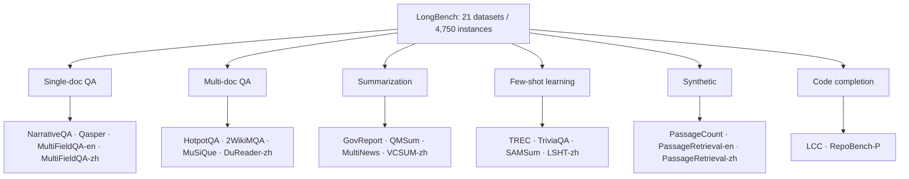

# LongBench: A Bilingual, Multitask Benchmark for Long Context Understanding — Bai et al., 2023

> **arXiv:** 2308.14508v2 · **Venue:** ACL 2024 (pp. 3119–3137) · **Affiliation:** Tsinghua University / THUDM / Zhipu AI

## TL;DR
LongBench is the **first bilingual (English + Chinese), fully-automatic, multitask** benchmark
for long-context understanding. It bundles **21 datasets across 6 task categories** — single-doc
QA, multi-doc QA, summarization, few-shot learning, synthetic, and code completion — totaling
**4,750 test instances** with average lengths of ~6.7K English words / ~13K Chinese characters.
All metrics are automatic (F1, ROUGE-L, accuracy, edit similarity), and a length-stratified
subset **LongBench-E** exposes how accuracy decays as inputs grow. It became a de-facto standard
showing that extended context windows alone do not confer real long-context comprehension.

## Problem & motivation
LLMs handle short text well but must increasingly process **books, reports, and codebases**.
Before LongBench, long-context evaluation was fragmented: single-dataset probes, English-only,
or dependent on **expensive manual/LLM-judged scoring**. There was no standardized, bilingual,
cheaply-reproducible suite covering diverse real tasks. LongBench fixes this with (i) a **unified
JSON format** across all datasets, (ii) **all-automatic metrics** (no human/API judging), and
(iii) **bilingual** coverage so length behavior can be compared across languages.

## Key idea
Assemble real long-context datasets into **six task families**, normalize them to one schema,
truncate over-long inputs from the **middle** (preserving head and tail, per *Lost in the
Middle*), and score everything automatically. A model's category score is the mean of its
per-dataset metrics; the overall score is the mean over categories.

## How it works

### The 21 datasets in 6 categories


**1. Single-doc QA** — *metric F1* (ROUGE where noted). NarrativeQA (stories/scripts, ~18.4K
words), Qasper (NLP papers, 3.6K), MultiFieldQA-en (mixed docs, 4.6K), MultiFieldQA-zh (6.7K
chars). Purpose-built MultiFieldQA has human-annotated evidence positions.

**2. Multi-doc QA** — *F1 / ROUGE-L (DuReader)*. HotpotQA (9.2K), 2WikiMultihopQA (4.9K),
MuSiQue (11.2K), DuReader-zh (15.8K chars). Requires multi-hop synthesis across documents.

**3. Summarization** — *ROUGE-L*. GovReport (8.7K), QMSum (query-based meeting summ, 10.6K),
MultiNews (multi-doc news, 2.1K), VCSUM-zh (15.4K chars).

**4. Few-shot learning** — *accuracy / F1 / ROUGE-L*. TREC (50-way question classification),
TriviaQA, SAMSum (dialogue summarization), LSHT-zh (24-way Chinese news classification). Few-shot
exemplars are prepended, stretching the context.

**5. Synthetic** — *accuracy*. PassageCount (count unique paragraphs amid duplicates),
PassageRetrieval-en (match one of 30 Wikipedia paragraphs to its summary), PassageRetrieval-zh.
Controlled probes of retrieval/counting at length.

**6. Code completion** — *edit similarity*. LCC (single-file next-line, 500 samples) and
RepoBench-P (cross-file completion from GitHub repos, 500 samples); tests using dependencies
spread across long code contexts.

Totals: **14 English + 5 Chinese + 2 code** tasks, 200 instances each (500 for code), = **4,750**.

### Unified format & scoring
Every instance is normalized to:
```json
{"input": "...", "context": "long text/code", "answers": ["..."],
 "length": 12345, "dataset": "hotpotqa", "language": "en", "all_classes": null, "_id": "..."}
```
- **Length** = word count (English/code) or character count (Chinese).
- **Truncation:** inputs exceeding a model's window are cut **from the middle**, keeping the
  beginning and end (empirically better than head/tail truncation; motivated by *Lost in the
  Middle*, arXiv:2307.03172).
- **Metrics:** F1 (QA overlap), ROUGE-L (summarization LCS-recall), accuracy (classification /
  synthetic exact match), edit similarity (code = normalized Levenshtein).

### LongBench-E (length-stratified)
A subset resampled to a **uniform length distribution** over three bins — **0–4k / 4k–8k / 8k+** —
across 13 tasks (~3,500+ instances), so a single model's accuracy can be plotted **as a function
of input length** to reveal degradation trends rather than a single averaged number.

## Training / data
Evaluation-only; no model training. Datasets are curated from existing corpora (NarrativeQA,
Qasper, HotpotQA, GovReport, TREC, GitHub repos, etc.) plus purpose-built MultiFieldQA. Models are
run **zero/few-shot** in their native chat format; all scoring is automatic, eliminating
annotation and API-judge cost.

## Results
Overall averages (percent) on English and Chinese splits (Tables 5–6):

| Model | EN avg | ZH avg | Notable |
|---|---|---|---|
| **ChatGLM3-6B-32k** | **48.5** | **52.8** | best open-source; beats GPT-3.5 on EN |
| GPT-3.5-Turbo-16k | 44.0 | 44.5 | strongest commercial baseline |
| ChatGLM2-6B-32k | 40.9 | 41.7 | +7.6 EN from v2→v3 |
| LongChat-v1.5-7B-32k | 34.3 | 23.9 | |
| Vicuna-v1.5-7B-16k | 31.9 | 26.4 | |
| Llama2-7B-chat-4k | 31.0 | 14.3 | 4K window hurts on ZH |
| XGen-7B-8k | 28.3 | 15.1 | |
| InternLM-7B-8k | 24.2 | 18.3 | |

Source: Tables 5–6 (per §4).

Per-category picture for the two leaders (EN): ChatGLM3-6B-32k scores 40.3 / 46.6 / 29.5 / 68.1 /
56.2 / 50.5 on single-doc QA / multi-doc QA / summarization / few-shot / code / synthetic;
GPT-3.5-Turbo-16k scores 39.8 / 38.7 / 26.5 / 67.1 / 54.1 / 37.8.

Main findings:
- **Commercial lead is real but bounded.** GPT-3.5-Turbo-16k tops most open models yet still
  degrades on the longest (8k+) inputs.
- **Scaled positions + fine-tuning drive gains.** ChatGLM3-6B-32k surpasses GPT-3.5 on English —
  gains attributed to RoPE/position scaling and continued training on long documents.
- **Retrieval augmentation helps weak models but does not close the gap** to models with strong
  native long-context ability (§4.2).
- **Length-dependent decay (LongBench-E).** All models fall as inputs grow (mild 0–4k → severe
  8k+, −20 to −40 points for non-fine-tuned models); ChatGLM3-6B-32k stays relatively flat.
- **Bottleneck = synthetic + summarization**; **few-shot learning** is most length-robust.

*(No stable figure asset ships with the paper's arXiv build — the repo's `misc/` figures now host
LongBench **v2** graphics, so the taxonomy diagram above is authored from Table 1 of the original
paper.)*

## Limitations & follow-ups
- **Automatic metrics only.** F1/ROUGE reward lexical overlap and can under-credit correct
  paraphrases, especially in summarization.
- **200 instances/task** is modest; middle-truncation changes what shorter-window models even see.
- **Successor — LongBench v2** (arXiv 2412.15204): 503 hard **multiple-choice** questions over
  8k–2M-token contexts targeting deep reasoning; categories shift to Single-/Multi-doc QA, Long
  ICL, Long dialogue, Code-repo, and Structured-data. Complements
  [RULER](benchmark_2024_ruler.md)'s synthetic length ladder and the clinical
  [LongHealth](benchmark_2024_longhealth.md).

## Links
- **arXiv:** [abs](https://arxiv.org/abs/2308.14508) · [html](https://arxiv.org/html/2308.14508v2) · [pdf](https://arxiv.org/pdf/2308.14508)
- **Code:** https://github.com/THUDM/LongBench
- **Hugging Face:** https://huggingface.co/datasets/THUDM/LongBench
- **ACL Anthology:** https://aclanthology.org/2024.acl-long.172
- **LongBench v2:** https://longbench2.github.io/ · [arXiv 2412.15204](https://arxiv.org/abs/2412.15204)
- **BibTeX:**
  ```bibtex
  @inproceedings{bai2024longbench,
    title={LongBench: A Bilingual, Multitask Benchmark for Long Context Understanding},
    author={Bai, Yushi and Lv, Xin and Zhang, Jiajie and Lyu, Hongchang and Tang, Jiankai and Huang, Zhidian and Du, Zhengxiao and Liu, Xiao and Zeng, Aohan and Hou, Lei and Dong, Yuxiao and Tang, Jie and Li, Juanzi},
    booktitle={Proceedings of the 62nd Annual Meeting of the ACL},
    pages={3119--3137},
    year={2024}
  }
  ```
- **Related / successor papers:** [RULER](benchmark_2024_ruler.md) ·
  [LongHealth](benchmark_2024_longhealth.md) · [GSM8K](benchmark_2021_gsm8k.md) ·
  thread: [Long-context benchmarks & datasets](../context/benchmarks/benchmarks.md)
