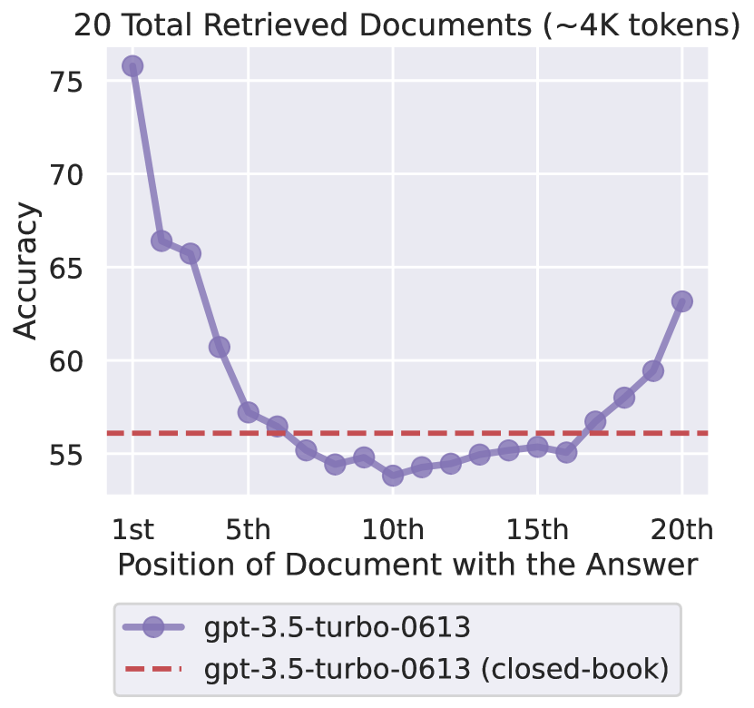
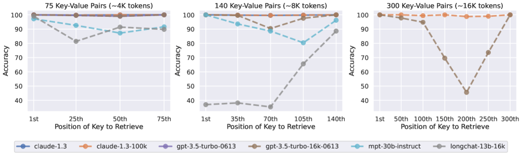

# Lost in the Middle: How Language Models Use Long Contexts — Liu et al., 2023

> **arXiv:** 2307.03172v3 · **Venue:** TACL 2023 (Transactions of the ACL) · **Affiliation:** Stanford University, UC Berkeley, Samaya AI

## TL;DR
Even when a long-context model *can* fit all the relevant text in its window, it does not
use that window uniformly. Across multi-document QA and synthetic key–value retrieval, model
accuracy traces a **U-shaped curve** in the position of the relevant information: highest when
the needed fact sits at the **very beginning** (primacy) or **very end** (recency) of the input,
and worst when it sits in the **middle** — a drop of **>20 points** for GPT-3.5-Turbo, sometimes
*below* its no-document closed-book baseline. Extending a model's context window (4K→16K, 8K→100K)
does **not** fix this. The paper reframes long-context evaluation: to claim a model "uses" its
context, best- vs. worst-case position accuracy must be nearly equal.

## Problem & motivation
Hardware and algorithmic advances (FlashAttention, ALiBi, condensed RoPE, etc.) pushed context
windows from 512–2048 tokens to 4K/16K/100K. But *capacity* to ingest tokens is not the same as
*ability to use* them. The paper asks a controlled question: if a model can robustly use its whole
input, its accuracy should be **minimally affected by where** the relevant information lives.

The pain point is concrete and practical. Retrieval-augmented generation (RAG) dumps $k$ retrieved
passages into the prompt and hopes the model finds the answer. If accuracy depends on *position*,
then RAG quality hinges not just on retrieval recall but on the (usually ignored) ordering of
passages — and stuffing more passages in can *hurt*. Prior needle-in-a-haystack tests only compared
"start vs. random"; this work sweeps the position finely and adds a semantics-free retrieval probe.

## Key idea
Hold the task and the answer fixed, then **independently vary two knobs**: (i) the input length
(number of documents / key–value pairs) and (ii) the **position** of the single relevant item.
Measure accuracy as a function of position. Robust context use ⇒ a flat curve; the paper finds a
**U**.

The proposed evaluation criterion: a model can be said to use long contexts robustly only if

$$
\Delta \;=\; \max_{p}\ \operatorname{acc}(p)\;-\;\min_{p}\ \operatorname{acc}(p)
$$

is small, where $p$ indexes the position of the relevant item and $\operatorname{acc}(p)$ is task
accuracy with the gold item at position $p$. Large $\Delta$ (e.g. >20 points) signals brittle,
position-dependent behavior rather than genuine full-context reasoning.

## How it works

### Task 1 — Multi-document question answering (the realistic probe)
- **Inputs:** a question + $k$ documents (Wikipedia chunks ≤100 tokens). **Exactly one** document
  (the *gold* document) contains the answer; the other $k-1$ are **distractors**.
- **Data:** 2,655 NaturalQuestions-Open queries whose annotated answer is a paragraph. Gold
  paragraph from the NQ annotation; distractors are the most-relevant non-answer chunks retrieved
  by **Contriever** (fine-tuned on MS-MARCO), presented in **decreasing relevance** order.
- **Position knob:** reorder documents so the gold document sits at index $0,\dots,k-1$
  (re-ordering does not change the correct answer).
- **Length knob:** use $k \in \{10, 20, 30\}$ total documents (≈1.5K / 3K / 4.5K tokens).
- **Metric:** accuracy = does any gold answer string appear in the greedy-decoded output.
- **Baselines:** **closed-book** (no documents; parametric memory only) and **oracle** (only the
  single gold document).

### Task 2 — Synthetic key–value retrieval (the semantics-free probe)
- **Inputs:** a JSON object of $k$ key–value pairs, all keys/values are unique random 128-bit
  UUIDs, plus one query key. **Output:** the value for that key.
- Strips away natural-language semantics so the task is *pure token matching* — a lower bound on
  retrieval ability. **Length knob:** $k \in \{75, 140, 300\}$ pairs (500 examples each).
  **Position knob:** location of the query key in the serialized JSON.

### Data flow of one evaluation


### The shape of the result
```
 acc
  |  *                         *      ← primacy (start) & recency (end): high
  |    *                    *
  |       *              *
  |          *   *   *              ← middle: lowest, can dip below closed-book
  +----------------------------------  gold-document position →
   start        middle         end
```




### Models evaluated
- **Open (decoder-only):** MPT-30B-Instruct (8K; pretrained on 1T tokens @2048, then +50B @8192;
  ALiBi positions), LongChat-13B (16K) (LLaMA-13B extended 2048→16384 via condensed RoPE).
- **Closed (decoder-only):** GPT-3.5-Turbo (4K), GPT-3.5-Turbo (16K), Claude-1.3 (8K),
  Claude-1.3 (100K).
- **Encoder–decoder (analysis):** Flan-T5-XXL (512-token train), Flan-UL2 (2048-token train).
- **Scale/fine-tuning analysis:** Llama-2 7B/13B/70B with and without SFT+RLHF.
- All generations use **greedy decoding** with a standardized prompt per model.

## Training / data
This is a **measurement paper — no model training.** All inputs are constructed:
NaturalQuestions-Open queries + Wikipedia (late-2018 dump) chunks for QA, and randomly-generated
UUID JSON objects for key–value retrieval. Contriever (MS-MARCO fine-tuned) supplies distractors.
Accuracy is string-match against NQ answers (QA) or exact value match (KV).

## Results

### Closed-book vs. oracle (Table 1) — the reference posts
| Model | Closed-book | Oracle |
|---|---|---|
| LongChat-13B (16K) | 35.0% | 83.4% |
| MPT-30B-Instruct | 31.5% | 81.9% |
| GPT-3.5-Turbo | 56.1% | 88.3% |
| GPT-3.5-Turbo (16K) | 56.0% | 88.6% |
| Claude-1.3 | 48.3% | 76.1% |
| Claude-1.3 (100K) | 48.2% | 76.4% |

Extended-context variants (16K, 100K) are **statistically indistinguishable** from their base
versions here — extra window doesn't buy extra usage (per §2.3).

### Position sweep — 10 documents (Table 5; start / middle / end)
| Model | Index 0 (start) | Index 4 (middle) | Index 9 (end) |
|---|---|---|---|
| GPT-3.5-Turbo | 76.8% | 61.2% | 62.4% |
| GPT-3.5-Turbo (16K) | 76.9% | 61.0% | 62.5% |
| Claude-1.3 | 62.9% | 58.3% | 59.7% |
| Claude-1.3 (100K) | 63.1% | 58.3% | 59.7% |
| MPT-30B-Instruct | 60.2% | 56.2% | 59.7% |
| LongChat-13B (16K) | 72.1% | 58.9% | 58.5% |

### Position sweep — 20 documents (Table 6; indices 0/5/10/15/19)
| Model | 0 | 5 | 10 (mid) | 15 | 19 |
|---|---|---|---|---|---|
| GPT-3.5-Turbo | 75.8% | 57.2% | 53.8% | 55.4% | 63.2% |
| Claude-1.3 | 59.9% | 55.9% | 56.8% | 57.2% | 60.1% |

### Position sweep — 30 documents (Table 7; 7 positions)
| Model | 0 | mid (worst) | last |
|---|---|---|---|
| GPT-3.5-Turbo (16K) | 73.4% | 50.5% | 63.7% |
| MPT-30B-Instruct | 51.6% | 49.0% | 54.1% |
| LongChat-13B (16K) | 66.9% | ~52% | 55.1% |

**Headline:** GPT-3.5-Turbo drops **>20 points** start→middle, and at 20/30 documents its
*middle* accuracy (≈50–54%) falls **below** the closed-book 56.1% — extra context in the wrong
place is worse than no context (per §2.3).

### Key–value retrieval (Figure 7)
- Claude-1.3 / Claude-1.3 (100K): **≈100%** at all sizes (75/140/300 pairs).
- GPT-3.5-Turbo, GPT-3.5-Turbo (16K), MPT-30B-Instruct: same **U-shape**; worst-case (middle,
  300 pairs) as low as **45.6%** — failing to copy an *exact* UUID it can plainly see.



### Why it happens (§4 analysis)
- **Architecture (§4.1).** Encoder–decoder models (Flan-UL2/Flan-T5-XXL) are **robust within
  their training length** (Flan-UL2: only **1.9%** best–worst gap ≤2048 tokens) but develop the
  U-shape **beyond** training length. Hypothesis: the **bidirectional encoder** lets each document
  be contextualized against later documents, improving relative-importance estimates.
- **Query-aware contextualization (§4.2).** Placing the query **both before and after** the data
  makes KV retrieval **near-perfect** (GPT-3.5-Turbo-16K → 100% at 300 pairs) but **barely
  changes** multi-doc QA (slightly better at the start, slightly worse elsewhere). Matching ≠
  reasoning.
- **Instruction tuning (§4.3).** MPT-30B and MPT-30B-Instruct **both** show the U-shape; SFT only
  shrinks the best–worst gap from ~10% to ~4%. So the bias is **not created by instruction
  tuning**.
- **Scale (Appendix E).** The U-shape (primacy *and* recency) appears only in **large** models:
  Llama-2-7B is purely recency-biased; 13B/70B show full U-shapes (13B base: ~20-point gap).
  RLHF/SFT slightly mitigates in 13B, barely moves 70B. GPT-4 (Appendix D) has higher absolute
  accuracy but **still** U-shaped.
- **RAG saturation (§5).** On open-domain NQ, reader accuracy **saturates far before** retriever
  recall: going 20→50 retrieved documents adds only ~1.5% (GPT-3.5-Turbo) / ~1% (Claude-1.3) while
  multiplying cost — motivating **reranking** (push relevant to the front) and **ranked-list
  truncation**.

## Limitations & follow-ups
- **Greedy decoding only**; other decoding strategies unexplored.
- NaturalQuestions answers can be **temporally ambiguous** vs. the 2018 Wikipedia dump; an
  unambiguous subset (Appendix A) and **random-distractor** / **randomized-order** ablations
  (Appendices B–C) reproduce the U-shape, so it is not an artifact of hard negatives or relevance
  ordering.
- **Practical fixes suggested:** rerank so relevant passages sit early; truncate the ranked list;
  design positional encodings / attention that flatten the curve; instructions emphasizing the
  middle.
- **Successors / related:** the "effective context ≪ claimed" story is quantified structurally by
  [Why Does the Effective Context Length Fall Short? (STRING)](benchmark_2024_effective-context-length.md);
  synthetic length-controlled evaluation is generalized by [RULER](benchmark_2024_ruler.md);
  broad real-task suites by [LongBench](benchmark_2023_longbench.md); training recipes that measure
  *effective* use by [How to Train Long-Context LMs (ProLong)](benchmark_2024_prolong.md).
- Connects to the psychological **serial-position effect** (Ebbinghaus 1913; Murdock 1962).

## Links
- **arXiv:** [abs](https://arxiv.org/abs/2307.03172) · [html (ar5iv)](https://ar5iv.labs.arxiv.org/html/2307.03172) · [pdf](https://arxiv.org/pdf/2307.03172)
- **Code / data:** <https://github.com/nelson-liu/lost-in-the-middle> · project page <https://nelsonliu.me/papers/lost-in-the-middle>
- **Venue page:** TACL 2023 (MIT Press)
- **BibTeX:**
  ```bibtex
  @article{liu2024lost,
    title={Lost in the Middle: How Language Models Use Long Contexts},
    author={Liu, Nelson F. and Lin, Kevin and Hewitt, John and Paranjape, Ashwin and
            Bevilacqua, Michele and Petroni, Fabio and Liang, Percy},
    journal={Transactions of the Association for Computational Linguistics},
    volume={12}, pages={157--173}, year={2024}
  }
  ```
- **Related / successor papers:** [RULER](benchmark_2024_ruler.md) · [LongBench](benchmark_2023_longbench.md) · [Effective Context Length / STRING](benchmark_2024_effective-context-length.md) · [ProLong](benchmark_2024_prolong.md)
