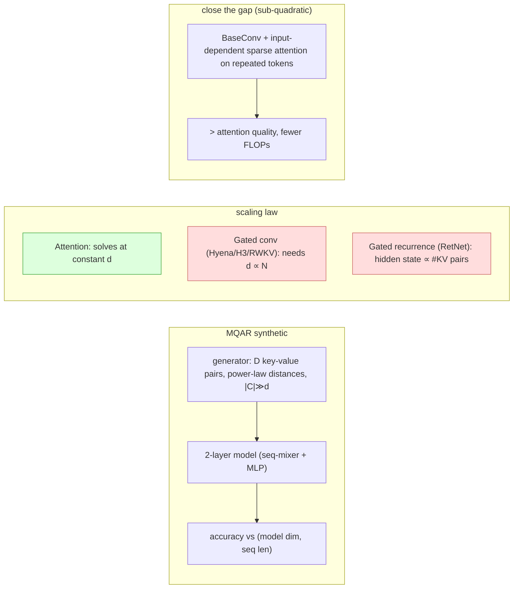

# Zoology: Measuring and Improving Recall in Efficient Language Models (MQAR) — Arora et al., 2023

> **arXiv:** 2312.04927v1 · **Venue:** ICLR 2024 · **Affiliation:** Stanford, Univ. at Buffalo, Purdue

## TL;DR
Attention-free "gated-convolution" LMs (H3, Hyena, RWKV, RetNet, Mamba-family) look competitive on average
but still trail attention by up to **2.1 perplexity points** on the Pile. Zoology shows **82%** of that gap
comes from a single skill — **associative recall (AR)**: predicting the continuation of a bigram seen
earlier in-context. A 70M attention model beats a **1.4B** (20×) Hyena on AR. The prior synthetic AR test
(single query, fixed position, tiny vocab) is too easy — gated convs "solve" it — so the paper introduces
**Multi-Query Associative Recall (MQAR)**: many recalls per sequence, at varying distances, large vocab.
Theory + experiment show gated convolutions need **model dimension growing with sequence length** to solve
MQAR, while attention solves it at **constant** dimension. Adding a little **input-dependent** mixing
(sparse attention on repeated tokens) closes **97.4%** of the gap sub-quadratically. MQAR is now a standard
diagnostic for judging efficient-architecture recall.

## Problem & motivation
Sub-quadratic architectures combining **gating** (element-wise multiply) and **long convolutions** promise
attention-level quality at $O(N\log N)$ cost. But on the Pile, SoTA gated convs lag attention. Where does
the gap live? Stratifying tokens by whether they are **AR Hits** — the last token of a bigram already seen
in context (and rare in training, ≤1250× in 10B tokens) — reveals: on the 93.6% "other" tokens there is
**no gap**; the entire gap concentrates on the **6.4%** AR Hits. So the problem isn't language modeling
broadly — it's **in-context recall**.

Puzzle: prior work claimed gated convs solve synthetic AR perfectly. The catch is the *formulation*.

## Key idea
**MQAR** generalizes AR to match real language. Given a sequence $\mathbf x=\{x_0,\dots,x_{N-1}\}$ from
vocab $C$, for **every** query position $1\le i<N$, check if some earlier $j<i$ has $u_i\equiv u_j$, and if
so output $u_{j+1}$ — i.e. multiple key→value recalls, at varying token-interaction distances, in one
forward pass:

$$
\underbrace{A\,4\;\;B\,3\;\;C\,6\;\;F\,1\;\;E\,2}_{\text{key-value pairs}}\ \to\ 
\underbrace{A\,?\;\;C\,?\;\;F\,?\;\;E\,?\;\;B\,?}_{\text{queries}}\ \Rightarrow\ 4,6,1,2,3 .
$$

Two properties are toggled in a generator: **number of key-value pairs** per example, and **range of
interaction distances** (drawn from a power law, matching Pile statistics), with **vocab ≫ model dim**
(30k–50k vs prior ≤40).

**Why attention wins — the theory.** Define **BaseConv**, a minimal gated-conv operator that provably
simulates any gating+convolution architecture (H3/Hyena/RWKV) up to poly-log factors:

$$
\mathbf y = \underbrace{(\mathbf u W^\ell + b_1^\ell)}_{\text{linear projection}}\ \odot\ 
\underbrace{(\mathbf h^\ell * \mathbf u + b_2^\ell)}_{\text{convolution}} .
$$

Results:
- **Attention** solves MQAR with $O(c^2)$ params, $O(1)$ layers — **independent of sequence length $N$**.
- **BaseConv with input-independent filters** needs model dimension that **scales with $N$** (Thm 4.4:
  $\tilde O(N\log c)$), because a fixed filter can't cheaply express the *variable* token-to-token
  distances real recall requires.
- **BaseConv with input-dependent filters** recovers $O(1)$ layers (Thm 4.5: $O(t\cdot Nc)$ params for $t$
  distinct interaction distances) — the fix is **data-dependent sequence mixing**.
- Gated **recurrences** (RetNet/Mamba-family) need hidden-state bits $\Omega(N)$ growing with the number of
  key-value pairs to store.

## How it works


To close the gap on the Pile, augment a mostly-BaseConv stack with **3 attention layers** (6–10% of
layers) that apply attention only to tokens selected by $f(\mathbf u)\in\{0,1\}^N$:

$$
\mathbf y[i,:]=\mathrm{softmax}\!\Big(\tfrac1{\sqrt d}\mathbf q[i]\mathbf k^\top\Big)\mathbf v\cdot f(\mathbf u)[i].
$$

Selection variants: **programmatic** (attend where a token id repeats — the AR-hit heuristic), **learned**
(linear+sigmoid, top-$k$ with sparsity aux-loss, sub-quadratic $O(ndk)$), **random** (control), or **full**.

## Training / data
17 models across 4 scales (70M–1.4B) pretrained on **10B Pile tokens** (50B at 1.4B) via EleutherAI
GPT-NeoX, matched Llama recipe (rotary, SwiGLU). Sequence mixers compared: **Attention, Hyena, H3, RWKV,
pure long-conv, BaseConv, RetNet**. Synthetic MQAR: 2-layer models, vocab 8192, sequence length & model
dim swept 64–512, LR swept ×4, 64 epochs, 100k train / 3k test examples. AR-gap metric uses log-probs on
bigrams seen <1250× in training (~6.4% of validation tokens).

## Results
Pile validation log-perplexity (NLL in parens), sliced into AR Hits vs Other tokens:

| Model | Params | Overall | AR Hits | Other | % gap due to AR | Source |
|---|---:|---:|---:|---:|---:|---|
| Attention | 125M | 11.01 | 2.16 | 12.45 | — | Table 1 |
| H3 | 168M | 12.06 | 6.75 | 12.60 | 88.4% | Table 1 |
| Hyena | 358M | 10.07 | 3.83 | 10.75 | 98.2% | Table 1 |
| RWKV | 351M | 9.79 | 3.82 | 10.51 | 100% | Table 1 |
| Attention | 1.4B | 8.19 | 1.91 | 9.86 | — | Table 5 |
| Hyena | 1.4B | 9.65 | 3.43 | 11.01 | 40.3% | Table 5 |

- **The gap is AR.** A **70M attention** model beats a **1.4B Hyena** on the AR slice (2.41 vs 3.43 ppl).
  Scaling gated convs to 7B (RWKV vs Llama-2) doesn't close it — recall degrades as #recalls per input
  grows, while attention stays flat.
- **Synthetic MQAR (Fig. 2):** attention solves at constant $d=64$ for all lengths; gated convs need
  $d\ge N$ for >0.9 accuracy — matching the theory.
- **Closing the gap (Table 2, 360M):** BaseConv + **programmatic** selection closes **85%** of the AR-slice
  gap; **learned** selection closes 72% with only $k=256$ attention positions; **full** attention hybrid
  even **beats** attention by ~0.85 ppl at **18% fewer FLOPs**; random selection doesn't help — confirming
  it's *input-dependence*, not just extra parameters.

## Limitations & follow-ups
- The AR-hit heuristic measures only **exact repeated bigrams**; fuzzy/semantic recall (synonyms, concepts)
  is not captured, so the gap may be underestimated.
- MQAR is a **diagnostic**, not a full model proposal; the hybrid prototypes are minimal demonstrations.
- Directly motivated selective/input-dependent SSMs — **Mamba** (selective state), **Based**, **Gated
  Linear Attention** — and MQAR became a standard recall probe; complements passkey-style tests
  ([Landmark Attention](longseq_2023_landmark-attention.md)) and long-context suites
  ([RULER](benchmark_2024_ruler.md)).

## Links
- **arXiv:** [abs](https://arxiv.org/abs/2312.04927) · [html](https://arxiv.org/html/2312.04927v1) · [pdf](https://arxiv.org/pdf/2312.04927)
- **Code:** <https://github.com/HazyResearch/zoology>
- **BibTeX:**
  ```bibtex
  @inproceedings{arora2024zoology,
    title     = {Zoology: Measuring and Improving Recall in Efficient Language Models},
    author    = {Arora, Simran and Eyuboglu, Sabri and Timalsina, Aman and Johnson, Isys and Poli, Michael and Zou, James and Rudra, Atri and R\'e, Christopher},
    booktitle = {International Conference on Learning Representations (ICLR)},
    year      = {2024},
    url       = {https://arxiv.org/abs/2312.04927}
  }
  ```
- **Related papers:** [RULER](benchmark_2024_ruler.md) ·
  [Landmark Attention](longseq_2023_landmark-attention.md) ·
  [Mamba](longseq_2023_mamba.md) · [Linear Attention](longseq_2020_linear-attention.md) ·
  [S4](longseq_2021_s4.md)
- **In-repo:** [§6.7 in mixed_decoder](../mixed_decoder/mixed_decoder.md)
