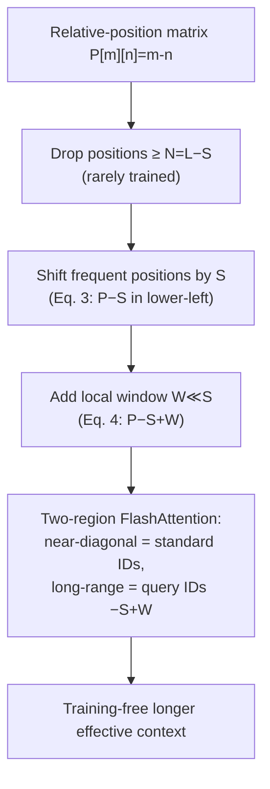

# Why Does the Effective Context Length of LLMs Fall Short? — An et al., 2024

> **arXiv:** 2410.18745v1 · **Venue:** preprint (ICLR 2025 submission) · **Affiliation:** The University of Hong Kong · ByteDance · UIUC

## TL;DR
Open LLMs advertise 128K windows but their **effective** context length is often **≤50%** of the
training length. The paper traces this to a **left-skewed frequency distribution of relative
positions** during pretraining: large relative distances are seen far less often than small ones,
so long-range position encodings are chronically *under-trained*. The fix, **STRING** (ShifTed
Rotary posiTion embeddING), is a **training-free**, inference-time trick that **shifts
well-trained (small) position indices to overwrite the rarely-trained large ones**. STRING lifts
Llama3.1-70B and Qwen2-72B by **+15–30 points on RULER** and **+10+ on InfiniteBench**, letting
open models **beat GPT-4-128K** with no weight updates.

## Problem & motivation
Context windows exploded (Llama3.1 = 128K, 64× its first release), yet models cannot actually use
the tail of the window:

- Llama3.1-70B claims 128K but is **effective only to ~64K** on RULER.
- Most open models: **effective length < 50%** of training length.
- Concretely, Llama3.1 accuracy degrades once **position indices exceed ~90K** (of 128K), and a
  2K-trained TinyLlama already struggles when the query–evidence **distance exceeds ~1,536** tokens.

Prior extrapolation methods (YaRN, NTK, DCA, Self-Extend) tune RoPE **frequencies** to avoid
out-of-distribution *angles*, but they do not address the fact that even *in-distribution* large
positions were **barely trained**. This paper diagnoses that root cause and exploits it.

## Key idea
Model relative positions between the $m$-th and $n$-th tokens as a **Toeplitz matrix** $P$ with
$P[m][n] = m - n$. Over a corpus $\mathcal{C}$, the number of times a relative distance $i$ is
*seen* during training is

$$
f(i) \;=\; \sum_{s \in \mathcal{C}} \max(|s| - i,\ 0), \qquad 0 \le i < L,
$$

where $|s|$ is a sequence's length and $L$ the training context length. For fixed-length data,
$f(i) = L - i$ — **strictly decreasing** in $i$. Empirically (SlimPajama-627B, $L=2048$) the small
positions dominate: $i \le 1024$ accounts for **>80%** of all position occurrences and $i \ge 1536$
for **<5%**. So **long-range positions are under-trained**, compounding the intrinsic difficulty of
long-range dependency.


**STRING's insight:** at inference, *reuse* the heavily-trained small-position encodings to
represent large distances — i.e., **shift the frequent positions down/left to fill the slots that
would otherwise use rare, under-trained positions.**

## How it works

### RoPE background
RoPE rotates query/key vectors by position-dependent angles so that the attention score
$\mathbf{q}_i'^{\top}\mathbf{k}_j'$ depends only on the **relative** offset $i-j$. Thus modifying
the *relative-position matrix* $P$ directly changes which learned rotations are used.

### STRING in three steps
Let $L$ = training length, $S$ = **shift offset**, $W$ = **local window**, and threshold
$N = L - S$ (positions $\ge N$ are deemed under-trained).

**(1) Drop infrequent positions.** Remove every entry using a relative position $\ge N$
(the bottom-left large-distance region of $P$).

**(2) Shift frequent positions to fill the gap.** Move the well-trained small positions down/left
by the offset $S$:

$$
P[m][n] \;=\;
\begin{cases}
P[m][n] - S, & \text{if } m \ge n - S \quad(\text{lower-left region})\\[2pt]
P[m][n], & \text{otherwise}
\end{cases}
\tag{Eq. 3}
$$

**(3) Restore locality.** Step 2 zeroes the local relationships along the $S$-th diagonal, so add a
small window $W \ll S$ to preserve nearest-neighbor structure:

$$
P[m][n] \;=\;
\begin{cases}
P[m][n] - S + W, & \text{if } m \ge n - S\\[2pt]
P[m][n], & \text{otherwise}
\end{cases}
\tag{Eq. 4}
$$

**Symbols:** $L$ training length; $S$ shift offset (how many large positions are overwritten);
$W$ local window (keeps close tokens distinct); $N=L-S$ drop threshold; $m,n$ row/column (token)
indices; $P[m][n]$ relative position at that cell.


### Worked example ($L=9,\ S=3,\ W=1$)
- Original last row of relative positions: `[8,7,6,5,4,3,2,1,0]` (max distance 8).
- Drop 6,7,8 (rare) → shift 0–5 by $S=3$ → row becomes `[5,4,3,2,1,0,2,1,0]` (positions **reused**).
- Add window $W=1$ → `[6,5,4,3,2,1,3,2,1]` — local neighbors keep separate indices.

### Flash-Attention implementation (Algorithm 1)
STRING splits attention into two regions computed with standard FlashAttention-2 blocks:
1. **Sliding-window / near-diagonal** ($m < n - S$): untouched — standard position IDs
   `pids = [0,1,…,L−1]` for both query and key.
2. **Shifted long-range** ($m \ge n - S$): replace the **query** position IDs with
   `pids_query − S + W`; keys/KV-cache unchanged. Distant queries thus attend using
   frequently-trained rotations.

Outputs of the two regions are merged. Only query position IDs are remapped — **no KV-cache
change, negligible overhead, no training.**



### Hyperparameters (defaults & ablation ranges)
| Symbol | Meaning | Constraint | Default | Ablation finding |
|---|---|---|---|---|
| $W$ | local window | $W \ge 32,\ W \ll S$ | **128** | big jump at $W{=}32$; plateaus past 128 while $W\ll S$ |
| $S$ | shift offset | $L/3 \le S \le L/2$ | **$L/3$** | improves up to $S{=}L/3$; diminishing returns after |
| $N$ | drop threshold | $N=L-S$ | $2L/3$ | derived from $S$ |

## Training / data
STRING is **inference-only** — no fine-tuning, no extra data. The pretraining-frequency analysis
uses SlimPajama-627B truncated/packed to $L=2048$; the effect is applied to off-the-shelf RoPE
models (Llama-3.1, Qwen2, TinyLlama, etc.). For real 128K models, $S = L/3 \approx 42\text{K}$
(positions ≥ ~86K dropped) or $S = L/2 = 64\text{K}$ (more aggressive).

## Results

### Needle-in-a-Haystack (Table 1; 4-needle, 500 cases, at training length)
| Method | Avg over 7 models |
|---|---|
| RoPE (baseline) | 67.8% |
| DCA | 73.1% |
| **STRING** | **85.7%** |

Per-model example: Llama-3.1-8B (128K) NIAH **53.6% → 95.2% (+41.6)** (per Table 1).

### RULER (13 tasks, tested at 128K; Table 2)
| Model | Avg | Effective length | vs. proprietary |
|---|---|---|---|
| Llama3.1-70B | 66.6% | 64K | — |
| **Llama3.1-70B + STRING** | **81.7% (+15.1)** | **100K** | > GPT-4-1106 (81.2%) |
| Qwen2-72B | 53.7% | 64K | — |
| **Qwen2-72B + STRING** | **84.6% (+30.9)** | **100K** | **> GPT-4-128K**, new open SOTA |

Llama3.1-70B+STRING per-category: NIAH 78.9→**92.7**, Variable-Tracing 59.2→**95.6**,
Aggregation 39.8→**50.0**, QA 47.6→**63.0** (per Table 2).

### InfiniteBench (real-world, 128K; Table 3)
Llama3.1-70B+STRING overall **56.88%**, surpassing GPT-4-128K (55.69%), Claude-2 (47.96%),
Kimi-chat (43.91%). Retrieval-PassKey and Retrieval-Number reach **100%** (per Table 3).

### Diagnostic evidence


## Limitations & follow-ups
- **Analysis limited to training lengths ≤4K**; multi-stage industrial recipes (e.g. Llama3.1's
  6-stage curriculum) have opaque per-stage data, making the frequency analysis intractable there.
- **Training-time fix is future work**: rebalancing the position-frequency distribution during
  pretraining (curriculum / data rebalancing) could remove the need for STRING, but risks knowledge
  loss without domain-matched data.
- **Assumes a full KV cache** — not directly applicable to streaming/eviction schemes
  (e.g. StreamingLLM).
- **Tested up to 128K**; scaling to 256K+ unverified.
- **Related:** motivates and complements [Lost in the Middle](benchmark_2023_lost-in-the-middle.md)
  (positional under-use) and is measured on [RULER](benchmark_2024_ruler.md); orthogonal to
  frequency-only extrapolation (YaRN, NTK, DCA, Self-Extend).

## Links
- **arXiv:** [abs](https://arxiv.org/abs/2410.18745) · [html](https://arxiv.org/html/2410.18745v1) · [pdf](https://arxiv.org/pdf/2410.18745)
- **Code:** <https://github.com/HKUNLP/STRING>
- **BibTeX:**
  ```bibtex
  @article{an2024effective,
    title={Why Does the Effective Context Length of LLMs Fall Short?},
    author={An, Chenxin and Zhang, Jun and Zhong, Ming and Li, Lei and Gong, Shansan and
            Luo, Yao and Xu, Jingjing and Kong, Lingpeng},
    journal={arXiv preprint arXiv:2410.18745}, year={2024}
  }
  ```
- **Related / successor papers:** [Lost in the Middle](benchmark_2023_lost-in-the-middle.md) · [RULER](benchmark_2024_ruler.md) · [ProLong](benchmark_2024_prolong.md)
