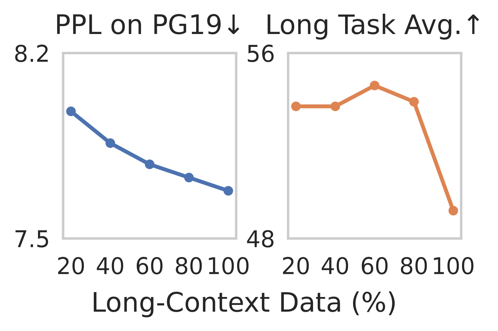
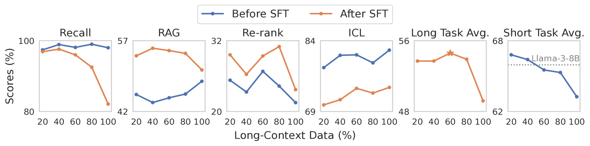
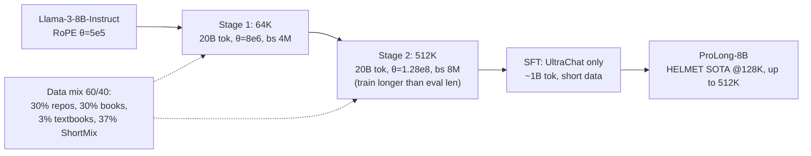

# How to Train Long-Context Language Models (Effectively) — Gao et al., 2024

> **arXiv:** 2410.02660v4 · **Venue:** ACL 2025 · **Affiliation:** Princeton Language and Intelligence, Princeton University

## TL;DR
ProLong is a **recipe** — and a family of models — for turning a short-context base model into an
effective long-context one **cheaply and correctly**. Two lessons dominate: (1) **don't steer with
perplexity or vanilla needle-in-a-haystack** — use reliable downstream long-context tasks
(HELMET), evaluated **after SFT**; (2) **mix ~60% long data (code repos + books) with ~40%
high-quality short data**, train in two stages (64K then **512K**), and do SFT with **short
instruction data only**. Starting from Llama-3-8B and using just **40B tokens** of continued
pretraining (~5% of Llama-3.1's long-context budget), **ProLong-8B is the best 8–10B model on
HELMET at 128K** and supports up to **512K** context.

## Problem & motivation
Long-context training is widely done, but **poorly guided and poorly measured**:

- **Perplexity is misleading.** Models trained on *more* long data reach lower PPL yet **worse**
  downstream long-context accuracy (Figure 1).
- **Synthetic NIAH is too easy** to separate good models from bad.
- **Naïve long-data fine-tuning degrades short-context** ability (Table 2 reports −1.4 HellaSwag,
  −2.8 MMLU, −1.3 ARC under position-extrapolation / SlimPajama-mixture baselines).
- Prior work rarely studies the **short/long ratio, data sources, and design choices** jointly, and
  wastes compute (Llama-3.1 uses ~800B long-context tokens).

## Key idea
Treat long-context training as a controlled optimization against a **trustworthy objective**:
- **Objective = HELMET downstream tasks** (not PPL), measured **after SFT** (some gains only appear
  post-SFT), while **watching short-context regressions**.
- **Data = a tuned mixture**: long documents that genuinely contain long-range dependencies
  (code repositories, books) balanced with high-quality short data to protect general ability.
- **Curriculum = length-staged** continued pretraining (64K → 512K), training on sequences
  **longer than** the evaluation length, then **short-only SFT**.



## How it works

### Evaluation methodology (HELMET)
Six category groups, macro-averaged at 32K/64K, chosen for **reliability** and separation:
1. **Recall** (SubEM) — key→value lookup in a long JSON.
2. **RAG** (SubEM) — QA over shuffled Wikipedia docs (NQ, HotpotQA, PopQA).
3. **Re-ranking** (nDCG@10) — order top-10 from a shuffled list (MSMARCO).
4. **ICL** (accuracy) — many-shot in-context learning (TREC, NLU, Banking77, Clinc-150, …).
5. **QA** (GPT-4o judge, 0–3) — questions over **whole books** (NarrativeQA; up to 518K tokens).
6. **Summarization** (GPT-4o coverage/precision) — long legal docs (Multi-LexSum).

Key practices: **evaluate after SFT** (Figure 2 shows RAG/re-ranking/QA/summarization signals only
emerge post-SFT), **monitor short-context** (HellaSwag, MMLU, ARC-c, WinoGrande, GSM8K), use
**model-based** judging (GPT-4o) over ROUGE, and validate on held-out RULER / ∞Bench / NoCha to
avoid overfitting HELMET.



### Data recipe
**Long-context sources** (documents ≥64K tokens; Table 3): code repos (files concatenated per repo,
from The Stack) **98.8B tokens**, SlimPajama Books **33.2B**, CommonCrawl **15.3B**, ArXiv **5.2B**,
GitHub **2.8B**. **Ablation (Table 4):** *books + code repos 1:1* is best overall (Recall 96.0, RAG
54.9, Re-rank 29.4, ICL 73.9, avg **54.6**); code-alone has weak ICL, CommonCrawl/ArXiv underperform.

**Short data — ProLong ShortMix:** 27% FineWeb, 27% FineWeb-Edu, 11% Wikipedia, 11% StackExchange,
8% Tulu-v2, 8% OpenWebMath, 8% ArXiv.

**Optimal ratio (Figure 3):** **60% long / 40% short.** More long data monotonically **degrades
short-context** and eventually long-context (after SFT) too.

**Final ProLong mixture (Table 9):** 30% code repos, 30% books, 3% textbooks (libretexts), 37%
ShortMix. **512K arrangement:** code repos 50%@512K / 50%@64K; books 17%@512K / 83%@64K; textbooks
100%@512K.

### Training recipe (exact settings)
- **Base:** Llama-3-8B-Instruct (final; -Base for ablations). Optimizer **AdamW**
  ($\beta_1{=}0.9,\ \beta_2{=}0.95$, weight decay 0.1). LR $1\times10^{-4}$ warmup → cosine to
  $1\times10^{-5}$; **cross-document attention masking** on.
- **Stage 1 — 64K:** 20B tokens, batch **4M tokens**, RoPE base $\theta = 8\times10^{6}$,
  ~2.2K H100-hours.
- **Stage 2 — 512K:** 20B tokens, LR reset (same schedule), batch **8M tokens**, RoPE base
  $\theta = 1.28\times10^{8}$, ~12.2K H100-hours, **sequence parallelism** over 8 GPUs/node.
- **SFT:** **UltraChat only** (no synthetic long data), ~1B tokens, batch 4M, 50-step warmup,
  **token-averaged** loss.
- **Totals:** 40B continued-pretraining + 1B SFT tokens; final **512K** max context.



### Why the surprising choices work
- **Train longer than you evaluate (Table 7):** models trained at 512K score **higher even at 64K**
  (e.g. +4B@512K → Recall 98.5 vs 95.0, Re-rank 32.9 vs 28.0) — longer sequences supply more
  long-range dependency examples.
- **Short-only SFT (Table 8):** adding synthetic long instruction data **hurts** (1% synthetic
  drops Recall 65.7→61.5; 50% → 45.8), even with a Llama-3-70B generator.
- **RoPE base tuning (Appendix B.1):** dynamic-NTK suggests $4\times10^6$/$64\times10^6$; empirically
  $8\times10^6$ (64K) and $1.28\times10^8$ (512K) are better.
- **Document masking (Appendix B.2)** and **Instruct init (Appendix B.3)** each help downstream and
  short-context retention.


## Training / data
See the recipe above — 40B tokens (20B @64K + 20B @512K) continued pretraining from Llama-3-8B-Instruct
plus ~1B tokens UltraChat SFT, on a 60/40 long/short mixture (code repos + books + textbooks +
ShortMix). Objective = next-token prediction (token-averaged during SFT); no RL.

## Results

### HELMET @128K (Table 10; higher is better)
| Model | Ctx | Recall | RAG | Re-rank | ICL | QA | Summ. | Overall |
|---|---|---|---|---|---|---|---|---|
| **ProLong-8B** | **512K** | 98.8 | 63.2 | 86.5 | 22.5 | 43.9 | 29.2 | **49.4** |
| Llama-3.1-8B | 128K | 95.2 | 59.5 | 83.9 | 14.0 | 43.2 | 27.0 | 46.5 |
| Llama-3.1-70B | 128K | 90.7 | 56.2 | 81.4 | 24.5 | 56.3 | 31.6 | 49.7 |
| GPT-4o | 128K | 99.9 | 70.2 | 86.3 | 50.0 | 59.3 | 43.2 | 64.8 |

**Best 8–10B model on HELMET**, beating Llama-3.1-8B on every category except summarization, using
**~5%** of Llama-3.1's long-context training tokens (40B vs ~800B) (per §6 / Table 10).

### Length stress test (Table 11) & NoCha (Table 12)
- QA **improves with length**: 31.7 (32K) → 43.7 (64K) → 46.7 (256K) → 49.7 (512K).
- NoCha (fictional-book claim verification): ProLong is the best 8–10B model — 28.4 (<75K),
  17.0 (75–150K), 13.1 (>180K) (per Table 12).
- vs. Fu et al. (2024) data mix (Table 24): **+2.8 avg, +1.4 short** at matched setup.

## Limitations & follow-ups
- **Compute-bounded ablations** — not all hyperparameter/data combinations exhausted.
- **10B-scale, Llama-3 only** — generalization to larger models / other architectures untested.
- **Possible HELMET overfitting**, mitigated by RULER/∞Bench/NoCha/held-out validation.
- **Open direction:** better synthetic long-SFT data, RL/preference tuning for long context, scaling
  the recipe up.
- **Related:** operationalizes the evaluation demands of [Lost in the Middle](benchmark_2023_lost-in-the-middle.md)
  and [RULER](benchmark_2024_ruler.md); complementary to inference-time fixes like
  [STRING](benchmark_2024_effective-context-length.md); reports on [LongBench](benchmark_2023_longbench.md)-style
  real tasks.

## Links
- **arXiv:** [abs](https://arxiv.org/abs/2410.02660) · [html](https://arxiv.org/html/2410.02660) · [pdf](https://arxiv.org/pdf/2410.02660)
- **Code:** <https://github.com/princeton-nlp/ProLong>
- **Hugging Face:** <https://huggingface.co/princeton-nlp/Llama-3-8B-ProLong-512k-Instruct>
- **BibTeX:**
  ```bibtex
  @article{gao2025train,
    title={How to Train Long-Context Language Models (Effectively)},
    author={Gao, Tianyu and Wettig, Alexander and Yen, Howard and Chen, Danqi},
    journal={arXiv preprint arXiv:2410.02660}, year={2024}
  }
  ```
- **Related / successor papers:** [Lost in the Middle](benchmark_2023_lost-in-the-middle.md) · [RULER](benchmark_2024_ruler.md) · [LongBench](benchmark_2023_longbench.md) · [Effective Context Length / STRING](benchmark_2024_effective-context-length.md)
