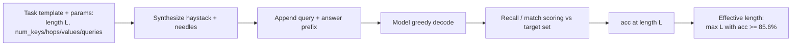

# RULER: What's the Real Context Size of Your Long-Context Language Models? — Hsieh et al., 2024

> **arXiv:** 2404.06654v3 · **Venue:** COLM 2024 · **Affiliation:** NVIDIA

## TL;DR
RULER is a **synthetic, configurable long-context benchmark** that goes far beyond simple
needle-in-a-haystack (NIAH) retrieval. It defines **13 tasks in 4 categories** — retrieval,
multi-hop tracing, aggregation, and question answering — each generable at any sequence length
with controllable difficulty. Using the score of Llama2-7B at 4K as a pass bar, it introduces
the notion of **effective context length** (the longest length at which a model still clears the
bar) and shows that for almost every model the *effective* length is **far below the claimed**
one (e.g., Yi-34B claims 200K but is effective only to 32K). Near-perfect vanilla-NIAH scores
mask large failures on the harder tasks as length grows.

## Problem & motivation
The needle-in-a-haystack test (insert one fact into a long distractor text and ask for it back)
became the default long-context probe, but it only measures **surface retrieval**. The paper
identifies three gaps:

1. **Insufficient complexity.** Vanilla NIAH ignores multi-hop reasoning, aggregation across the
   whole context, and robustness to hard distractors.
2. **Claimed ≫ effective length.** Models advertise 32K–1M windows, yet accuracy collapses well
   before the advertised limit; there was no principled way to quantify the gap.
3. **No configurable, contamination-free suite.** Real-data long-context benchmarks risk train
   leakage and cannot independently vary length and task complexity.

The headline empirical fact: despite ~100% accuracy on passkey/vanilla NIAH (Appendix E,
Tables 10–11), nearly all models show **large degradation** on RULER's harder tasks as context
grows (§1).

## Key idea
Build every example **synthetically** so that sequence length, number of distractors, number of
hops, and answer multiplicity are **independent knobs**. Score by **recall-based accuracy** (the
model must emit exactly the target items), then define effective length by a fixed reference bar:

$$
L_{\text{eff}} = \max\{\, L : \operatorname{acc}(L) \ge \tau \,\}, \qquad
\tau = \operatorname{acc}_{\text{Llama2-7B}}(4\text{K}) \approx 85.6\%
$$

where $\operatorname{acc}(L)$ is a model's average accuracy over the 13 tasks at length $L$, and
$\tau$ is the reference threshold (Llama2-7B's 4K average, §4). A model "claims" length
$L_{\text{claim}}$ but is only credited with $L_{\text{eff}}$.

## How it works

### The 13 tasks across 4 categories
Each task is a template with tunable parameters (Table 2). The haystack is either Paul Graham
essays or repeated-noise sentences; needles are word→number/UUID key–value pairs.

**A. Retrieval — Needle-in-a-Haystack (4 tasks).**
- **S-NIAH (single).** One key–value needle in the haystack; query *"What is the special magic
  number for {word}?"*; value is a 7-digit number or 32-char UUID. Recall-scored.
- **MK-NIAH (multi-key).** `num_keys ∈ {2, 4, full}` — one target key plus hard distractor keys;
  the `full` setting fills the entire haystack with key–value pairs (a line-retrieval stress
  test). Model must return only the target value, ignoring distractors.
- **MV-NIAH (multi-value).** One key with `num_values = 4` distinct values scattered through the
  context; query asks for *all* values. Tests completeness (no omissions/duplicates).
- **MQ-NIAH (multi-query).** `num_queries = 4` independent needles; all must be answered.
  Accuracy drops ~15 points as queries scale 1→8 (Fig. 2).

**B. Multi-hop tracing — Variable Tracking (1 task).**
- **VT.** A coreference chain $X_1 = V,\; X_2 = X_1,\; \dots,\; X_5 = X_4$ (hops) with distractor
  chains ($Y_i$) interleaved; knobs `num_chains ∈ {1,2}`, `num_hops ∈ {2,3,4}`. Query: *"Find
  all variables assigned the value {V}"*; answer is the full set of variable names in the chain.

**C. Aggregation (2 tasks).**
- **CWE (common words extraction).** Words drawn from a discrete uniform vocabulary; 10 "common"
  words each appear 30× and many "uncommon" words appear 3× (count scales with length). Query:
  *"the 10 most common words"*. Proxy for summarization / whole-context aggregation.
- **FWE (frequent words extraction).** Words drawn from a **Zeta** distribution ($\text{freq}
  \propto \text{rank}^{-\alpha}$, $\alpha = 2.0$); the top-3 dominate. Lowering $\alpha$ flattens
  the gradient and makes the task harder.

**D. Question answering (2 tasks).**
- **QA-1 (SQuAD)** and **QA-2 (HotpotQA):** the golden paragraph is buried among distractor
  paragraphs sampled from the same dataset; length is controlled by the number of distractors.
  QA-2 requires multi-hop reasoning. These inject *real* fuzzy-matching difficulty absent from
  synthetic NIAH.


The 13 representative tasks are chosen by a **correlation analysis** over 18 candidate configs
(Fig. 5): highly correlated configs are pruned so the final suite spans the behavior space
without redundancy.


### Data-flow of a single evaluation


### Effective-length rule, precisely
- Reference bar $\tau = 85.6\%$ = Llama2-7B's average over the 13 tasks at 4K.
- Two aggregate scores weight lengths differently: **wAvg(inc)** weights *increase* with length
  (long-usage regime) and **wAvg(dec)** weights *decrease* with length (short-usage regime).
- A model's effective length is the largest tested $L \in \{4,8,16,32,64,128\}$K where its
  13-task average stays $\ge \tau$.

### Critical settings / defaults
- Lengths tested: **4K, 8K, 16K, 32K, 64K, 128K**; **500 examples per task per length**.
- Decoding: **greedy**, BFloat16, vLLM on 8×A100.
- An **answer prefix** (e.g., *"The special magic number for {word} mentioned in the provided
  text is"*) is appended to standardize output and suppress refusals.

## Training / data
RULER is an **evaluation-only** benchmark — no model training. Data is generated on the fly from
task templates; haystacks come from Paul Graham essays and repeated-noise sentences, and QA tasks
reuse SQuAD v1.1 and HotpotQA passages. This makes it **contamination-resistant** and infinitely
re-generable at any length.

## Results
Main leaderboard (Table 3), weighted averages over the 13 tasks; effective vs. claimed length:

| Model | Claimed | Effective | wAvg (inc) | wAvg (dec) |
|---|---|---|---|---|
| Gemini-1.5-Pro | 1M | >128K | 95.5 | 96.1 |
| GPT-4 | 128K | 64K | 89.0 | 94.1 |
| GLM4-9B | 1M | 64K | 88.0 | 91.7 |
| Llama3.1-70B | 128K | 64K | 85.5 | 93.7 |
| Llama3.1-8B | 128K | 32K | 85.4 | 91.3 |
| Yi-34B | 200K | 32K | — | — |
| LongAlpaca-13B | 32K | <4K | 24.7 | — |

Source: Table 3. All figures (per §4).

Key findings:
- **Effective ≪ claimed for most models.** Only ~half of models claiming ≥32K hold the 85.6% bar
  at 32K (underlined entries, Table 3). Yi-34B: claim 200K, effective 32K (168K gap); Qwen2 and
  Command-R-plus: claim 128K, effective 32K.
- **Vanilla NIAH is misleadingly easy.** Nearly all models score ~100% on passkey/vanilla NIAH
  (Tables 10–11) yet degrade sharply on RULER's harder tasks with length.
- **Bigger training window ≠ better.** Models trained on longer contexts (LWM-1M, Llama3-1M) do
  not dominate; some rank below models trained on shorter windows (§6).
- **Failure modes.** Copying from the one-shot example (>80% of Yi-34B CWE outputs at 128K),
  incomplete multi-value retrieval, distractor confusion in MK-NIAH, and rising hallucination in
  QA as context grows (§5).
- **Non-Transformer architectures (RWKV, Mamba)** lag the Llama2-7B baseline substantially
  (Fig. 4).

## Limitations & follow-ups
- **Synthetic ≠ natural.** Recall-based synthetic tasks may not perfectly predict real-world
  long-document utility; the QA tasks partly bridge this.
- **Threshold is a design choice.** The 85.6% Llama2-7B-at-4K bar is a convention; a different
  reference shifts every effective-length number.
- **Complementary real-data suites.** Pairs naturally with
  [LongBench](benchmark_2023_longbench.md) (bilingual real tasks) and the domain-specific
  [LongHealth](benchmark_2024_longhealth.md); RULER supplies the controllable length ladder those
  lack. Successor **RULER v2** extends the task pipeline (see repo branch `rulerv2-ns`).

## Links
- **arXiv:** [abs](https://arxiv.org/abs/2404.06654) · [html](https://arxiv.org/html/2404.06654v3) · [pdf](https://arxiv.org/pdf/2404.06654)
- **Code:** https://github.com/NVIDIA/RULER
- **Hugging Face:** — (data generated from templates in-repo)
- **Project page:** —
- **Venue:** COLM 2024
- **BibTeX:**
  ```bibtex
  @article{hsieh2024ruler,
    title={RULER: What's the Real Context Size of Your Long-Context Language Models?},
    author={Hsieh, Cheng-Ping and Sun, Simeng and Kriman, Samuel and Acharya, Shantanu and Rekesh, Dima and Jia, Fei and Zhang, Yang and Ginsburg, Boris},
    journal={arXiv preprint arXiv:2404.06654},
    year={2024}
  }
  ```
- **Related / successor papers:** [LongBench](benchmark_2023_longbench.md) ·
  [LongHealth](benchmark_2024_longhealth.md) · [GSM8K](benchmark_2021_gsm8k.md) ·
  thread: [Long-context benchmarks & datasets](../context/benchmarks/benchmarks.md)
