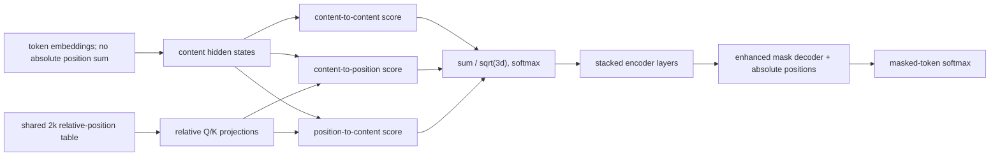
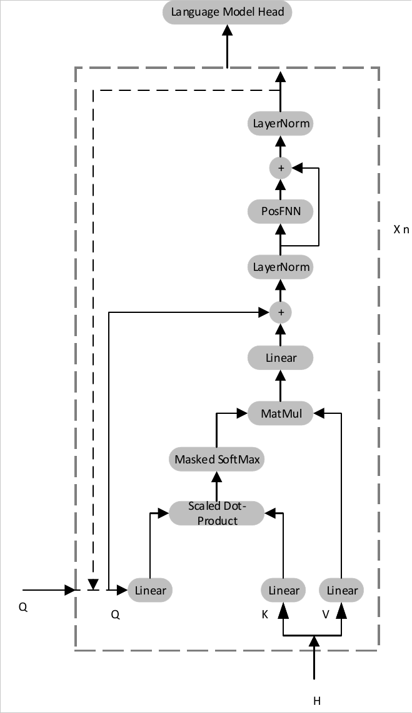
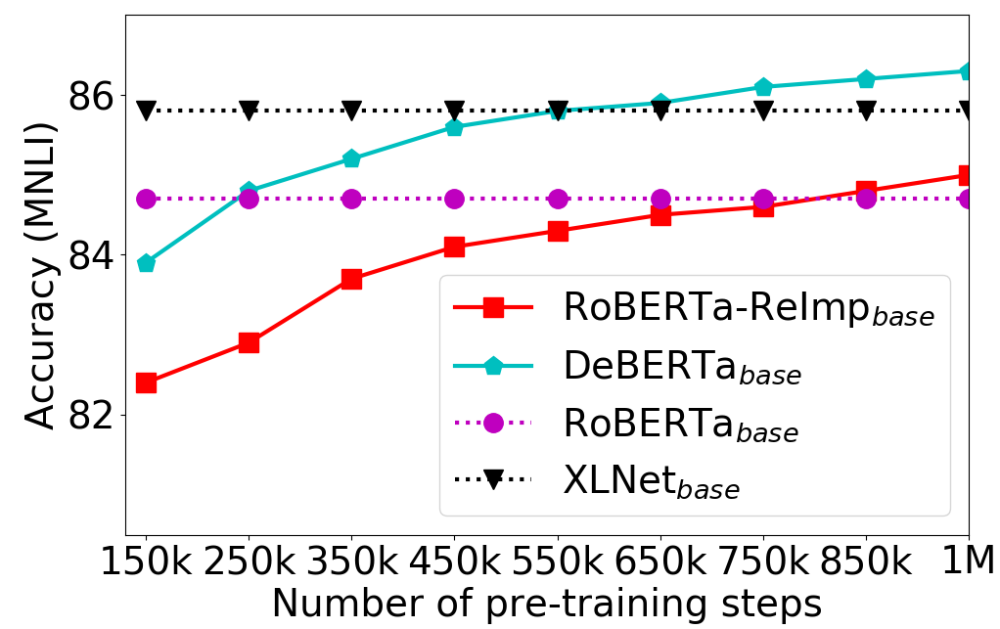
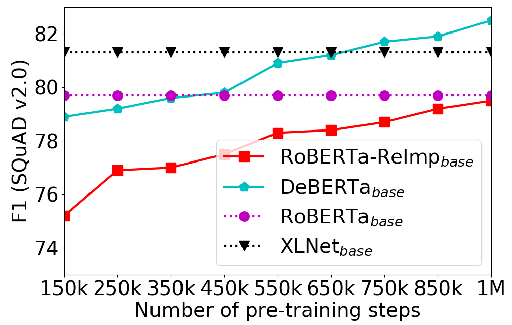
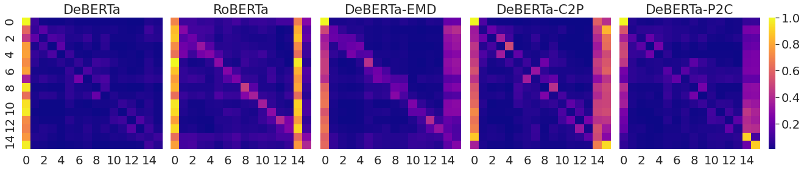

# DeBERTa — He et al., 2020

> **arXiv:** 2006.03654v6 · **Venue:** ICLR 2021 · **Affiliation:** Microsoft Dynamics 365 AI and Microsoft Research

## TL;DR
DeBERTa represents token content and relative position separately inside self-attention instead of adding absolute position embeddings to token embeddings at the input. Its disentangled score contains content-to-content, content-to-position, and position-to-content terms, while an enhanced mask decoder injects absolute position only when reconstructing masked tokens. At large scale, these changes improve language understanding over RoBERTa with less pretraining data; a 1.5B-parameter model with scale-invariant fine-tuning became the first single model reported to exceed the SuperGLUE human baseline.

## Problem & motivation
BERT and RoBERTa add token and absolute-position embeddings before the first layer. Every later query and key therefore mixes **what** a token is with **where** it occurs. The authors argue that dependency strength should instead depend explicitly on content and relative displacement: “deep” and “learning” interact differently when adjacent than when separated, even though their lexical content is unchanged.

Relative-position Transformers existed before DeBERTa, but commonly folded position into one side of attention or omitted one direction of the interaction. DeBERTa constructs distinct content-to-position and position-to-content terms. It also distinguishes the role of relative positions in contextual encoding from absolute positions in output decoding: relative offsets can model dependencies, while absolute order can still help predict a masked word's syntactic role.

## Key idea
For content vectors $H_i,H_j$ and directed relative-position vectors $P_{i\mid j},P_{j\mid i}$, a fully disentangled score could be

$$
A_{ij}=H_iH_j^\top+H_iP_{j\mid i}^\top+P_{i\mid j}H_j^\top+P_{i\mid j}P_{j\mid i}^\top.
$$

DeBERTa retains the first three terms and omits position-to-position, which provided little useful information. After projection, its implemented score is

$$
\widetilde A_{ij}
=Q_i^c(K_j^c)^\top
+Q_i^c(K_{\delta(i,j)}^r)^\top
+Q_{\delta(j,i)}^r(K_j^c)^\top.
$$

Here $Q^c,K^c\in\mathbb R^{N\times d}$ are content queries and keys for sequence length $N$ and head width $d$; $Q^r,K^r\in\mathbb R^{2k\times d}$ are projected relative-position queries and keys; and $k$ is the maximum represented relative distance. The three summed components change attention normalization to

$$
H_o=\operatorname{softmax}\!\left(\frac{\widetilde A}{\sqrt{3d}}\right)V^c.
$$

The clipped relative index is

$$
\delta(i,j)=
\begin{cases}
0,&i-j\le-k,\\
2k-1,&i-j\ge k,\\
i-j+k,&\text{otherwise}.
\end{cases}
$$

Thus every offset maps into one of $2k$ shared embedding rows. Directed indexing matters: query content attending to key position uses $\delta(i,j)$, while query position attending to key content uses $\delta(j,i)$.

## How it works

### Disentangled attention

For each head, content projections are produced from current hidden states, while relative projections come from one table shared across layers. Efficient gather operations select the $N\times N$ offset rows without materializing an $N\times N\times d$ tensor; relative embedding storage is $O(kd)$ rather than $O(N^2d)$. The value path remains content-based.

The position-to-content term is not redundant with content-to-position because attention is directional. One asks how the query token's content relates to the key's offset; the other asks how the query's offset relates to the key token's content. Table 4 shows that removing either degrades every reported downstream task, with larger losses on SQuAD 2.0 and RACE.

### Enhanced mask decoder

The encoder deliberately avoids absolute positions at its input, but masked-token decoding can need absolute information. The enhanced mask decoder (EMD) adds absolute-position embeddings after the contextual stack and applies two weight-shared decoder layers before the MLM softmax. This keeps the main encoder focused on content and relative relations while exposing absolute order at the point where a vocabulary prediction is made.

### Architecture and cost

| Model | Layers | Hidden | Heads | FFN | Parameters |
|---|---:|---:|---:|---:|---:|
| Base | 12 | 768 | 12 | 3072 | 134M |
| Large | 24 | 1024 | 16 | 4096 | about 350M |
| 1.5B | 48 | 1536 | 24 | 6144 | 1.5B |

The base/large position projections add approximately 12–13% parameters and about 30% computation over BERT/RoBERTa, while EMD adds about 2–3% because it processes masked positions. The 1.5B model shares content and relative query/key projection matrices to remove most extra parameters, adds a convolution alongside the first Transformer layer for local n-grams, and uses a 128K vocabulary.

### Scale-invariant fine-tuning

For the 1.5B SuperGLUE experiments, DeBERTa adds scale-invariant fine-tuning (SiFT), a virtual-adversarial method. Embeddings are normalized before a small adversarial perturbation so the effective perturbation does not depend on widely varying embedding norms. The paper applies SiFT only at this scale and does not present it as part of the base architectural ablation.

### Attention behavior and convergence

## Training / data

Base and large models use 78GB after deduplication: Wikipedia (12GB), BooksCorpus (6GB), OpenWebText (38GB), and Stories (31GB). The 1.5B run adds CC-News and reaches approximately 160GB. The original controlled models use dynamic span masking of 15% of tokens with spans up to three tokens and MLM pretraining; later appendices also evaluate RTD, which became the focus of [DeBERTa-v3](bert-objective_2021_deberta-v3.md).

For the large model, the reported recipe is batch size 2,048, peak learning rate $2\times10^{-4}$, 10K warmup steps, one million updates, Adam $\beta_1=0.9$, $\beta_2=0.999$, $\epsilon=10^{-6}$, weight decay 0.01, and gradient clipping 1.0. Six DGX-2 machines (96 V100 GPUs) train for about 20 days, approximately 18K GPU-hours. This processes about two billion examples, roughly half the sequence count of the comparable RoBERTa recipe.

Downstream searches use learning rates from $5\times10^{-6}$ to $10^{-5}$, batches 16–64, warmup 50–1,000 steps, and at most ten epochs. A task typically takes one to two hours on a DGX-2 node. SiFT and larger-scale ensembling are reserved for the strongest leaderboard systems.

## Results

### Base and large models

| Benchmark | DeBERTa-large | RoBERTa-large | ELECTRA-large | Source |
|---|---:|---:|---:|---|
| GLUE dev average | **90.00** | 88.82 | 89.46 | Table 1 |
| MNLI matched/mismatched | **91.1/91.1** | 90.2/90.2 | 90.9/n/a | Table 1 |
| QNLI | **95.3** | 93.9 | 95.0 | Table 1 |
| RTE | **88.3** | 86.6 | 88.0 | Table 1 |
| SQuAD 1.1 F1/EM | **95.5/90.1** | 94.6/88.9 | n/a | Table 2 |
| SQuAD 2.0 F1/EM | **90.7/88.0** | 89.4/86.5 | n/a | Table 2 |
| RACE accuracy | **86.8** | 83.2 | n/a | Table 2 |

DeBERTa-base reaches 88.8 MNLI-m, 93.1/87.2 SQuAD 1.1 F1/EM, and 86.2/83.1 SQuAD 2.0 F1/EM versus RoBERTa-base's 87.6, 91.5/84.6, and 83.7/80.5 (Table 3).

### Component ablation

| Variant | MNLI-m | SQuAD 1.1 F1 | SQuAD 2.0 F1 | RACE |
|---|---:|---:|---:|---:|
| Full DeBERTa-base | **86.3** | **92.1** | **82.5** | **71.7** |
| without EMD | 86.1 | 91.8 | 81.3 | 70.3 |
| without content-to-position | 85.9 | 91.6 | 81.3 | 69.3 |
| without position-to-content | 86.0 | 91.7 | 80.8 | 69.6 |
| without EMD and C2P | 85.8 | 91.5 | 80.3 | 68.1 |
| without EMD and P2C | 85.8 | 91.3 | 80.2 | 68.5 |

Per Table 4, all three additions contribute, and the position terms matter especially on reading comprehension. Removing components together produces larger losses than removing EMD alone.

### 1.5B and SuperGLUE

| System | SuperGLUE test average | Notes | Source |
|---|---:|---|---|
| Human baseline | 89.8 | benchmark estimate | Table 5 |
| T5-11B | 89.3 | much larger model | Table 5 |
| DeBERTa-1.5B + SiFT | **89.9** | single model | Table 5 |
| DeBERTa ensemble | **90.3** | multiple models | Table 5 |

The 89.9 result was the first reported single-model score above the SuperGLUE human baseline as of December 2020. It is an aggregate benchmark milestone, not evidence that the model exceeds people on every task: per-task scores remain mixed.

## Limitations & follow-ups

- Disentangled attention costs more than ordinary self-attention. The unshared base/large designs add parameters and roughly 30% computation, so quality gains are not free.
- Relative positions are clipped at $k$; stacking expands the theoretical receptive range but does not remove dense attention's quadratic memory or compute.
- EMD benefits masked-token pretraining but is not directly retained as a general downstream component, making its contribution objective-specific.
- The 1.5B milestone combines scale, extra data, architectural modifications, SiFT, and task tuning; it does not isolate disentangled attention alone.
- SiFT is evaluated narrowly, and the authors explicitly leave a comprehensive study to future work.
- Data and evaluation are mostly English, and large-scale reproduction requires substantial hardware.
- The v6 paper includes evolving objectives and large-model modifications added after the original submission. [DeBERTa-v3](bert-objective_2021_deberta-v3.md) gives the cleaner successor treatment of RTD and embedding gradients.

## Links

- **Review thread:** [BERT-family overview](../bert/overview.md#161-from-masked-bidirectionality-to-stronger-encoder-objectives)
- **arXiv:** [abs](https://arxiv.org/abs/2006.03654v6) · [html](https://arxiv.org/html/2006.03654v6) · [pdf](https://arxiv.org/pdf/2006.03654v6)
- **Code:** [microsoft/DeBERTa](https://github.com/microsoft/DeBERTa)
- **Hugging Face:** [microsoft/deberta-large](https://huggingface.co/microsoft/deberta-large)
- **Project page:** —
- **Blog posts:** [Microsoft Research](https://www.microsoft.com/en-us/research/blog/deberta-decoding-enhanced-bert-with-disentangled-attention-2/)
- **Talks / videos:** —
- **OpenReview / venue page:** [ICLR 2021](https://openreview.net/forum?id=XPZIaotutsD)
- **Papers-with-Code:** [DeBERTa](https://paperswithcode.com/method/deberta)
- **BibTeX:** [OpenReview citation](https://openreview.net/forum?id=XPZIaotutsD)
- **Related / successor papers:** [BERT](bert-encoder_2018_bert-pretraining.md) · [RoBERTa](bert-training_2019_roberta.md) · [ELECTRA](bert-objective_2020_electra.md) · [DeBERTa-v3](bert-objective_2021_deberta-v3.md)
