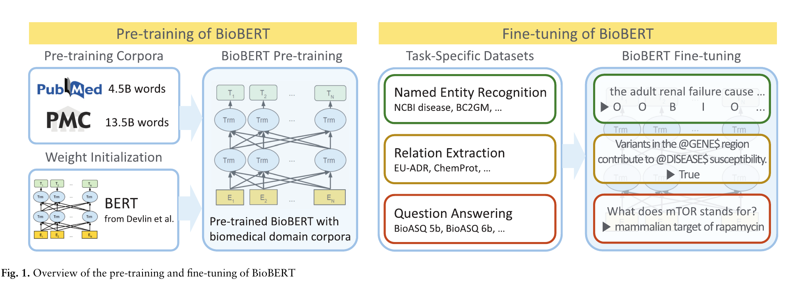
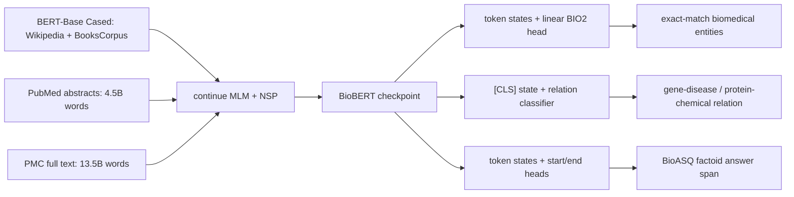
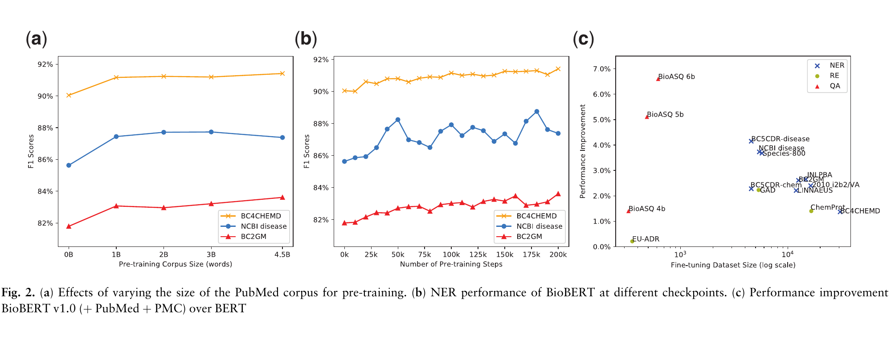

# BioBERT — Lee et al., 2019

> **arXiv:** 1901.08746v4 · **Venue:** Bioinformatics 36(4), 2020 · **Affiliations:** Korea University and NAVER

## TL;DR
BioBERT adapts BERT-Base to biomedical language by continuing pretraining on up to 4.5B words of PubMed abstracts and 13.5B words of PMC full text while retaining BERT's architecture and cased WordPiece vocabulary. With only linear task heads, it improves over general-domain BERT across nine biomedical NER datasets, three relation-extraction datasets, and three BioASQ factoid QA sets. The paper's ablations show that gains generally increase with biomedical corpus size and continued-pretraining steps, establishing domain-adaptive pretraining as a strong, economical alternative to training a biomedical encoder from scratch.

## Problem & motivation
Biomedical literature was already growing by more than 3,000 peer-reviewed articles per day when this work was written, and PubMed contained roughly 29 million articles in January 2019. Extracting diseases, chemicals, genes, relations, and answers from that volume requires automated text mining, but biomedical supervision is specialized and expensive.

The original BERT offers a reusable bidirectional encoder, yet its Wikipedia and BooksCorpus pretraining distribution differs sharply from biomedical writing. Biomedical text contains specialist words and symbols such as `BRCA1`, `c.248T>C`, `transcriptional`, and `antimicrobial`, as well as dense relationships between genes, diseases, chemicals, and phenotypes. A general model can tokenize these strings into subwords, but it has not learned their biomedical usage from its pretraining corpus.

Earlier biomedical systems commonly paired task-specific LSTMs, CRFs, character encoders, dictionaries, or ensembles with static embeddings trained on PubMed or PMC. This made each task a separate architecture problem. BioBERT asks a simpler question: can one general BERT checkpoint be continued on unlabeled biomedical text and then reused with minimal heads for named entity recognition (NER), relation extraction (RE), and question answering (QA)?

The design deliberately preserves BERT's original cased WordPiece vocabulary. This makes continued training cheap and maintains checkpoint compatibility, but it also means BioBERT tests **corpus adaptation**, not a biomedical tokenizer or a from-scratch biomedical model. That distinction later motivated models such as PubMedBERT.

## Key idea
BioBERT is BERT-Base initialized from the public checkpoint and then trained longer on biomedical corpora. For WordPiece sequence $X=(x_1,\ldots,x_n)$, its 12-layer, width-768, 12-head Transformer produces

$$
H^{(0)}=E_{\mathrm{tok}}(X)+E_{\mathrm{pos}}+E_{\mathrm{seg}},
\qquad
H^{(\ell)}=\operatorname{TransformerBlock}_{\ell}(H^{(\ell-1)}),
\quad \ell=1,\ldots,12.
$$

No biomedical module is inserted. Continued pretraining retains BERT's masked-language-model and next-sentence-prediction losses:

$$
\mathcal{L}_{\mathrm{BioBERT}}
=\mathcal{L}_{\mathrm{MLM}}+\mathcal{L}_{\mathrm{NSP}}
=-\sum_{i\in\mathcal{M}}\log p(x_i\mid\widetilde X)
-\log p(y_{\mathrm{NSP}}\mid h_{\mathrm{[CLS]}}).
$$

Here $\mathcal{M}$ is the set of masked positions, $\widetilde X$ is the corrupted biomedical input, $y_{\mathrm{NSP}}$ identifies whether two segments are consecutive, and $h_{\mathrm{[CLS]}}\in\mathbb{R}^{768}$ is the final classification-token state. The scientific contribution is the transfer schedule and its evaluation: first learn broad syntax and semantics from general text, then shift the same parameter space toward biomedical terminology and relations using unlabeled PubMed/PMC text.

The final paper distinguishes four important checkpoints:

| Checkpoint | Biomedical continuation | Steps |
|---|---|---:|
| BioBERT v1.0 + PubMed | 4.5B-word PubMed abstract corpus | 200K |
| BioBERT v1.0 + PMC | 13.5B-word PMC full-text corpus | 270K |
| BioBERT v1.0 + PubMed + PMC | PubMed, then PMC | 200K + 270K |
| BioBERT v1.1 + PubMed | PubMed abstract corpus | 1M |

All start from BERT-Base Cased, itself pretrained for 1M steps on Wikipedia and BooksCorpus. BioBERT v1.1 is not simply v1.0 plus another corpus: it is the longer PubMed-only run used for many final headline results.

## How it works

### 1. Preserve BERT's interface

BioBERT uses the BERT-Base Cased architecture and vocabulary without modification. WordPiece can represent unseen biomedical strings through fragments, for example `Immunoglobulin` as `I ##mm ##uno ##g ##lo ##bul ##in`. The authors choose compatibility over a new vocabulary: all general-domain parameters, including token embeddings, can be reused and biomedical checkpoints remain interchangeable with BERT task code. Cased models perform slightly better in their downstream experiments.

### 2. Continue pretraining on biomedical text

Initialize from the 1M-step BERT-Base checkpoint. Construct BERT pretraining examples from PubMed abstracts, PMC full-text articles, or both, and continue joint MLM/NSP optimization. Maximum sequence length is fixed at 512 rather than using BERT's shorter-first curriculum. The v1.0 combined model trains on PubMed for 200K steps and PMC for 270K; v1.1 instead runs 1M PubMed steps.

The paper says other pretraining hyperparameters, including learning-rate scheduling, follow BERT unless stated otherwise. It explicitly reports batch size 192, giving $192\times512=98{,}304$ WordPiece positions per update, but does not restate every inherited BERT optimizer value.

### 3. Fine-tune biomedical NER

Apply one linear layer to each final token state $h_i$ and predict BIO2 tags:

$$
p(y_i\mid X)=\operatorname{softmax}(W_{\mathrm{NER}}h_i+b_{\mathrm{NER}}).
$$

Unlike many prior biomedical systems, the paper adds no BiLSTM or CRF. WordPiece outputs are converted back to word/entity spans for entity-level exact-match precision, recall, and F1. The nine evaluations cover diseases, drugs/chemicals, genes/proteins, and species.

### 4. Fine-tune relation extraction

Replace the two target mentions with typed placeholders such as `@GENE$` and `@DISEASE$`. This anonymizes surface forms while preserving argument types and sentence context. Feed $h_{\mathrm{[CLS]}}$ to a linear softmax classifier:

$$
p(r\mid X)=\operatorname{softmax}(W_{
\mathrm{RE}}h_{\mathrm{[CLS]}}+b_{\mathrm{RE}}).
$$

GAD and EU-ADR classify gene-disease relations; CHEMPROT is multiclass protein-chemical relation classification. Datasets without fixed test sets use 10-fold cross-validation.

### 5. Fine-tune extractive biomedical QA

Use the standard BERT/SQuAD span head. Two learned vectors score each token as an answer start or end:

$$
p_s(i\mid X)=\operatorname{softmax}_i(w_s^\top h_i),
\qquad
p_e(j\mid X)=\operatorname{softmax}_j(w_e^\top h_j).
$$

BioASQ factoid examples are transformed into SQuAD format and models receive an intermediate SQuAD fine-tuning stage before BioASQ. Approximately 30% of BioASQ factoid questions have no exact answer string in the supplied passage, so the authors remove those examples from training. At inference, ranked answer spans are evaluated with strict accuracy, lenient accuracy, and mean reciprocal rank (MRR).

## Training / data

### Corpora and checkpoints

| Corpus | Size | Domain | Role | Source |
|---|---:|---|---|---|
| English Wikipedia | 2.5B words | general | inherited BERT pretraining | Table 1 |
| BooksCorpus | 0.8B words | general | inherited BERT pretraining | Table 1 |
| PubMed abstracts | 4.5B words | biomedical | BioBERT continuation | Table 1 |
| PMC full text | 13.5B words | biomedical | BioBERT continuation | Table 1 |

The main continuation setup uses eight NVIDIA V100 32GB GPUs on NSML, maximum length 512, and batch size 192. BioBERT v1.0 + PubMed + PMC takes more than 10 days for 470K updates; BioBERT v1.1 + PubMed takes nearly 23 days for 1M updates (§4.2). BERT-Large was attempted but abandoned because of computational cost.

Figure 2(a) varies PubMed exposure from zero to 4.5B words while holding v1.0 training at 200K steps. One billion words already yields a large gain on NCBI Disease, BC2GM, and BC4CHEMD; performance mostly improves through 4.5B, though NCBI Disease peaks earlier and varies slightly. Figure 2(b) saves checkpoints through 200K steps and shows an overall upward trend with substantial dataset-specific noise. Corpus size and optimization duration both matter, but neither is strictly monotonic on every benchmark.

### Downstream data and search

| Family | Datasets | Sizes reported by paper |
|---|---|---|
| Disease NER | NCBI Disease, 2010 i2b2/VA, BC5CDR | 6,881; 19,665; 12,694 annotations |
| Chemical NER | BC5CDR, BC4CHEMD | 15,411; 79,842 annotations |
| Gene/protein NER | BC2GM, JNLPBA | 20,703; 35,460 annotations |
| Species NER | LINNAEUS, Species-800 | 4,077; 3,708 annotations |
| Relation extraction | GAD, EU-ADR, CHEMPROT | 5,330; 355; 10,031 relations |
| Factoid QA | BioASQ 4b, 5b, 6b | 327/161; 486/150; 618/161 train/test questions |

Each downstream run uses one Titan Xp with 12GB memory. The search chooses batch size from $\{10,16,32,64\}$ and learning rate from $\{5\times10^{-5},3\times10^{-5},10^{-5}\}$. RE and QA fine-tuning take less than an hour; NER generally needs more than 20 epochs to peak (§4.2). The paper does not publish a complete per-dataset hyperparameter table, seed count, or variance.

NER uses established splits, except the authors warn that their LINNAEUS and Species-800 splits may differ from prior work because the earlier splits were unavailable. The preprocessed NCBI Disease corpus also removes duplicate training articles and therefore has fewer annotations than the original. These details affect direct score comparisons.

## Results

### Named entity recognition

| Dataset / entity type | BERT F1 | Best BioBERT F1 | Checkpoint | Prior SOTA | Source |
|---|---:|---:|---|---:|---|
| NCBI Disease / disease | 85.63 | **89.71** | v1.1 + PubMed | 88.60 | Table 6 |
| 2010 i2b2/VA / disease | 84.06 | **86.73** | v1.1 + PubMed | 86.84 | Table 6 |
| BC5CDR / disease | 82.41 | **87.15** | v1.1 + PubMed | 86.23 | Table 6 |
| BC5CDR / chemical | 91.16 | **93.47** | v1.1 + PubMed | 93.31 | Table 6 |
| BC4CHEMD / chemical | 90.04 | **92.36** | v1.1 + PubMed | 91.14 | Table 6 |
| BC2GM / gene-protein | 81.79 | **84.72** | v1.1 + PubMed | 81.69 | Table 6 |
| JNLPBA / gene-protein | 74.94 | **77.59** | v1.0 + PubMed + PMC | 78.58 | Table 6 |
| LINNAEUS / species | 87.60 | **89.81** | v1.0 + PubMed + PMC | 93.54 | Table 6 |
| Species-800 / species | 71.63 | **75.31** | v1.0 + PubMed + PMC | 74.98 | Table 6 |

Every BioBERT variant improves over BERT on every NER dataset. The best checkpoint varies: the longer PubMed-only v1.1 run leads six rows, while v1.0 PubMed+PMC leads JNLPBA, LINNAEUS, and Species-800. BioBERT beats the imported prior SOTA on six of nine datasets and improves the paper's micro-averaged prior-SOTA F1 by 0.62 (§4.3). It still trails specialized prior systems on i2b2/VA, JNLPBA, and LINNAEUS.

### Relation extraction

| Dataset | BERT F1 | Best BioBERT F1 | Checkpoint | Prior SOTA | Source |
|---|---:|---:|---|---:|---|
| GAD | 79.29 | **81.61** | v1.0 + PubMed | 83.93 | Table 7 |
| EU-ADR | 84.62 | **86.51** | v1.0 + PMC | 85.34 | Table 7 |
| CHEMPROT | 73.74 | **76.46** | v1.1 + PubMed | 64.10 | Table 7 |

BioBERT leads BERT on all three datasets, but no single continuation corpus wins all of them. It exceeds prior SOTA on EU-ADR and CHEMPROT but not GAD. Using each model's best row, the paper reports a micro-average BioBERT improvement of 2.80 F1 over prior systems (§4.3). Since GAD and EU-ADR use cross-validation and the imported baselines have different architectures, these are benchmark comparisons rather than controlled retrainings.

### Biomedical question answering

| Dataset | Metric | BERT | Best BioBERT | Checkpoint | Prior SOTA | Source |
|---|---|---:|---:|---|---:|---|
| BioASQ 4b | MRR | 33.77 | **35.17** | v1.0 + PubMed + PMC | 23.52 | Table 8 |
| BioASQ 5b | MRR | 44.27 | **51.64** | v1.1 + PubMed | 47.24 | Table 8 |
| BioASQ 6b | MRR | 40.88 | **48.43** | v1.1 + PubMed | 27.84 | Table 8 |

BioBERT establishes the best reported MRR on all three factoid sets. Micro-averaging across them, v1.1 reaches **38.77 strict accuracy, 53.81 lenient accuracy, and 44.77 MRR** (§4.3). The abstract reports a 12.24-point MRR improvement over previous SOTA. This pipeline includes SQuAD supervision and excludes unanswerable training questions, so the result is not produced by biomedical language-model pretraining alone.

Figure 2(c) plots BioBERT v1.0 + PubMed + PMC improvement over BERT against downstream dataset size. All 15 points are nonnegative. QA gains are largest despite tiny task datasets, while RE gains are smaller and variable; this is suggestive evidence that domain pretraining helps low-resource adaptation, not a controlled scaling law because task, metric, and dataset size change together.

## Limitations & follow-ups

- BioBERT keeps BERT's general-domain WordPiece vocabulary. This preserves compatibility but fragments biomedical terms heavily and does not test whether a domain-built vocabulary is better. [SciBERT](bert-domain_2019_scibert.md) and later PubMedBERT make that comparison more directly.
- All checkpoints inherit BERT-Base's general-domain weights; the paper does not compare continued pretraining with a biomedical model trained from scratch. Its conclusion is specifically about domain adaptation, not the globally optimal biomedical pretraining strategy.
- PubMed abstracts and PMC articles represent published biomedical literature, not clinical notes, patient language, coding systems, or current knowledge after the corpus snapshot. Deployment in clinical settings is outside the paper's evidence.
- BERT's 512-token limit prevents document-scale modeling of full papers even though PMC full text supplies pretraining data. Long-distance evidence is split across examples.
- The main tables select the best among differently trained BioBERT variants per dataset. Corpus effects are not uniform: PubMed, PMC, their sequence, and longer PubMed training win different tasks, and some curves in Figure 2 fluctuate.
- QA removes roughly 30% of training questions whose answer string is absent from the passage and adds SQuAD fine-tuning. This narrows BioASQ to extractive, answerable factoids and does not cover yes/no, list, summary, or retrieval quality.
- Reported prior-SOTA comparisons are heterogeneous. Some baselines use ensembles, silver data, character models, or unavailable splits; GAD/EU-ADR use cross-validation; LINNAEUS and Species-800 may use different splits. The controlled BERT-versus-BioBERT comparison is stronger evidence than the SOTA labels.
- The paper reports hyperparameter search sets but not every selected setting, random-seed variance, confidence intervals, preprocessing version, or all inherited pretraining details. Reproducing exact table values relies on released code, checkpoints, and prepared datasets.
- Pretraining v1.1 takes nearly 23 days on eight V100 GPUs. Continued training is cheaper than starting over, but the paper does not report energy, inference throughput, parameter count changes, or accuracy per unit compute.
- The original code targets TensorFlow 1 and Python 3.7 or earlier. A PyTorch port and Hugging Face checkpoints exist, but the maintained v1.2 checkpoint adds an LM head and should not be mistaken for the paper's evaluated v1.1 model.

The paper proposed future BERT-Base/Large models trained from scratch on PubMed with biomedical WordPiece vocabularies. [PubMedBERT](https://arxiv.org/abs/2007.15779) subsequently tested that direction, while clinical-domain variants such as [ClinicalBERT](https://aclanthology.org/W19-1909/) continued adaptation on MIMIC clinical notes.

## Links

- **arXiv:** [abs](https://arxiv.org/abs/1901.08746v4) · [pdf](https://arxiv.org/pdf/1901.08746v4)
- **Code:** [dmis-lab/biobert](https://github.com/dmis-lab/biobert) · [PyTorch port](https://github.com/dmis-lab/biobert-pytorch)
- **Hugging Face:** [dmis-lab/biobert-base-cased-v1.2](https://huggingface.co/dmis-lab/biobert-base-cased-v1.2) · [BioBERT collection](https://huggingface.co/collections/dmis-lab/biobert)
- **Project page:** [official repository and checkpoints](https://github.com/dmis-lab/biobert)
- **Blog posts:** —
- **Talks / videos:** —
- **OpenReview / venue page:** [Bioinformatics](https://doi.org/10.1093/bioinformatics/btz682) · [Europe PMC](https://europepmc.org/articles/PMC7703786/)
- **Papers-with-Code:** [BioBERT](https://paperswithcode.com/paper/biobert-a-pre-trained-biomedical-language)
- **BibTeX:** [DBLP record](https://dblp.org/rec/journals/bioinformatics/LeeYKKS0K20.html)
- **Related / successor papers:** [BERT](bert-encoder_2018_bert-pretraining.md) · [SciBERT](bert-domain_2019_scibert.md) · [PubMedBERT](https://arxiv.org/abs/2007.15779) · [ClinicalBERT](https://aclanthology.org/W19-1909/)