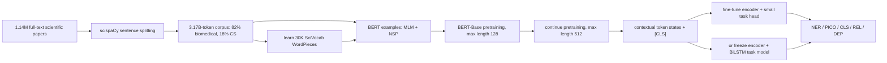

# SciBERT — Beltagy et al., 2019

> **arXiv:** 1903.10676v3 · **Venue:** EMNLP-IJCNLP 2019 · **Affiliation:** Allen Institute for Artificial Intelligence

## TL;DR
SciBERT keeps the BERT-Base architecture and pretraining objectives but trains on 1.14 million full-text scientific papers totaling 3.17 billion tokens. Its domain-built 30K WordPiece vocabulary overlaps BERT's vocabulary by only 42%, yet controlled experiments show that scientific-corpus pretraining contributes more than the tokenizer: SciVocab adds 0.60 F1 on average, while fine-tuned SciBERT beats BERT-Base by 2.11 points across scientific NLP datasets. The model established a reusable scientific encoder across biomedical and computer-science NER, PICO extraction, relation and text classification, and dependency parsing.

## Problem & motivation
Scientific NLP has an unfavorable supervision regime. Extracting entities, relations, trial outcomes, citation intent, and syntax from papers often requires annotators with domain expertise, so high-quality task labels are expensive and datasets remain small. General-domain contextual encoders reduce task-specific data needs, but the original BERT was pretrained on Wikipedia and BooksCorpus rather than scientific prose.

That domain mismatch appears at two levels. Scientific papers differ in discourse, syntax, and word distribution, while specialist terms are also poorly matched to a general WordPiece vocabulary. A term split into many fragments requires the encoder to reconstruct its meaning over more positions and consumes more of the context window. The authors report only **42% token overlap** between BERT's BaseVocab and their scientific SciVocab, evidence that the frequent reusable units differ substantially.

Before SciBERT, biomedical adaptations such as BioBERT continued BERT pretraining on biomedical text while retaining BaseVocab. SciBERT tests a broader proposition: one multi-domain scientific encoder, trained on both biomedical and computer-science full text, may transfer across many scientific tasks. It also separates three practical choices:

- fine-tune the encoder or keep its representations frozen;
- continue from BERT with BaseVocab or train from scratch with SciVocab;
- use cased or uncased text.

The paper evaluates these choices across 12 reported dataset/metric rows spanning five task families and three domain groups. Its contribution is therefore not a new Transformer mechanism but evidence about **domain-specific pretraining, vocabulary construction, and adaptation strategy**.

## Key idea
SciBERT is architecturally BERT-Base: 12 bidirectional Transformer layers, hidden width $H=768$, 12 attention heads, and approximately 110M parameters. For input WordPieces $t_1,\ldots,t_n$, the initial state at position $i$ is the sum of token, position, and segment embeddings,

$$
x_i=E_{\mathrm{tok}}(t_i)+E_{\mathrm{pos}}(i)+E_{\mathrm{seg}}(s_i),
\qquad x_i\in\mathbb{R}^{768}.
$$

The encoder maps $X^{(0)}=(x_1,\ldots,x_n)$ through 12 Transformer blocks:

$$
X^{(\ell)}=\operatorname{TransformerBlock}_{\ell}(X^{(\ell-1)}),
\qquad \ell=1,\ldots,12.
$$

Its pretraining objective is unchanged from the original BERT implementation. Masked language modeling predicts selected input tokens, while next-sentence prediction classifies whether segment $B$ follows segment $A$:

$$
\mathcal{L}_{\mathrm{SciBERT}}
=\mathcal{L}_{\mathrm{MLM}}+\mathcal{L}_{\mathrm{NSP}}
=-\sum_{i\in\mathcal{M}}\log p(t_i\mid\widetilde X)
-\log p(y_{\mathrm{NSP}}\mid h_{\mathrm{[CLS]}}).
$$

Here $\mathcal{M}$ is the set of masked positions, $\widetilde X$ is the corrupted input, $h_{\mathrm{[CLS]}}$ is the final classification-token state, and $y_{\mathrm{NSP}}$ indicates whether the second segment is the actual successor. The paper uses the original BERT code and does not report changing masking or NSP construction.

The novelty lies in the training distribution and token inventory. SciVocab is a 30,000-entry WordPiece vocabulary induced with SentencePiece from the scientific corpus. The recommended model, `scibert_scivocab_uncased`, therefore learns both its vocabulary and all model weights from scientific text rather than adapting a general-domain checkpoint.

## How it works

The paper contains no author-provided figures; its evidence is presented in tables. The diagram above reconstructs the training and evaluation flow from Sections 2–3.

### 1. Build the scientific corpus

Sample 1.14 million papers from Semantic Scholar and retain full text rather than abstracts alone. The mixture is 82% biomedical and 18% computer science. A paper averages 154 sentences and 2,769 tokens, yielding 3.17B tokens overall, close to BERT's 3.3B-token pretraining scale. Sentence segmentation uses scispaCy, which is tuned for scientific and biomedical text.

This is a multi-domain scientific corpus, not a balanced one. Biomedical text dominates by roughly 4.6 to 1, while computer-science papers provide a smaller but still substantial second domain.

### 2. Learn SciVocab

Run SentencePiece in WordPiece mode over the scientific corpus and retain 30,000 entries, matching BaseVocab's approximate size. Build separate cased and uncased vocabularies. Only 42% of entries overlap with BaseVocab, so changing the vocabulary changes the embedding rows and token boundaries throughout the corpus.

The paper trains four SciBERT variants:

| Vocabulary | Casing | Initialization | Pretraining |
|---|---|---|---|
| SciVocab | cased | from scratch | scientific corpus |
| SciVocab | uncased | from scratch | scientific corpus |
| BaseVocab | cased | corresponding BERT-Base checkpoint | continued on scientific corpus |
| BaseVocab | uncased | corresponding BERT-Base checkpoint | continued on scientific corpus |

This design permits a direct SciVocab-versus-BaseVocab comparison after scientific pretraining. It does **not** make every pair identical in training history: SciVocab models start from random weights, whereas BaseVocab models continue from BERT.

### 3. Pretrain in two length stages

Use the original BERT code, BERT-Base configuration, MLM, and NSP. Train with maximum sequence length 128 until the loss stops decreasing, then continue with maximum length 512. For a SciVocab model, the first stage takes five days and the long-sequence stage takes two days on one 8-core TPU v3. BaseVocab variants take two fewer days because they start from BERT-Base.

The paper specifies wall-clock stages rather than update counts, batch size, learning rate, warmup, masking ratio, or a numerical convergence criterion. Those missing values prevent an exact pretraining reproduction from the paper alone; the phrase “same configuration and size as BERT-Base” points implementers to the original BERT recipe.

### 4. Select casing by task

The main experiments follow BERT's convention: cased checkpoints for NER and dependency parsing, uncased checkpoints for all other tasks. The authors note that light experimentation sometimes favored uncased models even for NER. The public repository recommends SciVocab-uncased overall, but the paper's headline table mixes the task-appropriate cased and uncased variants.

### 5. Fine-tune with small task heads

For classification and relation classification, map the final `[CLS]` vector through a linear classifier:

$$
p(y\mid X)=\operatorname{softmax}(Wh_{\mathrm{[CLS]}}+b).
$$

Relation inputs surround the two given entities with special markers before encoding. For NER and PICO sequence labeling, classify each final token state and add a linear-chain conditional random field (CRF) so decoded label sequences form valid spans:

$$
s(X,Y)=\sum_{i=1}^{n}P_{i,y_i}+\sum_{i=0}^{n}A_{y_i,y_{i+1}},
\qquad
p(Y\mid X)=\frac{e^{s(X,Y)}}{\sum_{Y'}e^{s(X,Y')}}.
$$

$P_{i,y_i}$ is the linear head's emission score for label $y_i$ at position $i$, and $A$ is the learned transition matrix. The implementation must align WordPieces with dataset tokens; the paper does not spell out its subword-label projection policy.

For dependency parsing, replace the BiLSTM encoder in the deep biaffine parser with SciBERT states. Dependency arc and relation-label projections each have width 100, and biaffine attention scores candidate head–dependent pairs. This head is materially larger than the linear heads used for classification and tagging.

### 6. Compare against frozen representations

The frozen setting treats BERT or SciBERT as a feature extractor. Classification passes the token states through a two-layer BiLSTM of size 200 and applies a 200-hidden-unit MLP to the concatenated first and last BiLSTM vectors. Sequence labeling uses the same BiLSTM plus a CRF. Parsing retains the full deep biaffine parser, including its BiLSTM, with 100-dimensional arc and tag embeddings.

This comparison asks whether domain-specific contextual features alone transfer or whether updating the Transformer is important. It is not a head-matched comparison: fine-tuning uses relatively small heads, while frozen representations need the additional BiLSTM capacity.

## Training / data

### Pretraining recipe

| Setting | Value | Source |
|---|---:|---|
| Corpus | 1.14M Semantic Scholar full-text papers | §2 |
| Domain mixture | 82% biomedical, 18% computer science | §2 |
| Corpus size | 3.17B tokens | §2 |
| Average paper | 154 sentences, 2,769 tokens | §2 |
| Sentence splitter | scispaCy | §2 |
| Vocabulary | 30K WordPieces, cased and uncased | §2 |
| SciVocab/BaseVocab overlap | 42% | §2 |
| Architecture | BERT-Base | §3.3 |
| Objectives | masked LM + next-sentence prediction | §2 / BERT recipe |
| Length curriculum | maximum 128, then maximum 512 | §3.3 |
| SciVocab compute | one 8-core TPU v3 for 7 days | §3.3 |
| Stage timing | 5 days at length 128; 2 days at length 512 | §3.3 |

The paper does not publish exact pretraining update counts or optimizer hyperparameters. It trains until loss stops decreasing at length 128 before entering the 512-token stage. Results are therefore reproducible most directly from the released checkpoints rather than solely from the textual recipe.

### Fine-tuning recipe

All fine-tuned models use dropout 0.1, Adam, cross-entropy-based task losses, batch size 32, and a slanted triangular schedule equivalent to linear warmup followed by linear decay. For every dataset and model variant, the authors select the best development-set combination from:

| Hyperparameter | Search space | Source |
|---|---|---|
| Epochs | 2–5 | §3.4 |
| Learning rate | $5\times10^{-6},10^{-5},2\times10^{-5},5\times10^{-5}$ | §3.4 |
| Batch size | 32 | §3.4 |
| Dropout | 0.1 | §3.4 |

Two or four epochs at $2\times10^{-5}$ work best for most datasets. The paper reports the test result paired with the development-selected epoch count and learning rate. Table 1 values average multiple random seeds, and bold results use a 95% bootstrap confidence interval, although the number of seeds is not reported.

Frozen-feature models use Adam at $10^{-3}$, batch size 32, dropout 0.5, and development-set early stopping with patience 10. The authors did not perform an extensive frozen-model hyperparameter search.

### Evaluation suite

| Domain | Task | Datasets | Metric used in Table 1 |
|---|---|---|---|
| Biomedical | NER | BC5CDR, JNLPBA, NCBI-disease | span-level macro F1 |
| Biomedical | PICO extraction | EBM-NLP | token-level macro F1 |
| Biomedical | Dependency parsing | GENIA | LAS and UAS, excluding punctuation |
| Biomedical | Relation classification | ChemProt | micro F1 |
| Computer science | NER and relation classification | SciERC | span-level / sentence-level macro F1 |
| Computer science | Citation intent | ACL-ARC | sentence-level macro F1 |
| Multiple | Field and citation classification | Paper Field, SciCite | sentence-level macro F1 |

SciERC relation classification is given gold entities and is not comparable to the prior joint entity-and-relation extraction result. Paper Field maps titles into seven fields and has about 12,000 training examples per field.

## Results

### Main benchmark table

| Domain / task | Dataset / metric | BERT frozen | BERT fine-tuned | SciBERT frozen | SciBERT fine-tuned | Source |
|---|---|---:|---:|---:|---:|---|
| Bio NER | BC5CDR F1 | 85.08 | 86.72 | 88.73 | **90.01** | Table 1 |
| Bio NER | JNLPBA F1 | 74.05 | 76.09 | 75.77 | **77.28** | Table 1 |
| Bio NER | NCBI-disease F1 | 84.06 | 86.88 | 86.39 | **88.57** | Table 1 |
| Bio PICO | EBM-NLP F1 | 61.44 | 71.53 | 68.30 | **72.28** | Table 1 |
| Bio parsing | GENIA LAS | 90.22 | 90.33 | 90.36 | **90.43** | Table 1 |
| Bio parsing | GENIA UAS | 91.84 | 91.89 | **92.00** | 91.99 | Table 1 |
| Bio relation | ChemProt F1 | 68.21 | 79.14 | 75.03 | **83.64** | Table 1 |
| CS NER | SciERC F1 | 63.58 | 65.24 | 65.77 | **67.57** | Table 1 |
| CS relation | SciERC F1 | 72.74 | 78.71 | 75.25 | **79.97** | Table 1 |
| CS classification | ACL-ARC F1 | 62.04 | 63.91 | 60.74 | **70.98** | Table 1 |
| Multi classification | Paper Field F1 | 63.64 | 65.37 | 64.38 | **65.71** | Table 1 |
| Multi classification | SciCite F1 | 84.31 | 84.85 | 85.42 | **85.49** | Table 1 |
| **Reported average** | mixed metrics | **73.58** | **77.16** | **76.01** | **79.27** | Table 1 |

The reported average excludes GENIA UAS because LAS already represents that parsing dataset. It mixes macro F1, ChemProt micro F1, and dependency LAS, so it is a compact comparison across model variants rather than a single statistically homogeneous metric.

Fine-tuned SciBERT exceeds fine-tuned BERT-Base by **2.11 points on average**; frozen SciBERT exceeds frozen BERT by **2.43** (§4). The gain varies by domain: +1.92 fine-tuned points on biomedical tasks, +3.55 on computer-science tasks, and +0.49 on multi-domain tasks (§4.1–4.3). ACL-ARC has the largest fine-tuned improvement, 63.91 to 70.98, while the GENIA and Paper Field changes are small.

### Fine-tuning versus freezing

| Comparison | Average gain from fine-tuning | Source |
|---|---:|---|
| SciBERT, all datasets | +3.25 | §5.1 |
| BERT-Base, all datasets | +3.58 | §5.1 |
| SciBERT, computer science | +5.59 | §5.1 |
| SciBERT, biomedical | +2.94 | §5.1 |
| SciBERT, multi-domain | +0.70 | §5.1 |

Fine-tuning is usually more important than using a stronger frozen encoder: fine-tuned BERT-Base matches or beats frozen SciBERT everywhere except BC5CDR and SciCite. This supports end-to-end adaptation when compute and deployment constraints permit it.

### Vocabulary ablation

| SciVocab gain over BaseVocab after scientific pretraining | F1 points | Source |
|---|---:|---|
| All datasets | +0.60 | §5.2 |
| Biomedical | +0.76 | §5.2 |
| Computer science | +0.61 | §5.2 |
| Multi-domain | +0.11 | §5.2 |

Despite only 42% vocabulary overlap, SciVocab's average gain is modest relative to SciBERT's total advantage over BERT-Base. The authors therefore conclude that scientific-corpus pretraining is the dominant factor and the in-domain vocabulary is a useful increment. This comparison should still be read with the initialization difference in mind: BaseVocab models continue from BERT, whereas SciVocab models train from scratch.

### Comparison with reported BioBERT results

| Dataset | BioBERT | SciBERT | Source |
|---|---:|---:|---|
| BC5CDR NER | 88.85 | **90.01** | Table 2 |
| JNLPBA NER | **77.59** | 77.28 | Table 2 |
| NCBI-disease NER | **89.36** | 88.57 | Table 2 |
| ChemProt relation classification | 76.68 | **83.64** | Table 2 |

SciBERT leads the reported BioBERT numbers on BC5CDR and ChemProt, is close on JNLPBA, and trails on NCBI-disease. These values come from separate papers rather than a common rerun, and BioBERT was continued on a substantially larger 18B-token biomedical corpus.

## Limitations & follow-ups

- SciBERT inherits BERT's 512-WordPiece context limit. Most full papers are far longer, so the model cannot jointly contextualize document-scale arguments, sections, references, or distant evidence despite pretraining on full text.
- The corpus is heavily biomedical: 82% biomedical versus 18% computer science. “Scientific” performance is evaluated only on biomedical, computer-science, and two mixed classification datasets, so transfer to mathematics, physics, chemistry prose beyond ChemProt, social sciences, or patents is not established.
- The paper gives wall-clock pretraining phases but omits update count, batch size, optimizer settings, masking details, random seed, and stopping criterion. Reproducing the checkpoint from the paper alone is therefore underspecified.
- Vocabulary and initialization are not fully orthogonal. SciVocab models train from scratch; BaseVocab models continue from BERT-Base. The within-SciBERT vocabulary ablation is useful, but it does not compare equally initialized models with identical token exposure and optimization history.
- Fine-tuning selects learning rate and epoch count on each development set and averages multiple seeds, but neither per-task choices nor seed counts and variances are reported. Table 1's bolding conveys bootstrap uncertainty, not training-run variance.
- The aggregate average combines different metrics and excludes UAS. It summarizes broad transfer but has no direct task-level interpretation and weights each retained dataset row equally regardless of dataset size.
- Several “SOTA” comparisons import scores from prior systems with different architectures, auxiliary data, or task formulations. SciERC relation classification explicitly assumes gold entities and cannot be compared with the cited joint extraction model.
- The frozen and fine-tuned conditions use different task-head capacities, so their gap measures an end-to-end recipe choice rather than the isolated effect of unfreezing the same network.
- The original repository targets Python 3.6-era AllenNLP and its latest listed commit is from 2020. The released checkpoints remain directly usable through Transformers, but reproducing the historical training code may require an older environment.
- The paper proposes SciBERT-Large and alternate corpus mixtures as future work but does not evaluate either. Later domain encoders include [BioBERT](https://arxiv.org/abs/1901.08746), which continues BERT on biomedical corpora, and [PubMedBERT](https://arxiv.org/abs/2007.15779), which revisits from-scratch biomedical pretraining with an in-domain vocabulary.

## Links

- **arXiv:** [abs](https://arxiv.org/abs/1903.10676v3) · [html](https://arxiv.org/html/1903.10676v3) · [pdf](https://arxiv.org/pdf/1903.10676v3)
- **Code:** [allenai/scibert](https://github.com/allenai/scibert) (Apache-2.0)
- **Hugging Face:** [allenai/scibert_scivocab_uncased](https://huggingface.co/allenai/scibert_scivocab_uncased) · [allenai/scibert_scivocab_cased](https://huggingface.co/allenai/scibert_scivocab_cased)
- **Project page:** [GitHub README and model downloads](https://github.com/allenai/scibert)
- **Blog posts:** —
- **Talks / videos:** —
- **OpenReview / venue page:** [ACL Anthology](https://aclanthology.org/D19-1371/) · [DOI](https://doi.org/10.18653/v1/D19-1371)
- **Papers-with-Code:** [SciBERT](https://paperswithcode.com/paper/scibert-pretrained-contextualized-embeddings)
- **BibTeX:** [ACL Anthology export](https://aclanthology.org/D19-1371.bib)
- **Related / successor papers:** [BERT](bert-encoder_2018_bert-pretraining.md) · [BioBERT](https://arxiv.org/abs/1901.08746) · [PubMedBERT](https://arxiv.org/abs/2007.15779) · [Longformer](bert-long-context_2020_longformer.md)