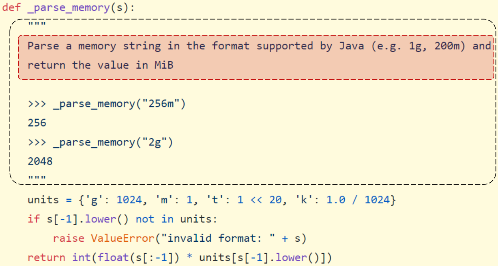
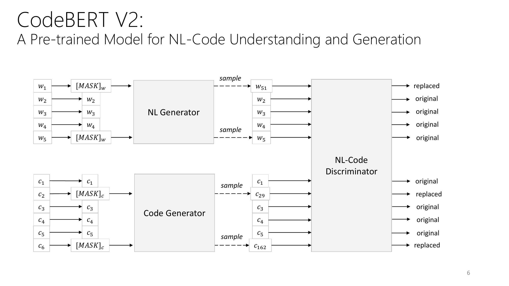
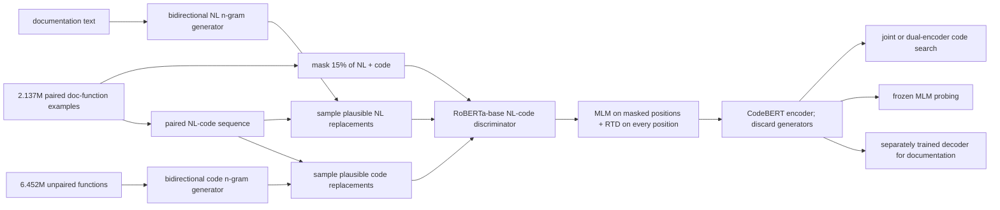
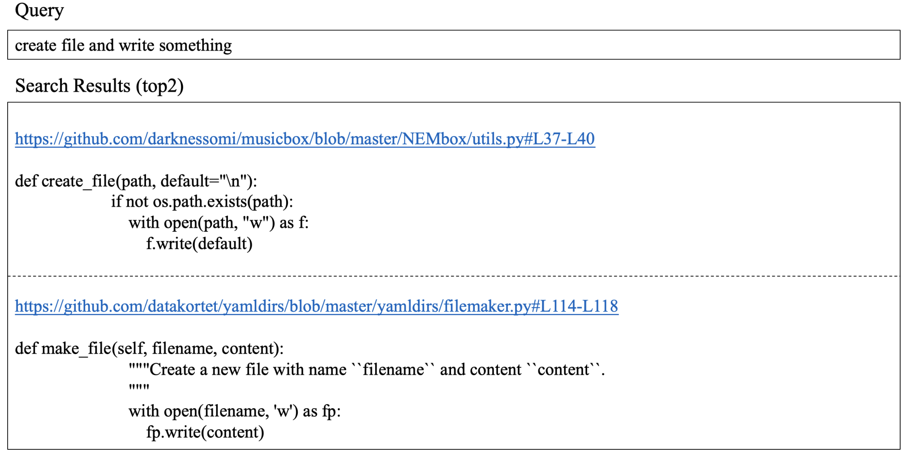
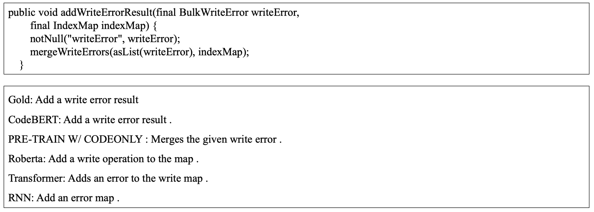

# CodeBERT — Feng et al., 2020

> **arXiv:** 2002.08155v4 · **Venue:** Findings of EMNLP 2020 · **Affiliation:** Harbin Institute of Technology, Sun Yat-sen University, Microsoft Research Asia, and Microsoft Search Technology Center Asia

## TL;DR
CodeBERT adapts RoBERTa-base into a single 125M-parameter encoder for natural language (NL) and six programming languages (PL). It combines masked language modeling on 2.1M paired documentation-function examples with replaced token detection (RTD), whose lightweight NL and code generators additionally exploit 6.4M unpaired functions. The combined checkpoint reaches 0.7603 mean reciprocal rank on six-language CodeSearchNet code search and 17.83 smoothed BLEU-4 on code documentation generation, but the ablations matter: MLM alone is stronger than RTD alone, and generation still requires a separately trained decoder.

## Problem & motivation
Source code and natural-language documentation express overlapping intent in different forms. A search query such as “create file and write something” should retrieve a function implementing that behavior even when their surface tokens differ. Conversely, a documentation generator must turn implementation details into a short natural-language summary. Before CodeBERT, neural code-search systems generally learned task-specific joint embeddings, while general encoders such as BERT and RoBERTa were pretrained almost entirely on natural language. Neither route produced one reusable multilingual representation model aligned across prose and code.

The available supervision is also asymmetric. CodeSearchNet provides millions of functions paired with docstrings, but still more functions without documentation. Standard bimodal masked language modeling can learn from the aligned pairs, yet cannot directly consume code-only examples because its cross-modal input is absent. CodeBERT's central training problem is therefore how to use scarce, informative NL-code alignment and abundant unimodal code in one encoder.

The paper treats NL and PL as two modalities and learns one model across Go, Java, JavaScript, PHP, Python, and Ruby, without an explicit language identifier (§1). It targets three questions:

1. Can bimodal pretraining improve natural-language code retrieval?
2. Can the same encoder initialize code-to-text generation, despite having no autoregressive pretraining objective?
3. What NL-PL correspondences remain visible when encoder parameters are frozen?

## Key idea
CodeBERT keeps the RoBERTa-base encoder and gives paired NL-code examples two complementary forms of supervision. MLM asks the encoder to reconstruct masked NL and code tokens. RTD first asks separate bidirectional n-gram language models to propose plausible replacements, then trains CodeBERT to classify every input position as original or replaced. The PL generator is fitted on unpaired functions; the NL generator is fitted on documentation from the paired corpus. Thus unimodal data improve the corruption process rather than being passed directly through the final discriminator as a separate pretraining stream (§3.4).

For an NL sequence $\mathbf w=(w_1,\ldots,w_n)$ and code sequence $\mathbf c=(c_1,\ldots,c_m)$, the paired input is

$$
\mathbf x=[\mathrm{CLS}],\mathbf w,[\mathrm{SEP}],\mathbf c,[\mathrm{EOS}].
$$

The paper writes the boundary tokens abstractly; the released RoBERTa artifact realizes the sequence with `<s>` and `</s>`. If $\mathcal M_w$ and $\mathcal M_c$ are randomly selected NL and PL mask positions and $\widetilde{\mathbf w},\widetilde{\mathbf c}$ replace those positions with a mask token, the MLM loss is

$$
\mathcal L_{\mathrm{MLM}}(\theta)
=-\sum_{i\in\mathcal M_w\cup\mathcal M_c}
\log p_{D_1,\theta}(x_i\mid\widetilde{\mathbf w},\widetilde{\mathbf c}).
$$

$x_i$ is the original token, $p_{D_1,\theta}$ is CodeBERT's vocabulary distribution, and $\theta$ denotes encoder and MLM-head parameters. Fifteen percent of tokens are selected (§3.4, Equation 6).

For RTD, generators $p_G^w$ and $p_G^c$ sample alternatives at the masked positions:

$$
\widehat w_i\sim p_G^w(w_i\mid\widetilde{\mathbf w}),\quad i\in\mathcal M_w,
\qquad
\widehat c_i\sim p_G^c(c_i\mid\widetilde{\mathbf c}),\quad i\in\mathcal M_c.
$$

Substitution produces $\mathbf x^{\mathrm{corrupt}}$. Define $y_i=1$ when the resulting token equals the original token and $y_i=0$ otherwise. A sampled token that happens to equal the target is therefore labeled original, not replaced. If $D_2(\mathbf x^{\mathrm{corrupt}},i)$ is CodeBERT's probability that position $i$ is original, the binary cross-entropy is

$$
\mathcal L_{\mathrm{RTD}}(\theta)
=-\sum_{i=1}^{n+m}
\left[
y_i\log D_2(\mathbf x^{\mathrm{corrupt}},i)
+(1-y_i)\log\left(1-D_2(\mathbf x^{\mathrm{corrupt}},i)\right)
\right].
$$

Unlike MLM, RTD trains on all positions, so each corrupted pair supplies dense supervision. The final objective has no reported weighting coefficient:

$$
\min_\theta\;\mathcal L_{\mathrm{MLM}}(\theta)+\mathcal L_{\mathrm{RTD}}(\theta).
$$

## How it works

### 1. Represent NL and code with one encoder

CodeBERT uses exactly the RoBERTa-base architecture: 12 bidirectional Transformer layers, hidden size 768, 12 attention heads, 3,072-dimensional feed-forward blocks, GELU activations, dropout 0.1, and about 125M parameters (§3.1; released `microsoft/codebert-base` config). Each layer maps a length-$L$ hidden-state matrix to another matrix of the same shape:

$$
H^{(0)}=E_{\mathrm{tok}}(\mathbf x)+E_{\mathrm{pos}},
\qquad
H^{(\ell)}=\operatorname{TransformerBlock}_{\ell}(H^{(\ell-1)}),
\quad H^{(\ell)}\in\mathbb R^{L\times768}.
$$

$E_{\mathrm{tok}}$ and $E_{\mathrm{pos}}$ are token and position embeddings. Token states support token-level predictions, while the first token's final state $h_{\mathrm{CLS}}$ is the aggregate representation used for pair classification and ranking (§3.2).

The paper describes NL tokenization as WordPiece and code as a token sequence. For faithful use of the released checkpoint, use `RobertaTokenizer`/`AutoTokenizer`: its configuration is RoBERTa with a 50,265-entry byte-level BPE vocabulary, 514 position embeddings, and a model maximum of 512 tokens. Replacing it with BERT WordPiece changes token IDs and is not checkpoint-compatible.

### 2. Train modality-specific corruption generators

Fit one bidirectional n-gram language model to NL documentation and another to unimodal functions. They are generators only: each predicts plausible vocabulary items at selected mask positions from surrounding context. The paper does not report the n-gram order or smoothing details, so an exact independent reconstruction of this component requires the authors' implementation rather than inference from the paper.

### 3. Corrupt paired examples, then classify every token

Mask 15% of NL and code positions in a paired example. Sample replacements independently from the corresponding generator, concatenate the corrupted NL and code, and send the result through CodeBERT. A binary head predicts original versus replaced for all positions. The generators are discarded after pretraining; only the NL-code discriminator supplies reusable representations.

### 4. Fine-tune for code search

For the paper's main early-interaction setup, concatenate a query and candidate function as during pretraining, feed both through CodeBERT, and attach a softmax binary classifier to $h_{\mathrm{CLS}}$. Train separate models for each programming language with balanced positive and negative pairs. Half of the negatives replace the NL side and half replace the PL side (§4.1).

At test time, rank the correct code against 999 distractors and report reciprocal rank, then macro-average MRR across languages. This protocol differs from CodeSearchNet's originally reported “avg” setting, which retrieves from candidates pooled across all six languages (§4.1).

Appendix D also tests scalable late fusion: encode NL and code separately, precompute code vectors, and score them by dot product. For a minibatch of $N$ aligned pairs, its in-batch contrastive loss is

$$
\mathcal L_{\mathrm{late}}
=-\frac{1}{N}\sum_{i=1}^{N}
\log
\frac{\exp\left(\operatorname{Enc}(c_i)^\top\operatorname{Enc}(w_i)\right)}
{\sum_{j=1}^{N}\exp\left(\operatorname{Enc}(c_j)^\top\operatorname{Enc}(w_i)\right)}.
$$

Here $w_i$ is query $i$, $c_i$ is its matching code, $c_j$ ranges over in-batch candidates, and `Enc` is the shared CodeBERT encoder. This form is deployable as vector retrieval, unlike the main joint encoder, but the paper evaluates it only on Ruby and Go.

### 5. Probe frozen cross-modal knowledge

The probing set is automatically constructed from CodeSearchNet validation and test pairs excluded from pretraining. NL probing masks one of six words (`max`, `maximize`, `min`, `minimize`, `less`, `greater`) and asks the frozen model to choose among four curated alternatives. PL probing masks `max` or `min` and creates a two-choice task, once with bidirectional code context and once with preceding code context only (§4.2).

This experiment uses **CodeBERT (MLM)**, whose vocabulary output layer directly supports masked-token scoring, not the primary `microsoft/codebert-base` MLM+RTD discriminator. The released fill-mask artifact is `microsoft/codebert-base-mlm`.

### 6. Add a decoder for documentation generation

CodeBERT itself is bidirectional and cannot autoregressively generate a summary. For the six CodeSearchNet languages, it initializes only the encoder of a sequence-to-sequence model; a separate 6-layer Transformer decoder with width 768 and 12 heads is trained to generate documentation (§4.3 and Appendix B.3). For unseen-language C#, the paper instead uses the 2-layer attention GRU decoder adopted by prior baselines (Appendix B.4). Any claim that the base checkpoint is a standalone code generator conflates encoder transfer with the full downstream system.

## Training / data

### Pretraining corpus

The data come from public, non-fork GitHub repositories collected for CodeSearchNet. A bimodal example is one function paired with the first paragraph of its documentation; a unimodal example is a function without paired documentation. Filters require, among other conditions, that a project be used by at least one other project, documentation contain at least three tokens, functions contain at least three lines, and function names not contain `test` (§3.3).

| Language | Paired NL-code functions | Unpaired code functions |
|---|---:|---:|
| Go | 319,256 | 726,768 |
| Java | 500,754 | 1,569,889 |
| JavaScript | 143,252 | 1,857,835 |
| PHP | 662,907 | 977,821 |
| Python | 458,219 | 1,156,085 |
| Ruby | 52,905 | 164,048 |
| **Total** | **2,137,293** | **6,452,446** |

All counts are from Table 1. Documentation from the paired set trains the NL n-gram generator, while the 6.45M code-only functions train the PL generator. MLM and discriminator training operate on paired sequences (§3.4).

### Pretraining recipe

| Setting | Value |
|---|---|
| Initialization | RoBERTa-base for the released/main `init=R` model |
| Hardware | One NVIDIA DGX-2: 16 interconnected 32GB V100 GPUs |
| Precision | FP16 |
| Optimizer | Adam |
| Global batch size | 2,048 |
| Peak learning rate | $5\times10^{-4}$ |
| Warmup | 10,000 steps |
| Maximum sequence length | 512 |
| Maximum training steps | 100,000 |
| Reported throughput cost | 600 minutes per 1,000 MLM batches; 120 minutes per 1,000 RTD batches |

These values are from Appendix B.1. The paper compares random (`init=s`) and RoBERTa (`init=R`) initialization, but RoBERTa initialization is the strong setting and is used by the released `microsoft/codebert-base` checkpoint.

### Downstream recipes

| Task | Recipe |
|---|---|
| Code search | Adam, learning rate $10^{-5}$, batch 64, maximum length 200, at most 8 epochs; select the best development checkpoint (Appendix B.2) |
| Six-language documentation | CodeBERT encoder + 6-layer, 768-wide, 12-head Transformer decoder; Adam, learning rate $5\times10^{-5}$, batch 64, input length 256, inference length 64; tune and early-stop on development data (Appendix B.3) |
| C# documentation | CodeBERT encoder + 2-layer attention GRU decoder; grid-search batch size $\{32,64\}$ and learning rate $\{2\times10^{-5},5\times10^{-5}\}$; choose on development data (Appendix B.4) |

The current repository recipe differs slightly from the paper for six-language generation: it exposes target length 128 and beam size 10. Reproducing the publication should prioritize Appendix B.3; reproducing the maintained script should use the repository flags and record the difference.

## Results

### Natural-language code search

| Model | Ruby | JavaScript | Go | Python | Java | PHP | Overall MRR |
|---|---:|---:|---:|---:|---:|---:|---:|
| NBoW | 0.4285 | 0.4607 | 0.6409 | 0.5809 | 0.5140 | 0.4835 | 0.5181 |
| Self-attention | 0.3651 | 0.4506 | 0.6809 | 0.6922 | 0.5866 | 0.6011 | 0.5628 |
| RoBERTa | 0.6245 | 0.6060 | 0.8204 | 0.8087 | 0.6659 | 0.6576 | 0.6972 |
| Code-only MLM, random init | 0.5712 | 0.5557 | 0.7929 | 0.7855 | 0.6567 | 0.6172 | 0.6632 |
| Code-only MLM, RoBERTa init | 0.6612 | 0.6402 | 0.8191 | 0.8438 | 0.7213 | 0.6706 | 0.7260 |
| CodeBERT MLM, random init | 0.5695 | 0.6029 | 0.8304 | 0.8261 | 0.7142 | 0.6556 | 0.6998 |
| CodeBERT MLM, RoBERTa init | 0.6898 | 0.6997 | 0.8383 | 0.8647 | 0.7476 | 0.6893 | 0.7549 |
| CodeBERT RTD, RoBERTa init | 0.6414 | 0.6512 | 0.8285 | 0.8263 | 0.7150 | 0.6774 | 0.7233 |
| **CodeBERT MLM+RTD, RoBERTa init** | **0.6926** | **0.7059** | **0.8400** | **0.8685** | **0.7484** | **0.7062** | **0.7603** |

All values are MRR from Table 2. Three conclusions are visible rather than assumed. RoBERTa initialization raises paired MLM from 0.6998 to 0.7549. Paired MLM at 0.7549 is substantially stronger than RTD alone at 0.7233, so RTD is not the sole source of CodeBERT's gains. Adding RTD to MLM gives the best aggregate result, but the increment over MLM alone is 0.0054 MRR.

In Appendix D's two-language late-fusion experiment, CodeBERT reaches 0.6870 MRR on Ruby and 0.8372 on Go, versus 0.0043/0.0030 for RoBERTa and 0.1648/0.4179 for code-only pretraining (Table 7). This supports efficient separately encoded retrieval, but the experiment's language coverage is much narrower than Table 2.

### Frozen NL-PL probing

| Probe | RoBERTa | Code-only pretraining | CodeBERT MLM |
|---|---:|---:|---:|
| PL token, full bidirectional context | 62.45 | 74.11 | **85.66** |
| PL token, preceding context only | 52.24 | 56.71 | **59.12** |
| NL token, full code context | 61.21 | 65.19 | **74.53** |

Values are aggregate accuracy percentages from Table 3. The dataset contains 2,615 PL questions and 856 NL questions. The 26.54-point drop from full-context to preceding-only PL probing for CodeBERT MLM shows both the value of bidirectionality and the difficulty of interpreting this encoder as a left-to-right completion model.

### Code documentation generation

| Encoder initialization | Ruby | JavaScript | Go | Python | Java | PHP | Overall BLEU-4 |
|---|---:|---:|---:|---:|---:|---:|---:|
| Seq2seq | 9.64 | 10.21 | 13.98 | 15.93 | 15.09 | 21.08 | 14.32 |
| Transformer | 11.18 | 11.59 | 16.38 | 15.81 | 16.26 | 22.12 | 15.56 |
| RoBERTa | 11.17 | 11.90 | 17.72 | 18.14 | 16.47 | 24.02 | 16.57 |
| Code-only MLM | 11.91 | 13.99 | 17.78 | 18.58 | 17.50 | 24.34 | 17.35 |
| CodeBERT RTD | 11.42 | 13.27 | 17.53 | 18.29 | 17.35 | 24.10 | 17.00 |
| CodeBERT MLM | 11.57 | 14.41 | 17.78 | 18.77 | 17.38 | 24.85 | 17.46 |
| **CodeBERT MLM+RTD** | **12.16** | **14.90** | **18.07** | **19.06** | **17.65** | **25.16** | **17.83** |

All values are smoothed BLEU-4 from Table 4. With the downstream decoder held constant, MLM+RTD improves 1.26 BLEU over RoBERTa and 0.37 over MLM alone. As in retrieval, RTD alone trails MLM alone.

On 66,015 Stack Overflow C# question-answer pairs, a language absent from CodeBERT pretraining, MLM+RTD reaches 22.36 smoothed BLEU-4 versus 19.81 for RoBERTa, 20.65 for code-only pretraining, 22.14 for RTD, and 22.32 for MLM (Table 5). The structured code2seq baseline remains higher at 23.04. The result supports cross-language transfer, not an unqualified state-of-the-art claim.

## Limitations & follow-ups
CodeBERT reads lexical token sequences but has no explicit syntax tree, data-flow graph, type system, or execution semantics. The authors tried serializing an AST traversal without improving generation; code2seq's 23.04 versus CodeBERT's 22.36 on C# suggests that simply flattening structure is not enough (§4.4). [GraphCodeBERT](https://openreview.net/forum?id=jLoC4ez43PZ) follows this direction by incorporating data flow into pretraining.

The model covers only six languages represented in CodeSearchNet and uses no language identifier. Its data filters, GitHub provenance, and function/docstring alignment bias the learned representation toward documented, open-source, function-level code. The unseen-C# evaluation is useful but is one small Stack Overflow dataset rather than broad evidence of language-agnostic behavior.

RTD's use of unimodal data is indirect: code-only functions train the n-gram generator that proposes replacements. The paper does not specify generator order, smoothing, or a separate generator ablation, limiting exact reproduction and making it difficult to isolate how much the 6.4M unpaired functions contribute. Table 2 does establish that RTD alone is weaker than paired MLM and that the combined objective gives a modest additional gain.

The main search architecture jointly encodes every query-candidate pair, which prevents precomputing a reusable code index. Appendix D's dual-encoder alternative is operationally attractive but tested only on Ruby and Go. Later work should compare early and late interaction under the same six-language retrieval corpus and latency budget.

Finally, CodeBERT is not a generative model by itself. Documentation results depend on a newly trained Transformer or GRU decoder, and its pretraining losses do not teach autoregressive generation. The authors explicitly identify generation-aware objectives, better bimodal or neural RTD generators, structural code representations, additional NL-PL tasks, and broader language adaptation as follow-ups (§5).

## Links
- **arXiv:** [abs](https://arxiv.org/abs/2002.08155v4) · [html](https://arxiv.org/html/2002.08155v4) · [pdf](https://arxiv.org/pdf/2002.08155v4)
- **Code:** [microsoft/CodeBERT](https://github.com/microsoft/CodeBERT) · [CodeBERT experiments](https://github.com/microsoft/CodeBERT/tree/master/CodeBERT)
- **Hugging Face:** [MLM+RTD encoder](https://huggingface.co/microsoft/codebert-base) · [MLM checkpoint](https://huggingface.co/microsoft/codebert-base-mlm)
- **Project page:** —
- **Blog posts:** —
- **Talks / videos:** —
- **OpenReview / venue page:** [ACL Anthology](https://aclanthology.org/2020.findings-emnlp.139/)
- **Papers-with-Code:** [CodeBERT](https://paperswithcode.com/paper/codebert-a-pre-trained-model-for-programming)
- **BibTeX:** [ACL Anthology BibTeX](https://aclanthology.org/2020.findings-emnlp.139.bib)
- **Related / successor papers:** [BERT-family overview](../bert/overview.md#167-domain-encoders-vocabulary-and-corpus-specialization) · [GraphCodeBERT](https://openreview.net/forum?id=jLoC4ez43PZ)