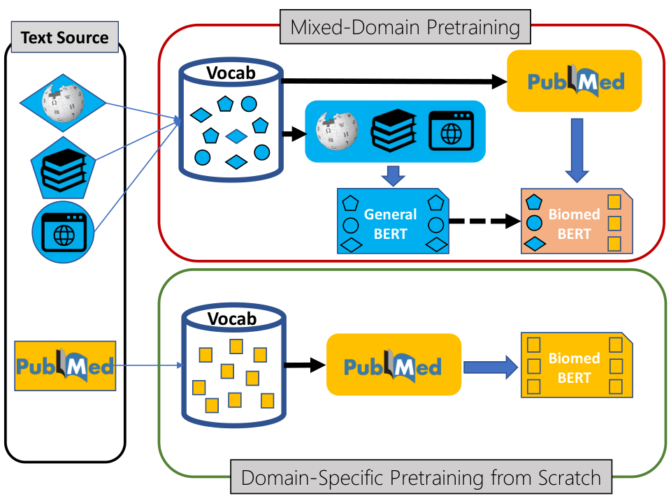
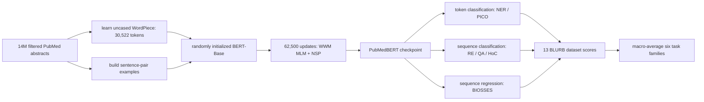
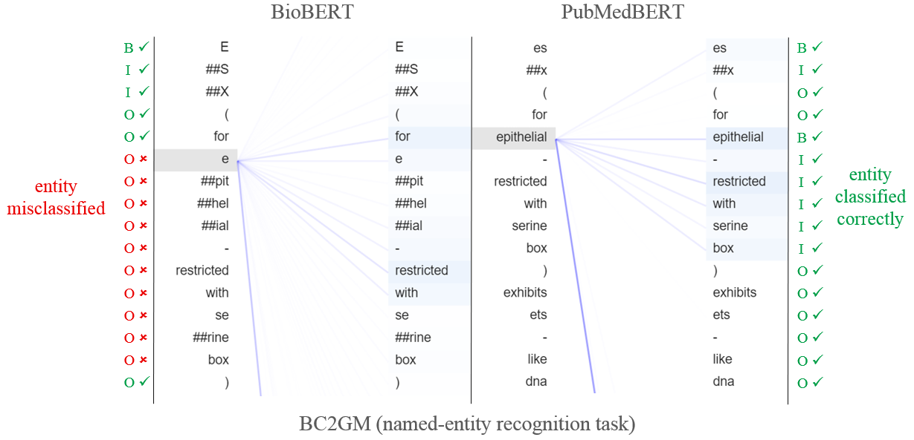
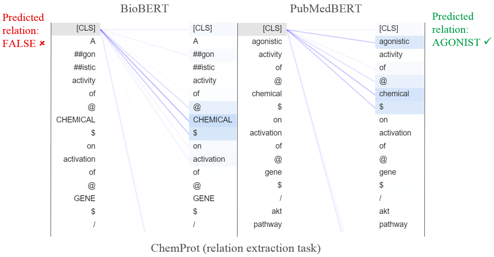

# PubMedBERT — Gu et al., 2020

> **arXiv:** 2007.15779v6 · **Venue:** ACM Transactions on Computing for Healthcare 3(1), 2021 online / 2022 issue · **Affiliation:** Microsoft Research

## TL;DR
PubMedBERT tests whether a biomedical encoder should inherit general-domain weights at all. It builds a 30,522-piece uncased WordPiece vocabulary from PubMed and pretrains BERT-Base from random initialization on 14 million filtered abstracts, reaching a BLURB score of 81.16 versus 80.34 for BioBERT under the paper's common fine-tuning protocol. Controlled ablations attribute the gain to the in-domain vocabulary, whole-word masking, and sufficient purely in-domain optimization rather than simply to more text; the paper also introduces BLURB, a 13-dataset benchmark spanning six biomedical task families.

## Problem & motivation
Biomedical language differs from Wikipedia, books, news, and web text in both distribution and lexicon. General BERT's WordPiece vocabulary contains common terms such as `diabetes` and `insulin`, but breaks less general terms into semantically awkward fragments: `naloxone` becomes `na`, `##lo`, `##xon`, `##e`, and `acetyltransferase` becomes seven pieces. Fragmentation consumes context positions, distributes one concept across several embeddings, and forces pretraining to reconstruct domain terms through pieces selected for another corpus.

Earlier biomedical encoders addressed the corpus mismatch without fully rejecting general-domain transfer. [BioBERT](bert-domain_2019_biobert.md) starts from BERT and continues MLM/NSP training on PubMed and PMC, inheriting BERT's vocabulary. BlueBERT similarly continues BERT on PubMed and clinical notes. [SciBERT](bert-domain_2019_scibert.md) does train from scratch with a new vocabulary, but its corpus is 82% biomedical and 18% computer science, so it is still mixed-domain from the perspective of biomedical applications.

The usual argument for initialization transfer is strongest when target-domain text is scarce. Biomedicine presents the opposite setting: PubMed had more than 30 million abstracts and was adding over one million per year. The paper therefore asks a falsifiable question: when unlabeled target-domain data are abundant, do general-domain weights and text help, or can they cause negative transfer?

Prior biomedical-model papers also evaluated different datasets, preprocessing, heads, and metrics. This made a model-level comparison unreliable. PubMedBERT addresses both problems together: it compares pretraining strategies under one fine-tuning framework and introduces the Biomedical Language Understanding & Reasoning Benchmark (BLURB), with 13 public datasets in named entity recognition, PICO extraction, relation extraction, sentence similarity, document classification, and question answering.

## Key idea
Construct every learned component that is sensitive to the language distribution from biomedical text: derive WordPiece from PubMed, randomly initialize BERT-Base, and optimize only on PubMed examples. This contrasts with mixed-domain continuation, where a general vocabulary and parameter state are inherited before biomedical training.

For input WordPieces $X=(x_1,\ldots,x_n)$, PubMedBERT uses the standard BERT-Base encoder:

$$
H^{(0)}=E_{\mathrm{tok}}(X)+E_{\mathrm{pos}}+E_{\mathrm{seg}},
\qquad
H^{(\ell)}=\operatorname{TransformerBlock}_{\ell}(H^{(\ell-1)}),
\quad \ell=1,\ldots,12.
$$

$E_{\mathrm{tok}}$, $E_{\mathrm{pos}}$, and $E_{\mathrm{seg}}$ are token, position, and segment embedding tables; $H^{(\ell)}\in\mathbb{R}^{n\times768}$ is layer $\ell$'s contextual state. The released checkpoint has 12 layers, width 768, 12 attention heads, a 3,072-wide feed-forward layer, and 512 positions. Architecture is deliberately held constant so vocabulary, corpus, initialization, masking, and training time can be studied.

Pretraining minimizes masked-language modeling plus next-sentence prediction:

$$
\mathcal L_{\mathrm{pre}}
=\mathcal L_{\mathrm{MLM}}+\mathcal L_{\mathrm{NSP}}
=-\sum_{i\in\mathcal M}\log p_\theta(x_i\mid\widetilde X)
-\log p_\theta(y_{\mathrm{NSP}}\mid h_{\mathrm{[CLS]}}).
$$

$\mathcal M$ is the selected mask set, $\widetilde X$ is the corrupted sequence, $x_i$ is the original token, $y_{\mathrm{NSP}}$ says whether the two segments are consecutive, and $h_{\mathrm{[CLS]}}$ is the final first-token state. Whole-word masking selects complete words even when WordPiece splits them. The masking rate is 15%; among selected tokens, the BERT corruption rule uses `[MASK]` 80% of the time, keeps the token 10%, and substitutes a random token 10% (§2.1.3 and §2.5).

BLURB prevents its five NER datasets from dominating the aggregate. If $D_t$ is the set of datasets in task family $t$, its score is

$$
S_{\mathrm{BLURB}}
=\frac{1}{6}\sum_{t=1}^{6}
\left(\frac{1}{|D_t|}\sum_{d\in D_t}s_d\right),
$$

where $s_d$ is dataset $d$'s published metric. Thus each of the six task families has equal weight, while datasets within a family are averaged first.

## How it works

### 1. Build a biomedical vocabulary

Lowercase the PubMed corpus and train WordPiece to the standard BERT vocabulary size. The released vocabulary has exactly 30,522 entries. Common biomedical concepts such as `oropharyngeal`, `cardiomyocyte`, `chloramphenicol`, `RecA`, `acetyltransferase`, `clonidine`, and `naloxone` become whole entries even though BERT and, for several terms, SciBERT split them (Table 1).

This improves efficiency as well as lexical alignment. Across every BLURB dataset, the PubMed vocabulary produces shorter inputs than the Wikipedia+Books vocabulary. Average lengths fall from 35.9 to 28.0 pieces on both BC5 tasks, 106.0 to 75.9 on DDI, 343.1 to 293.0 on PubMedQA, and 702.4 to 541.4 on BioASQ (Table 8). These are reductions of roughly 22%, 28%, 15%, and 23%, respectively.

### 2. Pretrain BERT-Base from random initialization

Use standard BERT-Base rather than importing BERT weights. The released artifact specifies 12 Transformer layers, 12 heads, hidden size 768, feed-forward size 3,072, GELU, dropout 0.1, two segment types, maximum length 512, and initializer standard deviation 0.02. The paper rounds this configuration to 100M parameters and uses it because prior biomedical encoders were also BERT-Base; BERT-Large was left for future study.

Create MLM/NSP examples from PubMed, mask whole words at 15%, and optimize for 62,500 steps with batch size 8,192. The paper retains NSP specifically to permit close comparison with BERT-derived biomedical models, despite prior evidence questioning NSP's utility.

### 3. Apply one controlled fine-tuning framework

All compared encoders receive the same task formulation and hyperparameter regime. Parameters in the encoder and prediction head are jointly fine-tuned. Classification uses cross-entropy; BIOSSES regression uses mean squared error.

- **NER:** predict a tag from every final token state with a linear layer, $p(y_i\mid X)=\operatorname{softmax}(W h_i+b)$. The standard experiment uses BIO tags, then compares BIO, BIOUL, and the simpler IO scheme.
- **PICO:** independently tag words for Participants, Interventions, and Outcomes. Labels may overlap, and the score macro-averages word-level F1 across P, I, and O.
- **Relation extraction:** by default replace target mentions with type placeholders such as `$DRUG` and `$GENE`, use $h_{\mathrm{[CLS]}}$, and predict the relation with a linear classifier. Inputs are 128 pieces for GAD and 256 for ChemProt/DDI.
- **Sentence similarity:** encode `[CLS]` $S_1$ `[SEP]` $S_2$ `[SEP]` and regress the BIOSSES similarity score from $h_{\mathrm{[CLS]}}$.
- **Document classification:** encode a HoC abstract and predict ten cancer-hallmark labels; evaluation uses micro F1.
- **Question answering:** concatenate question and reference text, use a 512-piece limit, and classify PubMedQA into yes/maybe/no or BioASQ into yes/no. These are sequence-classification tasks, not extractive span QA.

### 4. Separate vocabulary, corpus, and compute effects

The central evidence is not merely PubMedBERT versus a collection of public checkpoints. Four ablations probe alternative explanations:

1. Table 7 crosses general versus PubMed vocabulary with subword versus whole-word masking.
2. Table 9 compares general-then-PubMed continuation against PubMed-only training while controlling vocabulary and total compute.
3. Table 10 adds 13.6B words of PMC full text and then adds 60% more optimization.
4. Table 11 adds embedding-level adversarial pretraining to test whether a technique successful in broad-domain models transfers here.

### 5. Inspect task-head complexity

The paper holds PubMedBERT fixed and varies downstream modeling. A linear head matches or beats a BiLSTM on the reported NER and relation tasks (Table 12). BIO, BIOUL, and IO differ by at most 0.26 F1 across BC5-Chemical, BC5-Disease, and JNLPBA (Table 13). For relation extraction, retaining raw entity text with `[CLS]` performs catastrophically on ChemProt/DDI (50.52/37.00), whereas dummification with `[CLS]` reaches 77.24/82.36 and entity markers with mention or start-marker features are similarly strong (Table 14). The pretrained encoder removes the need for some sequence machinery, but input representation remains consequential.

## Training / data

### Pretraining corpora and variants

| Model / variant | Initialization | Vocabulary source | Pretraining text | Size | Source |
|---|---|---|---|---:|---|
| BERT | random | Wikipedia + Books | Wikipedia + Books | 3.3B words / 16GB | Table 5 |
| BioBERT | BERT | Wikipedia + Books | then PubMed | 4.5B biomedical words | Table 5 |
| SciBERT | random | PMC + computer science | PMC + computer science | 3.2B words | Table 5 |
| PubMedBERT, primary | random | PubMed | 14M PubMed abstracts | 3.1B words in Table 5; 3.2B / 21GB in §2.5 | Table 5, §2.5 |
| PubMedBERT + PMC | random | PubMed-domain corpus | abstracts + PMC full text | 16.8B words / 107GB | §3.2 |

The source PubMed collection contains more than 4B words. The authors discard abstracts shorter than 128 words, leaving 14 million abstracts. The discrepancy between 3.1B in Table 5 and 3.2B in prose is rounding in the paper, not a separate corpus.

### Optimization recipe

| Setting | Value | Source |
|---|---:|---|
| Optimizer | Adam | §2.5 |
| Peak learning rate | $6\times10^{-4}$ | §2.5 |
| Schedule | linear warmup for 10%, linear decay for 90% | §2.5 |
| Updates | 62,500 | §2.5 |
| Batch size | 8,192 sequences | §2.5 |
| Masking | 15% whole-word masking | §2.5 |
| Objectives | MLM + NSP | §2.1.3, §2.5 |
| Hardware | one DGX-2, 16 NVIDIA V100 GPUs | §2.5 |
| Wall time | approximately 5 days | §2.5 |
| Case | uncased; cased was similar in preliminary tests | §2.5 |

The paper says this budget is comparable to prior biomedical pretraining. At 62,500 updates and 8,192 examples per update, it processes 512 million training examples, but it does not provide enough sequence-length detail to convert this reliably into a token count. The abstracts+PMC variant initially uses the same update count; “longer training” raises it by 60% to 100,000 steps (Table 10).

### BLURB composition

| Family | Datasets | Metric | Train / dev / test instances | Source |
|---|---|---|---|---|
| NER | BC5-Chemical, BC5-Disease, NCBI-Disease, BC2GM, JNLPBA | entity-level F1 | 5,203/5,347/5,385; 4,182/4,244/4,424; 5,134/787/960; 15,197/3,061/6,325; 46,750/4,551/8,662 | Table 3 |
| PICO | EBM PICO | macro word-level F1 over P/I/O | 339,167 / 85,321 / 16,364 | Table 3 |
| Relation extraction | ChemProt, DDI, GAD | micro F1 | 18,035/11,268/15,745; 25,296/2,496/5,716; 4,261/535/534 | Table 3 |
| Similarity | BIOSSES | Pearson correlation | 64 / 16 / 20 | Table 3 |
| Document classification | HoC | micro F1 | 1,295 / 186 / 371 | Table 3 |
| QA classification | PubMedQA, BioASQ | accuracy | 450/50/500; 670/75/140 | Table 3 |

BLURB intentionally focuses on PubMed-based biomedical literature and excludes MIMIC clinical-note tasks. It uses original EBM PICO data so overlapping P/I/O labels are retained, the original 624/90/191-file DDI split, top-level HoC labels including negative controls, and yes/no BioASQ Task 7b rather than factoid, list, or summary generation.

### Fine-tuning protocol

Fine-tuning uses Adam, 0.1 dropout, 10% linear warmup, and 90% linear decay. Development search ranges are learning rate $\{10^{-5},3\times10^{-5},5\times10^{-5}\}$, batch size $\{16,32\}$, and 2–60 epochs (§2.5). The authors tune representative models rather than every model-dataset pair, then apply one dataset-specific setting to all encoders. BIOSSES, BioASQ, and PubMedQA report means over ten random runs; the other tasks report means over five.

## Results

### Main BLURB comparison

| Dataset | PubMedBERT | Strongest non-PubMedBERT result | Comparator | Source |
|---|---:|---:|---|---|
| BC5-Chemical | **93.33** | 92.85 | BioBERT | Table 6 |
| BC5-Disease | **85.62** | 84.70 | BioBERT / SciBERT | Table 6 |
| NCBI-Disease | 87.82 | **89.13** | BioBERT | Table 6 |
| BC2GM | **84.52** | 83.82 | BioBERT | Table 6 |
| JNLPBA | **79.10** | 78.68 | SciBERT | Table 6 |
| EBM PICO | **73.38** | 73.18 | BioBERT | Table 6 |
| ChemProt | **77.24** | 76.14 | BioBERT | Table 6 |
| DDI | **82.36** | 81.22 | ClinicalBERT | Table 6 |
| GAD | **83.96** | 82.38 | SciBERT | Table 6 |
| BIOSSES | **92.30** | 91.23 | BlueBERT uncased | Table 6 |
| HoC | **82.32** | 81.54 | BioBERT | Table 6 |
| PubMedQA | 55.84 | **60.24** | BioBERT | Table 6 |
| BioASQ | **87.56** | 84.14 | BioBERT | Table 6 |
| **BLURB score** | **81.16** | 80.34 | BioBERT | Table 6 |

PubMedBERT leads 11 of 13 datasets and the aggregate under the common protocol. The exceptions matter: BioBERT is 1.31 points better on NCBI-Disease and 4.40 accuracy points better on PubMedQA. PubMedQA has only 450 training examples and high seed variance, so the paper treats it cautiously. The broad result is stronger than an “across the board” slogan, but it is not literal dominance of every row.

General-domain scale alone does not solve domain mismatch. RoBERTa, despite 160GB of pretraining text, scores 76.46 BLURB, near uncased BERT's 76.11 and below every principal biomedical/scientific model in Table 6. ClinicalBERT and BlueBERT also do not improve PubMed tasks by adding clinical notes, supporting the narrower claim that related but distinct text can be out-of-domain for a literature benchmark.

### Vocabulary and whole-word masking

| Vocabulary / masking | BLURB | Selected details | Source |
|---|---:|---|---|
| Wikipedia + Books / subword masking | 79.16 | ChemProt 75.04; BioASQ 73.69 | Table 7 |
| Wikipedia + Books / whole-word masking | 79.96 | ChemProt 76.70; BioASQ 76.41 | Table 7 |
| PubMed / subword masking | 79.62 | ChemProt 75.72; BioASQ 78.51 | Table 7 |
| PubMed / whole-word masking | **81.16** | ChemProt 77.24; BioASQ 87.56 | Table 7 |

Whole-word masking improves the aggregate with either vocabulary. The full 1.54-point difference between PubMed/subword and PubMed/whole-word means vocabulary alone is not the entire result. Conversely, under whole-word masking the PubMed setup is 1.20 points above the general-vocabulary setup.

### Initialization, domain order, and compute

| Pretraining path | Vocabulary | Relative compute | BLURB | Source |
|---|---|---:|---:|---|
| Wikipedia + Books, then PubMed (BioBERT) | Wikipedia + Books | full | 80.34 | Table 9 |
| Wikipedia + Books, then PubMed | PubMed | full | 80.03 | Table 9 |
| PubMed from scratch | PubMed | half | 80.23 | Table 9 |
| PubMed from scratch | PubMed | full | **81.16** | Table 9 |

This is the paper's most discriminating ablation. Swapping in the PubMed vocabulary does not rescue general-first continuation; it slightly lowers the aggregate from 80.34 to 80.03. PubMed-only training reaches 80.23 with half the compute and 81.16 at equal compute. Results still vary by task: BioBERT remains better on NCBI-Disease, PubMedQA, and the half/full comparisons are not monotonic everywhere. The evidence supports the aggregate strategy, not a theorem that any out-of-domain token is harmful.

### More text and advanced pretraining are not automatically better

| Variant | Steps | Words | BLURB | Source |
|---|---:|---:|---:|---|
| PubMed abstracts | 62.5K | 3.1–3.2B | **81.16** | Table 10 |
| PubMed + PMC | 62.5K | 16.8B | 81.01 | Table 10 |
| PubMed + PMC, longer | 100K | 16.8B | **81.50** | Table 10 |
| PubMed + adversarial pretraining | 62.5K | 3.1–3.2B | 80.77 | Table 11 |

Adding full text without extending optimization slightly hurts, plausibly because PMC is noisier, differs from the abstract-heavy downstream distribution, and supplies much more data than the fixed schedule can absorb. Sixty percent more training produces the best aggregate, 81.50, but gains remain mixed: PubMedQA rises from 55.84 to 60.02 while DDI falls from 82.36 to 82.06 and GAD from 83.96 to 82.90 (Table 10). Adversarial pretraining also lowers the aggregate by 0.39, despite isolated gains on DDI and BIOSSES (Table 11).

### Fine-tuning findings

Simple heads are sufficient but representation choices are not interchangeable. A BiLSTM changes BC5-Chemical from 93.33 to 93.12, BC5-Disease from 85.62 to 85.64, JNLPBA remains 79.10, and relation F1 falls from 77.24 to 75.40 on ChemProt and 82.36 to 81.70 on DDI (Table 12). Across three NER datasets, BIO, BIOUL, and IO all stay within 0.26 F1 (Table 13).

For relation extraction, entity markers plus `[CLS]` lead ChemProt at 77.72, while entity markers plus mention pooling lead DDI at 82.42; these are small changes around dummification plus `[CLS]` at 77.24/82.36. In contrast, original entities plus `[CLS]` collapse to 50.52/37.00 (Table 14), showing that a powerful encoder can still overfit or fail to identify the target pair when the input design is underspecified.

## Limitations & follow-ups

- The central claim is conditional on abundant target-domain text and a target distribution close to that text. It does not show that from-scratch training is optimal for small domains, open-domain systems, clinical notes, patient language, or mixed-domain deployment.
- BLURB contains PubMed-literature tasks by design. This makes it a clean test of PubMed pretraining but also aligns the benchmark closely with the pretraining source. The paper does not report document-level decontamination between the PubMed snapshot and downstream corpora.
- PubMedBERT remains BERT-Base with a 512-position limit. It cannot process most full articles in one pass, even when PMC full text is used for pretraining.
- The benchmark's two QA datasets are small classification tasks. It does not evaluate retrieval, factoid span extraction, list/summary generation, evidence attribution, factual calibration, or safety in clinical decision making.
- The abstracts-only model loses to BioBERT on NCBI-Disease and PubMedQA. Corpus and initialization effects are therefore task-dependent, and the 0.82 aggregate gain over BioBERT should not be treated as universal dominance.
- The vocabulary ablation is entangled with initialization in Table 7; Table 9 controls vocabulary more directly, but no experiment factorially crosses random versus inherited initialization, every corpus order, every vocabulary, and every training duration.
- The PMC result shows that corpus size is not a sufficient statistic. Five times more words hurt at fixed steps and help only slightly after longer training; the paper does not separate article quality, duplication, document structure, sampling ratio, and optimization coverage.
- Fine-tuning uses common dataset-level hyperparameters chosen on representative models rather than independently optimizing every model-dataset pair. This improves comparability but may understate a baseline's best achievable score. Small tasks have substantial seed sensitivity even with five or ten-run averages.
- The paper reports one DGX-2 for about five days but not energy use, exact token throughput, data snapshot identifiers, complete preprocessing code, or a full pretraining configuration. Exact reconstruction therefore depends partly on the released checkpoint and NVIDIA BERT implementation.
- The released checkpoints were later renamed from PubMedBERT to **BiomedBERT**. The abstracts-only checkpoint is the primary 81.16 model; the abstracts+full-text checkpoint is a different variant and should not be cited as if it produced every main-table result.
- The paper calls for extending domain-specific pretraining to clinical and other high-value domains and adding more BLURB tasks. Later biomedical encoders explore larger backbones, knowledge injection, generative objectives, and clinical corpora, but those are beyond this controlled BERT-Base study.

## Links

- **arXiv:** [abs](https://arxiv.org/abs/2007.15779v6) · [html](https://arxiv.org/html/2007.15779v6) · [pdf](https://arxiv.org/pdf/2007.15779v6)
- **Code:** no dedicated pretraining repository identified · [NVIDIA BERT implementation used by the paper](https://github.com/NVIDIA/DeepLearningExamples/tree/master/TensorFlow/LanguageModeling/BERT)
- **Hugging Face:** [abstracts-only primary checkpoint, now BiomedBERT](https://huggingface.co/microsoft/BiomedNLP-BiomedBERT-base-uncased-abstract) · [abstracts + PMC checkpoint](https://huggingface.co/microsoft/BiomedNLP-BiomedBERT-base-uncased-abstract-fulltext)
- **Project page:** [BLURB](https://microsoft.github.io/BLURB/) · [model downloads](https://microsoft.github.io/BLURB/models.html)
- **Blog posts:** [Microsoft Research explanation](https://www.microsoft.com/en-us/research/blog/domain-specific-language-model-pretraining-for-biomedical-natural-language-processing/)
- **Talks / videos:** [Microsoft Research webinar](https://www.microsoft.com/en-us/research/video/domain-specific-language-model-pretraining-for-biomedical-natural-language-processing-2/)
- **OpenReview / venue page:** [ACM DOI](https://doi.org/10.1145/3458754) · [Microsoft Research publication](https://www.microsoft.com/en-us/research/publication/domain-specific-language-model-pretraining-for-biomedical-natural-language-processing/)
- **Papers-with-Code:** [paper entry](https://paperswithcode.com/paper/domain-specific-language-model-pretraining-for)
- **BibTeX:** [Microsoft Research record](https://www.microsoft.com/en-us/research/publication/domain-specific-language-model-pretraining-for-biomedical-natural-language-processing/bibtex/)
- **Related / predecessor papers:** [BERT](bert-encoder_2018_bert-pretraining.md) · [SciBERT](bert-domain_2019_scibert.md) · [BioBERT](bert-domain_2019_biobert.md) · [ClinicalBERT](https://aclanthology.org/W19-1909/) · [BlueBERT](https://aclanthology.org/W19-5006/)