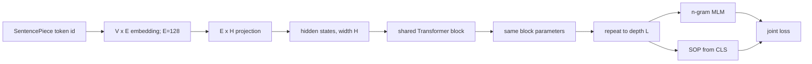
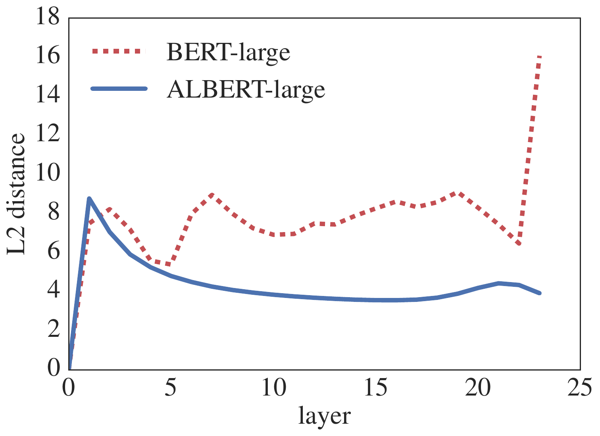
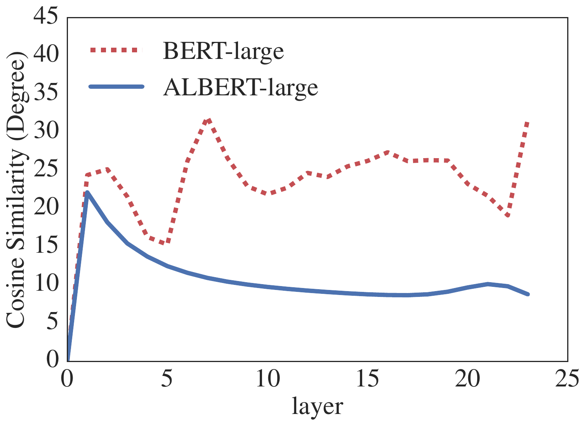
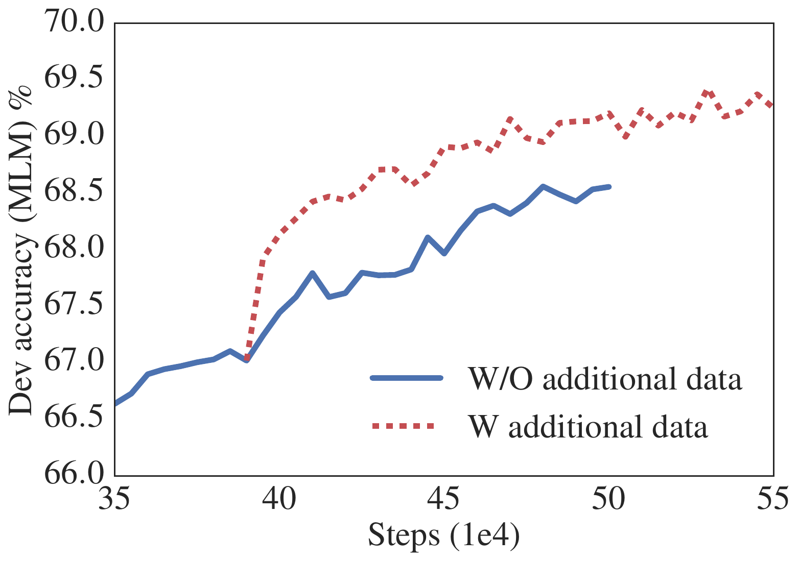
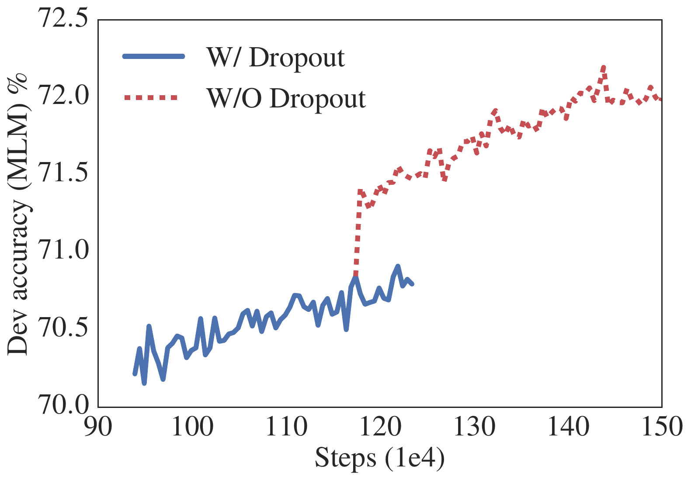

# ALBERT — Lan et al., 2019

> **arXiv:** 1909.11942v6 · **Venue:** ICLR 2020 · **Affiliation:** Google Research and Toyota Technological Institute at Chicago

## TL;DR
ALBERT decouples parameter count from Transformer width and depth through a low-dimensional token-embedding factorization and cross-layer parameter sharing. It also replaces BERT's next-sentence prediction with sentence-order prediction, whose hard negatives reverse two genuinely adjacent segments and therefore emphasize discourse coherence rather than topic detection. ALBERT-large stores 18M parameters versus BERT-large's 334M, while ALBERT-xxlarge spends the savings on a 4,096-wide hidden state and achieved then-state-of-the-art GLUE, SQuAD, and RACE results.

## Problem & motivation
Scaling pretrained encoders usually improved downstream accuracy, but BERT ties three expensive dimensions together. Its context-independent token embedding width equals the context-dependent hidden width, so widening the network enlarges a vocabulary table with $V\times H$ entries. Its $L$ Transformer blocks each have separate parameters, so making the computation deeper also increases stored parameters linearly.

Hundreds of millions of parameters strain accelerator memory and make distributed training communication expensive. Model parallelism and activation checkpointing can fit a larger model, but do not remove parameter communication. ALBERT asks whether parameter reuse can permit wider computation without equally large storage.

The paper also revisits inter-sentence supervision. BERT's random-document NSP negatives differ strongly in topic from positives, allowing the classifier to succeed without understanding whether adjacent discourse is coherent.

## Key idea

### Factorized vocabulary embeddings

Standard BERT maps one-hot vocabulary vectors directly into hidden width $H$:

$$
X\in\mathbb{R}^{V\times H},\qquad N_{\text{embed}}=VH.
$$

ALBERT introduces a smaller embedding dimension $E$ and matrices

$$
X_1\in\mathbb{R}^{V\times E},\qquad
X_2\in\mathbb{R}^{E\times H},
$$

so

$$
N_{\text{embed}}=VE+EH.
$$

Here $V$ is vocabulary size, $E$ is context-independent embedding width, and $H$ is contextual hidden width. When $H\gg E$, widening the encoder barely changes the vocabulary-dominated term.

### Shared Transformer parameters

For hidden states $h^{(0)},\ldots,h^{(L)}$, ALBERT repeatedly applies one parameterized block:

$$
h^{(\ell+1)}=F_\theta(h^{(\ell)}),\qquad \ell=0,\ldots,L-1.
$$

The activations are distinct at every depth, but the attention and FFN weights $\theta$ are reused. Thus, parameter count is approximately constant in $L$, although compute and activation memory still grow with depth.

### Sentence-order prediction

Given truly consecutive segments $(A,B)$, SOP assigns the positive example $(A,B)$ and the negative example $(B,A)$. If $y$ is the order label and $p_\theta(y\mid C)$ is predicted from `[CLS]`, then

$$
\mathcal{L}_{\mathrm{SOP}}=-\log p_\theta(y\mid C).
$$

Both classes share topic and lexical content. Success therefore requires cues about coherence and order rather than merely detecting a document change.

## How it works

### Backbone and configurations

The backbone remains a bidirectional Transformer encoder with GELU, FFN width $4H$, and $H/64$ attention heads. ALBERT normally shares all attention and FFN parameters across layers. Its main configurations are:

| Model | Parameters | Layers $L$ | Hidden $H$ | Embedding $E$ | Shared layers |
|---|---:|---:|---:|---:|---|
| BERT-base | 108M | 12 | 768 | 768 | no |
| BERT-large | 334M | 24 | 1024 | 1024 | no |
| ALBERT-base | 12M | 12 | 768 | 128 | yes |
| ALBERT-large | 18M | 24 | 1024 | 128 | yes |
| ALBERT-xlarge | 60M | 24 | 2048 | 128 | yes |
| ALBERT-xxlarge | 235M | 12 | 4096 | 128 | yes |

The 12-layer xxlarge variant is preferred because the 24-layer version obtains the same aggregate score while requiring more computation. Fewer parameters do not automatically mean lower latency: repeated layers still perform full attention and FFN operations, and width 4,096 makes xxlarge roughly three times slower in data throughput than BERT-large under the paper's setup.

### What weight sharing changes

The paper compares the distance and cosine angle between each layer's input and output. ALBERT's transitions are smoother than BERT's, but do not converge to zero; repeated application of a shared block is therefore not simply reaching the fixed point proposed by deep-equilibrium models.

Ablations show the trade-off. With $E=128$, no sharing gives 89M parameters and an 81.6 downstream average; attention-only sharing gives 64M and 81.7; FFN-only sharing gives 38M and 80.2; full sharing gives 12M and 80.1 (Table 4). Most quality loss arises from sharing FFN weights, but full sharing maximizes parameter efficiency.

### N-gram MLM and SOP

Inputs have the form `[CLS] A [SEP] B [SEP]`, use a 30K SentencePiece vocabulary, and have maximum length 512. ALBERT masks complete-word n-grams up to $N=3$. The sampled length distribution is

$$
p(n)=\frac{1/n}{\sum_{k=1}^{N}1/k},\qquad n\in\{1,2,3\}.
$$

The MLM and SOP losses are optimized jointly. In Table 5, an NSP-trained model reaches 90.5% on NSP but only 52.0% on SOP, approximately random. An SOP-trained model reaches 86.5% on SOP and 78.9% on NSP, supporting the claim that coherence information can partly detect unrelated segments while topic discrimination does not recover order.

### Additional data and dropout

The strongest checkpoints add the corpora used by XLNet and RoBERTa and remove dropout. The paper observes no training overfit after one million steps in its largest models; disabling dropout increases MLM accuracy and slightly improves all representative downstream metrics. This is an empirical result for this shared, very wide architecture rather than a general rule for all Transformers.

## Training / data

Controlled experiments use BooksCorpus and English Wikipedia, about 16GB uncompressed, matching the BERT corpus. Inputs are capped at 512 tokens, with a 10% probability of generating shorter sequences. All model updates use batch size 4,096 and the LAMB optimizer with learning rate 0.00176. Baselines train for 125,000 steps on 64–512 Cloud TPU v3 devices depending on model size. Strong final models add the larger RoBERTa/XLNet data mix and train for up to 1.5M steps.

A time-controlled comparison is especially informative. BERT-large processes 400K steps in 34 hours; ALBERT-xxlarge processes 125K in 32 hours. Despite the latter's lower throughput, it reaches an 88.7 representative-task average versus 87.2 for BERT-large and gains 5.2 RACE points (Table 6).

Representative downstream hyperparameters from Table 14 include:

| Task | Learning rate | Batch | Steps | Warmup | Max length |
|---|---:|---:|---:|---:|---:|
| MNLI | $3\times10^{-5}$ | 128 | 10,000 | 1,000 | 512 |
| SST-2 | $10^{-5}$ | 32 | 20,935 | 1,256 | 512 |
| SQuAD 1.1 | $5\times10^{-5}$ | 48 | 3,649 | 365 | 384 |
| SQuAD 2.0 | $3\times10^{-5}$ | 48 | 8,144 | 814 | 512 |
| RACE | $2\times10^{-5}$ | 32 | 12,000 | 1,000 | 512 |

Fine-tuning uses early stopping. High-variance GLUE development results are medians over five runs, and final leaderboard ensembles average predictions from 6–17 candidate checkpoints depending on task.

## Results

### Parameter efficiency at 125K steps

| Model | Params | SQuAD 1.1 F1/EM | SQuAD 2.0 F1/EM | MNLI | SST-2 | RACE | Average |
|---|---:|---:|---:|---:|---:|---:|---:|
| BERT-large | 334M | 92.2/85.5 | 85.0/82.2 | 86.6 | 93.0 | 73.9 | 85.2 |
| ALBERT-large | 18M | 90.6/83.9 | 82.3/79.4 | 83.5 | 91.7 | 68.5 | 82.4 |
| ALBERT-xlarge | 60M | 92.5/86.1 | 86.1/83.1 | 86.4 | 92.4 | 74.8 | 85.5 |
| ALBERT-xxlarge | 235M | **94.1/88.3** | **88.1/85.1** | **88.0** | **95.2** | **82.3** | **88.7** |

Per Table 2, ALBERT-large demonstrates compression but does not preserve BERT-large quality at equal updates. The paper's best accuracy comes from using the saved parameters to make computation dramatically wider, not from compression alone.

### Objective and embedding ablations

At full sharing, $E=128$ gives the best representative average, 80.1, compared with 79.0 for 64, 79.6 for 256, and 79.8 for 768 (Table 3). SOP improves the average from 79.0 with no sentence loss and 79.2 with NSP to 80.1; its largest representative gain is SQuAD 2.0, where F1/EM rises from 78.1/75.3 without a sentence loss to 80.0/77.1 (Table 5).

### Final leaderboard results

| Benchmark | Single ALBERT | ALBERT ensemble | Prior RoBERTa | Notes |
|---|---:|---:|---:|---|
| GLUE | 1.5M-step task results; no single aggregate stated | **89.4** | 88.5 | Table 9 |
| SQuAD 2.0 test F1/EM | **90.9/88.1** | **92.2/89.7** | 89.8/86.8 | Table 10 |
| RACE test | **86.5** | **89.4** | 83.2 | Table 10 |

The strongest system combines the factorized/shared architecture, MLM + SOP, no dropout, additional data, long training, and checkpoint ensembles. These results should not be attributed to parameter reduction in isolation.

## Limitations & follow-ups

- Parameter count is not FLOP count. ALBERT-xxlarge is smaller to store but computationally more expensive than BERT-large because every shared application operates at width 4,096.
- Full sharing sacrifices some quality relative to no sharing at the same width. Attention-only sharing is a useful intermediate point but gives up much of the compression.
- The selected factorization $E=128$ creates a narrow lexical bottleneck and may not transfer optimally across vocabulary sizes, scripts, or multilingual settings.
- SOP uses local segment order as a proxy for coherence; it cannot cover every discourse relation and relies on documents having meaningful order.
- Final SOTA results confound architecture with more data, longer training, dropout removal, and ensembling.
- Dense 512-token attention remains unchanged. The paper specifically proposes sparse or block attention as future work for training and inference speed.
- [RoBERTa](bert-training_2019_roberta.md) offers a stronger unshared baseline, while later parameter-efficient fine-tuning and distillation target per-task deployment cost rather than pretraining parameterization.

## Links

- **arXiv:** [abs](https://arxiv.org/abs/1909.11942v6) · [html](https://arxiv.org/html/1909.11942v6) · [pdf](https://arxiv.org/pdf/1909.11942v6)
- **Code:** [google-research/albert](https://github.com/google-research/albert)
- **Hugging Face:** [albert/albert-xxlarge-v2](https://huggingface.co/albert/albert-xxlarge-v2)
- **Project page:** —
- **Blog posts:** [Google Research overview](https://research.google/blog/albert-a-lite-bert-for-self-supervised-learning-of-language-representations/)
- **Talks / videos:** —
- **OpenReview / venue page:** [ICLR 2020](https://openreview.net/forum?id=H1eA7AEtvS)
- **Papers-with-Code:** [ALBERT](https://paperswithcode.com/method/albert)
- **BibTeX:** [OpenReview citation](https://openreview.net/forum?id=H1eA7AEtvS)
- **Related / successor papers:** [BERT](bert-encoder_2018_bert-pretraining.md) · [RoBERTa](bert-training_2019_roberta.md) · [SpanBERT](bert-span_2019_spanbert.md)
