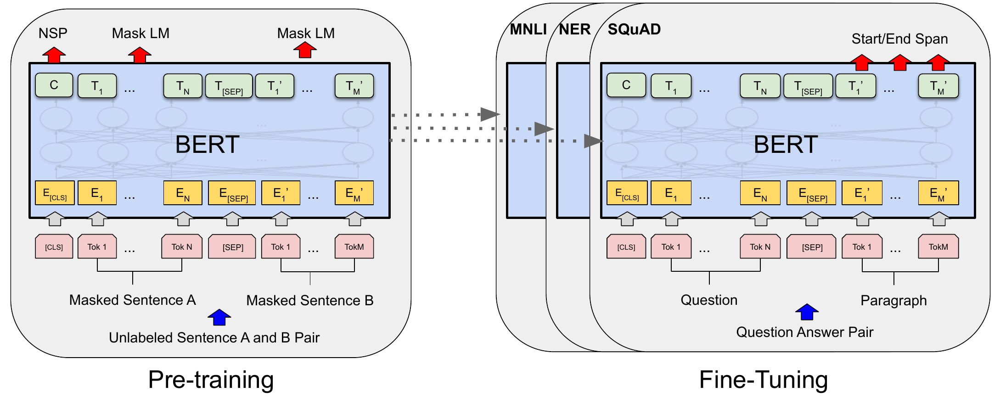
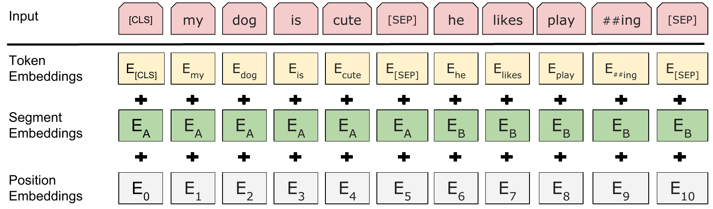
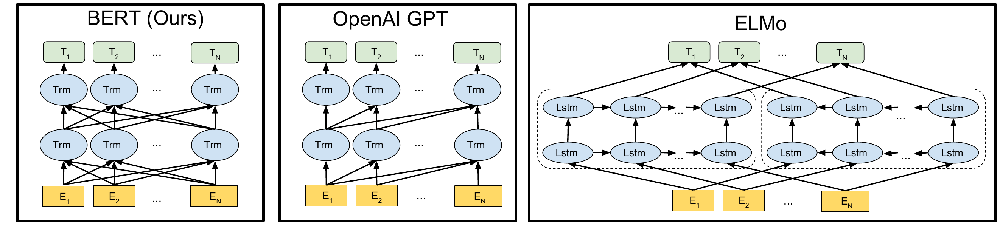
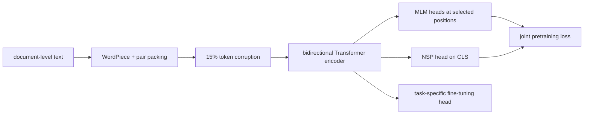

# BERT — Devlin et al., 2018

> **arXiv:** 1810.04805v2 · **Venue:** NAACL-HLT 2019 · **Affiliation:** Google AI Language

## TL;DR
BERT pretrains a Transformer encoder by hiding input tokens and recovering them from both left and right context. Its masked-language-model objective made deep bidirectional transfer practical, while a second next-sentence-prediction objective attempted to teach relationships between text segments. One pretrained checkpoint can then be adapted to classification, tagging, natural-language inference, and extractive question answering by adding a small output head and fine-tuning all parameters.

## Problem & motivation
Before BERT, the strongest transfer-learning systems usually followed one of two patterns. Feature-based systems such as ELMo concatenated representations from separately trained left-to-right and right-to-left language models, so no deep layer jointly conditioned on both directions. Fine-tuned Transformer systems such as GPT used a causal mask, so a token could inspect only earlier tokens even when the complete input was available.

The restriction is especially costly for token-level understanding. To identify an answer span or named entity, the representation of a token should use words on both sides. Removing the causal mask from ordinary language-model training is not enough, because the token being predicted would then reveal itself. BERT resolves this leakage by corrupting selected tokens before encoding the sequence.

The paper also sought a unified transfer interface. Rather than designing a large task-specific architecture for each benchmark, it pretrained a general encoder and changed only the input packing and shallow output layer during fine-tuning.

## Key idea
For a token sequence $x=(x_1,\ldots,x_n)$, sample masked positions $M$. Replace their visible inputs with corrupted tokens $\tilde{x}$, encode the entire sequence bidirectionally, and minimize

$$
\mathcal{L}_{\mathrm{MLM}}
= -\sum_{i\in M}\log p_\theta(x_i\mid \tilde{x}_1,\ldots,\tilde{x}_n).
$$

Here, $M$ is the selected-position set, $x_i$ is the original WordPiece at position $i$, $\tilde{x}$ is the corrupted input, and $p_\theta$ is the vocabulary distribution produced from BERT's contextual state. Because $x_i$ is hidden or perturbed, its prediction must combine the visible left and right context.

BERT jointly trains next-sentence prediction (NSP). If $y\in\{0,1\}$ indicates whether segment $B$ truly follows segment $A$, then

$$
\mathcal{L}_{\mathrm{NSP}}
= -y\log p_\theta(y=1\mid C)
  -(1-y)\log p_\theta(y=0\mid C),
$$

where $C\in\mathbb{R}^{H}$ is the final `[CLS]` state. The complete pretraining loss is the sum of the mean MLM and NSP losses:

$$
\mathcal{L}=\mathcal{L}_{\mathrm{MLM}}+\mathcal{L}_{\mathrm{NSP}}.
$$

## How it works

### Input construction

A single example has the form

$$
[\mathrm{CLS}], A_1,\ldots,A_m,[\mathrm{SEP}],B_1,\ldots,B_k,[\mathrm{SEP}],
$$

with $m+k$ chosen so the packed input has at most 512 tokens. For position $i$, the initial representation is

$$
e_i=e_i^{\text{token}}+e_i^{\text{segment}}+e_i^{\text{position}}.
$$

The token term comes from a 30,000-entry WordPiece vocabulary, the segment term distinguishes $A$ from $B$, and the learned absolute-position term identifies the location. The encoder returns one contextual vector $T_i\in\mathbb{R}^{H}$ per input position and the special aggregate vector $C=T_{\mathrm{[CLS]}}$.

### Encoder

Each Transformer block applies multi-head self-attention and a position-wise feed-forward network with residual connections, layer normalization, GELU activations, and dropout. For one attention head,

$$
\operatorname{Attention}(Q,K,V)
=\operatorname{softmax}\!\left(\frac{QK^\top}{\sqrt{d_k}}\right)V.
$$

Unlike a causal decoder, BERT supplies no triangular attention mask: every non-padding position can attend to every other visible position. The two released configurations are:

| Model | Layers $L$ | Hidden size $H$ | Heads $A$ | Parameters |
|---|---:|---:|---:|---:|
| BERT-base | 12 | 768 | 12 | 110M |
| BERT-large | 24 | 1024 | 16 | 340M |

### MLM corruption

BERT selects 15% of WordPiece positions after tokenization. For each selected position, it substitutes `[MASK]` 80% of the time, a random vocabulary item 10% of the time, and the unchanged token 10% of the time. Only selected positions contribute MLM loss. The latter two cases reduce dependence on `[MASK]`, which never appears in ordinary downstream input, while forcing the encoder to maintain useful representations at every position.

### NSP sampling

Half of segment pairs use the true continuation of $A$ as $B$ (`IsNext`); the other half draw $B$ from another corpus location (`NotNext`). The classification head reads $C$. Later work, particularly [RoBERTa](bert-training_2019_roberta.md), showed that removing NSP while improving sequence construction and training can work better, so NSP should be understood as part of the original recipe rather than an essential property of bidirectional encoders.

### Downstream heads

- **Sequence classification:** apply a learned matrix $W\in\mathbb{R}^{K\times H}$ to $C$ and optimize class cross-entropy.
- **Token classification:** classify each $T_i$, normally assigning a word's label to its first WordPiece.
- **Extractive QA:** learn start and end vectors $S,E\in\mathbb{R}^{H}$. The start probability is

$$
P_i^{\text{start}}=\frac{\exp(S^\top T_i)}{\sum_j\exp(S^\top T_j)},
$$

and the end probability is analogous. A candidate $(i,j)$ is scored by $S^\top T_i+E^\top T_j$ with $j\ge i$. For SQuAD 2.0, start and end at `[CLS]` represent no answer.
- **Multiple choice:** encode each context–candidate pair, score its $C$ state, and softmax across candidates.

## Training / data

BERT uses BooksCorpus (800M words) and English Wikipedia (2,500M words), approximately 3.3B words total. Wikipedia lists, tables, and headers are removed, while document boundaries are retained so contiguous segment pairs can be sampled. Masking is uniform over WordPieces and does not preserve complete words.

| Setting | Value | Source |
|---|---:|---|
| Batch size | 256 sequences | Appendix A.2 |
| Updates | 1,000,000 | Appendix A.2 |
| Peak learning rate | $10^{-4}$ | Appendix A.2 |
| Adam | $\beta_1=0.9$, $\beta_2=0.999$ | Appendix A.2 |
| Weight decay | 0.01 | Appendix A.2 |
| Warmup | 10,000 steps | Appendix A.2 |
| Dropout | 0.1 | Appendix A.2 |
| Sequence schedule | length 128 for 90% of steps; 512 for final 10% | Appendix A.2 |

The learning rate warms up linearly and then decays linearly. BERT-base trained for four days on 4 Cloud TPUs in Pod configuration (16 TPU chips); BERT-large used 16 Cloud TPUs (64 chips) for four days. The short-first schedule saves substantial compute because dense attention scales quadratically with sequence length.

For downstream tasks, the paper recommends batch sizes 16 or 32, Adam learning rates in $\{5,3,2\}\times10^{-5}$, and 2–4 epochs, with development-set selection. GLUE experiments used batch size 32 and three epochs; SQuAD 1.1 used three epochs, $5\times10^{-5}$, and batch size 32; SQuAD 2.0 used two epochs, $5\times10^{-5}$, and batch size 48.

## Results

| Benchmark | BERT result | Comparison | Notes |
|---|---:|---:|---|
| GLUE leaderboard | 80.5 | OpenAI GPT 72.8 | per §4.1; official aggregate at writing |
| GLUE task average excluding WNLI | 82.1 | OpenAI GPT 75.1 | BERT-large, per Table 1 |
| MNLI matched/mismatched | 86.7 / 85.9 | GPT 82.1 / 81.4 | accuracy, per Table 1 |
| CoLA | 60.5 | GPT 45.4 | Matthews correlation, per Table 1 |
| SQuAD 1.1 test | 87.4 EM / 93.2 F1 | prior #1 ensemble 86.0 / 91.7 | ensemble + TriviaQA, per Table 2 |
| SQuAD 2.0 test | 80.0 EM / 83.1 F1 | prior #1 74.8 / 78.0 | single model, per Table 3 |
| SWAG test | 86.3 | GPT 78.0 | BERT-large accuracy, per Table 4 |

The objective ablation supports deep bidirectionality more strongly than NSP. On the base configuration, full BERT reached 88.5 SQuAD 1.1 F1, removing NSP reached 87.9, and replacing MLM with a left-to-right objective fell to 77.8 (Table 5). A randomly initialized BiLSTM over the causal model recovered to 84.9 but remained below bidirectional pretraining.

Scaling was monotonic in the reported controlled experiment. Increasing from a 3-layer model to BERT-large reduced held-out MLM perplexity from 5.84 to 3.23 and improved MNLI development accuracy from 77.9 to 86.6 (Table 6). The result established that sufficiently pretrained large encoders can improve even on small supervised datasets.

## Limitations & follow-ups

- MLM predicts only 15% of positions, so each sequence provides fewer supervised targets than a causal LM. [ELECTRA](bert-objective_2020_electra.md) later replaced sparse reconstruction with dense replaced-token detection.
- The corruption symbol creates a train/test mismatch. Dynamic masking and larger corpora in [RoBERTa](bert-training_2019_roberta.md) improve the recipe without changing the basic encoder objective.
- NSP negatives are often topically unrelated and can be solved without learning fine discourse coherence. [ALBERT](bert-efficient_2019_albert.md) replaces NSP with sentence-order prediction; RoBERTa and [SpanBERT](bert-span_2019_spanbert.md) remove it.
- Dense attention and learned absolute positions cap the released model at 512 tokens and make long inputs expensive.
- Fine-tuning stores a separate full model per task and can be unstable on small datasets. Later adapters, low-rank updates, and distillation address this deployment cost.
- The original corpus and evaluation are primarily English, and the model can inherit social and factual biases from unlabeled text.

## Links

- **arXiv:** [abs](https://arxiv.org/abs/1810.04805v2) · [html](https://arxiv.org/html/1810.04805v2) · [pdf](https://arxiv.org/pdf/1810.04805v2)
- **Code:** [google-research/bert](https://github.com/google-research/bert)
- **Hugging Face:** [google-bert/bert-base-uncased](https://huggingface.co/google-bert/bert-base-uncased)
- **Project page:** —
- **Blog posts:** [Google Research announcement](https://research.google/blog/open-sourcing-bert-state-of-the-art-pre-training-for-natural-language-processing/)
- **Talks / videos:** —
- **OpenReview / venue page:** [ACL Anthology N19-1423](https://aclanthology.org/N19-1423/)
- **Papers-with-Code:** [BERT](https://paperswithcode.com/method/bert)
- **BibTeX:** [ACL Anthology export](https://aclanthology.org/N19-1423.bib)
- **Related / successor papers:** [RoBERTa](bert-training_2019_roberta.md) · [ALBERT](bert-efficient_2019_albert.md) · [SpanBERT](bert-span_2019_spanbert.md)
