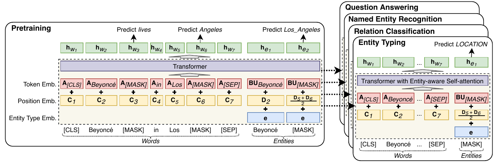
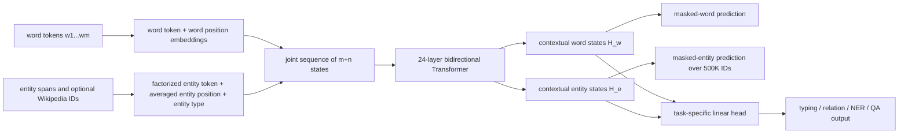

# LUKE — Yamada et al., 2020

> **arXiv:** 2010.01057v1 · **Venue:** EMNLP 2020 · **Affiliations:** Studio Ousia, RIKEN AIP, University of Washington, NAIST, and National Institute of Informatics

## TL;DR
LUKE extends RoBERTa-large with a second token stream for entities: each entity span gets its own contextual state alongside the ordinary word states. It pretrains those states by masking and predicting Wikipedia entities from a 500,000-entity vocabulary, then fine-tunes simple task heads with attention whose query projection depends on whether the source and target are words or entities. This explicit entity channel produced state-of-the-art results on five entity-heavy benchmarks in 2020, including 94.3 F1 on CoNLL-2003 and 90.2 EM / 95.4 F1 on SQuAD 1.1.

## Problem & motivation
Transformer language models represent text as word or subword tokens. That is awkward for entity-centric tasks for two structural reasons. First, an entity such as `Los Angeles` has no native span-level state; a downstream model must learn to pool its constituent tokens from a comparatively small labeled dataset. Second, reasoning about relations between entities is indirect because each entity may be split into several tokens. Standard masked language modeling also gives weak entity supervision: recovering `Rings` from `The Lord of the [MASK]` is much easier than identifying the complete entity *The Lord of the Rings*.

Static knowledge-base embeddings solve a different problem. They assign a stable vector to each known entity and can encode graph or corpus information, but using them in text generally requires entity linking and they cannot represent an entity absent from the knowledge base. Earlier knowledge-enhanced language models often inject such separately learned embeddings or auxiliary objectives while retaining a word-only Transformer interface.

LUKE asks whether entities can instead be first-class contextual tokens. Its design must support both linked entities, whose identity embeddings carry Wikipedia knowledge, and arbitrary spans, which can be represented by a special `[MASK]` entity without resolving them to a knowledge base. The model therefore aims to learn span-level entity representations during pretraining while preserving RoBERTa's general word representations.

The paper evaluates this premise across five different output structures: multi-label entity typing, relation classification, span-level NER, cloze-style QA over candidate entities, and extractive QA over word boundaries. The breadth matters: a useful entity representation should not depend on one specialized decoder.

## Key idea
Given $m$ word tokens and $n$ entity mentions, LUKE feeds both sets into one bidirectional Transformer. Words and entities are separate tokens even when an entity covers words in the same sentence. The resulting hidden states are

$$
H_w=(h_{w_1},\ldots,h_{w_m})\in\mathbb{R}^{m\times D},
\qquad
H_e=(h_{e_1},\ldots,h_{e_n})\in\mathbb{R}^{n\times D},
$$

where $D=1024$ in the reported model. An entity state can correspond to a known Wikipedia identity, a generic `[MASK]` entity placed over an arbitrary span, `[UNK]`, or a task-specific entity such as `[HEAD]` or `[TAIL]`.

The second idea is **entity-aware self-attention**. In one attention head, let $x_i,x_j\in\mathbb{R}^{D}$ be the state at query position $i$ and attended-to position $j$, and let $Q,K,V\in\mathbb{R}^{L\times D}$, where $L=64$ is the head width. LUKE shares keys and values but selects the query projection from four token-type pairings:

$$
e_{ij}=\frac{1}{\sqrt L}
\begin{cases}
(Kx_j)^\top Qx_i, & i=w,\ j=w,\\
(Kx_j)^\top Q_{w2e}x_i, & i=w,\ j=e,\\
(Kx_j)^\top Q_{e2w}x_i, & i=e,\ j=w,\\
(Kx_j)^\top Q_{e2e}x_i, & i=e,\ j=e,
\end{cases}
$$

$$
\alpha_{ij}=\frac{\exp(e_{ij})}{\sum_{r=1}^{m+n}\exp(e_{ir})},
\qquad
y_i=\sum_{j=1}^{m+n}\alpha_{ij}Vx_j.
$$

Here $w$ and $e$ denote word and entity token types. Only the query path changes; $K$ and $V$ remain shared. This preserves the leading-order attention cost while adding three $L\times D$ query matrices per head. The paper's notation `w2e` is best read as the word-query/entity-key case shown above.

The two contributions are related but distinct. Entity inputs and masked-entity pretraining teach the network to construct contextual span representations. Type-conditioned queries then give each attention head a direct parameterization for word-to-entity, entity-to-word, and entity-to-entity interactions.

## How it works

### 1. Construct word inputs

RoBERTa byte-pair encoding produces $m$ word/subword tokens from a sequence wrapped with `[CLS]` and `[SEP]`. If $A\in\mathbb{R}^{V_w\times D}$ is the word embedding table and $C_i\in\mathbb{R}^{D}$ is the word-position embedding at position $i$, the initial word state is

$$
x_{w_i}=A[w_i]+C_i,
$$

with $V_w\approx50{,}000$ and $D=1024$. The model initializes this path, the Transformer blocks, and other compatible parameters from RoBERTa-large.

### 2. Construct entity inputs

A full table for $V_e=500{,}000$ entities at width 1024 would be expensive. LUKE factorizes it into

$$
B\in\mathbb{R}^{V_e\times H},\qquad
U\in\mathbb{R}^{H\times D},\qquad H=256,
$$

so the projected embedding of identity $e$ is $(BU)[e]$. For an entity covering word positions $s$ through $t$, LUKE averages entity-specific position embeddings $D_p\in\mathbb{R}^{D}$ over that span and adds one learned entity-type vector $e_{\mathrm{type}}\in\mathbb{R}^{D}$:

$$
x_e=B[e]U+\frac{1}{t-s+1}\sum_{p=s}^{t}D_p+e_{\mathrm{type}}.
$$

Word and entity position tables are separate. Averaging makes the entity's input location depend on its entire span without introducing one entity token per covered word. Multiple entity tokens may point to overlapping word positions, and their inclusion does not replace the corresponding words.

### 3. Contextualize both token types jointly

Concatenate the $m$ word states and $n$ entity states conceptually into $X\in\mathbb{R}^{(m+n)\times D}$ and pass them through 24 bidirectional Transformer layers with 16 heads each. Every word and entity can attend to every other token. The output preserves two addressable groups, $H_w$ and $H_e$, so a downstream head can consume either or both without reconstructing entity spans by pooling words.

During **the reported pretraining run**, these layers use ordinary RoBERTa attention, not the four-way entity-aware mechanism. The authors could not afford two complete pretraining runs for an attention ablation. At downstream fine-tuning time, each $Q_{w2e}$, $Q_{e2w}$, and $Q_{e2e}$ is initialized from the pretrained ordinary $Q$ and then learned from the task data. Consequently, the paper demonstrates entity-aware attention as a fine-tuning adaptation, not as part of its 200,000-step pretraining recipe.

### 4. Predict masked entity identities

Wikipedia hyperlinks provide identity labels. For a masked entity state $h_e\in\mathbb{R}^{D}$, LUKE applies a dense transform, GELU, and layer normalization:

$$
m_e=\operatorname{LayerNorm}
\left(\operatorname{GELU}(W_hh_e+b_h)\right),
$$

where $W_h\in\mathbb{R}^{D\times D}$ and $b_h\in\mathbb{R}^{D}$. It projects back through a learned $T\in\mathbb{R}^{H\times D}$ and the same low-dimensional entity table $B$:

$$
\hat y_e=\operatorname{softmax}(BTm_e+b_o),
\qquad b_o\in\mathbb{R}^{V_e}.
$$

Thus $Tm_e\in\mathbb{R}^{H}$, $BTm_e\in\mathbb{R}^{V_e}$, and the output distribution covers the complete entity vocabulary. The paper does not state that $T$ is tied to the input projection $U$; an implementation should keep them distinct unless reproducing code establishes otherwise.

### 5. Adapt the entity interface to each task

- **Entity typing (Open Entity):** place one `[MASK]` entity over the target mention. A linear sigmoid classifier on its entity state predicts nine general types with binary cross-entropy.
- **Relation classification (TACRED):** place task-specific `[HEAD]` and `[TAIL]` entities over the arguments. Concatenate their two $D$-dimensional states and classify the relation with softmax cross-entropy.
- **Named entity recognition (CoNLL-2003):** enumerate all spans of at most 16 words and place a `[MASK]` entity on each. For span $(s,t)$, concatenate $h_{w_s}$, $h_{w_t}$, and its entity state $h_{e_{s:t}}$ into a $3D$ vector, then classify it as one of four entity types or non-entity. At inference, sort non-null spans by predicted-type logit and greedily retain non-overlapping spans.
- **Cloze QA (ReCoRD):** insert `[MASK]` entities for the missing question slot and every annotated passage entity. Score each candidate with a linear classifier over the concatenated missing-slot and candidate states; train binary cross-entropy over candidates and return the highest logit.
- **Extractive QA (SQuAD 1.1):** automatically link names in the question and passage to Wikipedia identities and include those entity tokens. The output head remains the standard pair of linear classifiers over word states for answer-start and answer-end positions.

Task-specific entity embeddings start from the pretrained `[MASK]` entity embedding. This is what allows unknown, unlabeled, or task-defined spans to use the entity channel without a valid Wikipedia identity.

## Training / data

The pretraining corpus is the December 2018 English Wikipedia dump: approximately **3.5 billion words** and **11 million hyperlink entity annotations**. Pages are shuffled and split into examples containing at most 512 word tokens plus their entity annotations. Only the 500,000 most frequent linked entities are retained as identities; out-of-vocabulary entities become `[UNK]`. The vocabulary also contains distinct entity `[MASK]` and `[UNK]` entries, separate from word masking tokens.

For each example, 15% of words and 15% of entities are selected independently for masking. If $\mathcal{M}_w$ and $\mathcal{M}_e$ are the selected positions and $p_w$, $p_e$ the two output distributions, the joint objective is

$$
\mathcal{L}=\mathcal{L}_{\mathrm{MLM}}+\mathcal{L}_{\mathrm{MEP}}
=-\sum_{i\in\mathcal{M}_w}\log p_w(w_i\mid\widetilde X)
-\sum_{j\in\mathcal{M}_e}\log p_e(e_j\mid\widetilde X),
$$

where $\widetilde X$ is the jointly corrupted word/entity input and MEP denotes masked-entity prediction. Both losses are cross-entropies. The architecture has about **483M parameters**: 355M inherited from RoBERTa-large and 128M in entity embeddings.

| Pretraining setting | Value | Source |
|---|---:|---|
| Transformer | 24 layers, width 1024, 16 heads, head width 64 | §3.4 |
| Entity bottleneck $H$ | 256 | §3.4 |
| Maximum word length | 512 | Appendix Table 9 |
| Batch size | 2,048 | Appendix Table 9 |
| Updates | 200,000 | §3.4 |
| Peak learning rate, first 100K | $5\times10^{-4}$ | Appendix Table 9 |
| Peak learning rate, final 100K | $10^{-5}$ | Appendix Table 9 |
| Warmup | 2,500 steps | Appendix Table 9 |
| Schedule | linear decay | Appendix Table 9 |
| Dropout / weight decay | 0.1 / 0.01 | Appendix Table 9 |
| AdamW | $\beta_1=0.9$, $\beta_2=0.999$, $\epsilon=10^{-6}$ | Appendix Table 9 |
| Compute | 16 Tesla V100 GPUs for about 30 days | Appendix A |

Training is staged. During the first 100,000 steps, RoBERTa-initialized parameters are frozen and only randomly initialized entity-related parameters are updated. All parameters are unfrozen for the final 100,000 steps. No gradient clipping is used. The paper initializes from RoBERTa-large rather than pretraining the word pathway from scratch.

Fine-tuning uses AdamW, linear decay, 6% warmup, dropout 0.1, weight decay 0.01, $\beta_1=0.9$, $\beta_2=0.98$, and $\epsilon=10^{-6}$ (Appendix Table 11). The authors grid-search learning rate $\{10^{-5},2\times10^{-5},3\times10^{-5}\}$, batch size $\{4,8,16,32,64\}$, and epochs $\{2,3,5\}$ for every task except SQuAD, which uses RoBERTa's published setup.

| Task | Learning rate | Batch | Epochs | GPUs | Reported training time | Source |
|---|---:|---:|---:|---:|---:|---|
| Open Entity | $10^{-5}$ | 4 | 3 | 1 | 10 min | Appendix Table 10 |
| TACRED | $10^{-5}$ | 32 | 5 | 1 | 190 min | Appendix Table 10 |
| CoNLL-2003 | $10^{-5}$ | 8 | 5 | 1 | 203 min | Appendix Table 10 |
| ReCoRD | $10^{-5}$ | 32 | 2 | 8 | 92 min | Appendix Table 10 |
| SQuAD 1.1 | $1.5\times10^{-5}$ | 48 | 2 | 8 | 42 min | Appendix Table 10 |

The Open Entity split has 1,998 examples each for train, development, and test. TACRED has 68,124 / 22,631 / 15,509 examples and 42 relation labels. CoNLL-2003 has 14,987 / 3,466 / 3,684 sentences and four entity types. ReCoRD has 100,730 / 10,000 / 10,000 questions, and SQuAD 1.1 has 87,599 / 10,570 / 9,533 questions (Appendix B).

## Results

All headline values below are the paper's single-model results unless noted. Different tasks use different metrics, so scores should be compared only within a row.

| Benchmark | LUKE | RoBERTa baseline | Previous best listed | Source |
|---|---:|---:|---:|---|
| Open Entity test, micro F1 | **78.2** | 76.2 | 77.5 K-Adapter | Table 1 |
| TACRED test, micro F1 | **72.7** | 71.3 | 72.0 K-Adapter | Table 2 |
| CoNLL-2003 test, span F1 | **94.3** | 92.4 | 93.5 Baevski et al. | Table 3 |
| ReCoRD dev, EM / F1 | **90.8 / 91.4** | 89.0 / 89.5 | 80.6 / 82.1 XLNet+Verifier | Table 4 |
| ReCoRD test, EM / F1 | **90.6 / 91.2** | 90.0 / 90.6 RoBERTa ensemble | 90.0 / 90.6 RoBERTa ensemble | Table 4 |
| SQuAD 1.1 dev, EM / F1 | **89.8 / 95.0** | 88.9 / 94.6 | 89.3 / 94.8 ALBERT | Table 5 |
| SQuAD 1.1 test, EM / F1 | **90.2 / 95.4** | not reported | 89.9 / 95.1 XLNet | Table 5 |

LUKE improves over the paper's matched RoBERTa baseline on every task. The largest direct gains are on span-level NER (+1.9 F1), Open Entity (+2.0 F1), and ReCoRD development (+1.8 EM / +1.9 F1). On the ReCoRD test set, one LUKE model exceeds the listed RoBERTa ensemble by 0.6 EM and 0.6 F1. On SQuAD, the gain is smaller but notable because the answer head itself remains word-based; entity tokens provide additional context rather than becoming the predicted output.

### Entity-input ablation

| Model | CoNLL test F1 | SQuAD dev EM | SQuAD dev F1 | Source |
|---|---:|---:|---:|---|
| LUKE without entity inputs | 92.9 | 89.2 | 94.8 | Table 6 |
| **LUKE** | **94.3** | **89.8** | **95.0** | Table 6 |

Removing all entity tokens costs 1.4 F1 on NER and 0.6 EM / 0.2 F1 on SQuAD. This is the cleanest evidence that the separate entity stream matters beyond the underlying RoBERTa-initialized word states.

### Entity-aware attention ablation

| Attention | Open Entity F1 | TACRED F1 | CoNLL F1 | ReCoRD EM / F1 | SQuAD EM / F1 | Source |
|---|---:|---:|---:|---:|---:|---|
| Original | 77.9 | 72.2 | 94.1 | 90.1 / 90.7 | 89.2 / 94.7 | Table 7 |
| **Entity-aware** | **78.2** | **72.7** | **94.3** | **90.8 / 91.4** | **89.8 / 95.0** | Table 7 |

Type-conditioned query matrices improve every reported metric, but by 0.2–0.7 points rather than explaining the full gap to RoBERTa. The largest gains occur on TACRED and both QA datasets, consistent with the authors' hypothesis that explicit token-type paths help relation reasoning. Because both variants start from the same ordinarily pretrained model, this table isolates the downstream attention modification reasonably well.

### Extra-pretraining control

| Model | CoNLL test F1 | SQuAD dev EM | SQuAD dev F1 | Source |
|---|---:|---:|---:|---|
| RoBERTa | 92.4 | 88.9 | 94.6 | Table 8 |
| RoBERTa + 200K Wikipedia MLM steps | 92.5 | 89.1 | 94.7 | Table 8 |
| **LUKE** | **94.3** | **89.8** | **95.0** | Table 8 |

Ordinary MLM on the same Wikipedia corpus barely changes RoBERTa. This control argues that LUKE's gains do not arise merely from 200,000 additional updates, although it does not separately ablate masked-entity prediction, the entity embedding interface, and all other entity-specific parameters.

## Limitations & follow-ups

- The 500,000-entry entity vocabulary is English-Wikipedia-specific, adds 128M parameters, and still maps long-tail or new entities to `[UNK]`. A `[MASK]` entity can represent arbitrary spans, but it cannot provide a missing identity's memorized knowledge.
- Pretraining depends on Wikipedia hyperlinks. Hyperlinks are sparse and editorially biased annotations rather than exhaustive entity labels, and the December 2018 snapshot makes the stored identity knowledge time-bound.
- The paper pretrains only ordinary self-attention. Entity-aware query matrices are copied from $Q$ and learned independently for each downstream dataset, so the experiment does not establish whether entity-aware attention during pretraining would help, hurt, or transfer better.
- The four query paths add parameters to every attention layer but do not condition keys or values by token-pair type. The ablation gains are consistent yet modest, and the paper does not report head-level analysis showing which paths learn distinct behavior.
- SQuAD requires automatically generated Wikipedia entity links using string matching, ambiguity filtering, and a 1% link-probability threshold. This introduces an external preprocessing pipeline and possible linking errors; other tasks avoid identity linking by using `[MASK]` or task-specific entities.
- NER enumerates every span up to 16 words and inserts a corresponding entity token. This gives strong span states but increases sequence length and attention cost, and greedy overlap removal need not find a globally optimal set.
- Results are from large-scale hardware: pretraining takes about 30 days on 16 V100 GPUs. The paper reports one large 483M-parameter configuration, not a compute–accuracy scaling curve, multiple pretraining seeds, inference latency, or memory measurements.
- Benchmark comparisons reflect the 2020 state of the art and are not uniformly controlled. Some baseline numbers come from prior papers, and ReCoRD compares a single LUKE model against a published RoBERTa ensemble on the test set.
- The original model is English-only. Follow-up work introduced [mLUKE](https://arxiv.org/abs/2110.08151), which extends entity representations across languages, while later maintained checkpoints include smaller LUKE-base and LUKE-large variants. Those capabilities are not results of this paper.

For a complementary extraction direction, [GLiNER](bert-extraction_2023_gliner.md) removes the closed entity vocabulary and treats natural-language type names as queries over candidate spans. LUKE learns entity-aware contextual representations; GLiNER learns open-label span–type compatibility.

## Links

- **arXiv:** [abs](https://arxiv.org/abs/2010.01057v1) · [html](https://arxiv.org/html/2010.01057v1) · [pdf](https://arxiv.org/pdf/2010.01057v1)
- **Code:** [studio-ousia/luke](https://github.com/studio-ousia/luke)
- **Hugging Face:** [studio-ousia/luke-large](https://huggingface.co/studio-ousia/luke-large) · [LUKE documentation](https://huggingface.co/docs/transformers/model_doc/luke)
- **Project page:** [Studio Ousia LUKE](https://github.com/studio-ousia/luke)
- **Blog posts:** —
- **Talks / videos:** [EMNLP 2020 presentation](https://slideslive.com/38938803)
- **OpenReview / venue page:** [ACL Anthology](https://aclanthology.org/2020.emnlp-main.523/) · [DOI](https://doi.org/10.18653/v1/2020.emnlp-main.523)
- **Papers-with-Code:** [LUKE](https://paperswithcode.com/paper/luke-deep-contextualized-entity)
- **BibTeX:** [ACL Anthology export](https://aclanthology.org/2020.emnlp-main.523.bib)
- **Related / successor papers:** [GLiNER local review](bert-extraction_2023_gliner.md) · [mLUKE](https://arxiv.org/abs/2110.08151) · [ERNIE](https://arxiv.org/abs/1905.07129) · [KnowBERT](https://arxiv.org/abs/1909.04164) · [SpanBERT](https://arxiv.org/abs/1907.10529)