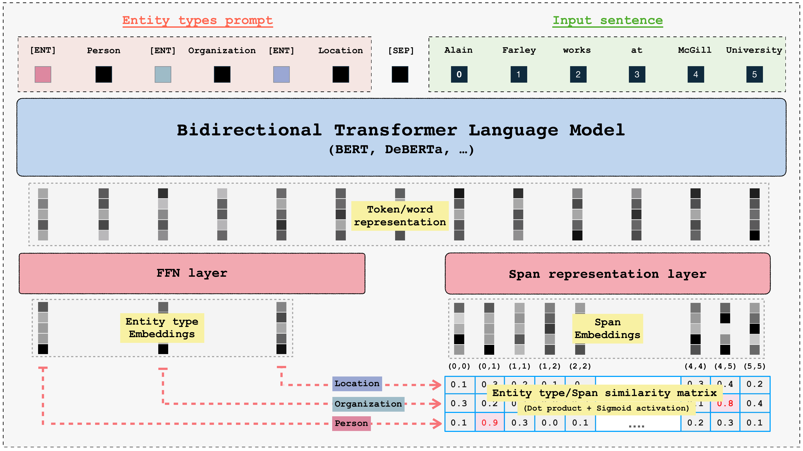
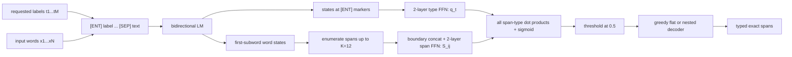
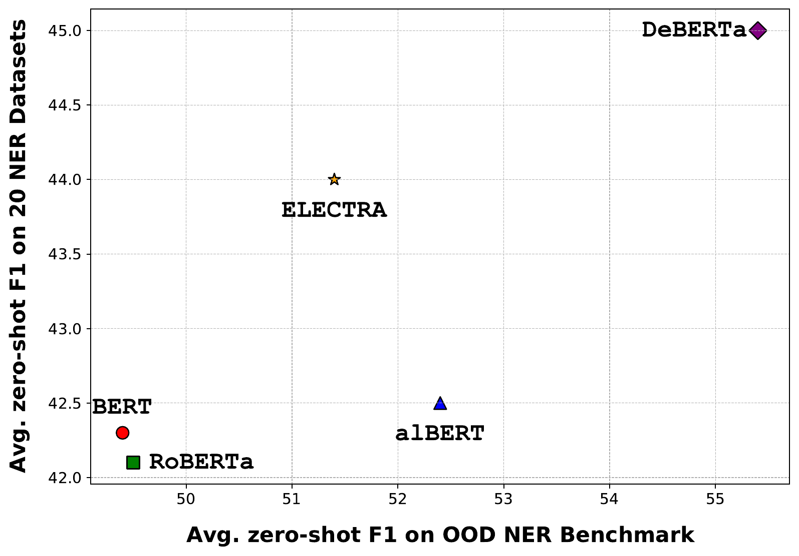
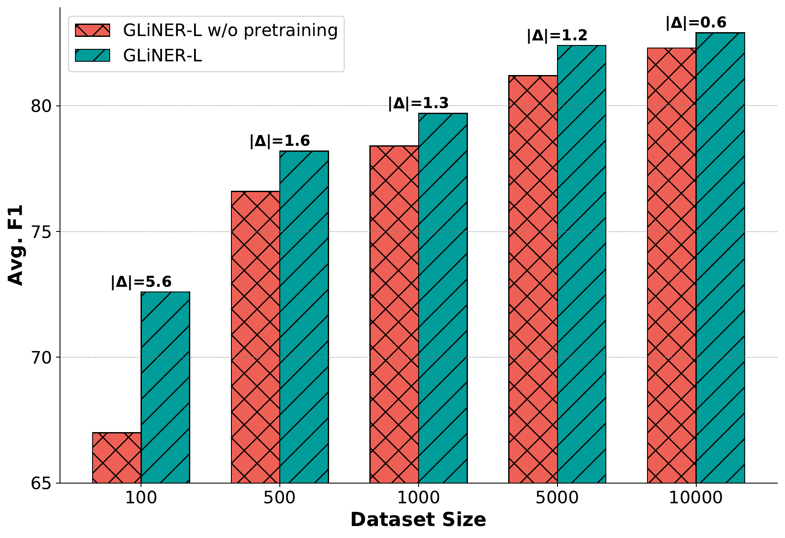

# GLiNER — Zaratiana et al., 2023

> **arXiv:** 2311.08526v1 · **Venue:** NAACL 2024 (long paper) · **Affiliation:** FI Group and LIPN, CNRS UMR 7030

## TL;DR
GLiNER turns open-label named entity recognition into parallel span–label matching with a compact bidirectional encoder. It jointly encodes natural-language entity labels and the input text, maps every bounded text span and every requested label into one latent space, and scores their compatibility with a dot product. Trained on the diverse, ChatGPT-annotated Pile-NER corpus, the 50M–300M-parameter models outperform much larger generative systems on the paper's main zero-shot evaluations while returning exact spans without autoregressive decoding.

## Problem & motivation
Conventional NER is usually a token-classification problem with a fixed output head: a model trained for `person`, `organization`, and `location` cannot directly recognize a newly requested type such as `protein complex` or `music genre`. Adding a type generally requires labeled examples and another training run. Prompted large language models remove that fixed-schema restriction, but they recast extraction as free-form generation. This introduces several costs: billions of parameters, sequential decoding, potentially expensive APIs, output parsing, and no natural way to score all candidate spans and labels in parallel.

GLiNER asks whether open-label NER actually needs generation. Its answer is no: a label name is text, so a bidirectional language model can contextualize the requested labels together with the sentence. A discriminative span head can then compare every plausible text span with every label representation. The output remains grounded in exact input boundaries, while changing the label set requires only changing the prompt sequence.

This formulation combines three properties that earlier approaches usually separated:

- **Open schema:** entity types are natural-language inputs rather than fixed classifier indices.
- **Grounded extraction:** outputs are selected input spans, not generated strings.
- **Parallel scoring:** candidate spans and types are represented in tensors and matched in one operation rather than decoded token by token.

The central empirical question is whether a small discriminative encoder can acquire enough label semantics from broad weak supervision to compete with prompted and instruction-tuned LLMs on entity types and domains absent from its target-task training.

## Key idea
Let the requested entity types be $T=(t_1,\ldots,t_M)$ and the input words be $X=(x_1,\ldots,x_N)$. GLiNER constructs one sequence containing learned `[ENT]` markers, textual type names, a learned `[SEP]` delimiter, and the input text. A bidirectional encoder therefore lets every type token attend to the sentence and every sentence token attend to all requested types.

From the encoder output, let

$$
P=(p_1,\ldots,p_M)\in\mathbb{R}^{M\times D}
$$

contain the contextual states at the $M$ `[ENT]` positions, and let

$$
H=(h_1,\ldots,h_N)\in\mathbb{R}^{N\times D}
$$

contain one state per input word. When a word has multiple subwords, the paper keeps the first subword state. A two-layer feed-forward network projects each type marker into the matching space:

$$
q_t=\operatorname{FFN}_{\mathrm{type}}(p_t),
\qquad q_t\in\mathbb{R}^{D}.
$$

For every span beginning at word $i$ and ending at word $j$, GLiNER concatenates its contextual boundary states and applies another two-layer network:

$$
S_{ij}=\operatorname{FFN}_{\mathrm{span}}([h_i;h_j]),
\qquad S_{ij}\in\mathbb{R}^{D}.
$$

Here $D$ is the matching width, $[\,;\,]$ denotes concatenation, and the span is retained only when $1\le j-i+1\le K$. The paper sets $K=12$, so the number of candidates is $O(NK)$ rather than $O(N^2)$ for fixed $K$.

The probability that span $(i,j)$ has type $t$ is the sigmoid of their dot product:

$$
\phi(i,j,t)=\sigma(S_{ij}^{\top}q_t).
$$

Unlike a softmax over types, independent sigmoids do not force each span to take exactly one supplied label. A requested type may be absent, most spans can be negative, and the same boundary candidate can in principle receive multiple scores before structural decoding resolves the output.

## How it works





### 1. Build the joint prompt

For labels such as `person`, `organization`, and `location`, the conceptual input is

```text
[ENT] person [ENT] organization [ENT] location [SEP] <input text>
```

Both `[ENT]` and `[SEP]` are newly learned tokens initialized randomly. Label order is shuffled during training so position does not become a shortcut. Randomly dropping labels exposes the encoder to different schema sizes and prevents it from relying on a fixed prompt inventory.

The original architecture is a **uni-encoder**: labels and text share one forward pass and interact through self-attention before matching. This interaction is important to the paper's method and should not be confused with later GLiNER bi-encoder variants that encode reusable labels separately.

### 2. Recover word-level states

The backbone emits one state per subword. GLiNER maps these back to $N$ word positions by selecting each word's first subword representation. This gives a predictable span lattice in word coordinates and avoids scoring starts or ends in the middle of a word. Exact character offsets can then be recovered from the tokenizer's word-to-text alignment.

### 3. Enumerate and encode spans

For each start $i$, enumerate ends

$$
j\in\{i,\ldots,\min(N,i+K-1)\}.
$$

With $K=12$, there are at most

$$
\sum_{i=1}^{N}\min(K,N-i+1)\le NK
$$

span candidates. Gather $h_i$ and $h_j$ for all candidates, concatenate them into a tensor of shape approximately $N\times K\times 2D$, and apply the span FFN in parallel to obtain $S\in\mathbb{R}^{N\times K\times D}$. Interior words influence $S_{ij}$ indirectly because the endpoint states are already contextualized by the bidirectional encoder.

### 4. Project label markers

Apply the type FFN to the $M$ marker states to obtain $Q\in\mathbb{R}^{M\times D}$. Because each marker attended jointly to its label text, the other requested types, and the input, $q_t$ is not a static dictionary embedding. It is a context-conditioned query for that label in this prompt.

### 5. Score all span–type pairs

Flatten the span lattice to $C\le NK$ candidates and multiply its matrix by $Q^\top$. This produces $C\times M$ logits in one batched operation. Applying sigmoid yields independently calibrated compatibility scores. The scoring work is $O(NKMD)$, while the encoder still has its normal self-attention cost over the combined label-and-text sequence.

### 6. Decode valid structures

At inference, discard candidates with $\phi(i,j,t)\le0.5$ and place the remainder in a priority queue ordered by score. The decoder repeatedly accepts the highest-scoring compatible candidate:

- **Flat NER:** reject every candidate that overlaps an accepted span.
- **Nested NER:** allow one accepted span to be fully contained in another, but reject partial crossings.

For $n$ candidates above threshold, priority-queue decoding costs $O(n\log n)$. This post-processing imposes task structure that the independent binary scores do not enforce by themselves.

### 7. Train all pairs with binary cross-entropy

Let $\mathcal{S}$ be the enumerated spans, $\mathcal{T}$ the prompted types, $\mathcal{P}\subseteq\mathcal{S}\times\mathcal{T}$ the gold span–type pairs, and $y_{ijt}=1$ exactly when $((i,j),t)\in\mathcal{P}$. The per-example objective is

$$
\mathcal{L}_{\mathrm{BCE}}
=-\sum_{(i,j)\in\mathcal{S}}\sum_{t\in\mathcal{T}}
\left[
y_{ijt}\log\phi(i,j,t)
+(1-y_{ijt})\log(1-\phi(i,j,t))
\right].
$$

Every unannotated span–type combination is negative. Negative *entity-type sampling* additionally inserts labels that have no positive mention anywhere in the sentence; without it, a model can learn that every prompted type must appear.

## Training / data

The zero-shot model is trained on **Pile-NER**, released with UniversalNER. Its creators sampled 50,000 passages from the heterogeneous Pile corpus and asked ChatGPT to extract entities without prescribing an entity inventory. After filtering malformed outputs, the GLiNER paper reports 44,889 passages, about 240,000 entity spans, and about 13,000 distinct entity types. This broad synthetic label vocabulary is what teaches semantic transfer to unseen type names; GLiNER does not obtain zero-shot behavior from architecture alone.

The paper trains three English variants with DeBERTa-v3 backbones: GLiNER-S (50M parameters), GLiNER-M (90M), and GLiNER-L (approximately 0.3B). Its multilingual experiment replaces the English backbone with mDeBERTa-v3-base but still trains on the English-only Pile-NER examples.

| Setting | Value | Source |
|---|---:|---|
| Span-length cap $K$ | 12 words | §2.1 |
| Matching/head width | 768 | §3.2 |
| Non-pretrained-layer dropout | 0.4 | §3.2 |
| Optimizer | AdamW | §3.2 |
| Backbone learning rate | $10^{-5}$ | §3.2 |
| New-layer learning rate | $5\times10^{-5}$ | §3.2 |
| Maximum updates | 30,000 | §3.2 |
| Warmup | 10% of updates | §3.2 |
| Schedule after warmup | cosine decay | §3.2 |
| Maximum prompted types per sentence | 25 | §3.2 |
| Regularization | shuffle type order; randomly drop types | §3.2 |
| GLiNER-L training time | 5 hours on one A100 | §3.2 |

Pile-NER supplies only labels that occur in each passage. During batching, GLiNER samples absent labels from other examples as negatives. The ablation studies 0%, 50%, and 75% negative types and finds 50% gives the best precision–recall balance. This is a semantic hardening step: the model must determine whether a requested concept occurs, not merely locate an instance of every listed concept.

For in-domain supervised experiments, the authors mix the training portions of 20 NER datasets, using up to 10,000 examples from each. They compare initialization from Pile-NER pretraining against training the same architecture without it. The paper does not report batch size, weight decay, random-seed count, or all dataset-specific fine-tuning hyperparameters, so the published recipe is not completely specified from the paper alone.

## Results

Evaluation uses exact-span NER F1: both boundaries and the type must match. The main zero-shot setting trains only on Pile-NER and performs no target-benchmark fine-tuning.

### Out-of-domain English NER

| Model | Parameters | OOD average F1 | Notes |
|---|---:|---:|---|
| ChatGPT | not reported | 47.5 | seven MIT/CrossNER domains; result imported from UniversalNER |
| InstructUIE | 11B | 47.2 | result imported from InstructUIE |
| UniNER-7B | 7B | 53.7 | same Pile-NER training source |
| UniNER-13B | 13B | 55.6 | same Pile-NER training source |
| GoLLIE | 7B | 58.0 | strongest listed generative baseline |
| GLiNER-S | 50M | 52.7 | paper Table 1 |
| GLiNER-M | 90M | 55.4 | paper Table 1 |
| **GLiNER-L** | **0.3B** | **60.9** | paper Table 1 |

GLiNER-L wins four of the seven domains and has the highest average. Its 60.9 average is 2.9 points above GoLLIE and 5.3 above UniNER-13B. GLiNER-M nearly matches UniNER-13B while using roughly 1/140 as many parameters. These are model-size comparisons, not controlled latency measurements, and several baseline values are carried over from prior papers.

On the broader 20-dataset benchmark, GLiNER-L averages **47.8 F1**, versus **45.7** for UniNER-7B and **36.5** for ChatGPT (Table 2). GLiNER has the best listed score on 13 of 20 datasets. The variation is substantial: it reaches 57.2 on MIT Movie versus UniNER's 42.4, but trails on noisy social-media sets such as Broad Twitter (61.2 versus 67.9) and TweetNER7 (41.4 versus 42.7).

### Multilingual zero-shot transfer

| Model | Multiconer average F1 | Training/evaluation note |
|---|---:|---|
| Per-language supervised XLM-R | 54.9 | trained separately on each target language |
| ChatGPT | 29.9 | zero-shot baseline from prior work |
| GLiNER-En | 23.6 | DeBERTa-v3-large; English Pile-NER |
| **GLiNER-Multi** | **32.9** | mDeBERTa-v3-base; English Pile-NER |

All values are from Table 3. GLiNER-Multi beats ChatGPT on 8 of the 10 non-English languages and averages 3.0 points higher despite seeing only English task supervision. It remains far below the per-language supervised baseline. The English-only backbone transfers poorly to non-Latin scripts, including **0.89 F1 on Bengali**, whereas multilingual pretraining raises Bengali to 25.9.

### Supervised fine-tuning and ablations

| Experiment | Result | Source |
|---|---:|---|
| GLiNER-L with Pile-NER initialization, 20-dataset supervised average | 82.9 F1 | Table 4 |
| GLiNER-L without Pile-NER initialization | 82.1 F1 | Table 4 |
| UniNER-7B with Pile-NER initialization | 84.8 F1 | Table 4 |
| InstructUIE without Pile-NER initialization | 81.2 F1 | Table 4 |
| Pile-NER gain at 100 labeled examples per dataset | +5.6 F1 | §5.2 / Figure 5 |
| Random entity-type dropping | over +1.4 OOD F1 | §5.3 / Figure 6 |



The backbone study uses base-size GLiNER variants with tuned learning rates. DeBERTa-v3 leads clearly; ELECTRA and ALBERT follow, while BERT and RoBERTa are lower but still competitive. XLNet is an important negative result: despite tuning, it reaches at most about 3 F1 on the OOD benchmark. The paper does not isolate why XLNet fails.



Negative type sampling directly controls calibration:

| Negative-type ratio | Precision | Recall | F1 | Source |
|---:|---:|---:|---:|---|
| 0% | 49.3 | 58.1 | 53.3 | Table 5 |
| **50%** | **62.3** | **59.7** | **60.9** | Table 5 |
| 75% | 61.1 | 56.5 | 58.6 | Table 5 |

With no absent labels, the model overpredicts and loses 13 precision points relative to the 50% setting. Raising negatives to 75% makes it more conservative and lowers recall. This ablation supports a key implementation lesson: open-label extraction requires training prompts in which requested labels genuinely have no answer.

## Limitations & follow-ups

- The paper has no dedicated limitations section. Its discussion does acknowledge weak performance on informal tweet data and says future work should improve low-resource-language adaptation.
- Zero-shot semantics depend on Pile-NER's ChatGPT-generated annotations. Its 13,000 type strings provide breadth, but annotation noise, type synonyms, inconsistent granularity, and Pile domain biases can all transfer into the model.
- The comparison to generative systems is not fully controlled. Several baseline numbers come from earlier publications with their own prompts and inference stacks, and the paper reports parameter counts rather than measured latency, throughput, memory, or energy on common hardware.
- The $K=12$ cap makes span enumeration linear in text length but prevents extraction of longer entities. The unified prompt also spends the backbone's context budget on label names, and training uses at most 25 types per sentence; behavior with much larger schemas is not established by this paper.
- Boundary-only span construction is efficient, but it has no explicit interior pooling or width embedding. Interior evidence must already be encoded into the contextual endpoint states.
- Independent BCE scores need a threshold and greedy structural decoder. Scores can conflict, calibration may shift with label wording or label-set composition, and greedy selection need not maximize a global structured objective.
- The multilingual result demonstrates transfer, not multilingual NER mastery: task supervision is English-only, performance remains well below supervised models, and the English backbone collapses on some non-Latin scripts.
- Exact-match benchmark F1 does not evaluate label paraphrase sensitivity, adversarial label descriptions, cross-sentence entities, inference speed, confidence calibration, or robustness to missing annotations.

The maintained project has since expanded beyond the paper's uni-encoder into bi-encoder, relation-extraction, decoder, and streaming architectures; those capabilities should not be retroactively attributed to the original experiment. Direct follow-ups include [GLiNER multi-task](https://arxiv.org/abs/2406.12925), [GLiNER2](https://arxiv.org/abs/2507.18546), and [The Million-Label NER](https://arxiv.org/abs/2602.18487), whose separate label encoder targets the original model's schema-scaling constraint. For complementary entity-aware representation learning rather than open-label span matching, see the local [LUKE review](bert-extraction_2020_luke.md).

## Links

- **arXiv:** [abs](https://arxiv.org/abs/2311.08526v1) · [html](https://arxiv.org/html/2311.08526v1) · [pdf](https://arxiv.org/pdf/2311.08526v1)
- **Code:** [urchade/GLiNER](https://github.com/urchade/GLiNER)
- **Hugging Face:** [GLiNER models](https://huggingface.co/models?library=gliner&sort=trending) · [Pile-NER-type dataset](https://huggingface.co/datasets/Universal-NER/Pile-NER-type)
- **Project page:** [GLiNER documentation](https://urchade.github.io/GLiNER/)
- **Blog posts:** —
- **Talks / videos:** [NAACL presentation](https://aclanthology.org/2024.naacl-long.300.mp4)
- **OpenReview / venue page:** [ACL Anthology](https://aclanthology.org/2024.naacl-long.300/) · [DOI](https://doi.org/10.18653/v1/2024.naacl-long.300)
- **Papers-with-Code:** [GLiNER](https://paperswithcode.com/paper/gliner-generalist-model-for-named-entity)
- **BibTeX:** [ACL Anthology export](https://aclanthology.org/2024.naacl-long.300.bib)
- **Related / successor papers:** [LUKE local review](bert-extraction_2020_luke.md) · [UniversalNER](https://arxiv.org/abs/2308.03279) · [GLiNER multi-task](https://arxiv.org/abs/2406.12925) · [GLiNER2](https://arxiv.org/abs/2507.18546) · [The Million-Label NER](https://arxiv.org/abs/2602.18487)