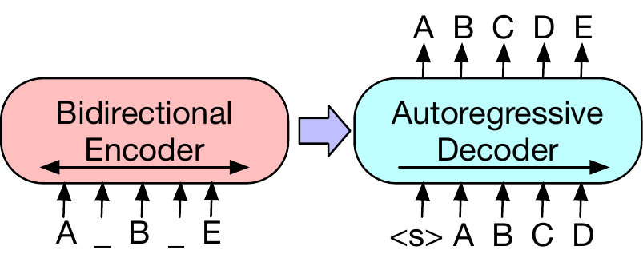
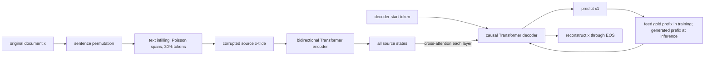
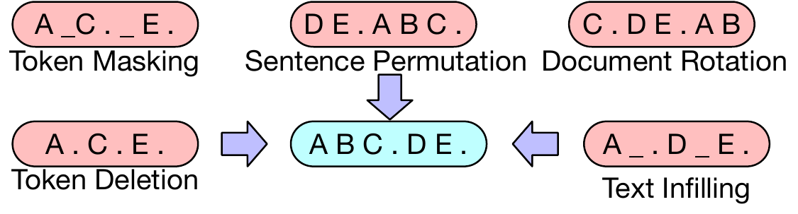
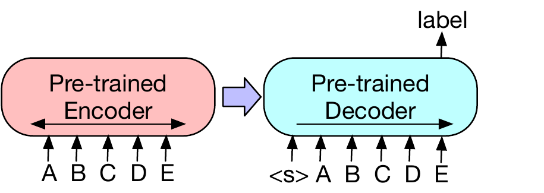
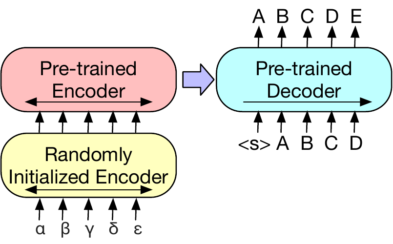

# BART — Lewis et al., 2019

> **arXiv:** 1910.13461v1 · **Venue:** ACL 2020 · **Affiliation:** Facebook AI

## TL;DR
BART pretrains a standard Transformer encoder-decoder as a denoising autoencoder: corrupt a document, encode the damaged text bidirectionally, and reconstruct the original text with a left-to-right decoder. Its strongest recipe replaces variable-length spans with single mask tokens and permutes sentence order, joining BERT-like full-context understanding to GPT-like autoregressive generation without designing a task-specific architecture. BART-large remains comparable to RoBERTa on SQuAD and GLUE while reaching 44.16/21.28/40.90 ROUGE-1/2/L on CNN/DailyMail and 45.14/22.27/37.25 on XSum (Table 3), but the paper also exposes factual hallucination and weaker behavior when outputs are only loosely constrained by inputs.

## Problem & motivation
BERT and GPT provided complementary capabilities but incompatible interfaces. BERT's bidirectional encoder can condition every token representation on both left and right context, which is valuable for classification and extractive question answering. Its masked tokens are predicted independently, however, so MLM does not define an output order, variable output length, or stopping process for free-form generation. GPT defines those properties through left-to-right factorization, but each token can only condition on earlier output tokens and therefore lacks a bidirectional source encoder.

Earlier attempts to bridge this divide usually committed to one prediction pattern. UniLM changes self-attention masks to simulate bidirectional, causal, and sequence-to-sequence modes within one stack. MASS masks one contiguous source span and generates only that missing span. XLNet predicts selected tokens autoregressively in permuted order. These methods improve particular task families, but their specialized corruption, visibility, or target construction restricts which source-to-target transformations they naturally represent (§1 and §7).

BART asks whether a conventional neural machine translation architecture can supply a more general interface. If the source may be corrupted arbitrarily and the target is always the original document, pretraining can change source length, delete information, scramble discourse, or combine several disturbances. At fine-tuning time the same model can classify, label tokens, answer extractively, summarize, converse, or generate translations without changing its basic encoder-decoder contract.

## Key idea
Let the original token sequence be $x=(x_1,\ldots,x_T)$ and let $C$ be a stochastic corruption process. BART samples a damaged source

$$
\widetilde{x}\sim C(x),
$$

encodes $\widetilde{x}$ bidirectionally, and trains an autoregressive decoder to reconstruct all of $x$. The conditional factorization is

$$
p_\theta(x\mid\widetilde{x})
=\prod_{t=1}^{T}p_\theta(x_t\mid x_{<t},\widetilde{x}),
$$

where $x_{<t}=(x_1,\ldots,x_{t-1})$ is the gold target prefix during teacher-forced training and $\theta$ contains the encoder, decoder, embeddings, and output head. The negative log-likelihood objective is

$$
\mathcal L_{\mathrm{DAE}}(\theta)
=-\mathbb E_{x\sim\mathcal D}
\mathbb E_{\widetilde{x}\sim C(x)}
\sum_{t=1}^{T}\log p_\theta(x_t\mid x_{<t},\widetilde{x}).
$$

$\mathcal D$ is the pretraining corpus. Unlike MLM, the loss covers every target token and target predictions are not conditionally independent. Unlike an ordinary causal LM, each prediction can cross-attend to a representation of the complete corrupted source.

The corruption process is modular. BART evaluates token masking, token deletion, text infilling, sentence permutation, and document rotation (§2.2). Its final large-scale recipe composes sentence permutation with text infilling: sample spans whose lengths follow $\operatorname{Poisson}(\lambda=3)$, replace each whole span with one mask token, continue until 30% of source tokens are covered, and randomly shuffle all sentences (§5.1). Because one mask can replace zero, one, or many tokens, the decoder must infer both missing content and missing length.

## How it works

### 1. Combine a bidirectional encoder with a causal decoder

BART uses the standard Transformer sequence-to-sequence architecture. Given corrupted source embeddings $S^{(0)}\in\mathbb R^{L_s\times d}$, the encoder applies unrestricted self-attention:

$$
S^{(\ell)}=\operatorname{EncoderBlock}_{\ell}(S^{(\ell-1)}).
$$

For target position $t$, decoder layer $\ell$ applies causal self-attention over positions $\le t$, then cross-attention over every final encoder state $S^{(L_e)}$:

$$
U^{(\ell)}
=\operatorname{DecoderBlock}_{\ell}
\left(U^{(\ell-1)},S^{(L_e)};M_{\mathrm{causal}}\right),
\qquad
p(x_t\mid x_{<t},\widetilde{x})
=\operatorname{softmax}(W_o u_t^{(L_d)}+b_o).
$$

$L_s$ is source length, $d$ is model width, $L_e$ and $L_d$ are encoder and decoder depths, $M_{\mathrm{causal}}$ prevents access to future target states, and $W_o,b_o$ map the final decoder state to vocabulary logits.

The base model has six encoder and six decoder layers, width 768, and about 140M parameters. BART-large has 12 layers in each stack, width 1,024, 16 attention heads, 4,096-wide feed-forward layers, and about 400M parameters (§2.1; official fairseq release and released config). The model uses GELU rather than ReLU and initializes parameters from $\mathcal N(0,0.02)$. Relative to an equivalently sized BERT, cross-attention and the full decoder add about 10% more parameters (§2.1).

### 2. Choose and compose corruption functions

The five tested corruptions impose different reconstruction demands (§2.2):

1. **Token masking:** sample tokens and replace each with `[MASK]`, as in BERT. Source length and mask locations remain visible.
2. **Token deletion:** remove sampled tokens entirely. The model must identify both where content is absent and what content is missing.
3. **Text infilling:** draw span lengths from $\operatorname{Poisson}(3)$ and replace each entire span with one `[MASK]`. Zero-length spans insert masks. Unlike equal-length span masking, this hides the number of missing tokens.
4. **Sentence permutation:** split a document at full stops and shuffle its sentences, forcing discourse-order recovery.
5. **Document rotation:** choose a token uniformly and rotate the document to begin there, forcing recovery of the true document start.

Table 1 is essential for interpreting these choices. Text infilling is the most consistently strong single corruption. Sentence shuffling and document rotation are poor alone; permutation contributes most clearly when composed with infilling on CNN/DailyMail. The final large model nevertheless includes both because the authors hypothesize that scale may make better use of document-order supervision (§4.3 and §5.1).

### 3. Fine-tune classification and token labeling through the decoder

For sequence classification, feed the same uncorrupted input to both encoder and decoder, append an extra end token, and apply a linear classifier to that final decoder state. The final position can causally attend to the complete decoder sequence while every decoder layer can cross-attend to all encoder states (§3.1).

For token classification such as SQuAD answer endpoints, likewise feed the complete question-context sequence to both sides and classify each top-layer decoder state as a start or end position (§3.2). These paths demonstrate that adding a causal decoder need not discard bidirectional comprehension, although it spends substantially more computation than an encoder-only model.

### 4. Fine-tune generation directly

For summarization, dialogue, and abstractive QA, place the task input in the encoder and train the existing decoder to generate the target autoregressively. This closely matches pretraining: the source conditions the output through cross-attention, and the decoder always learns from an uncorrupted target prefix (§3.3).

The paper uses label-smoothed cross-entropy with smoothing $\epsilon=0.1$. At inference it uses beam size 5, blocks repeated trigrams, and tunes minimum length, maximum length, and length penalty on validation data (§5.3). These decoding choices are part of the reported system, not properties of the bare checkpoint.

### 5. Adapt target-side BART to machine translation

For Romanian-to-English translation, prepend a newly initialized six-layer source encoder whose vocabulary may differ from BART's. Its outputs replace BART's ordinary token embeddings, while the pretrained BART encoder-decoder acts as a target-side English model that denoises the learned source representation (§3.4 and §5.4).

Training has two stages. First freeze most BART parameters and update the new source encoder, BART positional embeddings, and the input projection of BART encoder layer one. Then unfreeze and briefly tune all parameters. This isolates the fragile randomly initialized source mapping before adapting the full pretrained model (§3.4).

## Training / data

### Controlled objective comparison

The objective study uses base-size models with six encoder and six decoder layers and width 768. All models train for one million steps on the same BooksCorpus-plus-Wikipedia data, using comparable model sizes, one codebase, and common fine-tuning procedures (Table 1 and §4). This setup reimplements simplified versions of a left-to-right LM, XLNet-like permuted LM, BERT-like MLM, UniLM-like multitask MLM, and MASS-like masked seq2seq beside BART's own corruptions.

The comparison is controlled but not a literal reproduction of every named model. For example, the permuted LM omits XLNet's relative positions and segment recurrence, and learning rate and layer normalization are tuned per objective (§4.1). The table therefore compares objective families under BART's experimental framework, not published systems in all their architectural detail.

### Large-scale BART

| Setting | BART-large recipe |
|---|---|
| Architecture | 12 encoder + 12 decoder layers, width 1,024 |
| Parameters | approximately 400M |
| Tokenizer | GPT-2 byte-pair encoding; released vocabulary size 50,265 |
| Maximum positions | 1,024 in the released checkpoint |
| Corpus | 160GB of news, books, stories, and web text, matching RoBERTa |
| Corruption | permute all sentences; infill spans covering 30% of tokens |
| Span length | $\operatorname{Poisson}(\lambda=3)$ |
| Batch size | 8,000 sequences |
| Training steps | 500,000 |
| Dropout | disabled for the final 10% of updates |

These settings come from §5.1, supplemented only by the official released checkpoint configuration for vocabulary and maximum positions. The paper does not report hardware, wall-clock time, optimizer, peak learning rate, or complete schedule, so these should not be guessed when reconstructing the run.

The released fairseq family includes `bart.base` (140M), `bart.large` (400M), and large checkpoints fine-tuned on MNLI, CNN/DailyMail, and XSum. The Hugging Face `facebook/bart-large` config confirms 12×1,024 encoder and decoder stacks, 16 heads, 4,096-wide FFNs, dropout 0.1, learned absolute positions to 1,024, and a shared 50,265-entry vocabulary.

## Results

### Controlled pretraining-objective comparison

| Base-size objective | SQuAD 1.1 F1 $\uparrow$ | MNLI accuracy $\uparrow$ | ELI5 PPL $\downarrow$ | XSum PPL $\downarrow$ | ConvAI2 PPL $\downarrow$ | CNN/DM PPL $\downarrow$ |
|---|---:|---:|---:|---:|---:|---:|
| Masked LM | 90.0 | 83.5 | 24.77 | 7.87 | 12.59 | 7.06 |
| Masked seq2seq | 87.0 | 82.1 | 23.40 | 6.80 | 11.43 | 6.19 |
| Left-to-right LM | 76.7 | 80.1 | **21.40** | 7.00 | 11.51 | 6.56 |
| Permuted LM | 89.1 | 83.7 | 24.03 | 7.69 | 12.23 | 6.96 |
| Multitask masked LM | 89.2 | 82.4 | 23.73 | 7.50 | 12.39 | 6.74 |
| BART: token masking | 90.4 | **84.1** | 25.05 | 7.08 | 11.73 | 6.10 |
| BART: token deletion | 90.4 | **84.1** | 24.61 | 6.90 | 11.46 | 5.87 |
| BART: text infilling | **90.8** | 84.0 | 24.26 | **6.61** | **11.05** | 5.83 |
| BART: document rotation | 77.2 | 75.3 | 53.69 | 17.14 | 19.87 | 10.59 |
| BART: sentence shuffling | 85.4 | 81.5 | 41.87 | 10.93 | 16.67 | 7.89 |
| BART: infilling + shuffling | **90.8** | 83.8 | 24.17 | 6.62 | 11.12 | **5.41** |

All values are from Table 1. Text infilling is best or near-best across comprehension and most conditional-generation tasks. The pure LM wins ELI5 perplexity, supporting the paper's interpretation that a source-conditioned denoising objective is less helpful when answers are only weakly specified by inputs (§4.3). Deletion generally improves generation over masking, while rotation and sentence shuffling lack sufficient token-level corruption when used alone.

### Discriminative tasks

| Benchmark | BART-large | RoBERTa-large | Source |
|---|---:|---:|---|
| SQuAD 1.1 EM/F1 | 88.8 / 94.6 | 88.9 / 94.6 | Table 2 |
| SQuAD 2.0 EM/F1 | 86.1 / 89.2 | 86.5 / 89.4 | Table 2 |
| MNLI matched accuracy | 89.9 | 90.2 | Table 2 |
| SST-2 accuracy | 96.6 | 96.4 | Table 2 |
| QNLI accuracy | 94.9 | 94.7 | Table 2 |
| RTE accuracy | 87.0 | 86.6 | Table 2 |
| CoLA Matthews correlation | 62.8 | 68.0 | Table 2 |

BART is broadly comparable to RoBERTa rather than uniformly better. Its decoder does not erase bidirectional-task quality, but CoLA is notably lower and the full seq2seq architecture is less economical for pure encoding (§5.2).

### Summarization

| Model | CNN/DM R-1 | R-2 | R-L | XSum R-1 | R-2 | R-L |
|---|---:|---:|---:|---:|---:|---:|
| Lead-3 | 40.42 | 17.62 | 36.67 | 16.30 | 1.60 | 11.95 |
| BERTSUMEXTABS | 42.13 | 19.60 | 39.18 | 38.81 | 16.50 | 31.27 |
| **BART-large** | **44.16** | **21.28** | **40.90** | **45.14** | **22.27** | **37.25** |

All ROUGE values are from Table 3. BART improves most dramatically on highly abstractive XSum: +6.33 ROUGE-1, +5.77 ROUGE-2, and +5.98 ROUGE-L over BERTSUMEXTABS. The ACL camera-ready abstract conservatively describes gains up to 3.5 ROUGE, while Table 3's comparison to the strongest listed prior system yields roughly six points on XSum; the table is the precise source used here.

### Dialogue, abstractive QA, and translation

| Task | BART | Comparison | Source |
|---|---:|---:|---|
| ConvAI2 validation F1 | **20.72** | best prior system 19.09 | Table 4 |
| ConvAI2 validation PPL | **11.85** | best prior system 17.51 | Table 4 |
| ELI5 ROUGE-1/2/L | **30.6 / 6.2 / 24.3** | seq2seq multitask 28.9 / 5.4 / 23.1 | Table 5 |
| WMT16 Romanian-English BLEU | **37.96** | back-translation baseline 36.80 | Table 6 |

The translation gain requires end-to-end tuning: keeping BART fixed reaches 36.29 BLEU, below the 36.80 baseline, while the second unfreezing stage reaches 37.96 (Table 6). It also assumes back-translated data; without it, preliminary experiments overfit (§5.4).

## Limitations & follow-ups
BART generation is fluent but not guaranteed to be faithful. In the paper's qualitative XSum analysis, one summary says a coral study appeared in *Science*, a claim unsupported by the source (§6). This is an early explicit example of abstractive hallucination: denoising pretraining teaches plausible reconstruction and use of background knowledge, not entailment or citation discipline.

The objective is strongest when the output is constrained by the input. In the controlled study, a pure language model obtains lower ELI5 perplexity than every BART corruption, and ELI5 answers are only weakly determined by the supplied question and evidence (§4.3). BART should therefore not be treated as universally superior to causal pretraining for open-ended continuation.

Sequence classification and token labeling run both the encoder and decoder over the input. BART-large's roughly 400M parameters and 24 Transformer layers are expensive compared with a similarly capable encoder-only checkpoint, and Table 2 shows comparable rather than dominant discriminative quality. Use the decoder when generation is part of the requirement, not merely because BART can expose representations.

The 1,024-position source limit remains short for books, reports, and many summarization inputs. [Longformer](bert-long-context_2020_longformer.md) extends BART into LED by replacing encoder self-attention with local/global sparse attention and copying its position table to 16K, while retaining the causal decoder and cross-attention.

Reproduction is incomplete from the paper alone because pretraining hardware, optimizer, learning-rate schedule, and several implementation details are omitted. The official fairseq repository is archived and read-only as of 2026, and Hugging Face's model card was written by its maintainers rather than the original BART authors. Exact historical replication therefore requires pinning old fairseq code and dependencies in addition to the paper recipe.

The authors identify task-adapted corruption functions as the main research direction (§8). Later denoising encoder-decoders explore alternatives such as T5 sentinel-span corruption, multilingual pretraining, and long-context sparse encoders; these change what information is hidden and what target the decoder must reconstruct rather than changing BART's basic source-to-target interface.

## Links
- **arXiv:** [abs](https://arxiv.org/abs/1910.13461v1) · [html](https://arxiv.org/html/1910.13461v1) · [pdf](https://arxiv.org/pdf/1910.13461v1)
- **Code:** [fairseq BART](https://github.com/facebookresearch/fairseq/tree/main/examples/bart) (archived)
- **Hugging Face:** [BART large](https://huggingface.co/facebook/bart-large) · [CNN/DailyMail](https://huggingface.co/facebook/bart-large-cnn) · [XSum](https://huggingface.co/facebook/bart-large-xsum)
- **Project page:** —
- **Blog posts:** —
- **Talks / videos:** [ACL presentation](https://slideslive.com/38929218)
- **OpenReview / venue page:** [ACL Anthology](https://aclanthology.org/2020.acl-main.703/)
- **Papers-with-Code:** [BART](https://paperswithcode.com/paper/bart-denoising-sequence-to-sequence-pre)
- **BibTeX:** [ACL Anthology BibTeX](https://aclanthology.org/2020.acl-main.703.bib)
- **Related / successor papers:** [BERT-family overview](../bert/overview.md#168-restoring-generation-with-a-decoder-and-probing-generation-without-one) · [Longformer / LED](bert-long-context_2020_longformer.md) · [T5](backbone_2019_t5-prefix-lm.md) · [BERT generative ICL](bert-generation_2024_bert-generative-icl.md)