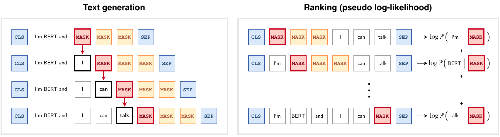
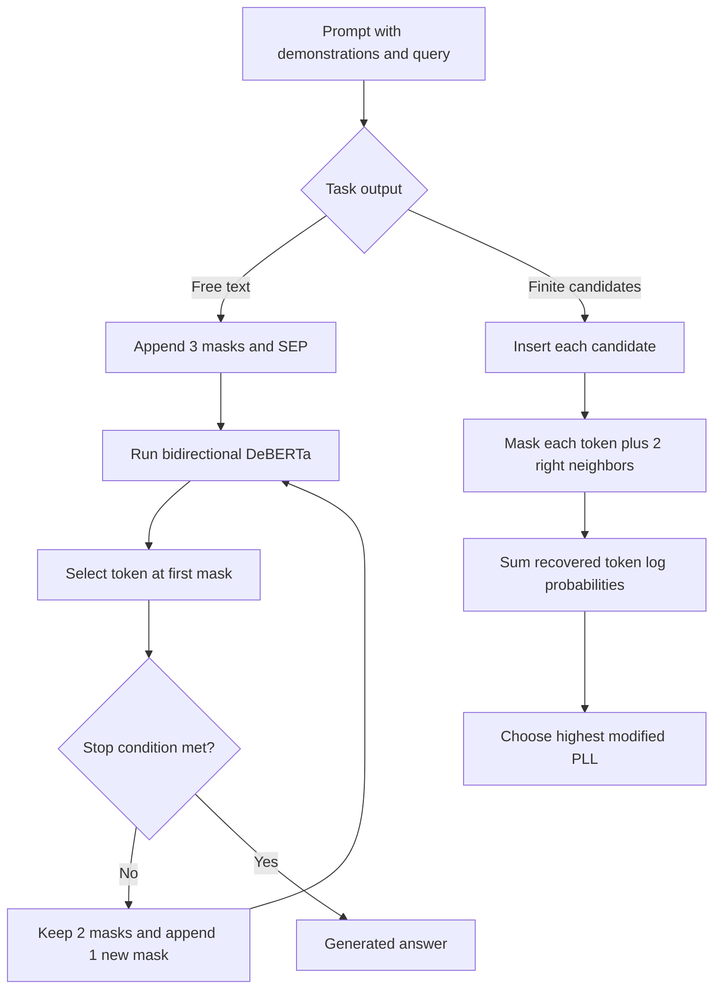
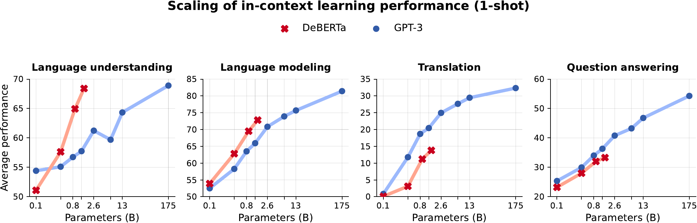
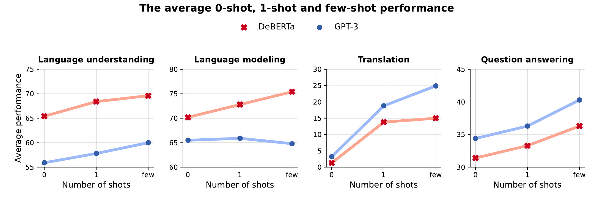

# BERTs Are Generative In-Context Learners - Samuel, 2024

> **arXiv:** 2406.04823v2 · **Venue:** NeurIPS 2024 · **Affiliation:** Language Technology Group, University of Oslo

## TL;DR

An off-the-shelf masked language model can perform generative and multiple-choice in-context learning without fine-tuning or architectural changes. The paper turns DeBERTa into a left-to-right generator by repeatedly predicting the first of three trailing mask tokens, and ranks candidate answers with a modified pseudo-log-likelihood that masks the scored token plus its next two tokens. At comparable model size, DeBERTa is stronger than GPT-3 on the paper's language-understanding and completion groups but markedly weaker on translation and closed-book question answering, showing complementary rather than interchangeable behavior.

## Problem & motivation

In-context learning became closely associated with causal language models after GPT-3: place task demonstrations in a prompt, append a query, and generate or score the answer without updating model weights. BERT-style masked language models (MLMs), despite their strong bidirectional representations, appeared unsuitable because their pretraining objective predicts holes in an otherwise visible sequence rather than a continuation. This encouraged a broad conclusion that encoder-only MLMs were obsolete for general prompting and generation.

The paper tests a narrower and more useful claim: does masked pretraining actually prevent in-context learning, or have standard inference interfaces simply failed to expose it? It evaluates public DeBERTa checkpoints from roughly 0.1B to 1.5B parameters using an evaluation suite patterned after GPT-3. No new pretraining, supervised fine-tuning, adapters, or task heads are introduced.

Two technical mismatches must be solved:

1. **Generation:** an MLM predicts a masked position but has no native next-token operation or causal key/value cache.
2. **Ranking:** a causal model can score a completion by the chain rule in one pass, whereas an MLM's token probabilities are conditioned on both left and right context and do not form an exact sequence likelihood.

The resulting study is not evidence that every BERT checkpoint is a practical drop-in replacement for a causal LM. It is evidence that generative in-context behavior can already be latent in a sufficiently large masked model and can be exposed by input formatting alone.

## Key idea

Let $c=(c_1,\ldots,c_n)$ be a prompt, $M$ the mask token, and $S$ the separator token seen at the end of DeBERTa pretraining examples. For generation step $t$, with generated prefix $y_{<t}$, construct

$$
z_t=[\mathrm{CLS}]\oplus c\oplus y_{<t}\oplus M\oplus M\oplus M\oplus S.
$$

Run the unchanged MLM and use the distribution at the **leftmost** mask as the next-token distribution:

$$
p(y_t\mid c,y_{<t})
=p_{\text{MLM}}\!\left(y_t\mid z_t,\operatorname{pos}(M_1)\right).
$$

After selecting $y_t$, replace $M_1$ with that token, shift the two remaining masks left, append a fresh mask before $S$, and rerun the entire model. The extra masks buffer the predicted position from the end separator; Table 5 shows that this is essential rather than decorative.

For ranking, consider a candidate completion $w=(w_0,\ldots,w_k)$. A causal LM computes an exact conditional log-likelihood

$$
\log p(w\mid c)=\sum_{i=0}^{k}\log p(w_i\mid c,w_{<i}).
$$

A conventional MLM pseudo-log-likelihood (PLL) instead masks each candidate token in turn while exposing all other candidate tokens:

$$
\operatorname{PLL}(w\mid c)
=\sum_{i=0}^{k}\log p_{\text{MLM}}
\left(w_i\mid c,w_{<i},M,w_{>i}\right).
$$

Strong local dependencies can make this estimate pathological, especially when one word spans several subword tokens. The paper's modified PLL also masks the next two candidate positions:

$$
\operatorname{PLL}_3(w\mid c)
=\sum_{i=0}^{k}\log p_{\text{MLM}}
\left(w_i\mid c,w_{<i},M_i,M_{i+1},M_{i+2},w_{>i+2}\right),
$$

with nonexistent positions near the end omitted. This weakens local leakage while retaining distant bidirectional evidence.

*Paper Figure 2. Generation repeatedly fills the leftmost mask while maintaining two look-ahead masks before `[SEP]`. Ranking makes one forward pass per candidate token, masking that position and up to two positions to its right, then sums the recovered token log-probabilities.*

## How it works

### Generative inference

1. Format zero-, one-, or few-shot demonstrations and the query as ordinary text.
2. Tokenize the prompt with DeBERTa's tokenizer and wrap it with `[CLS]` and `[SEP]`.
3. Insert three `[MASK]` tokens immediately before `[SEP]`.
4. Run DeBERTa and read logits only at the first mask.
5. Select a token. Main generative benchmarks use beam search with four beams; qualitative appendix examples use nucleus sampling with `top_k=64`, `top_p=0.9`, and temperature 0.2.
6. Replace the first mask with the selected token, append a new mask before `[SEP]`, and repeat until the task's stopping rule or output limit is reached.

The special separator is retained because DeBERTa always saw it during pretraining. One mask directly beside it encourages premature punctuation or termination. Two additional masks create room for a continuation: on one-shot German-to-English translation, one, two, three, and four masks score 10.0, 22.4, 23.7, and 23.9 SacreBLEU respectively (Appendix Table 5).

This procedure is autoregressive in output order but **not** a causal attention computation. Every pass remains fully bidirectional, and all hidden states are recomputed after each generated token. Standard decoder key/value caching is invalid because adding a token changes the right context visible to every earlier position.

### Candidate ranking

For a classification or multiple-choice task, render each candidate answer as a completion of the same prompt. For each candidate of $k+1$ tokens, create $k+1$ variants. Variant $i$ masks token $i$ and the next two tokens, runs the MLM, and records the log-probability assigned to the original token $w_i$ at its masked position. Sum these terms and choose the highest-scoring candidate.

This costs one full forward pass per candidate token rather than one causal pass per candidate. For ARC and OpenBookQA, the evaluation follows GPT-3's normalized scoring choice by dividing conditional completion probability by the completion's probability under an answer-only context. Appendix Table 6 validates the local masking change on zero-shot ReCoRD: one-mask PLL scores 80.9 EM / 81.6 F1, while three-mask PLL reaches 87.1 / 87.9.

### Prompting and task routing

The evaluation follows GPT-3's task splits, metrics, and prompts where possible. Random few-shot demonstrations are sampled without replacement from the training split and joined in the prompt. Because the DeBERTa tokenizer does not preserve actual newline characters, the implementation replaces them with a literal escaped `\n` marker.

- **Generation** is used for WMT translation and closed-book Natural Questions, TriviaQA, and Web Questions.
- **Ranking** is used for SuperGLUE, HellaSwag, StoryCloze, Winograd/WinoGrande, PIQA, ARC, and OpenBookQA.
- Translation alone uses a different, more informative prompt because the GPT-3 template failed to produce meaningful DeBERTa outputs.

### Scaling and long prompts

The study evaluates DeBERTa Base, Large, XLarge, and XXLarge checkpoints, described as approximately 0.1B, 0.4B, 0.9B, and 1.5B parameters. Main table captions sometimes call the largest model 1.4B; the recap retains the paper's more frequent 1.5B family label while noting this inconsistency.

DeBERTa was pretrained at length 512 but uses bucketed relative positions. A RULER-style needle test suggests that it can retrieve a six-digit value beyond that training length more gracefully than OPT, whose learned absolute-position range imposes a hard limitation. This does not make arbitrarily long contexts reliable: Appendix D reports that SuperGLUE performance declines after eight or more demonstrations, attributed partly to imperfect processing beyond 512 tokens.

*Paper Figure 1. Both model families improve roughly log-linearly with size, but the objective-dependent profile differs: DeBERTa leads at comparable scale on understanding and completion, while GPT-3 leads on translation and question answering. Points are task-group averages rather than a single common metric.*

## Training / data

The paper performs **no model training**. It reuses public DeBERTa checkpoints with unchanged weights and provides fixed Hugging Face conversions that expose the generation interface and correct bugs in the original modeling script.

The underlying DeBERTa family was pretrained on about 78 GB after deduplication: English Wikipedia (12 GB), BookCorpus (6 GB), OpenWebText (38 GB), and STORIES (31 GB; the individually reported rounded sizes exceed the stated deduplicated total). It processed about one trillion input tokens, with MLM loss applied to 15%, and used a maximum pretraining length of 512. The paper estimates training compute for the largest checkpoint at roughly $8.0\times10^{21}$ FLOPs.

The GPT-3 comparison is historical and approximate, not a controlled retraining study. GPT-3 used a broader corpus including filtered Common Crawl, WebText2, books, and Wikipedia; the paper cites 300 billion training tokens and roughly $2.4\times10^{21}$ FLOPs for GPT-3 1.3B. Architecture, objective, data composition, tokenization, and training compute therefore differ simultaneously.

Evaluation covers four groups:

| Group | Benchmarks | Inference |
|---|---|---|
| Language understanding | Eight SuperGLUE tasks | Modified PLL ranking |
| Completion / Winograd | HellaSwag, StoryCloze, Winograd, WinoGrande | Modified PLL ranking |
| Translation | WMT14 French-English; WMT16 German-English and Romanian-English, both directions | Four-beam generation |
| QA / commonsense | Natural Questions, TriviaQA, WebQuestions; PIQA, ARC-E/C, OpenBookQA | Generation for closed-book QA; ranking otherwise |

Zero-shot uses no completed demonstration, one-shot uses one, and few-shot uses a task-specific count from 4 to 96. The codebase contains separate evaluation scripts for these task groups and the needle test.

## Results

At comparable scale, the largest DeBERTa and GPT-3 models have sharply different strengths. The following are task-group averages from paper Tables 1-4; all individual tasks use their native accuracy or BLEU metric, so averages should be interpreted only within a group.

| Task group | Setting | GPT-3 1.3B | DeBERTa ~1.5B | Source |
|---|---|---:|---:|---|
| SuperGLUE | 0-shot | 55.9 | **65.4** | Table 1 |
| SuperGLUE | 1-shot | 57.8 | **68.4** | Table 1 |
| SuperGLUE | few-shot | 60.0 | **69.6** | Table 1 |
| Completion / Winograd | 0-shot | 65.5 | **70.2** | Table 2 |
| Completion / Winograd | 1-shot | 65.9 | **72.8** | Table 2 |
| Completion / Winograd | few-shot | 64.8 | **75.4** | Table 2 |
| Translation | 0-shot | **3.2** | 1.3 | Table 3, SacreBLEU |
| Translation | 1-shot | **18.8** | 13.8 | Table 3, SacreBLEU |
| Translation | few-shot | **24.9** | 15.0 | Table 3, SacreBLEU |
| QA / commonsense | 0-shot | **34.4** | 31.4 | Table 4 |
| QA / commonsense | 1-shot | **36.3** | 33.3 | Table 4 |
| QA / commonsense | few-shot | **40.3** | 36.3 | Table 4 |

The largest one-shot DeBERTa reaches 68.4 on the paper's SuperGLUE average, near the 68.9 reported for GPT-3 175B, but this is not parity with supervised adaptation: the paper notes that fine-tuned DeBERTa is more than 20 points higher. Within the completion group, few-shot DeBERTa scores 62.5 HellaSwag, 84.8 StoryCloze, 85.6 Winograd, and 68.8 WinoGrande (Table 2).

The opposite pattern appears for tasks requiring multilingual generation or memorized facts. Few-shot DeBERTa averages 15.0 SacreBLEU across six translation directions versus GPT-3's 24.9 (Table 3). On the three generated closed-book QA tasks, its few-shot exact-match scores are 4.4 Natural Questions, 17.9 TriviaQA, and 9.9 WebQuestions, versus GPT-3's 9.7, 32.1, and 19.6 (Table 4). The paper hypothesizes that DeBERTa's smaller, mostly English corpus contributes to translation weakness and that bidirectional pretraining may reduce pressure to store retrievable facts in parameters; these are interpretations, not controlled causal findings.

*Paper Figure 4. More demonstrations generally help both objectives. DeBERTa preserves its advantage on understanding and completion, while GPT-3 preserves its advantage on translation and QA, reinforcing the paper's complementary-objectives conclusion.*

The implementation ablations directly support the proposed formatting:

| Inference choice | Result | Source |
|---|---:|---|
| Generation with 1 mask | 10.0 de-to-en SacreBLEU | Table 5, one-shot |
| Generation with 3 masks | **23.7** de-to-en SacreBLEU | Table 5, one-shot |
| Generation with 4 masks | 23.9 de-to-en SacreBLEU | Table 5, one-shot |
| Gibbs sampling, mask initialization | 2.6 de-to-en SacreBLEU | Table 5, one-shot |
| Standard 1-mask PLL | 80.9 EM / 81.6 F1 | Table 6, zero-shot ReCoRD |
| Proposed 3-mask PLL | **87.1 EM / 87.9 F1** | Table 6, zero-shot ReCoRD |
| Exact left-to-right score | 77.2 EM / 77.8 F1 | Table 6, zero-shot ReCoRD |

These results establish capability, not efficiency. Generating $T$ tokens requires $T$ full bidirectional passes over a growing sequence; scoring a candidate of length $k$ requires $k$ passes. A causal decoder normally generates with cached keys and values and scores all completion positions in one teacher-forced pass.

## Limitations & follow-ups

- **Inference is expensive.** Bidirectional states cannot be cached under this procedure. Iterative generation and token-wise PLL ranking have much larger practical cost than standard causal inference even though each Transformer pass retains quadratic sequence complexity.
- **The comparison is confounded.** DeBERTa and GPT-3 differ in data, token budget, compute, tokenizer, architecture, positional encoding, and objective. Results cannot isolate masked versus causal pretraining as the cause of every difference.
- **Prompts favor the comparator.** Most prompts come from GPT-3, but translation needed a replacement because the original template failed for DeBERTa. Prompt sensitivity limits claims of architecture-wide superiority.
- **Model scope is narrow.** The experiments use one MLM family. DeBERTa's scale and relative positions are unusual among encoder checkpoints, so the title's plural "BERTs" should not be read as proof for all masked models.
- **Generation quality is only lightly tested.** Quantitative free generation is mostly translation and short-answer QA; open-ended examples are qualitative. There is no broad evaluation of coherence, factuality, toxicity, repetition, calibration, or long-form stopping.
- **PLL is not a probability.** Modified PLL is a ranking heuristic, not a normalized sequence likelihood. It needs one pass per token and can remain sensitive to segmentation, candidate length, and local dependence.
- **Long-context evidence is limited.** Relative positions enable extrapolation beyond 512 tokens, but the needle test does not establish robust reasoning at long lengths, and SuperGLUE degrades beyond roughly eight demonstrations in the controlled shot-count analysis.
- **Reproducibility labels are inconsistent.** The paper alternates between 1.5B in prose and 1.4B in main table captions for the largest DeBERTa checkpoint. The released model identifier is the more reliable way to pin experiments.

The most direct follow-ups are training masked models with generation-aware boundary formatting, distilling PLL into a single-pass scorer, selectively updating only affected hidden states, and combining bidirectional encoding with cacheable causal generation. BART, T5, prefix LMs, GLM, and UL2 already explore neighboring hybrid objectives, but this paper's contribution is specifically to expose generation in an unchanged masked checkpoint.

## Links

- **arXiv:** [abs](https://arxiv.org/abs/2406.04823v2) · [html](https://arxiv.org/html/2406.04823v2) · [pdf](https://arxiv.org/pdf/2406.04823v2)
- **Code:** [ltgoslo/bert-in-context](https://github.com/ltgoslo/bert-in-context)
- **Hugging Face:** [DeBERTa XXLarge fixed](https://huggingface.co/ltg/deberta-xxlarge-fixed) · [Base](https://huggingface.co/ltg/deberta-base-fixed) · [Large](https://huggingface.co/ltg/deberta-large-fixed) · [XLarge](https://huggingface.co/ltg/deberta-xlarge-fixed)
- **Project page:** [GitHub repository](https://github.com/ltgoslo/bert-in-context)
- **Blog posts:** —
- **Talks / videos:** —
- **OpenReview / venue page:** [NeurIPS 2024](https://openreview.net/forum?id=BCA9NMZkLS)
- **Papers-with-Code:** [BERTs are Generative In-Context Learners](https://paperswithcode.com/paper/berts-are-generative-in-context-learners)
- **BibTeX:** [official repository citation](https://github.com/ltgoslo/bert-in-context#please-cite-the-following-publication)
- **Related / predecessor papers:** [BART](bert-generation_2019_bart.md) · [T5](backbone_2019_t5-prefix-lm.md) · [BERT-family overview](../bert/overview.md#168-restoring-generation-with-a-decoder-and-probing-generation-without-one) · [DeBERTa](https://openreview.net/forum?id=XPZIaotutsD) · [Masked LM scoring](https://aclanthology.org/2020.acl-main.240/) · [BERT as a Markov random field](https://aclanthology.org/W19-2304/)