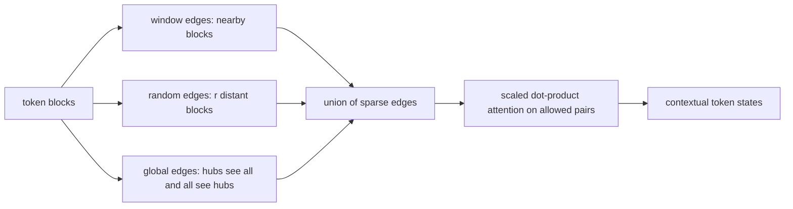
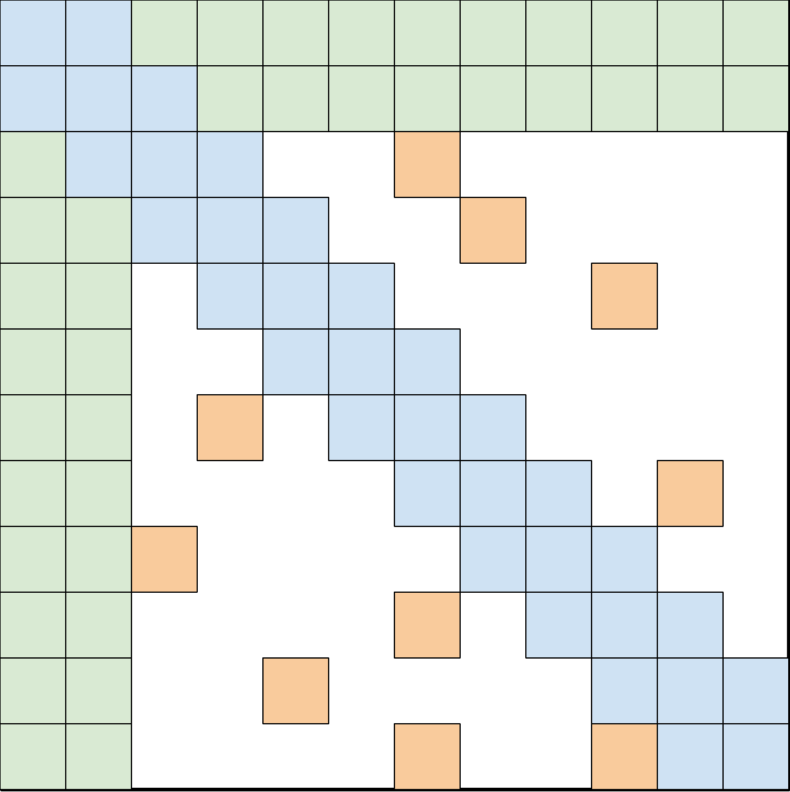
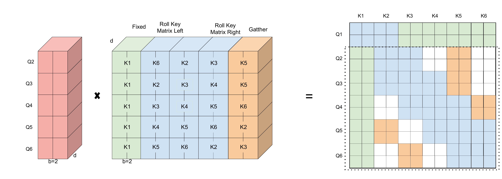
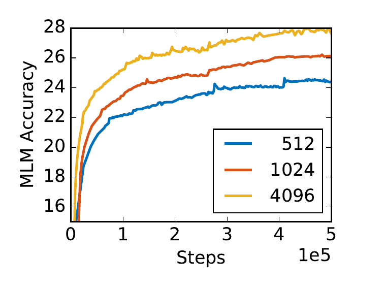

# BigBird — Zaheer et al., 2020

> **arXiv:** 2007.14062v2 · **Venue:** NeurIPS 2020 · **Affiliation:** Google Research

## TL;DR
BigBird replaces complete self-attention with the union of local-window, random, and global connections, reducing the number of attended pairs from quadratic to linear when their widths remain fixed. Its theory establishes that a sparse Transformer containing a star-shaped global token remains a universal approximator and that a sparse encoder-decoder can be Turing complete under arbitrary precision, while also proving a conditional task-specific depth lower bound. Practically, block sparsity enables 4,096-token encoders that improve long-document QA, classification, summarization, and genomic sequence modeling.

## Problem & motivation
Full attention treats the $n$ input positions as a complete directed graph and evaluates all $n^2$ query-key pairs. This is useful because any token can communicate with any other in one layer, but memory and computation make 512-token BERT-style encoders the practical norm. Long documents and DNA fragments routinely exceed that limit, and decisive evidence may be far from the beginning.

Sparse attention reduces cost, but sparsity raises two different questions. First, what graph gives local modeling and fast long-range information flow on accelerators? Second, does deleting most edges fundamentally weaken the Transformer? BigBird answers the engineering question with a small-world-inspired graph and the expressivity question with universal-approximation and Turing-completeness results, then explicitly shows that sparse attention still has hard cases.

## Key idea
Let $D=(V,E)$ be a directed attention graph over positions $V=\{1,\ldots,n\}$, and let $N(i)$ be the keys visible to query $i$. A generalized multi-head attention layer is

$$
\operatorname{Attn}_D(X)_i
=x_i+\sum_{h=1}^{H}
\sigma\!\left(Q_h(x_i)K_h(X_{N(i)})^\top\right)
V_h(X_{N(i)}),
$$

where $X\in\mathbb R^{n\times d}$, $Q_h,K_h:\mathbb R^d\to\mathbb R^m$, $V_h:\mathbb R^d\to\mathbb R^d$, $H$ is the number of heads, and $\sigma$ is softmax or hardmax. Full attention sets $N(i)=V$. BigBird instead uses

$$
E=E_{\mathrm{window}}\cup E_{\mathrm{random}}\cup E_{\mathrm{global}}.
$$

With $w$ local neighbors, $r$ random neighbors, and $g$ global positions, the graph has

$$
O\bigl(n(w+r+g)\bigr)
$$

edges and therefore linear attention cost in $n$ when $w,r,g$ are constants.

## How it works

### The three edge families

**Window attention** joins each position to $w/2$ positions on either side, preserving locality and a high clustering coefficient. **Random attention** gives each query $r$ sampled distant keys, reducing graph diameter and encouraging rapid mixing. **Global attention** makes a small set of positions attend to every token and be attended by every token, creating two-hop document-wide paths.

BigBird defines two global constructions. In **ITC** (internal Transformer construction), some existing sequence positions become global. In **ETC** (extended Transformer construction), extra global tokens are prepended, creating dedicated capacity for document, question, paragraph, sentence, or answer-candidate representations. The latter follows the global/long design of [ETC](bert-long-context_2020_etc.md), including relative relations and optional CPC in task systems.

The building-block ablation at length 512 shows why all three ideas matter. Full BERT-base obtains MLM 64.2, SQuAD 88.5, and MNLI 83.4. Random-only gives 60.1/83.0/80.2, window-only 58.3/76.4/73.1, and random-plus-window 62.7/85.1/80.5 (Table 1). Local and random edges approach dense attention but do not recover it; the theory and downstream systems motivate adding global hubs.

### Block-sparse implementation

Individual random token lookups underutilize GPUs and TPUs, so implementation operates on blocks of $b$ consecutive positions. Reshape queries and keys from $n\times d$ to

$$
Q',K'\in\mathbb R^{\lceil n/b\rceil\times b\times d}.
$$

For each query block, concatenate key blocks from three sources: fixed global blocks, locally rolled copies of $K'$, and $r$ gathered random blocks. This yields

$$
K''\in\mathbb R^{\lceil n/b\rceil\times (g+w+r)b\times d}.
$$

A batched dense multiplication between $Q'$ and $K''$ forms

$$
S\in\mathbb R^{\lceil n/b\rceil\times b\times(g+w+r)b}
$$

at cost $O(n(g+w+r)bd)$. Rolling implements local windows without gathers; only the small random component requires irregular gather operations.

The symbols $g,w,r$ in implementation tables count blocks or the equivalent tokens depending on the table. For the common ITC base configuration, $b=64$, global span $2b=128$, window span $3b=192$, and random span $3b=192$ (three random blocks). This distinction prevents interpreting “$r=192$” as 192 separately sampled blocks.

### Universal approximation

Add auxiliary token $x_0$ and define a star graph $S$ in which each ordinary position attends to itself and node 0, while node 0 attends to all ordinary positions. For $1<p<\infty$, let $\mathcal F_{CD}$ be continuous maps $[0,1]^{n\times d}\to\mathbb R^{n\times d}$ under the integrated $\ell_p$ distance. Theorem 1 states that for any $f\in\mathcal F_{CD}$ and $\epsilon>0$, a sparse Transformer $g\in\mathcal T_D^{H,m,q}$ exists such that

$$
d_p(f,g)\le\epsilon
$$

whenever $D$ contains $S$. The proof discretizes the domain, constructs a unique contextual code by repeatedly routing selective shifts through the global token, and approximates the modified hard operations with ordinary softmax and ReLU layers.

This is an existence result, not a guarantee that a fixed-size trained BigBird discovers the approximation efficiently. It specifically explains why a global hub is sufficient for theoretical universality; random expansion is an empirical/graph-connectivity design choice, not the theorem's key hypothesis.

### Turing completeness and the lower bound

The paper adapts an arbitrary-precision encoder-decoder Transformer simulation of a Turing machine, replacing full historical lookup with sparse staged aggregation. As with the dense result it builds on, arbitrary precision is essential; a finite-precision finite network is not literally an unbounded Turing machine.

The positive results do not make sparse and dense attention equally efficient on every function. Define the task that maps each unit vector $u_j$ to its furthest input vector,

$$
j^*=\arg\max_k\lVert u_k-u_j\rVert_2^2.
$$

One full-attention layer can compare every pair. Under the Orthogonal Vectors Conjecture, Proposition 1 states that any attention graph with $\widetilde O(n)$ inner products requires $\widetilde\Omega(n^{1-o(1)})$ layers for this task, while one full layer suffices. Sparse attention preserves broad expressivity but may exchange width of communication for depth.

### Encoder-decoder use

For summarization, only the encoder uses BigBird sparsity because outputs are roughly 200 tokens while inputs have medians above 3,000. The decoder retains full causal attention and full encoder-decoder attention. Base models lift from the paper's RoBERTa-initialized MLM encoder; large models lift from Pegasus, sharing compatible encoder/decoder self-attention and feed-forward weights and randomly initializing cross-attention.

## Training / data

NLP MLM pretraining warm-starts RoBERTa and uses Books (1.0B tokens), CC-News (7.4B), Stories (7.7B), and Wikipedia (3.1B), concatenating short documents and splitting documents beyond 4,096. Fifteen percent of tokens are masked. Base ITC and ETC have 12 layers, 12 heads, width 768, batch 256, Adam learning rate $10^{-4}$, 10K warmup, linear decay, GELU, and dropout/attention dropout 0.1 on $8\times8$ TPU v3 cores (Appendix Table 6). ITC uses block size 64; ETC uses block length 84, 256 added global tokens, and no random blocks. Large uses 24 layers, 16 heads, width 1,024, and batch 2,048.

QA fine-tuning uses 4,096 tokens. Base systems use batches 32–128; large systems search 3–10 epochs and learning rates $2\times10^{-5}$ to $10^{-4}$ depending on task (Appendix Tables 9–10). Global layouts encode questions, paragraphs, sentences, and candidates. Natural Questions windows longer articles at stride 2,048; TriviaQA trains against noisy string-matched answer spans; WikiHop scores candidate global tokens linked to textual mentions.

Document classification uses ITC with the same 64/128/192/192 token pattern, Adam, 10% warmup, linear decay, and task-specific learning rates/epochs (Appendix Table 11). Summarization uses encoder lengths 1,024 for XSum, 2,048 for CNN/DailyMail, and 3,072 for long datasets; BigBird-RoBERTa uses Adam at $10^{-5}$ and BigBird-Pegasus uses Adafactor at $10^{-4}$, both batch 128 (Appendix Table 14).

For genomics, a 32K SentencePiece/BPE vocabulary learned from human reference genome GRCh37 averages 8.78 base pairs per token. MLM pretraining compares 512- and 4,096-token contexts. The resulting encoder is fine-tuned for promoter detection and 919 chromatin-profile labels: 690 transcription-factor, 125 DNase-sensitivity, and 104 histone-mark targets.

## Results

### Pretraining and question answering

| Model | MLM held-out BPC, Base/Large | Source |
|---|---:|---|
| RoBERTa, length 512 | 1.846/1.496 | Appendix Table 7 |
| Longformer, length 4,096 | 1.705/1.358 | Appendix Table 7 |
| BigBird-ITC, length 4,096 | 1.678/1.456 | Appendix Table 7 |
| **BigBird-ETC, length 4,096** | **1.611/1.274** | Appendix Table 7 |

| QA test metric | BigBird-ETC | Strong comparison | Source |
|---|---:|---:|---|
| HotpotQA answer/support/joint F1 | 81.2/89.1/73.6 | HGN 82.2/88.5/74.2 | Table 3 |
| Natural Questions long/short F1 | **77.8**/57.9 | ReflectionNet 77.1/**64.1** | Table 3 |
| TriviaQA full/verified F1 | **84.5/92.4** | Fusion-in-Decoder 84.4/90.3 | Table 3 |
| WikiHop accuracy | **82.3** | Longformer 81.9 | Table 3 |

At submission, the single model set reported state of the art for Natural Questions long answer, TriviaQA, and WikiHop, while ranking third by HotpotQA F1. These are historical leaderboard comparisons with different task-specific systems.

### Classification and summarization

| Document classification | RoBERTa | BigBird | Prior reported best | Source |
|---|---:|---:|---:|---|
| IMDb micro-F1 | $95.0\pm0.2$ | $95.2\pm0.2$ | 97.4 | Appendix Table 12 |
| Arxiv micro-F1 | 87.42 | **92.31** | 87.96 | Appendix Table 12 |
| Patents micro-F1 | 67.07 | **69.30** | 69.01 | Appendix Table 12 |
| Hyperpartisan micro-F1 | $87.8\pm0.8$ | **$92.2\pm1.7$** | 90.6 | Appendix Table 12 |

| Long summarization | BigBird-Pegasus R-1/R-2/R-L | Pegasus reported | Source |
|---|---:|---:|---|
| Arxiv | **46.63/19.02/41.77** | 44.21/16.95/38.83 | Table 4 |
| PubMed | **46.32/20.65/42.33** | 45.97/20.15/41.34 | Table 4 |
| BigPatent | **60.64/42.46/50.01** | 52.29/33.08/41.75 | Table 4 |

On shorter XSum and CNN/DailyMail, BigBird-Pegasus is slightly below the re-evaluated dense Pegasus (Appendix Table 16), supporting the narrower conclusion that sparse long context is most beneficial when documents exceed ordinary limits.

### Genomics

| Genomics task | BigBird | Comparison | Source |
|---|---:|---:|---|
| DNA MLM BPC, length 4,096 | **1.12** | BERT-512 1.23; SRILM 1.57 | Table 5 |
| Promoter prediction F1 | **99.9** | DeePromoter 95.6 | Table 6 |
| Chromatin TF AUC | **96.1** | DeepSea 95.8 | Table 7 |
| Chromatin histone-mark AUC | **88.7** | DeepSea 85.6 | Table 7 |
| Chromatin DHS AUC | 92.1 | DeepSea **92.3** | Table 7 |

## Limitations & follow-ups

- Linear edge count does not automatically imply ideal wall-clock speed; block packing computes redundant dense work, and random gathers remain hardware-unfriendly.
- BigBird-ETC QA configurations use no random blocks, so those gains do not empirically validate random attention as necessary. They combine ETC-style structure, relative positions, CPC, long inputs, and scale.
- Global layouts and relation edges are task-designed. ITC is simpler, but ETC's strongest results require structured preprocessing.
- Universal approximation and Turing completeness are asymptotic existence results under permissive depth/precision assumptions, not statements about trainability, finite precision, or equal sample efficiency.
- The conditional furthest-vector lower bound proves a real worst-case separation: some all-pairs operations can lose the sparse efficiency advantage through required depth.
- Many comparisons change context length and initialization together. Long-document improvements should not be attributed solely to the random-edge component.
- BigBird still uses learned maximum lengths and fixed sparse topology; it does not dynamically retrieve arbitrary external context.
- Related local reviews: [Longformer](bert-long-context_2020_longformer.md) and [ETC](bert-long-context_2020_etc.md). [LongT5](https://arxiv.org/abs/2112.07916) later adapts local/global sparse attention to pre-trained text-to-text models.

## Links

- **Review thread:** [BERT-family overview](../bert/overview.md#162-making-bidirectional-attention-survive-long-documents)
- **arXiv:** [abs](https://arxiv.org/abs/2007.14062v2) · [html](https://arxiv.org/html/2007.14062v2) · [pdf](https://arxiv.org/pdf/2007.14062v2)
- **Code:** [google-research/bigbird](https://github.com/google-research/bigbird)
- **Hugging Face:** [BigBird documentation](https://huggingface.co/docs/transformers/model_doc/big_bird)
- **Project page:** —
- **Blog posts:** [Google Research overview](https://research.google/blog/constructing-transformers-for-longer-sequences-with-sparse-attention-methods/)
- **Talks / videos:** [NeurIPS page](https://proceedings.neurips.cc/paper/2020/hash/c8512d142a2d849725f31a9a7a361ab9-Abstract.html)
- **OpenReview / venue page:** [NeurIPS 2020 proceedings](https://proceedings.neurips.cc/paper/2020/hash/c8512d142a2d849725f31a9a7a361ab9-Abstract.html)
- **Papers-with-Code:** [Big Bird](https://paperswithcode.com/paper/big-bird-transformers-for-longer-sequences)
- **BibTeX:** [NeurIPS proceedings](https://proceedings.neurips.cc/paper/2020/hash/c8512d142a2d849725f31a9a7a361ab9-Abstract.html)
- **Related papers:** [Longformer](bert-long-context_2020_longformer.md) · [ETC](bert-long-context_2020_etc.md) · [Linformer](bert-long-context_2020_linformer.md) · [Reformer](bert-long-context_2020_reformer.md)
