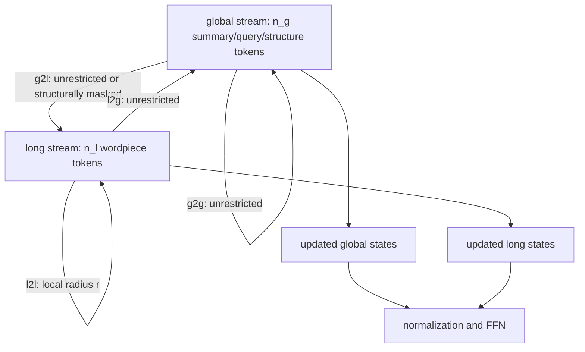
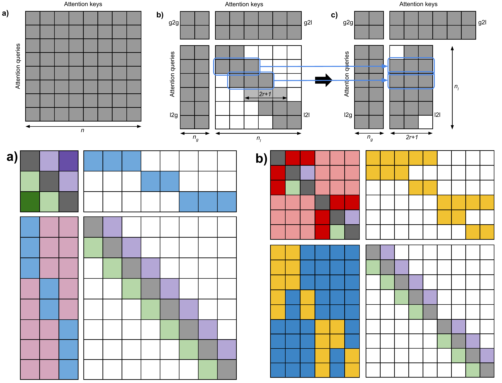
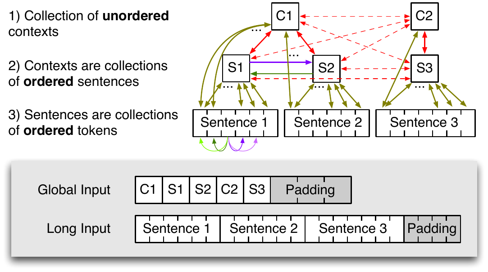
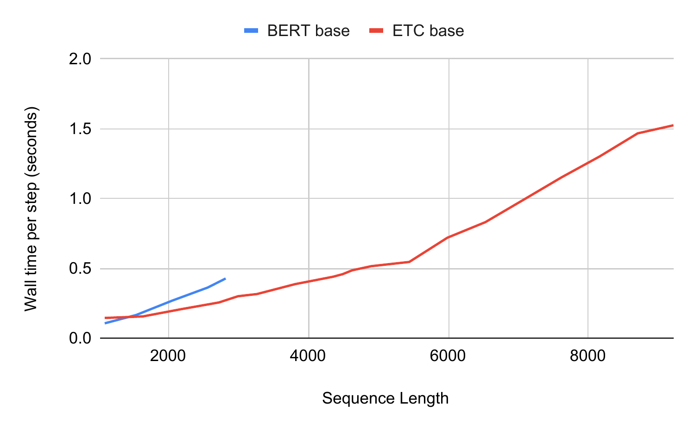
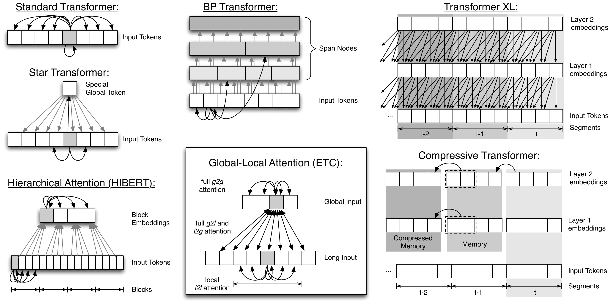

# ETC — Ainslie et al., 2020

> **arXiv:** 2004.08483v5 · **Venue:** EMNLP 2020 · **Affiliation:** Google Research

## TL;DR
Extended Transformer Construction (ETC) splits an input into a long token stream and a much shorter global stream of summary tokens. Long-to-long attention is local, while global-to-global and cross-stream attention are unrestricted, making cost linear in long-input length for bounded global size and radius. Relative relation labels, instance-specific masks, and a sentence-level contrastive pretraining objective let the same mechanism represent document hierarchy and other structured inputs, not only longer flat sequences.

## Problem & motivation
Standard attention is quadratic and usually caps BERT inputs near 512 wordpieces. ETC targets tasks where this loses decisive evidence: Natural Questions pairs a question with a full Wikipedia article; HotpotQA and WikiHop require reasoning across multiple contexts; OpenKP includes web-page hierarchy and visual structure. Their inputs are not merely long—the order between documents may be meaningless, sentence membership matters, and DOM nodes carry relations that flattening obscures.

Sparse local attention lowers cost but makes distant communication slow. A single undifferentiated set of global tokens can restore connectivity, yet it does not inherently say which sentence, paragraph, candidate, or DOM node each global token summarizes. ETC therefore treats sparse connectivity, relation labels, and hierarchical summary tokens as one design problem.

## Key idea
ETC receives two sequences:

$$
X^g=(x_1^g,\ldots,x_{n_g}^g),\qquad
X^l=(x_1^l,\ldots,x_{n_l}^l),\qquad n_g\ll n_l,
$$

where $X^l$ contains ordinary wordpieces and $X^g$ contains auxiliary global tokens. Every layer has four attention regions:

- global-to-global (g2g): unrestricted;
- global-to-long (g2l): unrestricted unless an instance mask narrows it;
- long-to-global (l2g): unrestricted;
- long-to-long (l2l): restricted to radius $r$.

Its attention complexity is

$$
O\!\left(n_g(n_g+n_l)+n_l(n_g+2r+1)\right).
$$

If $n_g=O(2r+1)$ and both are bounded relative to $n_l$, this becomes

$$
O(n_g^2+n_gn_l),
$$

linear in long-sequence length. Ordinary Transformer attention is recovered by placing every token in the global stream and setting $n_l=0$; thus existing BERT-family weights can be copied into ETC.

## How it works

### Global-local attention

For a g2g head, with $x_i^g\in\mathbb R^{d_x}$ and output $z_i^g\in\mathbb R^{d_z}$,

$$
z_i^g=\sum_{j=1}^{n_g}\alpha_{ij}^{g2g}x_j^gW^V,
$$

$$
\alpha_{ij}^{g2g}
=\frac{\exp(e_{ij}^{g2g})}
{\sum_{\ell}\exp(e_{i\ell}^{g2g})},
$$

$$
e_{ij}^{g2g}
=\frac{(x_i^gW^Q)(x_j^gW^K+a_{ij}^K)^\top}{\sqrt{d_z}}
-(1-M_{ij}^{g2g})C.
$$

Here $W^Q,W^K,W^V$ are learned projections, $a_{ij}^K$ is an embedding of the directed relation from $i$ to $j$, $M^{g2g}_{ij}\in\{0,1\}$ is an instance-specific permission mask, and $C=10{,}000$ suppresses forbidden logits. The other three regions use analogous equations. Implementations jointly normalize g2g with g2l for each global query and l2g with l2l for each long query, rather than applying four unrelated softmaxes.

The conceptual l2l score array has shape $n_l\times(2r+1)$. For accelerator-friendly execution, long tokens are split into blocks of $r+1$ queries; each block attends its own and adjacent key blocks, then invalid positions are masked. This performs somewhat redundant work but maps to ordinary batched matrix multiplication and avoids a custom sparse kernel.

### Relative position and relation labels

ETC removes learned absolute positions and assigns a label $l_{ij}$ to each directed query-key edge. For sequential offsets and clipping distance $k$,

$$
l_{ij}=l_{\operatorname{clip}(j-i,-k,k)},
$$

so the base positional vocabulary contains $2k+1$ labels. Each label maps to $a_l^K\in\mathbb R^{d_z}$ and modifies the key in the score equation. Since labels depend on relative distance, parameters do not depend on maximum input length.

The label vocabulary can additionally encode relations such as “word belongs to sentence,” “sentence belongs to document,” or “candidate token mentions this answer.” Masks can delete meaningless edges—for example, prevent local attention from crossing unordered document boundaries—while labels distinguish allowed edge types. Together they turn attention into message passing over a task-defined labeled graph.

### Constructing the hierarchy

A typical pretraining example places all wordpieces in $X^l$ and one summary token per sentence in $X^g$. A relation label links each summary to its words. Optional **hard g2l masking** lets a sentence summary read only its own sentence, forcing it to become a local aggregate, while long tokens can still read all global summaries through l2g. At fine-tuning time the global stream can also contain `[CLS]`, mirrored question tokens, paragraph and sentence summaries, answer candidates, or DOM nodes.

This is asymmetric by design. Global summaries may be constrained to their member tokens, but every long token can consult all summaries. Two ordinary tokens in distant sections communicate in two hops through global states rather than through many local layers.

### Contrastive Predictive Coding for global tokens

MLM directly trains long-token states but gives sentence summaries no dedicated target. ETC adds sentence-level Contrastive Predictive Coding (CPC):

1. Select 10% of sentences and mask their wordpieces in a full-document encoder, leaving their global summary tokens visible.
2. Encode each original masked sentence independently with an auxiliary encoder whose single global token can see that sentence and nothing else.
3. Make the contextual document summary identify its matching isolated-sentence representation among in-batch negatives.

The paper specifies within-batch NCE but does not publish its internal scoring equation. Writing contextual and target sentence representations as $h_s$ and $t_s$, its stated matching problem can be expressed abstractly as

$$
\mathcal L_{\mathrm{CPC}}
=-\sum_s\log
\frac{\exp(s(h_s,t_s))}
{\sum_{u\in\mathcal B}\exp(s(h_s,t_u))},
$$

where $\mathcal B$ supplies the matching target and random in-batch negatives and $s(\cdot,\cdot)$ denotes the unspecified matching score. The training mixture weights MLM by 0.8 and CPC by 0.2. CPC plays for global summaries a role analogous to MLM for individual tokens.

### Weight lifting and model sizes

BERT or RoBERTa query/key/value, feed-forward, normalization, and output projections are copied into corresponding global and long branches. Absolute-position embeddings and NSP parameters are discarded; relation embeddings and CPC-specific parameters start randomly. Separate projections increase capacity: default ETC-base has 166M parameters versus 109M when attention parameters are shared; ETC-large has 539M, or 558M with RoBERTa's vocabulary. Relative labels add only about 600K parameters when their vocabulary is doubled and do not grow with sequence length.

| Configuration | Layers | Hidden | Heads | Radius $r$ | Max sequential offset $k$ |
|---|---:|---:|---:|---:|---:|
| Base | 12 | 768 | 12 | 84 | 12 |
| Large | 24 | 1024 | 16 | 169 | 24 |

## Training / data

Pretraining uses English Wikipedia and BooksCorpus, filtering documents with fewer than seven sentences. Base processes approximately the original BERT token count; Large processes twice as many. Every sequence contains up to 4,096 long tokens plus one global token per sentence. Whole-word MLM first reserves sentences for CPC, then masks 15% of remaining tokens.

The paper reports 63K updates. Base trains batches of 512 sequences on 256 TPU v3 cores for 11h46m; Large trains batches of 1,024 on 512 TPU v3 cores for 63h41m. From-scratch runs use LAMB with learning rate $\sqrt{8}\times10^{-3}$. RoBERTa-lifted runs use a lower $2\times10^{-3}$ rate (Appendix training tables). The global-token counts are task-dependent: Natural Questions uses 128/230/460 for long lengths 512/4,096/8,192; HotpotQA 256; WikiHop 430; OpenKP 512.

Fine-tuning puts questions and documents in the long stream and mirrors task structure into global tokens and edge labels. Natural Questions predicts long span, short span, and answer type; HotpotQA predicts answer span and supporting sentences; WikiHop scores global answer-candidate tokens linked to textual mentions; OpenKP scores one-to-five-token phrases and augments DOM global nodes with bucketed visual features.

Typical searches use learning rates $10^{-5}$–$7\times10^{-5}$ and 2–15 epochs depending on task. Reported base fine-tuning takes 10h47m for Natural Questions, 2h59m for HotpotQA, 5h55m for 15-epoch WikiHop, and 2h05m for OpenKP on TPU v3 configurations (Appendix).

## Results

### Natural Questions and length scaling

| Model/configuration | Long length | Long-answer F1 | Short-answer F1 | Source |
|---|---:|---:|---:|---|
| BERT-base | 512 | 0.634 | 0.475 | Table 2 |
| ETC-base, shared/no CPC/no hard g2l | 512 | 0.645 | 0.478 | Table 2 |
| Same ETC configuration | 4,096 | 0.692 | 0.497 | Table 2 |
| ETC-base default | 4,096 | 0.725 | 0.522 | Table 2 |
| ETC-base | 8,192 | 0.740 | 0.542 | Table 2 |
| ETC-base, 2× pretraining | 4,096 | **0.746** | **0.558** | Table 2 |
| ETC-large | 4,096 | 0.761 | 0.565 | Table 2 |
| **ETC-large, RoBERTa lifted** | 4,096 | **0.782** | **0.585** | Table 2 |

Length alone raises the controlled ETC configuration's long-answer F1 from 0.645 at 512 to 0.692 at 4,096. In the default family, moving to 8,192 reaches 0.740/0.542. Doubling radius, relative-label range, or pretraining also helps, but lifting RoBERTa into Large produces the strongest development result. On the official leaderboard at submission, ETC records 0.7778 NQ long-answer F1 (first) and 0.5786 short-answer F1 (18th), per Table 5.

### Structure-sensitive tasks

| Development result | Base ETC | Large ETC + RoBERTa lift | Comparison | Source |
|---|---:|---:|---:|---|
| HotpotQA answer/support F1 | 0.751/0.869 | **0.813/0.894** | Longformer-large 0.788/0.860 | Table 3 |
| WikiHop accuracy | **75.9** (no hard g2l) | **79.8** | Longformer-large 77.6 | Table 3 |
| OpenKP F1@3 | **0.416** (max loss) | **0.423** | RoBERTa-JointKPE 0.398 | Table 4 |

Ablations show that structure is not one universally optimal mask. On HotpotQA, flattening structure while retaining CPC/hard g2l changes 0.751/0.869 to 0.748/0.870, but removing CPC and hard g2l together falls to 0.722/0.857. On WikiHop, hard g2l hurts; the best base score, 75.9, removes it, while a flat representation gives 70.7. On OpenKP, adding visual features and using the maximum score across repeated keyphrase occurrences provide important gains (Table 4).

Official single-model submissions rank first at the time of publication for NQ long answer (0.7778), HotpotQA supporting facts (0.8909), WikiHop (0.8225), and OpenKP (0.4205); HotpotQA overall is third at 0.7362 (Table 5). These historical ranks should not be read as current leaderboard standings.

## Limitations & follow-ups

- ETC requires task-specific construction of global tokens, relation labels, and four masks. This flexibility is powerful but shifts architecture design into data preprocessing.
- The global stream is fully connected to the long stream, so cost is linear only while $n_g$ stays small. Fine-grained structures can make $n_gn_l$ expensive.
- Separate global/long projections improve some tasks but increase ETC-base from 109M to 166M parameters; WikiHop sometimes favors sharing, suggesting overfitting on smaller datasets.
- Hard g2l masking helps Natural Questions and HotpotQA but hurts WikiHop. Structural assumptions must match the task rather than being applied mechanically.
- CPC requires a second sentence encoder and in-batch contrastive comparisons during pretraining. The paper does not isolate all additional compute from the architectural cost.
- The experiments stop at 8,192 tokens even though checkpointing permits longer inputs; encoder-decoder generation is explicitly left for future work.
- [Longformer](bert-long-context_2020_longformer.md) offers a simpler single-stream local/global interface and LED generation. [BigBird](https://arxiv.org/abs/2007.14062) later adds random sparse edges and formal expressivity/connectivity results.

## Links

- **Review thread:** [BERT-family overview](../bert/overview.md#162-making-bidirectional-attention-survive-long-documents)
- **arXiv:** [abs](https://arxiv.org/abs/2004.08483v5) · [html](https://arxiv.org/html/2004.08483v5) · [pdf](https://arxiv.org/pdf/2004.08483v5)
- **Code:** [google-research/etcmodel](https://github.com/google-research/google-research/tree/master/etcmodel)
- **Hugging Face:** —
- **Project page:** —
- **Blog posts:** —
- **Talks / videos:** [EMNLP presentation](https://slideslive.com/38938951)
- **OpenReview / venue page:** [ACL Anthology](https://aclanthology.org/2020.emnlp-main.19/)
- **Papers-with-Code:** [ETC](https://paperswithcode.com/paper/etc-encoding-long-and-structured-inputs-in)
- **BibTeX:** [ACL Anthology export](https://aclanthology.org/2020.emnlp-main.19.bib)
- **Related / contemporary papers:** [Longformer](bert-long-context_2020_longformer.md) · [BigBird](https://arxiv.org/abs/2007.14062)
