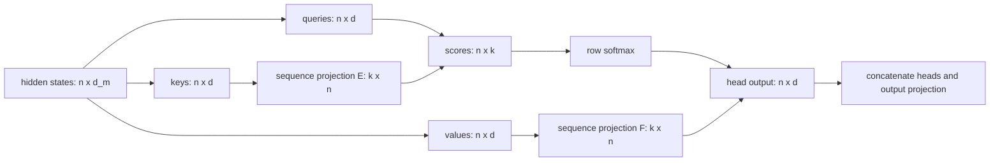
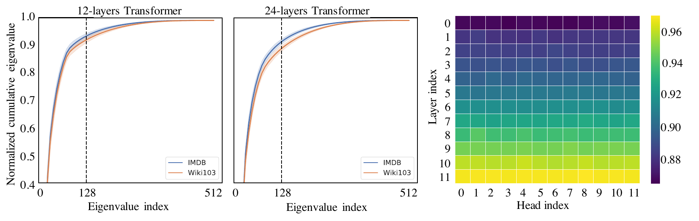
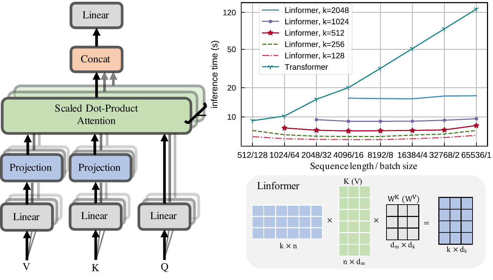
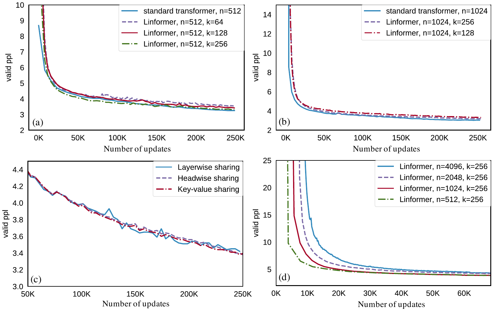

# Linformer — Wang et al., 2020

> **arXiv:** 2006.04768v3 · **Venue:** preprint · **Affiliation:** Facebook AI

## TL;DR
Linformer compresses the sequence dimension of keys and values from $n$ positions to a fixed rank $k\ll n$ before computing attention. The resulting attention map has shape $n\times k$ instead of $n\times n$, reducing attention time and activation memory to $O(nkd)$ and therefore linear in sequence length for fixed $k$ and hidden size $d$. Empirical spectrum measurements and Johnson–Lindenstrauss-based arguments motivate the approximation; BERT-scale MLM experiments show that $k=128$–256 can preserve downstream quality while substantially improving synthetic long-sequence inference speed and memory.

## Problem & motivation
For a head with queries, keys, and values in $\mathbb R^{n\times d}$, dense attention constructs an $n\times n$ context matrix. Both score computation and storing its softmax grow quadratically with sequence length. Sparse methods avoid many entries, but require a connectivity pattern or hashing mechanism and can have irregular hardware behavior.

Linformer asks whether attention can be compressed globally rather than sparsified. Its motivating observation is empirical: singular values of attention probability matrices from RoBERTa have a long-tailed spectrum, so a relatively small number of directions captures much of their cumulative magnitude. If that effective rank does not need to grow proportionally with $n$, projecting keys and values along the sequence axis can replace quadratic pairwise attention with a rectangular low-rank map.

## Key idea
For model width $d_m$, head key/value width $d$, and head $i$, ordinary attention is

$$
\operatorname{head}_i
=\underbrace{\operatorname{softmax}\!\left(
\frac{QW_i^Q(KW_i^K)^\top}{\sqrt d}
\right)}_{P\in\mathbb R^{n\times n}}
VW_i^V,
$$

where $Q,K,V\in\mathbb R^{n\times d_m}$, $W_i^Q,W_i^K\in\mathbb R^{d_m\times d}$, and $W_i^V\in\mathbb R^{d_m\times d}$. Linformer learns sequence projections $E_i,F_i$ and computes

$$
\overline{\operatorname{head}}_i
=\underbrace{\operatorname{softmax}\!\left(
\frac{QW_i^Q(E_iKW_i^K)^\top}{\sqrt d}
\right)}_{\bar P\in\mathbb R^{n\times k}}
\underbrace{F_iVW_i^V}_{\in\mathbb R^{k\times d}}.
$$

For the products as written, $E_i,F_i\in\mathbb R^{k\times n}$: they map the sequence axis from $n$ to $k$. The paper's prose prints $n\times k$ in places, while its equations sometimes use transposes; this recap follows the algebraically consistent operator orientation. Implementations may store the transpose.

The cost is $O(nkd)$ for scores and weighted values, plus $O(nkd)$ for projecting keys/values. Activation storage for attention probabilities is $O(nk)$ rather than $O(n^2)$. With $k$ independent of $n$, both are linear in sequence length.

## How it works

### Projected multi-head attention

For every layer:

1. Produce conventional $Q_i=QW_i^Q$, $K_i=KW_i^K$, and $V_i=VW_i^V$.
2. Compute compressed keys $\bar K_i=E_iK_i\in\mathbb R^{k\times d}$.
3. Compute compressed values $\bar V_i=F_iV_i\in\mathbb R^{k\times d}$.
4. Form $n\times k$ logits $Q_i\bar K_i^\top/\sqrt d$ and apply row-wise softmax.
5. Multiply by $\bar V_i$ to return one $d$-dimensional context vector for each of the $n$ original queries.
6. Concatenate heads and apply the ordinary output projection, residual path, normalization, and feed-forward block.

The method therefore changes only the key/value sequence axis. Queries remain at full resolution, so there is still one output per input position. Unlike sparse local attention, every query can depend on a learned mixture of every original key/value through each projected slot, but individual source positions are no longer independently addressable after compression.

### Projection sharing

The unshared design learns separate $E_i,F_i$ for every head and layer. The paper tests three reductions:

- **Headwise sharing:** each layer has one $E$ and one $F$ shared by all heads—24 matrices in a 12-layer model.
- **Key-value sharing:** each layer uses one $E=F$ across all heads—12 matrices.
- **Layerwise sharing:** one $E=F$ serves every head and every layer—one matrix total.

Layerwise sharing is the strongest compression and performs best in the reported four-task average. It also reduces projection parameters from $O(LHnk)$ to $O(nk)$ for $L$ layers and $H$ heads. The parameter count still depends on the configured maximum length $n$; “linear complexity” refers primarily to computation and attention activations, not a length-independent projection table.

The paper suggests smaller $k$ in upper layers because their spectra appear more concentrated, and mentions pooling or strided convolution as alternative projections, but does not experimentally establish those variants.

### The low-rank argument

Let

$$
A=\frac{QW_i^Q(KW_i^K)^\top}{\sqrt d},
\qquad P=\operatorname{softmax}(A).
$$

Theorem 1 considers one value column $w\in\mathbb R^n$. For a Gaussian Johnson–Lindenstrauss matrix $R\in\mathbb R^{k\times n}$ with entries $N(0,1/k)$, it constructs

$$
\widetilde P=PR^\top R.
$$

With

$$
k=\frac{5\log n}{\epsilon^2-\epsilon^3},
$$

the paper claims, with probability $1-o(1)$,

$$
\lVert\widetilde Pw-Pw\rVert
\le\epsilon\lVert Pw\rVert,
\qquad \operatorname{rank}(\widetilde P)\le k=\Theta(\log n).
$$

This is a statement about approximating $P$ **when applied to a specified value vector**, not necessarily approximating every entry of $P$ or its full operator norm. It motivates low-rank context computation but would still require an SVD or random projection after constructing dense $P$ if used directly.

Theorem 2 motivates projecting before attention. It claims that projection matrices exist such that each output row is approximated with relative error when

$$
k=\min\left\{
\Theta\!\left(\frac{9d\log d}{\epsilon^2}\right),
5\Theta\!\left(\frac{\log n}{\epsilon^2}\right)
\right\}.
$$

The first branch is independent of $n$. The proof uses Gaussian JL projections and the rank-$d$ score matrix, whereas practical Linformer learns $E$ and $F$ by gradient descent. Consequently, the theorem is motivation for the existence of compact projections, not a training guarantee for learned projections or a universal bound on all attention distributions.

### Fixed maximum length

A learned $k\times n$ projection is tied to its configured source length. Short examples can be padded/masked to $n$, but using a checkpoint at an unseen longer length requires extending, interpolating, or retraining the projections. Thus Linformer has linear cost at its supported length; it does not obtain length extrapolation automatically from the asymptotic theorem.

## Training / data

Experiments use a 12-layer, 12-head, width-768 BERT-base/RoBERTa-style encoder with MLM. BookCorpus plus English Wikipedia contains 3.3B words, matching the original BERT corpus. All compared in-house models use the same corpus, objective, and at most 250K updates, parallelized over 64 Tesla V100 GPUs with mixed precision (Section 5).

Pretraining varies maximum sequence length $n\in\{512,1024,2048,4096\}$ and projected rank, including $k\in\{64,128,256,512,1024,2048\}$ where valid. The principal comparison uses $k=128$ at $n=512$ and $k=256$ at $n=1024$; the length experiment fixes $k=256$ while increasing $n$ to 4,096. Exact optimizer learning rate, batch schedule, masking details, and total wall-clock compute are not fully specified in the paper, so they cannot be reconstructed from the paper alone.

Downstream fine-tuning covers SST-2 and IMDB sentiment, QNLI inference, and Quora Question Pairs similarity. The source reports development scores but does not provide a complete per-task fine-tuning hyperparameter table.

## Results

### Downstream quality

| Model | $n$ | $k$ | SST-2 | IMDB | QNLI | QQP | Average | Source |
|---|---:|---:|---:|---:|---:|---:|---:|---|
| RoBERTa-base, matched corpus | 512 | — | 93.1 | 94.1 | 90.9 | 90.9 | 92.25 | Table 2 |
| Linformer, unshared | 512 | 128 | 92.4 | 94.0 | 90.4 | 90.2 | 91.75 | Table 2 |
| Linformer, unshared | 512 | 256 | 93.2 | 94.0 | 90.6 | 90.5 | 92.08 | Table 2 |
| **Linformer, layerwise shared** | 512 | 256 | **93.1** | **94.1** | **91.2** | **90.8** | **92.30** | Table 2 |
| Linformer, layerwise shared | 1,024 | 256 | 93.2 | 94.2 | 90.8 | 90.5 | 92.18 | Table 2 |
| BERT-base | 512 | — | 92.7 | 93.5 | 91.8 | 89.6 | 91.90 | Table 2 |
| DistilBERT | 512 | — | 91.3 | 92.8 | 89.2 | 88.5 | 90.45 | Table 2 |

The best average exceeds the matched-corpus RoBERTa row by 0.05 point, too small to establish broad superiority without multiple-seed uncertainty. The stronger conclusion is near-parity across these four tasks despite severe sequence-axis compression. The $n=1{,}024,k=256$ result is also close to $n=512,k=256$, supporting the paper's claim that absolute $k$ matters more than the ratio $n/k$ within this range.

### Pretraining behavior

Per Figure 3, increasing $k$ consistently improves validation MLM perplexity. At $n=512$, $k=128$ is nearly on par with the dense Transformer; at $n=1{,}024$, $k=256$ is nearly on par. Layerwise sharing nearly matches unshared projection perplexity. With fixed $k=256$, converged perplexities remain approximately similar for $n=512,1{,}024,2{,}048,4{,}096$. The figure supports these qualitative statements but does not publish a table of exact terminal perplexities.

### Synthetic inference efficiency

| Sequence length | Speedup, $k=128$ | Speedup, $k=256$ | Memory factor, $k=128$ | Memory factor, $k=256$ | Source |
|---:|---:|---:|---:|---:|---|
| 512 | 1.5× | 1.3× | 1.7× | 1.5× | Table 3 |
| 2,048 | 2.6× | 2.4× | 6.1× | 5.6× | Table 3 |
| 4,096 | 3.4× | 3.2× | 14× | 13× | Table 3 |
| 8,192 | 5.5× | 5.0× | 28× | 26× | Table 3 |
| 16,384 | 8.6× | 7.8× | 56× | 48× | Table 3 |
| 65,536 | 20× | 18× | 60× | 52× | Table 3 |

These tests use randomly generated inputs and a 12-layer forward pass on one 16GB Tesla V100. “Memory saved” is inferred from the ratio of maximum fitting batch sizes, not direct peak-byte measurement. Only training lengths through 4,096 receive MLM experiments; 8K–65K rows establish kernel scaling rather than real-task quality at those lengths.

## Limitations & follow-ups

- Learned projections are tied to maximum sequence length and add $nk$ parameters per distinct projection. Linear runtime does not imply length-independent weights or automatic extrapolation.
- Compression mixes all source positions into $k$ slots before query-dependent scoring. Tasks requiring precise retrieval among many nearly independent positions may need larger $k$.
- The theory constructs random projections under per-vector/probabilistic error criteria, while the model learns shared projections. It does not prove that optimization finds them or that a fixed $k$ works for arbitrary data and attention heads.
- The empirical rank evidence measures cumulative singular values of RoBERTa attention matrices at $n=512$; it does not directly establish stable rank for much longer sequences.
- Real-task pretraining stops at 4,096, while the most dramatic 65,536-token speed/memory results use synthetic inputs.
- Only four downstream tasks are reported, with no long-document QA, token extraction, generation, or broad GLUE evaluation and no uncertainty across seeds.
- Training and fine-tuning recipes omit enough hyperparameters to prevent exact reproduction from the paper alone; no official implementation or checkpoint was released with the paper.
- [Longformer](bert-long-context_2020_longformer.md), [ETC](bert-long-context_2020_etc.md), and [BigBird](bert-long-context_2020_bigbird.md) preserve selected token-to-token edges rather than compressing all keys/values. [Performer](https://arxiv.org/abs/2009.14794) instead approximates the softmax kernel with random features.

## Links

- **Review thread:** [BERT-family overview](../bert/overview.md#162-making-bidirectional-attention-survive-long-documents)
- **arXiv:** [abs](https://arxiv.org/abs/2006.04768v3) · [html](https://arxiv.org/html/2006.04768v3) · [pdf](https://arxiv.org/pdf/2006.04768v3)
- **Code:** —
- **Hugging Face:** —
- **Project page:** —
- **Blog posts:** —
- **Talks / videos:** —
- **OpenReview / venue page:** —
- **Papers-with-Code:** [Linformer](https://paperswithcode.com/paper/linformer-self-attention-with-linear)
- **BibTeX:** [arXiv API](https://export.arxiv.org/api/query?id_list=2006.04768)
- **Related papers:** [Longformer](bert-long-context_2020_longformer.md) · [ETC](bert-long-context_2020_etc.md) · [BigBird](bert-long-context_2020_bigbird.md) · [Reformer](bert-long-context_2020_reformer.md) · [Performer](https://arxiv.org/abs/2009.14794)
