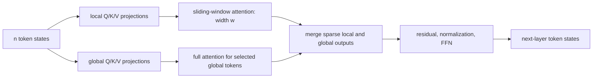
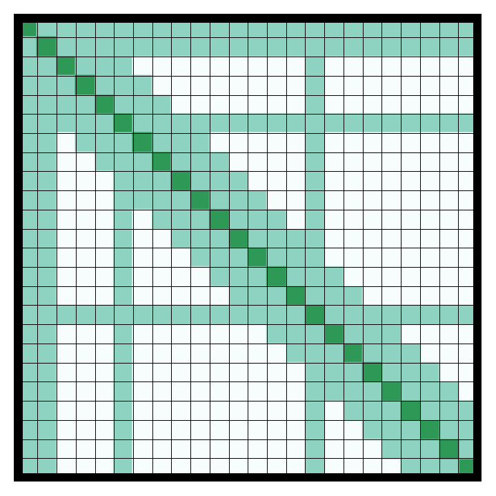
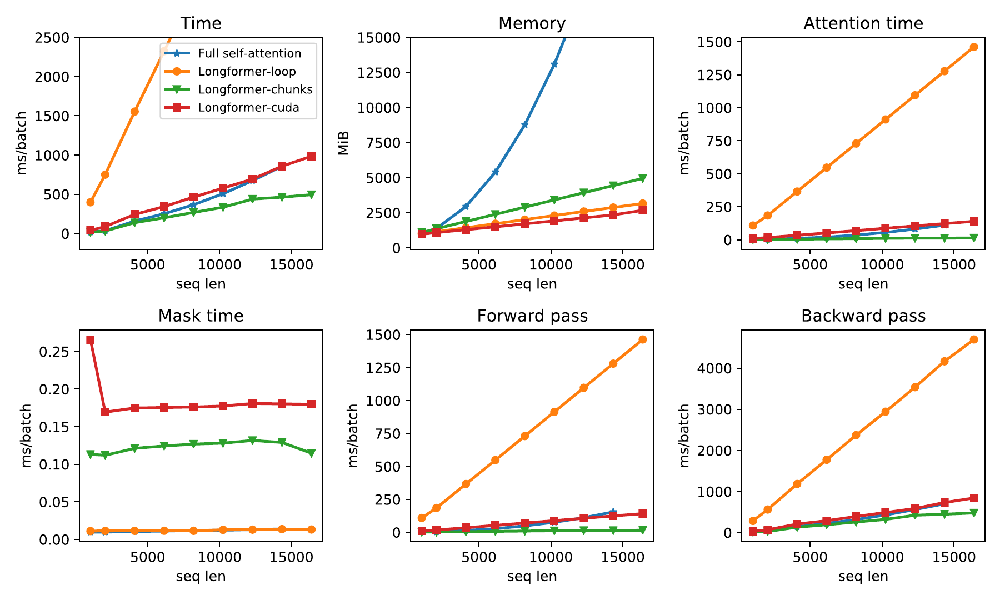
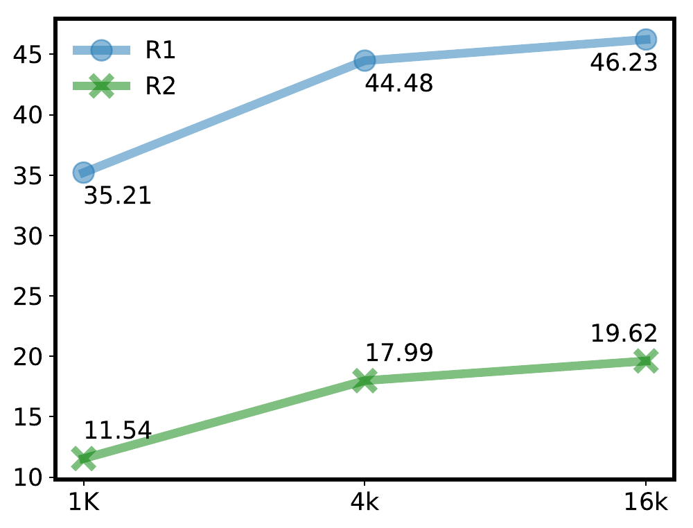

# Longformer — Beltagy, Peters, and Cohan, 2020

> **arXiv:** 2004.05150v2 · **Venue:** preprint · **Affiliation:** Allen Institute for AI

## TL;DR
Longformer replaces dense self-attention with a sparse pattern that combines a fixed-width sliding window with a small number of task-selected global tokens. Local attention keeps cost linear in sequence length, while global tokens provide document-wide communication for classification and question answering. Continued MLM pretraining converts RoBERTa into a 4,096-token encoder, and the same pattern converts BART into the Longformer Encoder-Decoder (LED) for inputs up to 16K tokens.

## Problem & motivation
Dense Transformer attention forms an $n\times n$ score matrix, requiring $O(n^2)$ memory and computation for sequence length $n$. BERT-style encoders were consequently limited to 512 wordpieces, even though evidence in multi-hop QA, coreference, news classification, and summarization can span thousands of tokens. Truncation loses evidence, independent chunks cannot communicate across boundaries, and retrieve-then-read pipelines introduce a separate recall bottleneck.

Earlier sparse or recurrent Transformers mainly targeted autoregressive language modeling. Longformer asks for a sparse attention operator that can replace BERT/RoBERTa attention, retain bidirectional encoding, initialize from existing checkpoints, and adapt its few long-range edges to each downstream task.

## Key idea
For layer input $X\in\mathbb R^{n\times d}$ and head dimension $d_k$, ordinary attention is

$$
\operatorname{Attn}(Q,K,V)=
\operatorname{softmax}\!\left(\frac{QK^\top}{\sqrt{d_k}}\right)V,
\qquad Q=XW_Q,\ K=XW_K,\ V=XW_V.
$$

Longformer does not compute every pair. With even local window width $w$, token $i$ attends only to

$$
\mathcal N_i^{\mathrm{local}}
=\left\{j:\lvert i-j\rvert\le \frac{w}{2}\right\}.
$$

If $G$ is the set of global positions, the allowed keys for a non-global query are

$$
\mathcal N_i=\mathcal N_i^{\mathrm{local}}\cup G,
$$

while every $i\in G$ attends to all $n$ positions. Global attention is symmetric: global tokens see every token and every token can see the global tokens. The per-layer attention cost is

$$
O(nw+n\lvert G\rvert),
$$

which is linear in $n$ when $w$ and $\lvert G\rvert$ are bounded. After $L$ nondilated layers, information can travel across a receptive field of roughly $Lw$ tokens.

## How it works

### Sparse attention pattern

The sliding window gives every token immediate left and right context. A dilated variant attends at stride $\delta$ within the same number of slots, increasing the receptive field to approximately $L\delta w$ without increasing the number of scores. Character-language-model experiments assign dilation to two of eight heads in upper layers and retain dense local sampling in the other heads, allowing fine and coarse dependencies simultaneously.

Global positions are configured by the task rather than learned by a routing algorithm. Classification marks `[CLS]`; TriviaQA marks question tokens; WikiHop marks question and answer-candidate tokens; HotpotQA marks question, title, and sentence-marker tokens. Coreference uses no global tokens. This produces a graph with cheap local edges plus a few hubs whose two-hop paths connect the whole document.

### Separate global projections

Local and global attention use separate parameter sets $(W_Q^s,W_K^s,W_V^s)$ and $(W_Q^g,W_K^g,W_V^g)$. The global matrices are initialized from the local matrices when converting RoBERTa. This lets global states specialize as information hubs. On WikiHop, removing separate projections reduces accuracy from 73.8 to 72.2; removing the useful global mechanism as well reaches 65.5 (Table 10).

### Efficient kernels

A dense implementation would erase the asymptotic benefit, so the paper provides three implementations:

1. **Loop:** compute one diagonal at a time. It is memory-efficient but 100–1,000 times slower and mainly useful as a correctness reference.
2. **Chunks:** split queries and keys into overlapping blocks, multiply complete blocks with optimized GEMM, then mask scores outside the local band. It is fast and portable but stores about twice the theoretically necessary scores; it does not support dilation.
3. **Custom CUDA/TVM kernel:** compute only the banded product. It supports dilation, has linear memory, and is used for the longest language-model runs.

### Converting RoBERTa into Longformer

RoBERTa's learned positional table ends at 512. Longformer expands it to 4,096 by repeatedly copying the original positions rather than randomly initializing the new rows. Before continued training, random extension yields validation BPC 10.299, whereas copying yields 1.957; RoBERTa at its original length gives 1.846 (Table 5). The copied periodicity is then resolved during long-sequence MLM training.

The attention weights, embeddings, feed-forward blocks, and normalization parameters come from RoBERTa. Dense self-attention is replaced with a nondilated window of 512, and global projections copy their local counterparts. After 65K continued-pretraining updates, validation BPC reaches 1.705 (Table 5). A variant that freezes RoBERTa and learns only position embeddings reaches 1.850, showing that adapting all layers matters.

### Longformer Encoder-Decoder

LED substitutes Longformer attention only in BART's encoder; its autoregressive decoder keeps ordinary causal self-attention and dense cross-attention. BART's 1K encoder position table is copied to 16K. The first encoder token receives global attention. The reported summarization model is initialized from BART and fine-tuned directly, without additional LED-specific pretraining.

## Training / data

### Character language modeling

The paper first isolates sparse attention on text8 and enwik8, each 100M characters with 90M/5M/5M train/dev/test splits. The small model has 12 layers, 8 heads, width 512, and 41M parameters; the large model has 30 layers and 102M parameters. Both use pre-layer normalization, GELU, AdamW, weight decay 0.01, gradient clipping 0.25, mixed precision, and gradient checkpointing (Appendix Table 12).

Training proceeds through five phases. It starts at length 2,048 with small windows, then repeatedly doubles sequence length and window size while halving the learning rate, eventually reaching 23,040 training characters and 32,256 at evaluation. The initial learning rate is $2.5\times10^{-4}$ and falls to $1.5625\times10^{-5}$; warmup occupies 10% of a phase up to 10K steps. The small run uses four RTX 8000 GPUs for 16 days and the large run eight GPUs for 13 days. Directly beginning with the longest sequence was harder to optimize, motivating this staged curriculum.

### Long-document MLM

Continued RoBERTa pretraining uses 6.8B English tokens: BooksCorpus (0.5B), Wikipedia (2.1B), selected long Realnews documents (1.8B), and Stories (2.1B), per Table 13. The mix retains data seen by RoBERTa while emphasizing documents long enough to exercise sparse attention.

Base and large variants train for 65K updates at sequence length 4,096 and batch size 64. The peak learning rate is $3\times10^{-5}$ with 500 warmup updates followed by polynomial decay of power 3. The local window is 512, chosen so the sparse model's operation count is comparable to RoBERTa processing 512-token sequences.

### Fine-tuning

WikiHop uses batch 32, learning rate $3\times10^{-5}$, 200 warmup steps, and 15 epochs; TriviaQA uses batch 32, the same learning rate, 1,000 warmup steps, and five epochs; HotpotQA uses batch 32, $5\times10^{-5}$, 1,000 warmup steps, and five epochs (Table 14). All use Adam with linear warmup and decay. Classification places a softmax head over globally connected `[CLS]`; extractive QA predicts spans; HotpotQA jointly predicts answers, supporting sentences, question type, and paragraph relevance.

## Results

### Sparse language modeling

| Model | Parameters | text8 test BPC | enwik8 test BPC | Source |
|---|---:|---:|---:|---|
| Adaptive Span | 38M | 1.11 | 1.02 | Table 2 |
| BP-Transformer | 38M | 1.11 | 1.02 | Table 2 |
| **Longformer-small** | 41M | **1.10** | **1.00** | Table 2 |
| Sparse Transformer | 100M | n/a | **0.99** | Table 3 |
| **Longformer-large** | 102M | n/a | **0.99** | Table 3 |

Increasing window sizes toward upper layers performs better than decreasing them: 1.21 versus 1.24 BPC after the controlled text8 phase. Adding dilation to two heads further improves 1.21 to 1.20 (Table 4).

### Encoder transfer

| Development task | RoBERTa-base | Longformer-base | Source |
|---|---:|---:|---|
| WikiHop accuracy | 72.4 | **75.0** | Table 7 |
| TriviaQA F1 | 74.3 | **75.2** | Table 7 |
| HotpotQA joint F1 | 63.5 | **64.4** | Table 7 |
| OntoNotes average F1 | 78.4 | **78.6** | Table 7 |
| IMDB accuracy | 95.3 | **95.7** | Table 7 |
| Hyperpartisan F1 | 87.4 | **94.8** | Table 7 |

The model improves all six comparisons, with the largest gains on WikiHop and very long Hyperpartisan articles. On the May 2020 test leaderboards, Longformer-large scores 81.9 on WikiHop versus prior 78.3 and 77.3 F1 on TriviaQA versus prior 73.3; its 73.2 HotpotQA joint F1 trails the graph-based prior result of 74.2 (Table 8).

### LED summarization

| Model | Encoder length | ROUGE-1 | ROUGE-2 | ROUGE-L | Source |
|---|---:|---:|---:|---:|---|
| Pegasus | n/a | 44.21 | 16.95 | 38.83 | Table 11 |
| LED-large | 4K | 44.40 | 17.94 | 39.76 | Table 11 |
| BigBird | 4K | 46.63 | 19.02 | 41.77 | Table 11 |
| **LED-large** | **16K** | **46.63** | **19.62** | **41.83** | Table 11 |

These arXiv-summarization results establish that the sparse encoder also supports generation. They do not isolate attention alone because input length and fine-tuning conditions differ between systems.

## Limitations & follow-ups

- Global-token selection is manually encoded per task. A poor selection can bottleneck information flow, and the model does not learn its sparse graph from scratch.
- Sliding-window attention is linear only when window width and global-token count remain bounded. A large set of global tokens adds $O(n\lvert G\rvert)$ work.
- Sparse attention does not guarantee that optimization will use very distant evidence; it only supplies paths. Information between ordinary far-apart tokens requires multiple local layers or a global hub.
- The fast chunks implementation stores redundant scores and lacks dilation; the most flexible implementation requires a custom CUDA kernel.
- Copying position embeddings is effective but heuristic, and learned absolute positions do not naturally extrapolate beyond the newly trained maximum.
- Comparisons with dense RoBERTa can confound sequence length, continued pretraining, and task architecture. HotpotQA also shows that sparse context alone does not replace graph reasoning.
- [ETC](bert-long-context_2020_etc.md) independently develops explicit global and long streams, relation labels, and structural masks. [BigBird](https://arxiv.org/abs/2007.14062) later combines local, global, and random edges with graph-theoretic guarantees.

## Links

- **Review thread:** [BERT-family overview](../bert/overview.md#162-making-bidirectional-attention-survive-long-documents)
- **arXiv:** [abs](https://arxiv.org/abs/2004.05150v2) · [html](https://arxiv.org/html/2004.05150v2) · [pdf](https://arxiv.org/pdf/2004.05150v2)
- **Code:** [allenai/longformer](https://github.com/allenai/longformer)
- **Hugging Face:** [longformer-base-4096](https://huggingface.co/allenai/longformer-base-4096) · [led-base-16384](https://huggingface.co/allenai/led-base-16384)
- **Project page:** [AllenAI Longformer](https://www.allenai.org/longformer)
- **Blog posts:** [AllenAI announcement](https://allenai.org/blog/longformer)
- **Talks / videos:** —
- **OpenReview / venue page:** —
- **Papers-with-Code:** [Longformer](https://paperswithcode.com/paper/longformer-the-long-document-transformer)
- **BibTeX:** [arXiv export](https://export.arxiv.org/api/query?id_list=2004.05150)
- **Related / successor papers:** [ETC](bert-long-context_2020_etc.md) · [BigBird](https://arxiv.org/abs/2007.14062)
