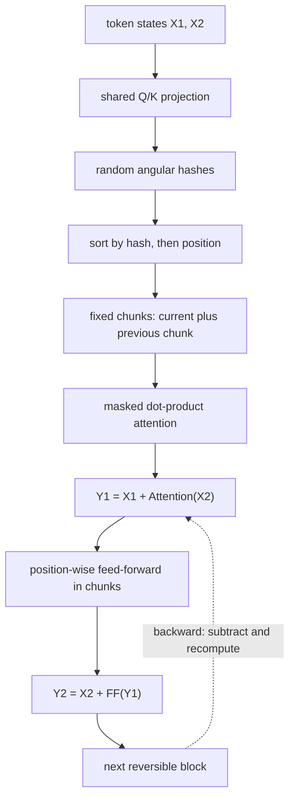
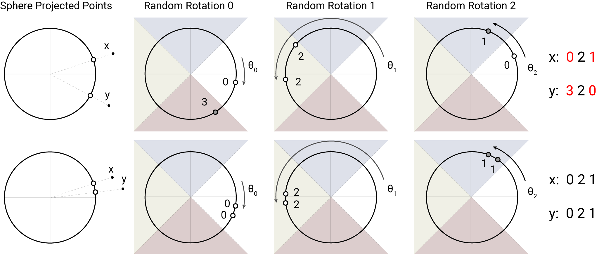
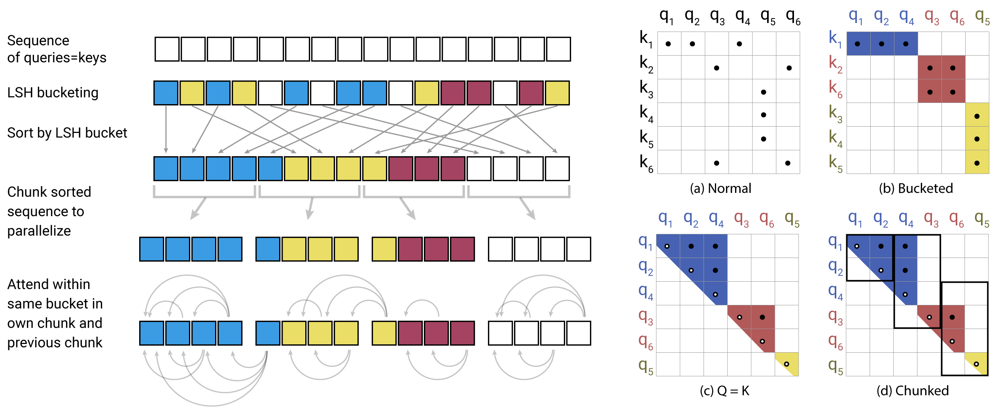
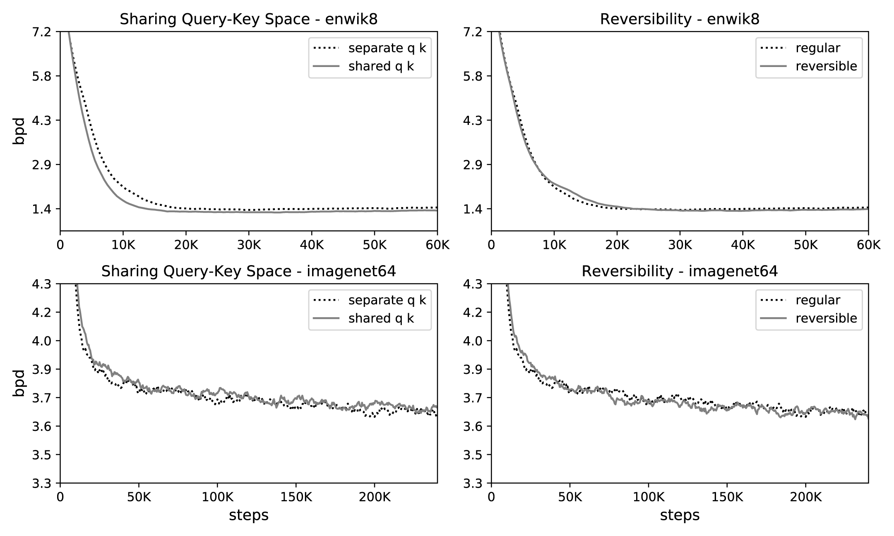
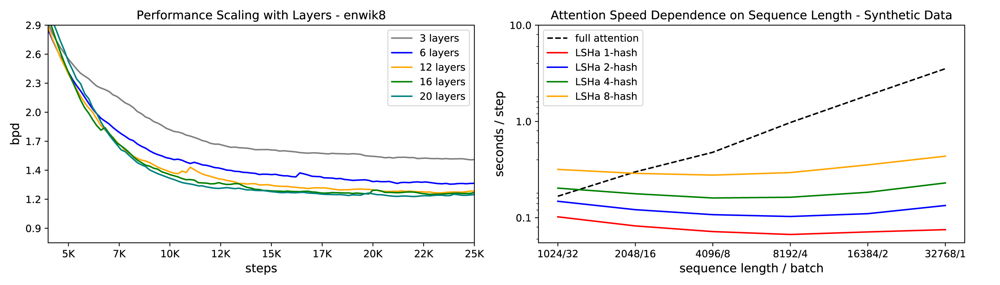

# Reformer — Kitaev et al., 2020

> **arXiv:** 2001.04451v2 · **Venue:** ICLR 2020 oral · **Affiliation:** UC Berkeley and Google Research

## TL;DR
Reformer attacks two independent Transformer bottlenecks: locality-sensitive hashing (LSH) restricts each query to content-similar keys and changes attention from $O(L^2)$ to $O(L\log L)$; reversible residual blocks reconstruct intermediate activations during backpropagation instead of storing one copy per layer. Chunking position-wise feed-forward and output computations removes another large activation peak. The paper demonstrates 64K-character language modeling and 12K-step image generation, but its long-context evidence is primarily causal—not BERT-style bidirectional encoder pretraining.

## Problem & motivation
A standard Transformer becomes expensive along three axes. For batch size $B$, sequence length $L$, model width $d_{\text{model}}$, feed-forward width $d_{\text{ff}}$, and $N$ layers:

1. the attention matrix has $L^2$ entries per head;
2. backpropagation normally retains activations for all $N$ layers;
3. the intermediate feed-forward state has width $d_{\text{ff}}$, commonly much larger than $d_{\text{model}}$.

The paper illustrates the scale with 64K tokens, width 1,024, and batch 8: one activation tensor already contains roughly $0.5$ billion floats, or about 2 GB in FP32. Repeating comparable storage across layers and materializing attention makes a conventional long-sequence Transformer impractical on one accelerator.

Reformer decomposes the problem rather than presenting one monolithic attention replacement. LSH reduces the number of query-key comparisons; reversible blocks remove depth from activation-storage growth; and chunking lowers transient position-wise memory. These mechanisms can be adopted separately, a fact reflected in the paper's ablations and translation experiment.

## Key idea
For one attention head, dense scaled dot-product attention is

$$
\operatorname{Attention}(Q,K,V)
=\operatorname{softmax}\!\left(\frac{QK^\top}{\sqrt{d_k}}\right)V,
$$

where $Q,K\in\mathbb R^{L\times d_k}$ and $V\in\mathbb R^{L\times d_v}$. Reformer first shares the query and key projection, normalizing keys so that

$$
k_j=\frac{q_j}{\lVert q_j\rVert_2}.
$$

It then uses an angular locality-sensitive hash

$$
h(x)=\arg\max\left([xR;-xR]\right),
\qquad R\in\mathbb R^{d_k\times b/2},
$$

where $b$ is the number of hash buckets and $[\cdot;\cdot]$ concatenates the positive and negative random projections. Similar directions are likely to receive the same bucket ID. A query attends only to keys sharing a bucket, so content—not original sequence distance—selects its sparse neighborhood.

The second idea replaces an ordinary residual block with an invertible coupling. Given two streams $X_1,X_2\in\mathbb R^{L\times d_{\text{model}}}$,

$$
Y_1=X_1+\operatorname{Attention}(X_2),
\qquad
Y_2=X_2+\operatorname{FeedForward}(Y_1).
$$

The inputs can be recovered exactly in ideal arithmetic from the outputs:

$$
X_2=Y_2-\operatorname{FeedForward}(Y_1),
\qquad
X_1=Y_1-\operatorname{Attention}(X_2).
$$

Backpropagation can therefore reconstruct a block's inputs as it walks backward, trading recomputation for the memory that conventional training uses to retain every layer's activations.

## How it works

### End-to-end data flow

### From nearest neighbors to batched LSH attention

For causal self-attention, let $\mathcal P_i=\{j:j\le i\}$ be legal source positions for query $i$. Omitting scale for clarity, the output is

$$
o_i=\sum_{j\in\mathcal P_i}
\exp\!\bigl(q_i\cdot k_j-z(i,\mathcal P_i)\bigr)v_j,
$$

where $z(i,\mathcal P_i)$ is the log partition function. LSH initially restricts the candidate set to

$$
\mathcal P_i^{\mathrm{LSH}}=\{j:h(q_i)=h(k_j)\}.
$$

Variable bucket sizes are awkward for accelerators. Reformer turns them into regular blocks:

1. **Project once for shared QK.** Compute $q_i$ and use its normalized direction as $k_i$, guaranteeing that the query and key attached to a position hash together. Compute values with a separate projection.
2. **Hash.** Multiply each head's vectors by a random rotation $R$ and choose the largest signed coordinate. The rotation is not learned.
3. **Sort.** Sort positions first by bucket ID and then by sequence position. Let $s_i$ be position $i$'s index in this sorted order.
4. **Chunk.** Split the sorted list into fixed chunks of $m$ items. Each chunk attends to itself and the immediately preceding sorted chunk:

$$
\widetilde{\mathcal P}_i=
\left\{j:
\left\lfloor\frac{s_i}{m}\right\rfloor-1
\le
\left\lfloor\frac{s_j}{m}\right\rfloor
\le
\left\lfloor\frac{s_i}{m}\right\rfloor
\right\}.
$$

5. **Mask.** Remove candidates with a different bucket and, in a decoder, candidates in the future. Because shared QK makes self-similarity trivially maximal, also mask $i=j$ unless no other legal source exists, as for the first token.
6. **Attend and unsort.** Compute ordinary softmax attention inside the compact candidate blocks, then invert the permutation to restore sequence order.

The paper chooses

$$
m=2\frac{L}{n_{\mathrm{buckets}}},
$$

twice the average bucket population. If no true bucket exceeds $m$, attending to the current and previous sorted chunks covers every member of the query's bucket. This is an engineering assumption, not a worst-case guarantee: an oversized bucket can lose candidates.

### Multiple hashing rounds

A single random partition may separate two highly similar vectors. With $n_r$ independent hash functions, Reformer uses the union

$$
\mathcal P_i=\bigcup_{r=1}^{n_r}\mathcal P_i^{(r)},
\qquad
\mathcal P_i^{(r)}=\{j:h^{(r)}(q_i)=h^{(r)}(q_j)\}.
$$

Each round is sorted, chunked, and evaluated independently. Let $N_{i,j}$ count how many rounds expose pair $(i,j)$. Appendix A divides that pair's unnormalized contribution by $N_{i,j}$ to prevent duplicate counting, folds the correction into the mask, and combines per-round outputs using their log partition functions. Increasing $n_r$ improves recall of high-similarity keys but multiplies hashing and candidate-attention work. A trained model can use more rounds only at evaluation time, providing a direct quality/compute knob.

Sorting costs $O(L\log L)$. When chunk size and number of rounds are treated as bounded, dot products inside chunks are linear in $L$, making overall LSH attention $O(L\log L)$ in time and memory rather than $O(L^2)$. Constants include heads, rounds, and chunk width, so the asymptotic label does not mean those choices are free.

### Reversible residual blocks

The reversible block is a RevNet additive coupling with attention as $F$ and the feed-forward network as $G$. Layer normalization is moved inside the residual branches. Both streams have width $d_{\text{model}}$ so comparisons to an ordinary Transformer keep comparable parameter capacity rather than halving each stream.

During the forward pass, training retains only the final reversible state (plus non-reconstructible necessities such as parameters, random seeds/state, and outputs needed by the implementation). During backward:

1. recompute $G(Y_1)$ and subtract it from $Y_2$ to recover $X_2$;
2. recompute $F(X_2)$ and subtract it from $Y_1$ to recover $X_1$;
3. recompute the local operations needed for gradients;
4. continue to the preceding block.

Thus activation storage no longer scales linearly with the number of reversible layers, although arithmetic increases because forward functions are evaluated again. Parameter and optimizer-state memory still grow with depth. The paper notes that layer parameters may be swapped to CPU because long sequences provide enough work to amortize transfer, but does not present a benchmark isolating this strategy.

### Chunked feed-forward and output loss

A feed-forward network acts independently at each position. Partition the sequence axis into $c$ slices and evaluate

$$
Y_2=
\left[
X_2^{(1)}+\operatorname{FF}(Y_1^{(1)});
\ldots;
X_2^{(c)}+\operatorname{FF}(Y_1^{(c)})
\right].
$$

Sequentially processing slices reduces the peak $B L d_{\mathrm{ff}}$ intermediate allocation by approximately the chunk factor without changing the mathematical function. The inverse and backward computations are chunked as well. For vocabularies wider than $d_{\text{model}}$, the model similarly chunks output logits and computes loss over sequence sections, avoiding materialization of all $L\times |\mathcal V|$ logits at once.

### What belongs to the paper—and what does not

Modern Reformer libraries commonly add axial positional embeddings and alternate local and LSH layers. Those are useful implementation choices, but the v2 paper does not describe axial embeddings or report an alternating local/LSH architecture. They should not be treated as evaluated contributions of this paper. The paper's demonstrated long models use LSH attention, reversible blocks, and chunked position-wise computation.

Likewise, LSH is not intrinsically causal: removing the future mask gives bidirectional candidate attention. However, the paper's 64K text and 12K image studies are autoregressive. Its WMT14 encoder is bidirectional and reversible, but WMT does **not** use LSH because all test sentences are shorter than the typical 128-token post-sort chunk. Consequently, this work motivates a possible efficient BERT-like encoder; it does not experimentally establish one through masked-language-model pretraining or long-document understanding benchmarks.

## Training / data

### Main ablations

The paper evaluates **enwik8-64K**, a character-level text task split into $2^{16}=65{,}536$-character subsequences, and **ImageNet-64 generation**, where a $64\times64$ RGB image is serialized into $64\cdot64\cdot3=12{,}288$ channel values. Both use autoregressive next-symbol prediction and bits per dimension (bits/dim) on held-out data.

To make dense comparisons tractable, ablations use 3 layers with $d_{\text{model}}=1{,}024$, $d_{\text{ff}}=4{,}096$, 8 heads, total batch size 8, and Adafactor. Training is distributed over 8 GPUs or 8 TPU v3 cores. The paper does not publish a complete learning-rate schedule, regularization recipe, number of buckets for every curve, or exact training duration for every ablation.

### Duplication task

Each example is $0w0w$, with $w$ containing 511 symbols sampled from $\{1,\ldots,127\}$, for total length 1,024. The model predicts the next symbol causally, but loss and accuracy are measured only on the predictable second half. A 1-layer model with $d_{\text{model}}=d_{\text{ff}}=256$ and 4 heads trains for 150K steps under full attention or LSH with 1, 2, or 4 hash rounds.

Table 2 crosses **training-time attention** (rows) with **evaluation-time attention** (columns), rather than testing different sequence lengths. This distinction matters because the table's central finding is that the number of hashes can be increased after training.

### Translation

WMT 2014 English-to-German tests reversibility in both the bidirectional encoder and causal decoder. The models follow Transformer-base/big hyperparameters from Vaswani et al. The paper reports 100K or 500K steps for base and 300K for big; the longer base and big runs do not share embedding and output projection weights. It omits LSH because sentence lengths are below its 128-token chunk regime.

### Large models

The scaling experiment trains up to 20-layer big Reformer models on enwik8 and ImageNet-64. A reported 12-layer enwik8 run uses dropout 0.1 and 20K steps; a separately tuned, longer run reaches the paper's best reported text result, but the additional recipe is not fully specified. Therefore exact reproduction of the 1.05 bits/dim number is not possible from the paper alone.

## Results

### LSH retrieval on the controlled duplication task

| Training attention ↓ / evaluation attention → | Full | LSH-8 | LSH-4 | LSH-2 | LSH-1 | Source |
|---|---:|---:|---:|---:|---:|---|
| Full attention | **100%** | 94.8% | 92.5% | 76.9% | 52.5% | Table 2 |
| LSH-4 | 0.8% | **100%** | 99.9% | 99.4% | 91.9% | Table 2 |
| LSH-2 | 0.8% | **100%** | 99.9% | 98.1% | 86.8% | Table 2 |
| LSH-1 | 0.8% | 99.9% | 99.6% | 94.8% | 77.9% | Table 2 |

LSH-trained models fail under full attention because they learned with the shared-QK/self-mask behavior and sparse routing; “full” is not simply a guaranteed better inference setting. Conversely, more evaluation hashes recover missed neighbors: even LSH-1 training rises from 77.9% with one evaluation hash to 99.9% with eight.

### Component ablations

Figure 3 shows no material degradation from shared QK and nearly overlapping learning curves for reversible and ordinary residual blocks at matched parameter counts. On enwik8, shared QK appears slightly faster to train. These are curve-based findings; the paper does not provide exact terminal values or uncertainty, so stronger numerical claims are unwarranted.

Figure 4 reports that ImageNet-64 LSH attention approaches full-attention performance as hashing rounds increase, with 8 rounds nearly matching it. Again, the figure supports the trend rather than a table of precise endpoint values.

### WMT14 English-to-German

| Model | Tokenized BLEU | sacreBLEU uncased | sacreBLEU cased | Source |
|---|---:|---:|---:|---|
| Transformer base, Vaswani et al. | 27.3 | — | — | Table 4 |
| Transformer big, Vaswani et al. | 28.4 | — | — | Table 4 |
| Transformer big, Ott et al. | 29.3 | — | — | Table 4 |
| Reversible Transformer base, 100K | 27.6 | 27.4 | 26.9 | Table 4 |
| Reversible Transformer base, 500K, no weight sharing | 28.0 | 27.9 | 27.4 | Table 4 |
| Reversible Transformer big, 300K, no weight sharing | 29.1 | 28.9 | 28.4 | Table 4 |

The controlled conclusion is that reversibility preserves translation quality. It is not evidence for LSH attention, because these models deliberately use ordinary attention.

### Long-sequence scaling

| Experiment | Reformer result | Qualification | Source |
|---|---:|---|---|
| enwik8, 12 layers, 20K steps, dropout 0.1 | 1.19 bits/dim test | stated single run | §5, “Large Reformer models” |
| enwik8, 12 layers, longer tuned run | **1.05 bits/dim test** | added tuning/improvements not fully specified | §5, “Large Reformer models” |
| Maximum demonstrated text length | 65,536 characters | autoregressive enwik8 chunks | §5 |
| Maximum demonstrated image length | 12,288 channel values | autoregressive ImageNet-64 | Abstract and §5 |
| Maximum depth in scaling plot | 20 layers | dense baseline could not be run at this scale | Figure 5 and §5 |

The authors report that 20-layer models fit and improve with depth, whereas corresponding dense baselines were too slow and memory-hungry to train. This establishes feasibility, not a controlled quality victory at 20 layers. The speed panel also holds total tokens fixed while varying sequence length; its flat LSH trend isolates attention scaling but is not an end-to-end throughput table.

## Limitations & follow-ups

- LSH retrieves content-similar keys probabilistically. Important but dissimilar tokens can be excluded, while additional hash rounds improve recall only by increasing cost.
- The twice-average bucket-size rule assumes oversized buckets are unlikely. It does not guarantee complete same-bucket coverage under adversarial or collapsed representations.
- Sorting introduces $O(L\log L)$ cost and irregular data movement. Practical performance depends on efficient sort/gather kernels, not asymptotics alone.
- Shared QK and suppressing self-attention alter the model. The paper's ablations find little effect on two generative tasks, but do not establish equivalence for all tasks.
- Reversible training reduces activation storage by recomputing functions during backward; it does not remove parameter, optimizer-state, final-state, or within-operation memory, and it spends extra computation.
- Stochastic operations in reversible branches require reproducible randomness during recomputation. Finite-precision subtraction can also accumulate reconstruction error; the paper does not quantify either issue.
- Most long-context experiments are causal character/pixel generation. No masked-language-model pretraining, long-document classification, extractive QA, or bidirectional long-encoder result is reported.
- WMT14 validates reversible encoder-decoder blocks only; LSH is explicitly absent. Calling Reformer a demonstrated long-context BERT replacement would overstate the evidence.
- The best 1.05 bits/dim enwik8 recipe lacks enough detail for exact reproduction, and several plots do not expose exact endpoint values or uncertainty.
- Later libraries add axial positions, local/LSH layer alternation, bidirectional heads, and decoding caches. These features should be attributed to implementations rather than retroactively to the paper's experiments.
- Related local reviews cover fixed sparse patterns in [Longformer](bert-long-context_2020_longformer.md), structured global tokens in [ETC](bert-long-context_2020_etc.md), mixed random/local/global sparsity in [BigBird](bert-long-context_2020_bigbird.md), and learned low-rank projection in [Linformer](bert-long-context_2020_linformer.md).

## Links

- **Review thread:** [BERT-family overview](../bert/overview.md#162-making-bidirectional-attention-survive-long-documents)
- **arXiv:** [abs](https://arxiv.org/abs/2001.04451v2) · [html](https://arxiv.org/html/2001.04451v2) · [pdf](https://arxiv.org/pdf/2001.04451v2)
- **Code:** [google/trax Reformer](https://github.com/google/trax/tree/master/trax/models/reformer) (repository archived in 2025)
- **Hugging Face:** [Reformer documentation](https://huggingface.co/docs/transformers/model_doc/reformer) · [google/reformer-crime-and-punishment](https://huggingface.co/google/reformer-crime-and-punishment)
- **Project page:** [Google Research publication](https://research.google/pubs/reformer-the-efficient-transformer/)
- **Blog posts:** [Google Research: Reformer](https://research.google/blog/reformer-the-efficient-transformer/)
- **Talks / videos:** [ICLR 2020 virtual poster](https://iclr.cc/virtual_2020/poster_rkgNKkHtvB.html)
- **OpenReview / venue page:** [ICLR 2020 OpenReview](https://openreview.net/forum?id=rkgNKkHtvB)
- **Papers-with-Code:** [Reformer](https://paperswithcode.com/paper/reformer-the-efficient-transformer)
- **BibTeX:** [Google Research citation](https://research.google/pubs/reformer-the-efficient-transformer/)
- **Related papers:** [Longformer](bert-long-context_2020_longformer.md) · [ETC](bert-long-context_2020_etc.md) · [BigBird](bert-long-context_2020_bigbird.md) · [Linformer](bert-long-context_2020_linformer.md)
