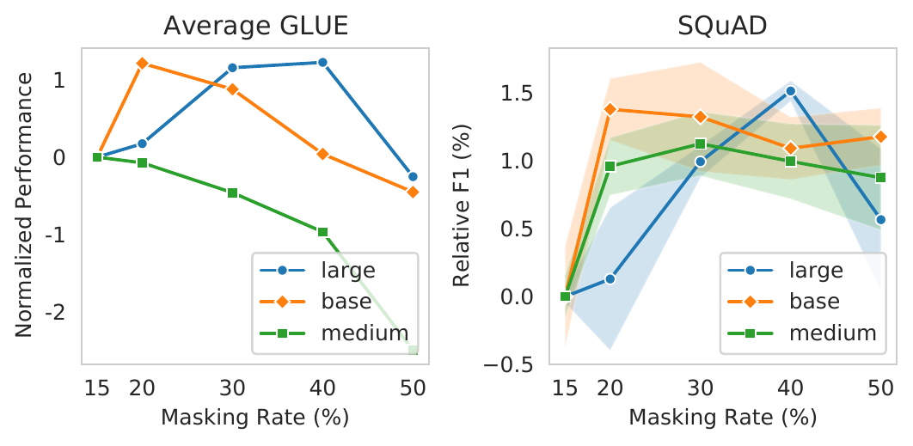
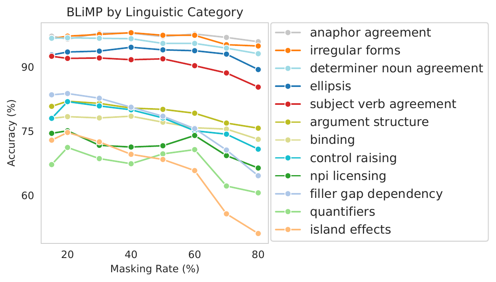
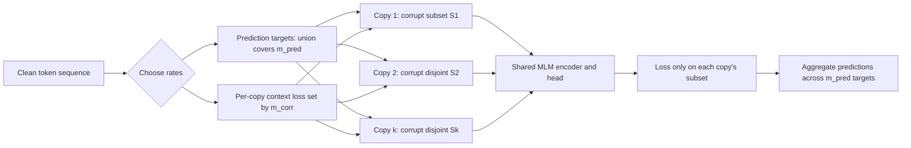
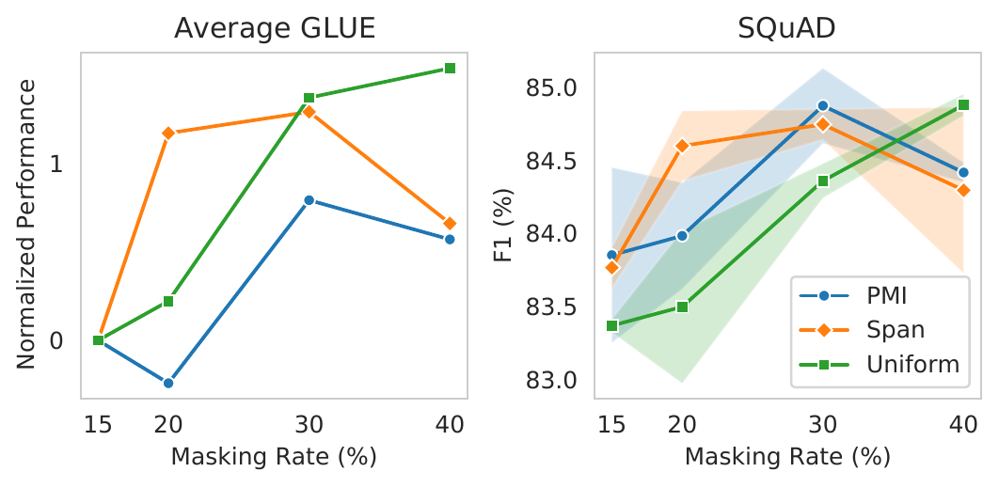
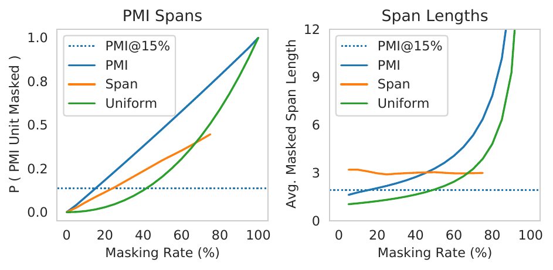

# Should You Mask 15% in Masked Language Modeling? - Wettig et al., 2022

> **arXiv:** 2202.08005v3 · **Venue:** EACL 2023 · **Affiliation:** Princeton University

## TL;DR

The familiar 15% masking rate is not a universal property of masked language modeling: under the paper's efficient pretraining recipe, the best average GLUE rate rises from 15% for a 51M-parameter model to 20% for 124M and 40% for 354M. A masking rate simultaneously makes the input harder by corrupting more context and supplies more supervised targets; controlled ablations show that more prediction helps while more corruption hurts. Even 80% masking preserves more than 95% of aggregate fine-tuning performance and about 90% of BLiMP probing performance despite validation perplexity above 1,000, so reconstruction perplexity and representation quality can diverge sharply.

## Problem & motivation

BERT selected 15% of input tokens for its masked language modeling (MLM) objective, replacing 80% of those selected tokens with `[MASK]`, 10% with random tokens, and leaving 10% unchanged. That design became a default across model sizes, corpora, tokenizers, and masking strategies. Its usual intuition is a trade-off: selecting too few tokens wastes each sequence because the model receives little prediction supervision, while selecting too many removes the context needed to infer the targets.

The paper argues that this intuition hides several coupled variables:

1. **Model capacity:** a larger encoder may extract useful representations from a more severely corrupted sequence.
2. **Prediction density:** increasing the rate creates more loss-bearing tokens from every input sequence.
3. **Corruption difficulty:** the same increase removes more visible evidence from which to predict.
4. **Masking strategy:** uniform token masking, contiguous span masking, and pointwise-mutual-information (PMI) masking produce different effective spans at the same nominal rate.
5. **Replacement policy:** BERT's random-token and unchanged-token branches alter corruption and prediction differently from `[MASK]`-only replacement.

These distinctions matter for both quality and efficiency. With a fixed batch and number of steps, moving from 15% to 40% predicts roughly $40/15\approx2.67$ times as many token targets without reading more sequences. Conversely, it also hides far more context. The central question is therefore not simply whether a high rate is harder, but whether the extra learning signal outweighs the added corruption for a particular model and training recipe.

The authors evaluate this question mainly with an accelerated, resource-conscious recipe derived from Academic BERT. Their conclusions are strongest inside that controlled setting. Appendix experiments with longer and RoBERTa-style training show a weaker and less uniform advantage, which prevents interpreting 40% as a new universal constant.

## Key idea

Let a tokenized sequence be $x=(x_1,\ldots,x_n)$ and let $S\subseteq\{1,\ldots,n\}$ be the selected prediction positions. A corruption operator $C$ produces $\tilde{x}=C(x,S)$, and an encoder with parameters $\theta$ minimizes

$$
\mathcal{L}_{\mathrm{MLM}}(\theta)
=-\frac{1}{|S|}\sum_{i\in S}
\log p_\theta(x_i\mid \tilde{x}).
$$

Here $x_i$ is the original token at position $i$, $\tilde{x}$ is the corrupted sequence, and $p_\theta$ is the MLM head's distribution. In ordinary `[MASK]`-only MLM, the masking rate $m$ controls two quantities at once:

$$
m_{\mathrm{corr}}
=\frac{|\{i:\tilde{x}_i\neq x_i\}|}{n},
\qquad
m_{\mathrm{pred}}
=\frac{|S|}{n},
$$

where $m_{\mathrm{corr}}$ is the fraction of input positions whose visible token is corrupted and $m_{\mathrm{pred}}$ is the fraction on which loss is computed. For `[MASK]`-only replacement,

$$
m_{\mathrm{corr}}=m_{\mathrm{pred}}=m.
$$

The paper's causal decomposition is:

- Holding $m_{\mathrm{corr}}$ fixed, increasing $m_{\mathrm{pred}}$ improves downstream representations because each encoded example supplies more supervised targets.
- Holding $m_{\mathrm{pred}}$ fixed, increasing $m_{\mathrm{corr}}$ degrades them because less usable context remains.

Thus the observed effect of increasing $m$ is the net result of opposing forces. Larger models and efficient, short training runs can benefit more from prediction density, shifting the optimum upward.

To realize $m_{\mathrm{pred}}>m_{\mathrm{corr}}$ in the controlled ablation, the authors create multiple corrupted copies of the same sequence with disjoint masked subsets. For example, four copies can each corrupt 10% of positions while their union supplies predictions for 40% of the original positions. This disentangles the rates but duplicates encoder work; it is a diagnostic experiment, not an efficient proposed training algorithm.

## How it works

### 1. Sweep the uniform masking rate

For every input sequence, sample approximately $mn$ token positions uniformly without replacement and replace all selected positions with `[MASK]`. Compute cross-entropy only at those positions. Unlike original BERT, the main experiments do not apply the 80-10-10 replacement rule.

Train otherwise matched encoders at several rates. The 354M-parameter `large` model is swept from 15% through 60%; `base` and `medium` are swept from 15% through 50%. Fine-tune every checkpoint with the same task-specific search procedure, then compare development performance. Since task metrics have different scales, Figure 2 normalizes each task relative to its 15% baseline before averaging GLUE tasks.

### 2. Vary model capacity

The study uses three pre-layernorm Transformer encoders:

| Name | Parameters | Layers | Hidden size | Attention heads |
|---|---:|---:|---:|---:|
| `medium` | 51M | 8 | 512 | 8 |
| `base` | 124M | 12 | 768 | 12 |
| `large` | 354M | 24 | 1,024 | 16 |

The average-GLUE optimum under the main recipe is 15% for `medium`, 20% for `base`, and 40% for `large` (Figure 2). Individual tasks need not share the aggregate optimum: for example, the SQuAD curves favor about 30% for `medium` and `base`, and 40% for `large`.

*Paper Figure 2. Larger models tolerate and benefit from more masking under the efficient recipe. Values are development results normalized to each model's 15% baseline on the left and relative SQuAD F1 on the right; the plot supports a capacity-dependent trend, not a universal 40% prescription.*

### 3. Push masking to the extreme

The authors train `large` models at 15%, 40%, and 80%, then compare reconstruction perplexity, downstream fine-tuning, and linguistic probing. At 80%, most content disappears and independent token reconstruction becomes extremely ambiguous: validation perplexity is 1,141.4 when evaluated at 80% masking. Nevertheless, the encoder remains far above random initialization on every reported downstream task.

The discrepancy is conceptually important. The MLM head is scored on exact token recovery, but downstream fine-tuning needs useful contextual features rather than exact reconstruction. A representation learner can therefore remain effective after its denoising problem has become nearly impossible.

*Paper Figure 3. Most BLiMP categories degrade gradually and the 80% model retains about 90% of the 15% model's average probing accuracy, though filler-gap dependencies, quantifiers, and especially island effects are more sensitive. The result argues for substantial robustness, not equivalence at every linguistic phenomenon.*

### 4. Disentangle corruption from prediction

The standard objective ties the two rates. The diagnostic ablation breaks that tie as follows:

1. Choose a target prediction rate $m_{\mathrm{pred}}$.
2. Choose a per-copy corruption rate $m_{\mathrm{corr}}\leq m_{\mathrm{pred}}$.
3. Partition the prediction targets into disjoint subsets of size $m_{\mathrm{corr}}n$.
4. Duplicate the clean sequence once per subset.
5. In copy $j$, replace only subset $S_j$ with `[MASK]` and compute loss on $S_j$.
6. Aggregate losses across copies so that the union $\bigcup_j S_j$ covers $m_{\mathrm{pred}}n$ targets.

For example, $(m_{\mathrm{corr}},m_{\mathrm{pred}})=(20\%,40\%)$ uses two copies, each with a disjoint 20% corruption pattern. $(10\%,40\%)$ uses four. The resulting comparison shows monotonic gains from lowering corruption while holding prediction at 40%, and mostly lower scores when reducing prediction from 40% to 20% while holding corruption at 40% (Table 3).

This authored diagram exposes the experimental control: prediction coverage grows across copies while each copy's missing context stays fixed. It also exposes the cost, since the same underlying sequence is encoded multiple times.

### 5. Compare masking strategies at matched rates

The paper implements three target-selection policies:

- **Uniform:** sample individual token positions uniformly. Adjacent masks occur by chance; their expected runs become longer as the rate rises.
- **Span:** repeatedly sample contiguous spans with mean length approximately 3, following the T5-style strategy, until the target budget is reached.
- **PMI:** preferentially select multi-token spans with high pointwise mutual information, so strongly associated pieces or words are masked together rather than leaving local shortcut cues.

At a fixed 15%, span and PMI masking can outperform uniform masking because they create harder, less locally recoverable targets. That comparison reverses or narrows after jointly tuning the rate: on average GLUE, uniform keeps improving through 40%, PMI peaks around 30%, and span is strongest around 20%-30% (Figure 4). A masking strategy therefore cannot be judged fairly at one inherited rate.

*Paper Figure 4. The best rate depends on the selection policy. Sophisticated span-based policies are stronger at low rates, while uniform masking needs a higher rate and becomes competitive or best once tuned.*

The mechanism is partly geometric. Raising a uniform masking rate increases both the probability of covering an entire high-PMI unit and the average length of accidental contiguous mask runs. Uniform masking at 40% masks about as many complete PMI units as PMI masking at 15%.

*Paper Figure 5. Nominal strategy and rate jointly determine the actual corruption pattern. T5-style span masking keeps mean span length near 3 over its feasible range, whereas uniform and PMI runs lengthen as the rate rises.*

### 6. Test BERT's 80-10-10 replacement rule

Starting from the 40% `[MASK]`-only baseline, the paper tests unchanged-token prediction, random-token substitution, and BERT's full rule. The exact variants are:

- **`+5% same`:** retain the 40% masked targets and add loss on another 5% unchanged tokens.
- **`w/ 5% rand`:** within the 40% target set, use `[MASK]` for 35% of all positions and random substitutions for 5%.
- **`w/ 80-10-10`:** within the 40% target set, use `[MASK]`, random, and unchanged tokens in an 80:10:10 ratio.

Across the five reported development tasks, `[MASK]`-only is usually best or tied; the 80-10-10 rule is lower on MNLI, QNLI, QQP, and STS-B and only slightly higher on SST-2 (Table 4). This is evidence for simplifying this particular recipe, not proof that replacement noise is harmful for every architecture or transfer setting.

## Training / data

### Pretraining corpus and model

- **Data:** English Wikipedia and BookCorpus.
- **Tokenizer:** RoBERTa byte-pair encoding rather than BERT WordPiece, selected after a preliminary comparison.
- **Objective:** `[MASK]`-only MLM with no next-sentence prediction.
- **Architecture:** pre-layernorm BERT-style encoder; pre-layernorm is necessary for the unusually high learning rate used by the efficient recipe.
- **Primary model:** 354M-parameter `large`; 124M `base` and 51M `medium` are used for the capacity sweep.

### Main pretraining recipe

| Hyperparameter | Value | Source |
|---|---:|---|
| Peak learning rate | $2\times10^{-3}$ | Appendix Table 6 |
| Warmup | 6% of steps | Appendix Table 6 |
| Batch size | 4,096 sequences | Appendix Table 6 |
| Training steps | 23,000 | Appendix Table 6 |
| Sequence length | 128 | Appendix Table 6 |
| Hardware | 8 Nvidia GTX 2080 GPUs | Appendix A |
| Large-model training time | about 24 hours | §3 |

Gradient accumulation realizes the large effective batch. Each training configuration is pretrained once; the authors explicitly note that limited compute prevented multiple pretraining seeds. Consequently, the small standard deviations shown in downstream plots quantify fine-tuning variation, not end-to-end pretraining uncertainty.

For the main SQuAD comparison, models receive another 2,300 pretraining steps at sequence length 512, learning rate $5\times10^{-4}$, and 10% warmup. Other SQuAD plots omit this continuation and therefore have lower absolute numbers (Appendix A).

### Fine-tuning and evaluation

The downstream suite consists of GLUE, SQuAD v1.1, Movie Review sentiment, and BLiMP probing. GLUE fine-tuning searches learning rates and epoch counts; larger tasks use batch size 32, while smaller tasks search batch sizes 16 and 32. SQuAD uses learning rate $10^{-4}$, batch size 16, and two epochs. Learning rates decay linearly.

Every downstream dataset is fine-tuned with three random seeds and averaged. RTE, MRPC, and STS-B use the conventional intermediate MNLI fine-tuning for the reported test comparison. Figures and tables report development results unless explicitly identified as Table 2's test results. French robustness is checked separately by pretraining on 2020 French Wikipedia and evaluating French XNLI over four fine-tuning seeds.

The appendix also tests two larger budgets: 125,000 steps at length 128 with batch 4,096 and learning rate $2\times10^{-3}$, and a RoBERTa-style 125,000-step, length-512 run with batch 2,048 and learning rate $7\times10^{-4}$. These checks are important because the 40% advantage is less consistent after substantially longer training.

## Results

### Headline test comparison

For the 354M `large` model under the main efficient recipe, 40% wins seven of the nine displayed metric columns on the paper's held-out comparison, with the clearest gain on SQuAD. SQuAD is a development-set F1 carried from the continued-pretraining setup; the GLUE columns are test-set values.

| Benchmark | 15% | 40% | Metric / split | Source |
|---|---:|---:|---|---|
| MNLI matched / mismatched | 84.2 / 83.4 | **84.7 / 84.0** | Accuracy, test | Table 2 |
| QNLI | 90.9 | **91.3** | Accuracy, test | Table 2 |
| QQP | 70.8 | **70.9** | F1, test | Table 2 |
| RTE | 73.5 | **75.5** | Accuracy, test | Table 2 |
| SST-2 | **92.8** | 92.6 | Accuracy, test | Table 2 |
| MRPC | 88.8 | **89.8** | F1, test | Table 2 |
| CoLA | **51.8** | 50.7 | Matthews correlation, test | Table 2 |
| STS-B | 87.3 | **87.6** | Spearman correlation, test | Table 2 |
| SQuAD v1.1 | 88.0 | **89.8** | F1, development | Table 2 and §3 |

The convergence plots add a sample-efficiency result: on QNLI and QQP, the 40% model reaches the final 15% model's development score in almost half as many pretraining steps (Figure 1). This compares steps and examples, not FLOPs saved per step; both models still process the same full sequence length.

### Extreme masking and representation quality

| Masking rate | Validation PPL at its own rate | MNLI-m/mm | QNLI | CoLA | SQuAD F1 | Source |
|---:|---:|---:|---:|---:|---:|---|
| 15% | 17.7 | 84.2 / 84.6 | 90.9 | 59.2 | 88.0 | Tables 1 and 7, development |
| 40% | 69.4 | **84.5 / 84.8** | **91.6** | **61.0** | **89.8** | Tables 1 and 7, development |
| 80% | 1,141.4 | 80.8 / 81.0 | 87.9 | 38.7 | 86.2 | Tables 1 and 7, development |
| Random initialization | n/a | 61.5 / 61.2 | 60.9 | 11.9 | 10.8 | Table 7, development |

Aggregating the fine-tuning metrics, the paper reports that the 80% model retains more than 95% of the 15% baseline's performance (§4). On BLiMP it retains about 90% of average probing accuracy (§4 and Figure 3). Neither percentage means that 80% is optimal: it is substantially below 15%-40% on several tasks and especially weak on CoLA and selected long-distance linguistic categories.

### Corruption-versus-prediction ablation

| $m_{\mathrm{corr}}$ | $m_{\mathrm{pred}}$ | MNLI | QNLI | QQP | STS-B | SST-2 | Source |
|---:|---:|---:|---:|---:|---:|---:|---|
| 40% | 40% | 84.5 | 91.6 | 88.1 | 88.2 | 92.8 | Table 3, development |
| 40% | 20% | 83.7 | 90.6 | 87.8 | 87.5 | 92.9 | Table 3, development |
| 20% | 20% | 84.1 | 91.3 | 87.9 | 87.4 | 92.7 | Table 3, development |
| 20% | 40% | 85.7 | 92.0 | 87.9 | 88.6 | 93.4 | Table 3, development |
| 10% | 40% | 86.3 | **92.3** | 88.3 | **88.9** | 93.2 | Table 3, development |
| 5% | 40% | **86.9** | 92.2 | **88.5** | 88.6 | **93.9** | Table 3, development |

The cleanest controlled comparisons are vertical: at 40% corruption, reducing predictions to 20% lowers four of five metrics; at 40% prediction, reducing corruption from 40% to 20%, 10%, or 5% raises nearly every metric. The result explains why increasing ordinary masking can help even though corruption itself is harmful: under the main recipe, the marginal value of additional targets initially dominates the lost context.

### Replacement-policy ablation

| Corruption policy | MNLI | QNLI | QQP | STS-B | SST-2 | Source |
|---|---:|---:|---:|---:|---:|---|
| 40% `[MASK]` only | **84.5** | **91.6** | **88.1** | **88.2** | 92.8 | Table 4, development |
| Add 5% unchanged predictions | 84.2 | 91.0 | 87.8 | 88.0 | **93.3** | Table 4, development |
| 35% `[MASK]` + 5% random | **84.5** | 91.3 | 87.9 | 87.7 | 92.6 | Table 4, development |
| BERT 80-10-10 within 40% targets | 84.3 | 91.2 | 87.9 | 87.8 | 93.0 | Table 4, development |

### Recipe dependence

The main 23,000-step result should not be detached from its compute regime. At 125,000 steps with the authors' short-sequence recipe, 15% and 40% trade wins across tasks. Under the longer-sequence RoBERTa recipe, 40% is nearly tied on several GLUE tasks and improves SQuAD from 90.72 to 91.23, but drops sharply on MRPC (80.80 to 63.90) and also trails on CoLA and STS-B (Appendix Table 8). The robust conclusion is to tune the rate jointly with capacity, strategy, and budget; it is not to replace 15% mechanically with 40%.

## Limitations & follow-ups

- **One efficient recipe dominates the evidence.** Most sweeps use 23,000 short-sequence steps, a very large batch, high learning rate, pre-layernorm, and a 354M model. The best rate can move when any of these variables changes, and the longer-budget appendix is mixed.
- **No replicated pretraining runs.** Three seeds cover downstream fine-tuning only. A single pretraining run per condition cannot quantify variance from initialization, corpus order, or sampled masks, which matters when many reported differences are a few tenths of a point.
- **Limited language and data scope.** The main study uses English Wikipedia plus BookCorpus. One French Wikipedia/XNLI check supports a 40% gain in that setting, but does not establish multilingual, domain, or low-resource generality.
- **Encoder-only transfer scope.** Results cover classification, extractive QA, sentiment, and acceptability probing. They do not determine the best corruption rate for encoder-decoder denoising, generation, retrieval, token classification, or very long-context encoders.
- **The diagnostic decomposition costs extra compute.** Achieving high prediction with low corruption by duplicating sequences repeats encoder computation. The ablation identifies a desirable objective property but does not itself deliver the efficiency implied by that property.
- **Aggregate scores conceal task differences.** Average normalized GLUE favors a simple capacity-dependent trend, while SQuAD and individual GLUE tasks peak elsewhere. BLiMP likewise shows that long-distance dependencies can be more rate-sensitive than local agreement.
- **Perplexity is rate-dependent.** MLM perplexities evaluated under different corruption levels are not directly comparable as ordinary language-model perplexities. The $>1{,}000$ value demonstrates reconstruction difficulty, not that the model assigns poor unconditional probability to natural text.
- **Random-initialization comparison is conservative.** The paper cautions that randomly initialized models use the pretrained models' fine-tuning hyperparameters and may therefore be undertrained.

The paper suggests two practical research directions. First, high rates could support asymmetric architectures that run a heavy encoder only on visible tokens and use a lightweight module for masked positions, analogous to masked autoencoders. Second, a training method could encode once and predict several disjoint mask sets cheaply, realizing high $m_{\mathrm{pred}}$ with low $m_{\mathrm{corr}}$ without duplicated full passes. The immediate successor in this overview, *Dynamic Masking Rate Schedules*, treats the rate as a curriculum rather than a constant and tests whether corruption difficulty should change during training.

## Links

- **arXiv:** [abs](https://arxiv.org/abs/2202.08005v3) · [html](https://arxiv.org/html/2202.08005v3) · [pdf](https://arxiv.org/pdf/2202.08005v3)
- **Code:** —
- **Hugging Face:** —
- **Project page:** —
- **Blog posts:** —
- **Talks / videos:** —
- **OpenReview / venue page:** [EACL 2023 / ACL Anthology](https://aclanthology.org/2023.eacl-main.217/)
- **Papers-with-Code:** [Should You Mask 15% in Masked Language Modeling?](https://paperswithcode.com/paper/should-you-mask-15-in-masked-language)
- **BibTeX:** [ACL Anthology citation](https://aclanthology.org/2023.eacl-main.217/#cite)
- **Related / successor papers:** [BERT-family overview](../bert/overview.md#169-mask-schedules-and-the-mlm-versus-clm-question) · [BERT](bert-encoder_2018_bert-pretraining.md) · [RoBERTa](bert-training_2019_roberta.md) · [T5](backbone_2019_t5-prefix-lm.md) · [Dynamic Masking Rate Schedules](bert-masking_2024_dynamic-mask-schedules.md)