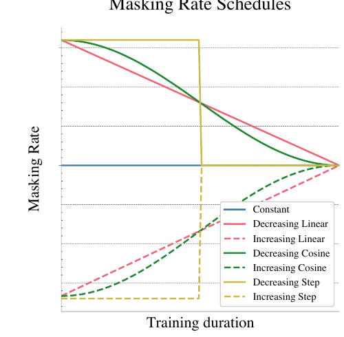
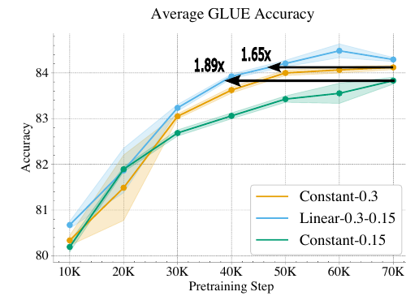
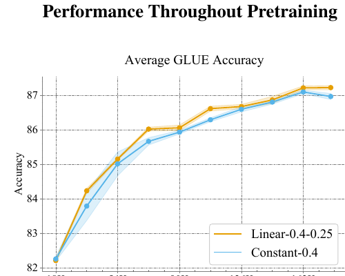
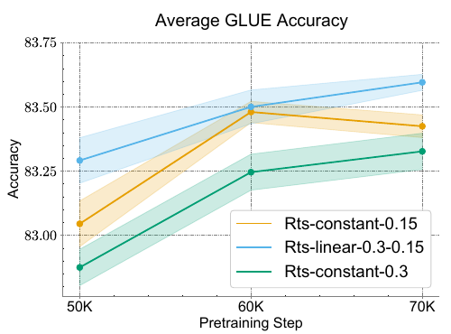

# Dynamic Masking Rate Schedules for MLM Pretraining - Ankner et al., 2024

> **ACL Anthology:** 2024.eacl-short.42 · **Venue:** EACL 2024 (Short Papers) · **Affiliations:** MosaicML, MIT, Harvard University, and DatologyAI

## TL;DR

Instead of holding an MLM's masking rate fixed, start high and decrease it during pretraining. A linear 30% to 15% schedule raises BERT-base average GLUE accuracy to 84.29, versus 84.12 for the best fixed-rate baseline and 83.83 for fixed 15%, while reaching those baselines' final scores in 1.65x and 1.89x fewer steps. The gain is not merely exposure to several rates: reversing the schedule fails, and masking dynamically while computing loss on only a fixed 15% of tokens also fails. The method combines the dense prediction signal and better MLM loss of a high rate with the grammatical behavior of a low rate.

## Problem & motivation

BERT masks 15% of input tokens throughout pretraining. Later work showed that this constant is often suboptimal and that larger models can favor higher rates, but selecting one fixed value still forces a compromise:

- A **high rate** creates more supervised targets per sequence and can improve sample efficiency, but removes more context.
- A **low rate** preserves context and, in this paper's experiments, produces stronger grammatical knowledge, but supplies fewer prediction targets.

Optimization routinely schedules learning rate, batch size, sequence length, dropout, or input resolution because the best training conditions can change over time. The paper asks whether the masking rate should likewise be a function of training step rather than a single hyperparameter.

This question has two intertwined parts. Changing the masking rate changes both the input distribution and the number of loss terms. Scheduling may help by injecting more corruption early, perhaps smoothing optimization like simulated annealing, or by extracting more prediction supervision from each sequence. A useful experiment must determine whether either mechanism alone explains the result.

The paper tests BERT-base and BERT-large pretrained on C4, evaluates downstream transfer on GLUE, probes grammar with BLiMP, and extends the schedule to Random Token Substitution (RTS). Its claim is deliberately narrower than “decay is always best”: high-to-low schedules improve these encoder pretraining settings, while language, architecture, task, and endpoint selection remain open variables.

## Key idea

Let $x=(x_1,\ldots,x_n)$ be an input sequence, $M_t$ the token indices selected at training step $t$, and $p_{\mathrm{mask},t}$ the probability that any token is selected. Each position is sampled independently:

$$
\Pr(i\in M_t)=p_{\mathrm{mask},t}.
$$

Following BERT, 80% of selected positions become `[MASK]`, 10% become a random token, and 10% remain unchanged. Loss is computed on every selected position:

$$
\mathcal{L}_t(\theta)
=-\frac{1}{|M_t|}\sum_{i\in M_t}
\log p_\theta(x_i\mid \tilde{x}_t),
$$

where $\tilde{x}_t$ is the corrupted sequence and $\theta$ denotes model parameters.

For total training duration $T$ and step $t\in[0,T]$, the proposed linear scheduler interpolates from initial rate $p_i$ to final rate $p_f$:

$$
p_{\mathrm{mask},t}
=p_i+\frac{t}{T}(p_f-p_i).
$$

The paper names this `linear-{p_i}-{p_f}`. Its best settings are:

- **BERT-base:** `linear-0.3-0.15`.
- **BERT-large:** `linear-0.4-0.25`.

The schedule begins with dense supervision and severe corruption, then gradually restores visible context. The important empirical result is directional: `linear-0.15-0.3` scores 83.71 average GLUE, significantly below the decreasing schedule's 84.29 and near fixed 15%'s 83.83 (Table 2).

## How it works

### Linear schedule implementation

At every optimizer step:

1. Compute the current rate $p_t=p_i+(t/T)(p_f-p_i)$.
2. Draw a Bernoulli selection for every non-special token with probability $p_t$.
3. Apply BERT's 80-10-10 corruption policy to the selected positions.
4. Run the encoder on the corrupted sequence.
5. Compute cross-entropy on **all** selected positions.
6. Update the model with AdamW and advance both masking-rate and learning-rate schedulers.

In pseudocode:

```text
for t in range(T):
    p = p_initial + (t / T) * (p_final - p_initial)
    selected = Bernoulli(p).sample(non_special_tokens)
    corrupted = bert_80_10_10(input_ids, selected)
    logits = encoder(corrupted)
    loss = cross_entropy(logits[selected], input_ids[selected])
    optimizer.step(loss)
```

The scheduler does not change architecture, sequence length, optimizer throughput, or inference. It changes only data collator behavior at each training step.


Early batches therefore contain more corrupted inputs and more labels; late batches contain richer context and fewer labels.

### Constant, increasing, and nonlinear controls

The experiments compare several schedule families:

- **Constant:** $p_t=p_i=p_f$.
- **Increasing linear:** the same interpolation with $p_f>p_i$.
- **Decreasing linear:** the proposed setting with $p_f<p_i$.
- **Cosine:** half-cosine interpolation,

$$
p_t=p_i+\frac{p_f-p_i}{2}
\left[1+\cos\left(\left(1-\frac{t}{T}\right)\pi\right)\right].
$$

- **Step:** change from $p_i$ to $p_f$ once, halfway through training.



*Paper Figure 4. The experiments separate direction from functional form. Linear, cosine, and one-step decay finish with statistically similar average GLUE scores, so endpoint choice and high-to-low direction matter more than a sophisticated curve.*

For BERT-base, the authors first sweep fixed rates $\{0.15,0.20,0.25,0.30,0.35\}$; fixed 0.30 has the best mean average GLUE. Holding 0.30 as the initial point, they sweep final rates $\{0.15,0.20,0.25,0.35,0.40,0.45\}$. The best mean is 0.30 to 0.15 (Appendix Tables 5-6). They do not repeat the full sweep for BERT-large: following the preceding masking-rate study, they choose fixed 0.40 as the baseline and evaluate a decreasing schedule, ultimately reporting 0.40 to 0.25.

### Why both corruption and prediction matter

`subset-linear-0.3-0.15` applies the same dynamic corruption as the proposed schedule but computes loss on only a subset corresponding to 15% of input positions. It therefore varies hidden context without receiving the extra prediction signal at high rates.

This control scores 83.71 average GLUE, below fixed 15% at 83.83 and well below full `linear-0.3-0.15` at 84.29 (Table 3). Dynamic corruption alone is insufficient. The result complements the previous paper's corruption/prediction decomposition: the useful early high-rate phase must actually train on its additional selected tokens.

### Checkpoint efficiency

The authors fine-tune checkpoints during pretraining and compare interpolated average GLUE curves. Since constant and scheduled masking have identical throughput, speedup is measured in optimizer steps. A regression

$$
g(t)=c_1-c_2\exp\left(-(c_3t)^{c_4}\right)
$$

fits average GLUE score $g$ against step $t$; solving the fitted curve for a baseline's best score yields the expected step speedup (Appendix F).



*Paper Figure 1. `linear-0.3-0.15` reaches the best fixed-0.15 result in 37K steps instead of 70K (1.89x) and the best fixed-0.30 result in 42K steps (1.65x). It matches or exceeds both baselines at every evaluated checkpoint.*



*Paper Figure 2. `linear-0.4-0.25` is a Pareto improvement over fixed 0.40 at the evaluated BERT-large checkpoints. The final difference is small, but the scheduled mean remains higher at the last plotted point.*

### Transfer to Random Token Substitution

RTS randomly substitutes a fraction of input tokens and trains the encoder to classify each position as original or substituted. The appendix schedules this substitution rate from 30% to 15% with the same BERT-base recipe. `rts-linear-0.3-0.15` scores 83.60 average GLUE versus 83.42 for fixed 15% and 83.33 for fixed 30% (Table 9), suggesting that the curriculum is not tied to the `[MASK]` symbol or generative MLM loss.



*Paper Figure 5. The scheduled RTS model is ahead of both fixed-rate models at the 50K, 60K, and 70K checkpoints, extending the Pareto pattern to a discriminative corruption objective.*

## Training / data

### Models and corpus

The study uses Hugging Face BERT implementations managed with MosaicML Composer:

| Model | Parameters | Pretraining trials | Data / duration | Approximate time |
|---|---:|---:|---|---:|
| BERT-base | 110M | 3 | 275 million-document subset of C4 | 10 hours |
| BERT-large | 345M | 2 | 2 epochs of C4 | 24 hours |

All runs use 8 Nvidia A100 GPUs. The paper does not report an exact BERT-base epoch count or an explicit final step count in Appendix A; Figure 1 evaluates through 70K steps. BERT-large checkpoints in Figure 2 extend beyond 162K steps.

### Optimization

| Hyperparameter | Value | Source |
|---|---:|---|
| Sequence length | 128 | Appendix A |
| Batch size | 4,096 sequences | Appendix A |
| Optimizer | AdamW | Appendix A |
| Adam $\beta_1,\beta_2$ | 0.9, 0.98 | Appendix A |
| Adam $\epsilon$ | $10^{-6}$ | Appendix A |
| Decoupled weight decay | $10^{-5}$ | Appendix A |
| Learning-rate warmup | 6% of training | Appendix A |
| Learning-rate schedule | Linear, $5\times10^{-4}$ to $10^{-5}$ after warmup | Appendix A |
| MLM replacement | 80% mask / 10% random / 10% unchanged | §2.1 |

The masking schedule spans the full training duration independently of the learning-rate schedule.

### Evaluation and significance

Every pretrained model is fine-tuned on the eight GLUE tasks. Each fine-tuning result is repeated for five trials per pretraining trial. Reported schedule means therefore aggregate multiple pretraining runs and five downstream trials for each one.

For each task, the authors run a one-sided $t$-test asking whether a schedule is worse than the schedule with the highest mean. Multiple pairwise comparisons use the Hochberg step-up correction, with corrected $p<0.05$ treated as significant (Appendix B). Bold entries in the paper's tables denote no significant difference from the best schedule, not necessarily the largest numerical mean.

BLiMP evaluation uses pseudo-log-likelihood: mask each position in turn, sum its original token's log-probability, and choose the better sentence in each minimal pair. The reported aggregate covers syntax, morphology, and semantics super-tasks.

## Results

### Final GLUE transfer

| Model / schedule | MNLI m/mm | QNLI | QQP | RTE | SST-2 | MRPC | CoLA | STS-B | Average | Source |
|---|---:|---:|---:|---:|---:|---:|---:|---:|---:|---|
| Base, fixed 0.15 | 84.30 / 84.71 | 90.38 | 88.31 | **76.65** | **92.91** | 91.94 | 55.89 | 89.38 | 83.83 | Table 1 |
| Base, fixed 0.30 | 84.50 / 84.83 | 90.82 | 88.31 | 76.56 | 92.79 | **92.18** | 57.24 | 89.85 | 84.12 | Table 1 |
| Base, linear 0.30 to 0.15 | **84.61 / 85.13** | **90.89** | **88.34** | 76.25 | 92.71 | 91.87 | **58.96** | **89.87** | **84.29** | Table 1 |
| Large, fixed 0.40 | 87.43 / 87.68 | 93.03 | 88.84 | **83.25** | 94.48 | 93.64 | 63.53 | 90.82 | 86.97 | Table 1 |
| Large, linear 0.40 to 0.25 | **87.69 / 87.90** | **93.33** | **89.23** | 83.14 | **94.59** | **93.86** | **64.07** | **91.21** | **87.22** | Table 1 |

For BERT-base, the abstract's “up to 0.46%” is an **absolute percentage-point** gain over fixed 15%: $84.29-83.83=0.46$. Against the best fixed rate found in the sweep, the gain is $84.29-84.12=0.17$ points. BERT-large improves by $87.22-86.97=0.25$ points over fixed 40%. The paper calls both average improvements statistically significant, while individual-task bolding shows many ties after correction.

### Direction and mechanism ablations

| Schedule | Average GLUE | Interpretation | Source |
|---|---:|---|---|
| Fixed 0.15 | 83.83 | Low-rate baseline | Table 2 |
| Linear 0.15 to 0.30 | 83.71 | Visiting the same interval in reverse does not help | Table 2 |
| Linear 0.30 to 0.15 | **84.29** | High-to-low direction is necessary in this comparison | Table 2 |
| Subset-linear 0.30 to 0.15 | 83.71 | Dynamic corruption with only 15% prediction targets fails | Table 3 |
| Cosine 0.30 to 0.15 | 84.27 | Statistically tied in average with linear | Appendix Table 8 |
| Step 0.30 to 0.15 | 84.23 | Statistically tied in average with linear | Appendix Table 8 |

These controls rule out two simple explanations. Merely covering both high and low rates is insufficient because order matters. Merely adding early corruption is insufficient because the model must receive loss on the extra masked targets. The exact path is less important: linear, cosine, and a halfway step are close once endpoints and direction match.

### Grammar and pretraining objective

| Schedule | Average BLiMP accuracy | MLM loss evaluated at 15% masking | Source |
|---|---:|---:|---|
| Fixed 0.15 | 82.44 | 1.59 | Table 4 and §3.6 |
| Fixed 0.30 | 82.13 | **1.56** | Table 4 and §3.6 |
| Linear 0.30 to 0.15 | **82.70** | **1.56** | Table 4 and §3.6 |

The scheduled model matches the low-rate model's grammatical behavior within standard error across all BLiMP super-tasks, while matching the high-rate model's lower MLM loss. This is the paper's strongest evidence for combining complementary regimes, although BLiMP gains are small and the scheduled model does not numerically dominate every linguistic category.

### RTS generalization

| RTS schedule | Average GLUE | Source |
|---|---:|---|
| Fixed substitution 0.15 | 83.42 | Appendix Table 9 |
| Fixed substitution 0.30 | 83.33 | Appendix Table 9 |
| Linear substitution 0.30 to 0.15 | **83.60** | Appendix Table 9 |

The scheduled RTS run beats fixed 15% on six of eight tasks, loses on one, and improves average GLUE by 0.18 points. This is one additional objective on the same model family and data, so it supports portability across corruption losses but not universal generalization.

## Limitations & follow-ups

- **English only.** Pretraining and downstream evaluation are English. The authors specifically caution that high early rates may be less suitable for free-word-order languages, where position carries less information about sentence structure.
- **Encoder-only scope.** Experiments use BERT-style encoders. The effect may differ for encoder-decoder models such as T5, where corruption also changes decoder behavior and generation difficulty.
- **Narrow downstream suite.** Final quality is centered on GLUE, with BLiMP as the main supplementary probe. There is no QA, retrieval, token labeling, long-context, multilingual, generation, robustness, or calibration evaluation.
- **Small absolute gains.** The best-rate BERT-base improvement is 0.17 average GLUE points and BERT-large improves 0.25 points. Statistical testing and checkpoint efficiency strengthen the result, but practical significance depends on the cost of tuning schedule endpoints.
- **Endpoint selection is expensive.** BERT-base endpoints are chosen after a fixed-rate sweep and a final-rate sweep on GLUE. This uses downstream feedback and adds multiple full pretraining runs; an unseen task or compute budget may select different endpoints.
- **Incomplete large-model sweep.** Computational limits prevent the BERT-large schedule search performed for base. The chosen endpoints inherit assumptions from prior fixed-rate work, and the text briefly mentions 0.40 to 0.15 while the main experiment reports 0.40 to 0.25.
- **Schedules couple corruption and supervision.** The subset-loss ablation shows both are needed, but does not fully separate their causal contributions or compare equal total numbers of predicted tokens across the entire run.
- **Speedup is fitted and task-dependent.** The 1.89x and 1.65x values come from regression over intermittently fine-tuned checkpoints and target final GLUE scores. They are not reductions in per-step FLOPs, and they need not transfer to another benchmark.
- **No released code located.** The paper specifies Hugging Face and Composer components but the ACL record and paper do not provide an author repository, limiting exact reproduction of data preprocessing and checkpoint evaluation.

Useful follow-ups include deriving endpoints from training statistics instead of downstream sweeps; matching schedules by total predicted tokens or FLOPs; testing multilingual and free-word-order languages; combining rate scheduling with span or PMI masking; extending it to encoder-decoder corruption; and adapting the schedule online from uncertainty, gradient noise, or reconstruction difficulty. The next paper in the overview asks a broader objective question by comparing masked and causal encoder pretraining and studying biphasic combinations.

## Links

- **arXiv:** — (no arXiv version listed by the authors or ACL Anthology)
- **Code:** — (no official repository linked)
- **Hugging Face:** —
- **Project page:** —
- **Blog posts:** —
- **Talks / videos:** [EACL 2024 video](https://aclanthology.org/2024.eacl-short.42.mp4)
- **OpenReview / venue page:** [ACL Anthology](https://aclanthology.org/2024.eacl-short.42/) · [PDF](https://aclanthology.org/2024.eacl-short.42.pdf) · [DOI](https://doi.org/10.18653/v1/2024.eacl-short.42)
- **Papers-with-Code:** —
- **BibTeX:** [ACL Anthology citation](https://aclanthology.org/2024.eacl-short.42/#cite)
- **Related / predecessor papers:** [BERT-family overview](../bert/overview.md#169-mask-schedules-and-the-mlm-versus-clm-question) · [Should You Mask 15%?](bert-masking_2022_mask-15-percent.md) · [BERT](bert-encoder_2018_bert-pretraining.md) · [Learning Better Masking for Better Language Model Pre-training](https://aclanthology.org/2023.acl-long.400/)