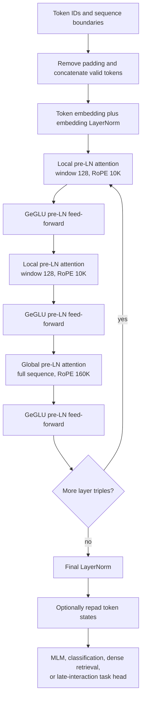
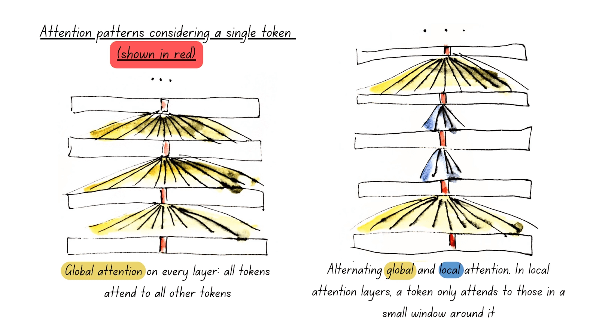
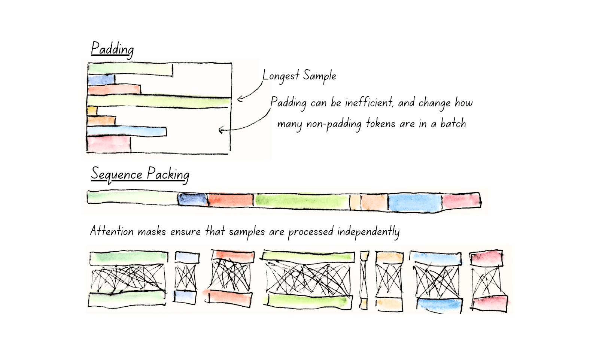
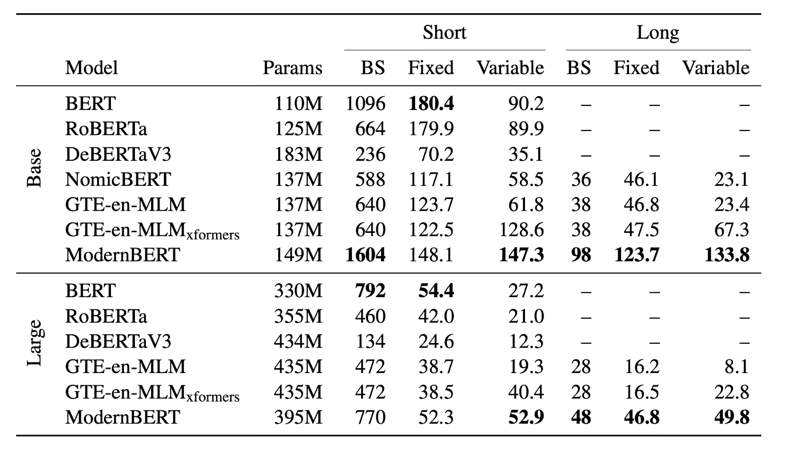
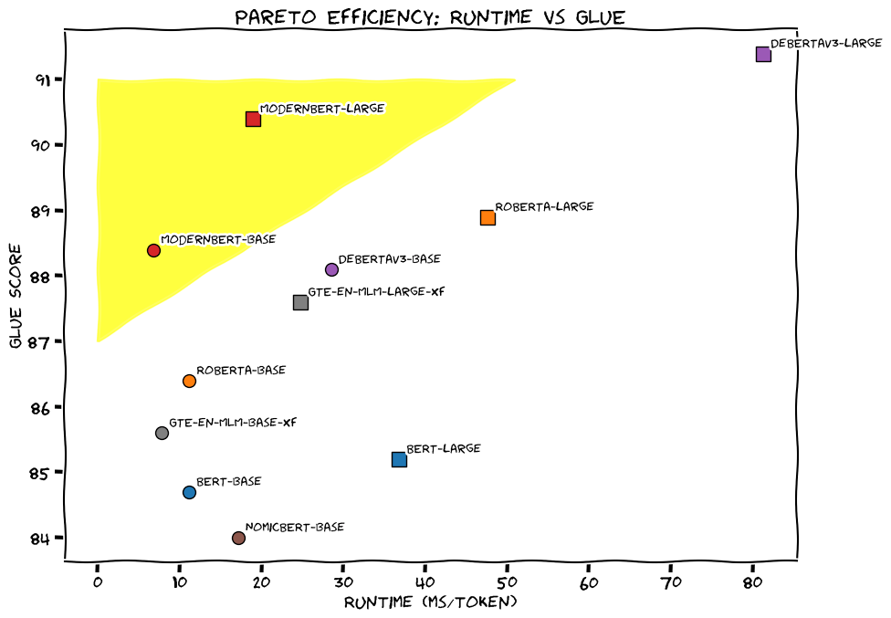

# ModernBERT — Warner et al., 2024

> **arXiv:** 2412.13663v2 · **Venue:** preprint · **Affiliation:** Answer.AI, LightOn, Johns Hopkins University, Hugging Face, and NVIDIA

## TL;DR
ModernBERT updates the BERT encoder recipe with RoPE, GeGLU, pre-normalization, alternating local/global attention, whole-model unpadding, FlashAttention, and GPU-aware dimensions, then trains base and large variants on about 2 trillion primarily English and code tokens. Both variants accept 8,192 tokens and improve the paper's combined classification, short- and long-context retrieval, and code-retrieval frontier. Its strongest systems result is practical long-context inference: on one RTX 4090, the paper reports 123.7K tokens/s for base and 46.8K tokens/s for large on fixed 8,192-token inputs, while the largest fitting long batches are 98 and 48 sequences respectively.

## Problem & motivation
Encoder-only Transformers remain useful for retrieval, classification, reranking, entity extraction, content moderation, and other non-generative workloads. They can inspect both left and right context in one pass and are much smaller than general-purpose decoder LLMs. Yet many deployed encoders still inherit limitations from BERT-era designs:

- a 512-token maximum length from learned absolute position embeddings;
- old WordPiece vocabularies and corpora with little or no code;
- post-normalized blocks and ungated feed-forward networks;
- dense attention in every layer, whose $L\times L$ score matrix becomes expensive at long sequence lengths;
- padded batches that spend compute and memory on semantically empty positions;
- dimensions selected mostly by parameter count rather than kernel and GPU utilization.

Prior modernization efforts addressed only parts of this list. MosaicBERT and CrammingBERT emphasized faster pretraining. NomicBERT and GTE-en-MLM supported longer retrieval inputs, but retained older architectural or data choices. DeBERTaV3 was a strong classification baseline but, in this paper's experiments, was weak as a retrieval backbone and expensive at inference. ModernBERT therefore asks whether an encoder can improve **quality, usable context length, speed, and memory together**, rather than trading one axis for another.

The target is deliberately practical: base-scale and large-scale models that preserve the familiar BERT hidden widths, run efficiently on common NVIDIA inference GPUs, and can serve as generic pretrained backbones. They are masked-language models, not ready-made universal embedding models; retrieval and classification results require task-specific fine-tuning.

## Key idea
ModernBERT is not based on one novel operator. Its contribution is a co-designed stack in which architecture, attention pattern, batching, kernels, dimensions, data, and training schedule reinforce one another.

For hidden states $X\in\mathbb R^{L\times d}$, standard bidirectional self-attention is

$$
Q=XW_Q,\qquad K=XW_K,\qquad V=XW_V,
$$

$$
\operatorname{Attn}(X;M)
=\operatorname{softmax}\!\left(\frac{QK^\top}{\sqrt{d_h}}+M\right)V,
$$

where $L$ is sequence length, $d$ is model width, $d_h=d/H$ is the per-head width for $H$ heads, and $M_{ij}$ is $0$ when token $j$ is visible to query $i$ and $-\infty$ otherwise. ModernBERT varies $M$ by depth:

$$
M^{(\ell)}_{ij}=
\begin{cases}
0, & \ell\text{ is a global-attention layer},\\
0, & \ell\text{ is local and }|i-j|\leq w/2,\\
-\infty, & \text{otherwise},
\end{cases}
$$

with a local window $w=128$ and a global layer every third layer. Two local layers cheaply propagate nearby evidence; periodic global layers restore direct document-wide communication. For a three-layer cycle, attention work is approximately

$$
O\!\left(2Lw+L^2\right),
$$

instead of $O(3L^2)$ for three all-global layers. The design therefore reduces the constant substantially but remains asymptotically quadratic because global layers are retained.

Position is injected by rotary position embeddings (RoPE). For each two-dimensional pair in a query or key vector at position $p$,

$$
R(p,\theta_i)
=
\begin{bmatrix}
\cos(p\theta_i) & -\sin(p\theta_i)\\
\sin(p\theta_i) & \cos(p\theta_i)
\end{bmatrix},
\qquad
\theta_i=\Theta^{-2i/d_h},
$$

$$
\widetilde q_{p,i}=R(p,\theta_i)q_{p,i},
\qquad
\widetilde k_{p,i}=R(p,\theta_i)k_{p,i}.
$$

Here $i$ indexes coordinate pairs and $\Theta$ is the RoPE base. Local layers use $\Theta=10{,}000$; after context extension, global layers use $\Theta=160{,}000$. The rotation makes attention scores depend on relative displacement while avoiding a learned absolute-position table capped at 512 entries.

The feed-forward branch is GeGLU:

$$
\operatorname{GeGLU}(x)
=\operatorname{GELU}(xW_g)\odot(xW_v),
\qquad
\operatorname{FFN}(x)=\operatorname{GeGLU}(x)W_o,
$$

where $W_g$ and $W_v$ are parallel input projections, $W_o$ projects back to width $d$, and $\odot$ is elementwise multiplication. The two branch widths are 1,152 for base and 2,624 for large, giving concatenated GLU expansions of 2,304 and 5,248.

## How it works

### End-to-end architecture

The diagram shows a conceptual three-layer cycle; the released base and large models contain 22 and 28 blocks, so the last cycle is partial.

### Model configurations

| Property | ModernBERT-base | ModernBERT-large | Source |
|---|---:|---:|---|
| Parameters | 149M | 395M | §2.1.3 |
| Transformer layers | 22 | 28 | Table 4 |
| Hidden width $d$ | 768 | 1,024 | Table 4 |
| Attention heads $H$ | 12 | 16 | Table 4 |
| Head width $d_h$ | 64 | 64 | derived from Table 4 |
| GeGLU branch width | 1,152 | 2,624 | Table 4 |
| Total GLU expansion | 2,304 | 5,248 | Table 4 |
| Vocabulary | 50,368 | 50,368 | Table 4 |
| Native context | 8,192 | 8,192 | §2.2.2 |
| Local attention window | 128 | 128 | Table 4 |
| Global attention cadence | every third layer | every third layer | Table 4 |
| Global/local RoPE base | 160,000 / 10,000 | 160,000 / 10,000 | Table 4 |

The vocabulary size and linear dimensions are multiples of 64. The authors additionally search for shapes that tile well into $128\times256$ tensor-core blocks and avoid poor wave utilization across a basket of T4, A10, L4, RTX 3090, RTX 4090, A100, and H100 GPUs. They retain BERT-compatible hidden widths of 768 and 1,024 while choosing more layers and hardware-friendly GeGLU widths. This is a heuristic multi-GPU compromise, not a proof that the dimensions are optimal on every device.

### Pre-normalized, mostly bias-free blocks

Let $x_\ell$ be the input to block $\ell$. Apart from the first attention normalization, which is redundant with the embedding normalization, a block is

$$
a_\ell=x_\ell+
\operatorname{Attn}_\ell\!\left(\operatorname{LN}(x_\ell)\right),
$$

$$
x_{\ell+1}=a_\ell+
\operatorname{FFN}_\ell\!\left(\operatorname{LN}(a_\ell)\right).
$$

LayerNorm uses $\epsilon=10^{-5}$ and no learned bias. Linear layers also omit bias except for the final MLM decoder. An extra LayerNorm immediately after token embeddings stabilizes the stack. Attention-output dropout is 0.1; other dropout is 0.0 in pretraining.

The paper's Appendix Table 4 labels the activation row “GeLU,” but §2.1.1 and the stated GLU dimensions make clear that the complete feed-forward unit is **GeGLU**: GELU is the gate nonlinearity inside the gated unit.

### Alternating local and global attention

The local/global schedule matters most at long lengths. A local layer limits each token to a 128-token sliding neighborhood; a global layer exposes all valid positions in that sample. Because global attention appears every third layer, any token can exchange information with any other token after reaching such a layer. The paper's ablations report that this pattern matched all-global downstream performance through a 100B-token ablation while providing major speedups. That evidence is empirical and at smaller scale than final training; it does not guarantee equal behavior for every long-range task.

RoPE is applied to 100% of each head dimension. The authors tested 50%, 75%, and 100% rotary fractions; smaller fractions were slightly better in small ablations, but the differences were minimal, so they retained the conservative full-head setting.

### Whole-model unpadding

A padded batch $X\in\mathbb R^{B\times L_{\max}\times d}$ contains only

$$
T=\sum_{b=1}^{B}L_b
$$

real tokens, while a conventional implementation computes over $B L_{\max}$ positions. ModernBERT gathers valid positions once into

$$
X_{\mathrm{packed}}\in\mathbb R^{T\times d}
$$

and carries cumulative sequence lengths

$$
\mathrm{cu\_seqlens}=[0,L_1,L_1+L_2,\ldots,T]
$$

through variable-length attention kernels. Sequence boundaries prevent attention from crossing between samples. Every encoder layer remains unpadded; outputs are scattered back to a padded layout only if the downstream caller requests it. The paper attributes a 10–20% performance improvement over approaches that repeatedly unpad and repad inside the model.

This should be distinguished from **training-time sequence packing**. Unpadding removes batch padding at runtime. Sequence packing greedily groups source examples into near-full training sequences while preserving independent attention masks. The reported packing efficiency exceeds 99%, which keeps the count of useful tokens per optimizer batch stable.

### Kernels and compilation

- Global layers use FlashAttention 3 on H100 training hardware.
- Local sliding-window layers use FlashAttention 2 because FlashAttention 3 lacked sliding-window support at the time.
- The implementation can fall back to FlashAttention 2 for all layers where FlashAttention 3 is unavailable.
- Variable-length FlashAttention and RoPE kernels consume the packed representation directly.
- Compatible modules are compiled with `torch.compile`; the paper reports about 10% additional training throughput with negligible compilation overhead.

FlashAttention changes the IO schedule and avoids materializing the full score matrix in high-bandwidth memory, but computes exact softmax attention for the selected global or local mask. The **attention pattern**, not FlashAttention itself, is what removes most long-sequence pairwise work.

### Downstream representations

The pretrained checkpoint emits one contextual state per valid token. The paper evaluates several adaptations:

1. **GLUE classification:** attach task-specific heads and fine-tune each task. MRPC, STS-B, and RTE start from the MNLI-fine-tuned checkpoint.
2. **Dense single-vector retrieval:** pool a document or query to one vector and train contrastively on MS MARCO with hard negatives.
3. **ColBERT-style multi-vector retrieval:** retain token vectors and score a query $q$ against document $d$ using late interaction,

$$
S(q,d)=\sum_{i=1}^{|q|}\max_{1\le j\le |d|}
\left\langle \widehat h_i^{(q)},\widehat h_j^{(d)}\right\rangle,
$$

where $\widehat h$ denotes a normalized projected token state. The student is distilled from BGE-M3 teacher scores with KL divergence.
4. **Code retrieval:** use the same dense-retrieval framework for CodeSearchNet and StackOverflow-QA.

Thus the reported retrieval scores characterize **fine-tuned ModernBERT backbones**, not the raw MLM checkpoint used without an embedding objective.

## Training / data

### Corpus and tokenizer

Both models see approximately 2T tokens, primarily English, drawn from web documents, code, and scientific literature. The paper says that ablations selected the mixture but does **not** disclose exact source names, proportions, filters, deduplication settings, or the code share. Exact reconstruction of the corpus is therefore impossible from the paper alone.

Tokenization uses a modified OLMo byte-pair tokenizer with a 50,368-token vocabulary. The multiple-of-64 vocabulary supports efficient matrix tiling and reserves 83 unused tokens for downstream applications. BERT special tokens and templates, including `[CLS]` and `[SEP]`, are retained, but the exact tokenizer modifications are not enumerated. ModernBERT does not use BERT token-type IDs.

### Masked-language-model objective

For a sampled mask set $\mathcal M$ containing 30% of input positions, the objective is

$$
\mathcal L_{\mathrm{MLM}}
=-\frac{1}{|\mathcal M|}
\sum_{i\in\mathcal M}
\log p_\theta(x_i\mid x_{\setminus\mathcal M}),
$$

where $x_i$ is the original token at masked position $i$ and $x_{\setminus\mathcal M}$ is the corrupted bidirectional context. Next-sentence prediction is removed. The paper follows MosaicBERT's masking setup but does not fully restate the exact mask/random/original replacement proportions, so those should be taken from the released configuration rather than inferred from original BERT.

### Three-stage length and learning-rate curriculum

| Stage | Tokens | Max length | Base LR | Large LR | Purpose | Source |
|---|---:|---:|---:|---:|---|---|
| Main pretraining | 1.719T | 1,024 | $8\times10^{-4}$ | $5\times10^{-4}$, then $5\times10^{-5}$ | learn general text/code representations cheaply | Table 3, §2.2.2 |
| Context extension | 250B | 8,192 | $3\times10^{-4}$ | $5\times10^{-5}$ | expose model to long sequences; raise global RoPE base | Table 3 |
| Quality-upsampled decay | 50B | 8,192 | decays from $3\times10^{-4}$ | decays from $5\times10^{-5}$ | recover a balanced final checkpoint | Table 3, §2.2.2 |

Main pretraining begins with learning-rate warmup over 3B tokens for base and 2B for large, then holds the rate constant. ModernBERT-large plateaued after 900B tokens at $5\times10^{-4}$; the authors rolled back and trained the remaining 800B tokens at $5\times10^{-5}$ with weight decay reduced from $10^{-5}$ to $10^{-6}$. This intervention means the final large run is not a single uninterrupted 1.719T-token trajectory.

Context extension raises maximum length from 1,024 to 8,192 and the global-layer RoPE base from 10,000 to 160,000. The first 250B long tokens use a resampled version of the original mixture. The final 50B tokens upsample higher-quality sources and apply a $1-\sqrt{\cdot}$ decay. If $u\in[0,1]$ is progress through decay, a normalized form is

$$
\eta(u)=\eta_0\left(1-\sqrt{u}\right),
$$

where $\eta_0$ is the stage's initial rate. The paper reports that combining long-sequence continuation with quality upsampling produced a better retrieval/classification balance than either strategy alone.

### Optimizer, batch schedule, and initialization

Training uses StableAdamW, which adds Adafactor-style update clipping to AdamW as a per-parameter learning-rate adjustment. Shared settings are $\beta_1=0.90$, $\beta_2=0.98$, $\epsilon=10^{-6}$, fully decoupled weight decay, and no weight decay on normalization or bias parameters.

The batch size is warmed up rather than fixed from step one:

- base: 768 to 4,608 sequences over 50B tokens;
- large: 448 to 4,928 sequences over 10B tokens.

During 8K stages, sequence batches are much smaller—about 72 for base and 77–78 for large—so total tokens per update remain comparable. The schedule allocates an equal number of update steps at each batch size rather than equal token intervals.

Base uses Megatron-style random initialization. Large is initialized from base using center tiling with wraparound, accounting for token embeddings and attention heads, plus Gopher layer scaling. This accelerated early loss reduction in ablations. Base's released checkpoint averages the three best annealing checkpoints with the final checkpoint; averaging did not help large, so its best annealing checkpoint is released directly.

### Compute and software

All phases use DistributedDataParallel on 8 H100 GPUs. Reported **training time** is:

| Phase | Base | Large | Source |
|---|---:|---:|---|
| Main pretraining | 191.1 h | 420.4 h | Table 3 |
| 250B context extension | 36.3 h | 75.1 h | Table 3 |
| 50B decay | 7.5 h | 15.3 h | Table 3 |
| Sum | 234.9 h | 510.8 h | derived from Table 3 |

The stack is PyTorch 2.4.0, CUDA 12.4.0, Composer 0.24.1, FlashAttention 2.6.3, and the paper's pinned FlashAttention 3 commit. A failed early base run exposed sequential bias from PyTorch's distributed random sampler at roughly 500M–1B samples; the final pipeline uses NumPy's PCG64DXSM sampler. This is a consequential reproducibility detail because the original run's loss oscillated and diverged.

## Results

### Aggregate downstream quality

All values below are copied from the paper's Table 1. BEIR and MLDR use nDCG@10; GLUE is the paper's average across eight development tasks; CSN and SQA are the CodeSearchNet and StackOverflow-QA code-retrieval scores. “Dense” means single-vector retrieval and “late” means ColBERT-style multi-vector retrieval.

| Size | Model | BEIR dense | MLDR OOD dense | MLDR ID dense | BEIR late | MLDR OOD late | GLUE | CSN | SQA | Source |
|---|---|---:|---:|---:|---:|---:|---:|---:|---:|---|
| Base | GTE-en-MLM | 41.4 | **34.3** | **44.4** | 48.2 | 69.3 | 85.6 | 44.9 | 71.4 | Table 1 |
| Base | **ModernBERT** | **41.6** | 27.4 | 44.0 | **51.3** | **80.2** | **88.4** | **56.4** | **73.6** | Table 1 |
| Large | DeBERTaV3 | 25.6 | 7.1 | 19.2 | 46.7 | 23.0 | **91.4** | 21.2 | 19.7 | Table 1 |
| Large | GTE-en-MLM | 42.5 | **36.4** | **48.9** | 50.7 | 71.3 | 87.6 | 40.5 | 66.9 | Table 1 |
| Large | **ModernBERT** | **44.0** | 34.3 | 48.6 | **52.4** | **80.4** | 90.4 | **59.5** | **83.9** | Table 1 |

The result is broad but not uniformly dominant. ModernBERT wins the paper's BEIR late-interaction average, long-context late interaction, and both code columns. Base leads the listed base models on GLUE. Large trails DeBERTaV3-large on GLUE and trails GTE-en-MLM on both dense MLDR settings. In particular, accepting 8K tokens does not guarantee that a single pooled vector transfers optimally to long documents without in-domain adaptation.

The GLUE aggregates of 88.4 and 90.4 are consistent with averaging the eight task values in Appendix Table 5 and rounding to one decimal. The comparisons combine ModernBERT fine-tuning runs with prior-model numbers drawn partly from their respective literature, and every GLUE subset receives a hyperparameter sweep; they are not a single-seed, one-recipe controlled study.

### Short-context retrieval detail

On 15 BEIR datasets, Appendix Tables 7–8 report:

| Model | Size | Dense average nDCG@10 | Late-interaction average nDCG@10 | Source |
|---|---|---:|---:|---|
| GTE-en-MLM | Base | 41.4 | 48.2 | Tables 7–8 |
| ModernBERT | Base | **41.6** | **51.3** | Tables 7–8 |
| GTE-en-MLM | Large | 42.5 | 50.7 | Tables 7–8 |
| ModernBERT | Large | **44.0** | **52.4** | Tables 7–8 |

ModernBERT's average is helped materially by TREC-COVID: its dense scores are 72.1 base and 74.1 large, versus 49.7 and 48.4 for GTE-en-MLM. The authors explicitly flag a possible recency advantage, although other recent encoders also use updated data. Learning rates are selected on NFCorpus, SciFact, TREC-COVID, and FiQA, so the full BEIR average is not an untouched model-selection target.

### Efficiency and memory

Efficiency uses four synthetic collections of 8,192 documents: fixed 512-token, variable short with mean 256, fixed 8,192-token, and variable long with mean 4,102. Runs use one RTX 4090 and are averaged over ten repetitions. Throughput values are **thousands of tokens per second**; batch size is the largest fitting batch.

| Size | Model | Short max batch | Short fixed K tok/s | Short variable K tok/s | Long max batch | Long fixed K tok/s | Long variable K tok/s | Source |
|---|---|---:|---:|---:|---:|---:|---:|---|
| Base | BERT | 1,096 | **180.4** | 90.2 | — | — | — | Table 2 |
| Base | GTE-en-MLM + xFormers | 640 | 122.5 | 128.6 | 38 | 47.5 | 67.3 | Table 2 |
| Base | **ModernBERT** | **1,604** | 148.1 | **147.3** | **98** | **123.7** | **133.8** | Table 2 |
| Large | BERT | **792** | **54.4** | 27.2 | — | — | — | Table 2 |
| Large | GTE-en-MLM + xFormers | 472 | 38.5 | 40.4 | 28 | 16.5 | 22.8 | Table 2 |
| Large | **ModernBERT** | 770 | 52.3 | **52.9** | **48** | **46.8** | **49.8** | Table 2 |

Appendix Table 11 provides absolute runtimes that cross-check these rates. ModernBERT-base processes 67,108,864 fixed long tokens in 542.4 s, giving about 123.7K tokens/s; large takes 1,433.9 s, giving about 46.8K tokens/s. These absolute times resolve a possible unit-reading trap: larger Table 2 values are faster, not slower.

On fixed short inputs, old BERT and RoBERTa remain faster than ModernBERT-base, and BERT is slightly faster than ModernBERT-large. ModernBERT's advantage becomes pronounced for variable lengths and especially 8K inputs, where unpadding and local attention matter. The results are specific to an RTX 4090, the tested precision/software stack, and the largest-batch evaluation protocol; they should not be generalized unchanged to CPUs, other accelerators, latency at batch one, or serving systems.

## Limitations & follow-ups

- **English focus.** Training is primarily English plus code, and evaluation is English-only. The paper does not establish multilingual transfer, especially for low-resource languages.
- **Incomplete data reproducibility.** Exact corpus sources, mixture weights, filtering, deduplication, code proportion, knowledge cutoff, and tokenizer modifications are not published. Open training code cannot reconstruct the released weights without these inputs.
- **Scale confounding.** ModernBERT combines architectural changes with about 2T training tokens and newer data. Final-model comparisons do not isolate how much gain comes from architecture, data volume, data recency, code, or tokenizer choice. Most architecture ablations use only 8–20B tokens, with the attention comparison extending to 100B.
- **Periodic quadratic layers.** Every third layer is global, so long-context attention is cheaper than all-global attention but not asymptotically linear. Memory-efficient FlashAttention does not change that arithmetic complexity.
- **Accepted versus effective context.** The model natively accepts 8,192 positions, but dense out-of-domain MLDR trails GTE-en-MLM. Effective long-context use depends on the downstream objective, pooling, and fine-tuning distribution.
- **Benchmark breadth.** MLDR is the main long-context task. The work does not test long-document classification, extractive QA, multi-hop evidence recovery, RULER-style diagnostics, or position-sensitive “lost in the middle” behavior.
- **Fine-tuned, selected results.** Retrieval models receive learning-rate sweeps and task-specific training; GLUE receives per-task sweeps and transfer from MNLI for three tasks. Results do not describe zero-shot behavior of the raw checkpoint.
- **Hardware specificity.** Efficiency is measured on one RTX 4090 with synthetic inputs and throughput-oriented batches. No batch-one latency, CPU, energy, cross-GPU, ONNX, quantized, or production-serving comparison is reported.
- **Training instability and intervention.** The initial base run failed because of sampler bias, and large required rollback after a long high-learning-rate plateau. These details are valuable but show that the recipe was not robust without monitoring and manual correction.
- **Objective frontier.** The authors suggest combining masked-language modeling with replaced-token detection because DeBERTaV3 remains stronger on large-model GLUE while ModernBERT is stronger for retrieval. This is proposed future work, not a tested ModernBERT variant.
- **Model scaling.** Only 149M and 395M sizes are explored, leaving the scaling behavior of this architecture unresolved.
- **Bias and harmful content.** Web-trained representations can reproduce source-data biases. Although the model is not an autoregressive generator, masked-token predictions can still emit harmful content.

The immediate successor thread includes full-attention [NeoBERT](https://arxiv.org/abs/2502.19587), paired encoder/decoder [Ettin](https://arxiv.org/abs/2507.11412), massively multilingual [mmBERT](https://arxiv.org/abs/2509.06888), and multilingual [EuroBERT](https://arxiv.org/abs/2503.05500). Their local reviews are not yet present; the BERT overview tracks them.

## Links

- **Review thread:** [BERT-family overview](../bert/overview.md#163-the-modern-encoder-revival)
- **arXiv:** [abs](https://arxiv.org/abs/2412.13663v2) · [html](https://arxiv.org/html/2412.13663v2) · [pdf](https://arxiv.org/pdf/2412.13663v2)
- **Code:** [AnswerDotAI/ModernBERT](https://github.com/AnswerDotAI/ModernBERT)
- **Hugging Face:** [ModernBERT-base](https://huggingface.co/answerdotai/ModernBERT-base) · [ModernBERT-large](https://huggingface.co/answerdotai/ModernBERT-large) · [model collection](https://huggingface.co/collections/answerdotai/modernbert-67627ad707a4acbf33c41deb)
- **Project page:** —
- **Blog posts:** [Hugging Face / Answer.AI release article](https://huggingface.co/blog/modernbert) (source of the local companion illustrations)
- **Talks / videos:** —
- **OpenReview / venue page:** —
- **Papers-with-Code:** [ModernBERT](https://paperswithcode.com/paper/smarter-better-faster-longer-a-modern)
- **BibTeX:** [repository citation](https://github.com/AnswerDotAI/ModernBERT#reference)
- **Related / successor papers:** [NeoBERT](https://arxiv.org/abs/2502.19587) · [Ettin / Seq vs Seq](https://arxiv.org/abs/2507.11412) · [mmBERT](https://arxiv.org/abs/2509.06888) · [EuroBERT](https://arxiv.org/abs/2503.05500)
