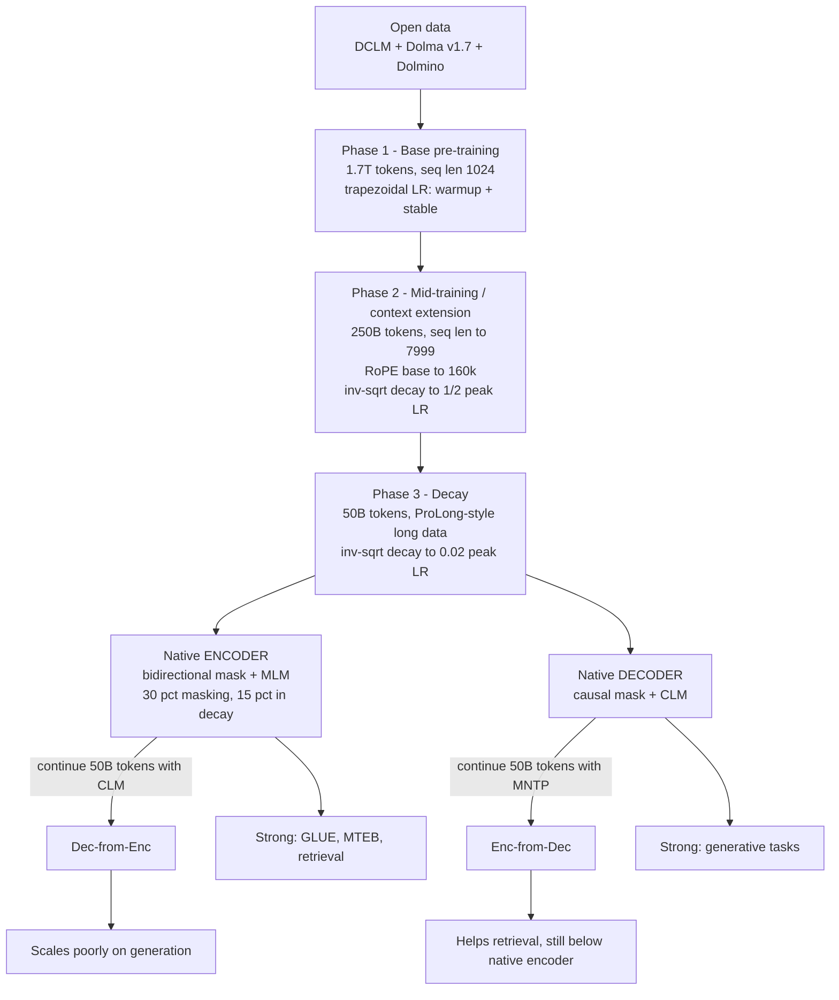

# Ettin / Seq vs Seq — Weller et al., 2025

> **arXiv:** 2507.11412v2 · **Venue:** ICLR 2026 · **Affiliation:** Johns Hopkins University (CLSP) and LightOn

## TL;DR
Ettin is the first suite of **paired encoder-only and decoder-only models** trained with an identical recipe — same open data, same data order, same architecture shape, same schedule — differing only in attention mask (bidirectional vs causal) and objective (MLM vs CLM). Six paired sizes from 17M to 1B parameters are trained on up to 2T tokens, and the models are simultaneously state-of-the-art among open-data encoders (beating ModernBERT) *and* open-data decoders (beating Llama 3.2 1B and SmolLM2). The headline scientific result is that native objectives retain a durable advantage: 50B tokens of cross-objective continued pretraining never closes the gap in either direction, and a 150M native encoder beats a 400M decoder on MNLI.

## Problem & motivation
Encoder-only models were the foundation of the neural NLP era through ELMo and BERT, but the field pivoted to decoder-only models for their generative strength. The consequence is a development gap: practitioners doing retrieval, classification, or fast on-device inference still routinely deploy 2019-era checkpoints, while decoder research absorbed nearly all architectural and data-scaling progress.

A widely held community assumption made this gap seem acceptable — that decoders can simply be *adapted* to encoder-style tasks. Decoders are more studied, more overtrained relative to Chinchilla-optimal budgets, and generally larger, and they now occupy the top of leaderboards such as MTEB that were historically encoder territory. Adaptation recipes like LLM2Vec made "continue-train a decoder with a masked objective" a standard move.

The problem is that this assumption has never been tested cleanly. Prior encoder-vs-decoder comparisons had to use **incomparable models**: different architectures, different pretraining corpora, different tokenizers, different learning-rate schedules, different token budgets. Any measured difference confounds the objective with a dozen other variables. If BERT loses to a modern 1B decoder, is that because bidirectional MLM is worse, or because the decoder saw 50× more and better data?

Ettin removes the confounders by construction. It holds everything fixed except the two variables actually under study, so that the encoder-vs-decoder question becomes a controlled experiment rather than a leaderboard comparison. A secondary contribution is practical: because ModernBERT's training data was never released, Ettin also provides the **first open-data replication of the ModernBERT recipe**, letting others build on it.

## Key idea
Train two models that are identical in every respect except two bits of configuration.

Let $x = (x_1,\dots,x_L)$ be a token sequence of length $L$, and let $h_i \in \mathbb{R}^{d}$ denote the final hidden state at position $i$ with hidden width $d$. Attention scores in every layer are

$$
\operatorname{Attn}(X) = \operatorname{softmax}\!\left(\frac{\widetilde{Q}\widetilde{K}^{\top}}{\sqrt{d_h}} + M\right)V,
\qquad Q = XW_Q,\; K = XW_K,\; V = XW_V,
$$

where $X \in \mathbb{R}^{L\times d}$ are layer inputs, $d_h = d/H$ is per-head width for $H$ heads, $\widetilde{Q},\widetilde{K}$ are the rotary-rotated projections, and $M$ is the additive mask. **Variable 1** is $M$:

$$
M^{\text{enc}}_{ij} = 0 \quad \forall\, i,j \text{ valid},
\qquad
M^{\text{dec}}_{ij} =
\begin{cases}
0 & j \le i \\
-\infty & j > i
\end{cases}
$$

The encoder lets every valid token attend in both directions; the decoder forbids attending to the future. **Variable 2** is the loss. For the encoder, masked language modeling over a corrupted copy $\tilde{x}$ with masked index set $\mathcal{M} \subset \{1,\dots,L\}$:

$$
\mathcal{L}_{\text{MLM}} = -\frac{1}{|\mathcal{M}|}\sum_{i \in \mathcal{M}} \log p_\theta\!\left(x_i \mid \tilde{x}\right)
$$

For the decoder, causal language modeling over every position:

$$
\mathcal{L}_{\text{CLM}} = -\frac{1}{L}\sum_{t=1}^{L} \log p_\theta\!\left(x_t \mid x_{<t}\right)
$$

Here $\theta$ are model parameters and $p_\theta$ is the softmax over the 50,368-entry vocabulary. Note the asymmetry in supervision density that the paper later uses to explain a conflicting result: CLM receives a loss term at **every** position, whereas MLM receives one at only $|\mathcal{M}|/L$ of positions (30% for most of Ettin's training).

The third mechanism is **cross-objective training**: take a fully trained model and continue pretraining it on the *reverse* objective for 50B tokens. Following LLM2Vec, the encoder-from-decoder direction does not use plain MLM but **masked next-token prediction (MNTP)**, where the masked token is predicted from the hidden state of the *preceding* position so the head stays aligned with the causal pretraining:

$$
\mathcal{L}_{\text{MNTP}} = -\frac{1}{|\mathcal{M}|}\sum_{i \in \mathcal{M}} \log p_\theta\!\left(x_i \mid h_{i-1}\right)
$$

This yields four model families per size: native **Enc**, native **Dec**, **Enc-from-Dec** (decoder continued with MNTP), and **Dec-from-Enc** (encoder continued with CLM).

## How it works

### Architecture
The backbone is a ModernBERT-style transformer. Both members of a pair use the **exact same configuration** — layer count, hidden size, intermediate size, head count, learning rate, weight decay, and warmup are all shared (per Table 1).

| Parameter | 17M (XXS) | 32M (XS) | 68M (Small) | 150M (Base) | 400M (Large) | 1B (XL) |
|---|---|---|---|---|---|---|
| Layers | 7 | 10 | 19 | 22 | 28 | 28 |
| Hidden size | 256 | 384 | 512 | 768 | 1024 | 1792 |
| Intermediate size | 384 | 576 | 768 | 1152 | 2624 | 3840 |
| Attention heads | 4 | 6 | 8 | 12 | 16 | 28 |
| Learning rate | 3e-3 | 3e-3 | 3e-3 | 8e-4 | 5e-4 | 5e-4 |
| Weight decay | 3e-4 | 3e-4 | 3e-4 | 1e-5 | 1e-5 | 5e-5 |
| Warmup tokens (B) | 4 | 4 | 3 | 3 | 2 | 2 |
| Batch-size warmup (B) | 125 | 100 | 75 | 50 | 10 | 3 |

Shapes follow MobileLLM's **deep-and-thin** philosophy; the 1B model is the exception, keeping 28 layers and growing width to 1792 instead of adding depth. Sizes were chosen at roughly 2× increments to line up with familiar encoder scales.

Shared block mechanics (per Table 12): pre-normalization, LayerNorm with $\epsilon = 10^{-12}$ and **no** norm bias, GLU feed-forward with GELU activation, no QKV bias, no attention-output bias, RoPE positions, unpadded sequences, and the ModernBERT tokenizer with a 50,368-token vocabulary.

Attention alternates local and global, exactly as in ModernBERT — a **128-token sliding window** in most layers with **full global attention every 3rd layer**:

$$
M^{\text{local}}_{ij} =
\begin{cases}
0 & |i - j| \le w/2 \\
-\infty & \text{otherwise}
\end{cases}
\qquad w = 128
$$

so the cost of a local layer is $O(Lw)$ while the periodic global layers remain $O(L^2)$ and restore document-wide communication. One notable divergence from ModernBERT: Ettin sets the **same RoPE base of 160,000 for both local and global layers**, where ModernBERT used different values.

### Self-authored view of the paired pipeline

The single branch point at the bottom of the shared pipeline is the whole experimental design: everything above it is literally identical, so any divergence below it is attributable to mask plus objective.

### Training phases in detail
1. **Base pretraining — 1.7T tokens.** Warmup plus stable segment of a trapezoidal (warmup–stable–decay) learning-rate schedule. Both learning-rate warmup and batch-size warmup are used. Sequence length 1,024. Data is a broad mixture dominated by DCLM (49.1%) and CC Head (20.9%), with Starcoder code at 15.5% (per Table 2).
2. **Mid-training / context extension — 250B tokens.** Data quality is raised and length raised together: sequences extend to 7,999 tokens and the RoPE base moves to 160k. The noisiest sources are dropped (older Dolma Common Crawl, CC News, general StackExchange) in favor of filtered DCLM from Dolmino (70.4%), math, and curated StackExchange. Learning rate follows an inverse-square-root schedule from the peak down to half the peak.
3. **Decay — 50B tokens.** A second inverse-square-root decay down to 0.02 of peak learning rate, following the ProLong recipe by upweighting long-context sources: Dolma Books (13.8%), Wikipedia, and open-access textbooks, plus a Code_Repos share of 26.5%. Note Table 2's decay column sums to 76.3B tokens of *available pool*; the caption states 50B tokens are actually trained, with sources sampled, repeated, or under-sampled to hit the target.

Masking ratio is **30% for MLM throughout, lowered to 15% for the decay phase** — one of the five deliberate departures from ModernBERT, alongside open data, decaying within the context-extension phase, using identical local/global RoPE, and **deliberately skipping model merging** (the authors note merging would likely add another point or two but would compromise clean scientific comparison).

Checkpoints are saved every **8.5B tokens, giving 236 checkpoints per model**, and the batch-order data is released, so any behaviour can be traced to the exact tokens that produced it.

### Cross-objective continued training
Each fully trained model is continued for **50B tokens** on the reverse objective — substantially more than LLM2Vec's ~10B. The data is the highest-quality decay-phase mixture (a second repetition, which prior work indicates is harmless at two repeats). A fresh trapezoidal schedule is used with 3B tokens of warmup and 10B of decay; the 1B model's budget is scaled by 1/3 for compute reasons. Enc-from-Dec uses a 15% masking rate as a middle ground.

## Training / data
- **Corpus.** Fully open: DCLM, Dolma v1.7 curated sources, and Dolmino (OLMo 2) filtered data for later phases. An ablation with non-filtered data produced worse results. Both the raw training data and the **exact batch order seen by the models** are released.
- **Budget.** ~2T tokens total (1.7T + 250B + 50B). The **1B models are the exception**: compute limits forced scaling to 1/3 of the data, i.e. ~667B tokens instead of 2T — still above Chinchilla-optimal, and still enough to beat 1B baselines trained longer.
- **Objectives.** $\mathcal{L}_{\text{MLM}}$ (30%/15% masking) for encoders, $\mathcal{L}_{\text{CLM}}$ for decoders, $\mathcal{L}_{\text{MNTP}}$ for the decoder→encoder adaptation.
- **Schedule.** Trapezoidal LR with explicit batch-size warmup; inverse-square-root decays in phases 2 and 3.
- **Compute.** A comparatively small cluster: **4×H100 with NVLink per model**. Base pretraining takes ~6 days for the 17M model and ~40 days for the 1B model (per Appendix E).
- **Evaluation setup.** Encoders reuse ModernBERT's evaluation protocol and hyperparameter sweeps for fairness; decoders use the EleutherAI harness with zero-shot closed-book settings. Encoders are evaluated on generative tasks via Samuel (2024)'s protocol: append three mask tokens and iteratively fill the first.

## Results

### Encoders are SOTA for their size (per Table 3)

| Model | CSN | MLDR | MTEB v2 Retrieval | SST-2 | MNLI | GLUE Avg |
|---|---|---|---|---|---|---|
| DistilRoBERTa (82M) | 60.3 | 19.7 | 40.0 | 93.1 | 84.7 | 83.8 |
| **Ettin-Enc-68m** | **75.1** | **30.1** | **43.1** | **94.4** | **87.0** | **87.2** |
| ModernBERT base | 75.9 | 30.4 | 43.9 | **96.0** | 89.1 | 88.4 |
| **Ettin-Enc-150m** | **76.3** | **31.8** | **45.7** | 95.8 | **89.2** | **88.9** |
| ModernBERT large | 78.3 | 34.9 | 47.0 | **97.1** | 90.8 | 90.4 |
| **Ettin-Enc-400m** | **80.7** | **36.2** | **48.4** | 96.7 | **91.3** | **90.8** |
| DeBERTa-v1-xl | 75.6 | 28.1 | 47.2 | 97.1 | 91.7 | 90.7 |
| **Ettin-Enc-1B** | **82.3** | **40.2** | **50.1** | 97.1 | **91.8** | **91.6** |

The gains are largest at bigger sizes; the authors attribute the narrower small-model margins to heavily distillation-optimized baselines (and note MiniLM L12 has 21M non-embedding parameters vs Ettin-32m's 12M). The long-context MLDR column shows the widest relative margin — Ettin-Enc-1B's 40.2 against DeBERTa-v1-xl's 28.1.

### Decoders are SOTA among open-data models (per Table 4)

| Model | ARC | HS | LMB | SciQ | TQA | WSC | Avg |
|---|---|---|---|---|---|---|---|
| Pythia-160m | 24.0 | 30.2 | 32.9 | 67.2 | 0.4 | 58.2 | 39.1 |
| SmolLM2-135m | **29.1** | **43.1** | 42.9 | 78.5 | 5.0 | **59.7** | 45.2 |
| **Ettin-Dec-150m** | 28.6 | 40.3 | **43.2** | **89.6** | **11.2** | 59.0 | **46.2** |
| SmolLM2-360m | **37.6** | **56.3** | **53.5** | 86.6 | **18.4** | 70.3 | 53.1 |
| **Ettin-Dec-400m** | 33.6 | 54.3 | 52.3 | **91.8** | 18.3 | **71.8** | **53.1** |
| OLMo-1B-0724 | 32.3 | **66.1** | 61.0 | 91.8 | 1.2 | 76.9 | 55.1 |
| Llama-3.2-1B | 36.2 | 63.7 | **62.1** | 88.4 | 24.9 | 74.7 | 56.6 |
| **Ettin-Dec-1B** | **39.7** | 62.9 | 58.4 | **93.8** | **29.3** | **79.1** | **59.0** |

This matters methodologically more than competitively: because the *same* recipe produces best-in-class models on both sides, the encoder-vs-decoder comparison cannot be dismissed as a recipe tuned to favour one architecture.

### The central result: native objectives win, and adaptation does not fix it

Selected values (per Table 9, the table version of Figure 1):

| Size | Variant | Retrieval nDCG@10 | MNLI Acc | Generative Avg |
|---|---|---|---|---|
| 150M | Enc | **39.97** | **89.2** | 42.9 |
| 150M | Dec | 37.71 | 85.6 | **46.2** |
| 150M | Enc-from-Dec | 39.49 | 85.8 | 43.7 |
| 150M | Dec-from-Enc | 37.55 | 86.8 | 43.6 |
| 400M | Enc | **42.24** | **91.3** | 48.2 |
| 400M | Dec | 39.93 | 88.2 | **53.1** |
| 400M | Enc-from-Dec | 41.44 | 87.6 | 48.4 |
| 400M | Dec-from-Enc | 39.69 | 89.4 | 49.1 |
| 1B | Enc | **43.35** | **91.8** | 50.7 |
| 1B | Dec | 41.70 | 89.9 | **59.0** |
| 1B | Enc-from-Dec | 43.24 | 89.0 | 52.5 |
| 1B | Dec-from-Enc | 40.77 | 90.5 | 52.2 |

Three findings follow:

- **Classification.** Encoders dominate, and cross-objective training barely moves the needle — Enc-from-Dec stays close to its decoder origin. A **150M encoder scores 89.2 MNLI against the 400M decoder's 88.2** (per §4.2), i.e. the native objective is worth more than a ~2.7× parameter advantage.
- **Retrieval.** Encoders again lead, but here MNTP adaptation genuinely helps the decoder at all sizes. Even so it does not catch up: at 400M, **42.24 for the native encoder vs 41.44 for Enc-from-Dec** despite 50B extra tokens.
- **Generation.** The ordering reverses, and the gap *widens* with scale — from roughly parity at 68M to **more than 6 points at 1B** (59.0 vs 52.2). Dec-from-Enc scales poorly, which the authors suggest explains the near-absence of prior work in that direction.

The average hides a nuance worth keeping: on generative benchmarks that are really classification in disguise (ARC, SciQ), **encoders used generatively beat decoders** — 35.6 vs 33.6 ARC at 400M. Decoders' advantage concentrates in HellaSwag, TriviaQA, and SIQA. The same split appears at 1B on harder benchmarks (per Table 5): **Dec-from-Enc reaches 37.0 on MMLU CS vs the decoder's 27.0, but collapses to 18.9 on GSM8k vs 32.0**.

### Gender-bias case study

Because the training data and its order are identical and public, behavioural differences can be attributed to objective alone. Encoders are markedly more likely to predict gender-neutral pronouns; decoders start at 84% male at 17M and decline monotonically to 54% at 1B, while the encoder trend is more stochastic. Both remain male-biased. The full coreference task (Table 10) is too hard for most of these sizes — many do not exceed the 50% random baseline.

## Limitations & follow-ups
- **1B models are undertrained.** Compute availability forced the 1B pair to ~667B tokens (1/3 of the intended 2T), so the top of the scaling curve is not directly comparable to the smaller sizes.
- **The "3B encoder" claim is extrapolation.** The discussion argues a 3B encoder would likely outperform today's 7B+ decoder-based MTEB leaders, but the suite stops at 1B; this is an inference from the trend, not a measurement.
- **Asymmetric adaptation budget.** Cross-objective training gets 50B tokens against ~2T of native pretraining. The authors defend this as mimicking realistic adaptation budgets, but it does not establish what would happen with a far larger conversion budget.
- **Conflicting concurrent evidence.** Gisserot-Boukhlef et al. (2025) found CLM→MLM continued pretraining better in nearly all cases. Ettin attributes the discrepancy to scale: that study pretrained for only 100B tokens, a regime where CLM's denser per-token supervision makes it more data-efficient. This remains an interpretation rather than a controlled refutation.
- **Deliberately no model merging**, so published numbers understate what the recipe can deliver in deployment by an estimated point or two.
- **Scope.** English-only; the bias study covers a single benchmark and only three pronoun categories, which WinoGender's design imposes.
- **Non-native generative protocol.** Encoders are evaluated on generation through iterative mask-filling, which may understate or distort their generative capability.
- **Internal inconsistency to be aware of.** The v2 introduction describes the suite as "10 models (5 pairs)", but Table 1 specifies six configurations and every results table reports six sizes; treat **six pairs** as authoritative.

Successors and siblings in the encoder revival: [ModernBERT](bert-modern-encoder_2024_modernbert.md) is the recipe Ettin replicates on open data, [NeoBERT](bert-modern-encoder_2025_neobert.md) takes the full-attention alternative, and [mmBERT](bert-modern-encoder_2025_mmbert.md) (from an overlapping JHU team, cited by Ettin as concurrent SOTA work) extends the approach multilingually.

## Links

- **Review thread:** [BERT-family overview](../bert/overview.md#163-the-modern-encoder-revival)
- **arXiv:** [abs](https://arxiv.org/abs/2507.11412) · [html](https://arxiv.org/html/2507.11412v2) · [pdf](https://arxiv.org/pdf/2507.11412)
- **Code:** [JHU-CLSP/ettin-encoder-vs-decoder](https://github.com/JHU-CLSP/ettin-encoder-vs-decoder)
- **Hugging Face:** [jhu-clsp](https://huggingface.co/jhu-clsp) (models, training data, and batch-order data)
- **Project page:** —
- **Blog posts:** —
- **Talks / videos:** —
- **OpenReview / venue page:** — (ICLR 2026)
- **Papers-with-Code:** —
- **BibTeX:** see the [arXiv abs page](https://arxiv.org/abs/2507.11412)
- **Related / successor papers:** [ModernBERT](bert-modern-encoder_2024_modernbert.md) · [NeoBERT](bert-modern-encoder_2025_neobert.md) · [RoPE](positional_2021_rope-roformer.md) · [BERT](bert-encoder_2018_bert-pretraining.md) · [DeBERTa](bert-attention_2020_deberta.md) · [mmBERT](bert-modern-encoder_2025_mmbert.md) · [EuroBERT](https://arxiv.org/abs/2503.05500)
