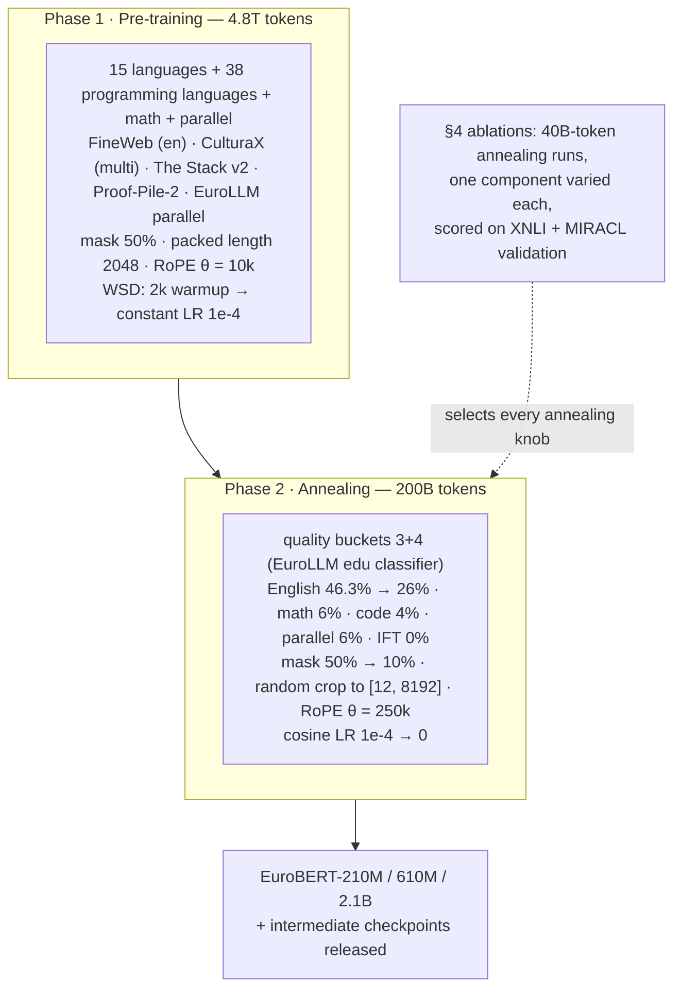

# EuroBERT — Boizard et al., 2025

> **arXiv:** 2503.05500v3 (v1 7 Mar 2025, v3 1 Jun 2026) · **Venue:** preprint (28 pages, 8 figures, 13 tables) · **Affiliation:** 19-author European academic–industry consortium (first author Nicolas Boizard, senior author Pierre Colombo); trained on the Adastra supercomputer at CINES

## TL;DR
EuroBERT is a three-model family (210M, 610M, 2.1B) of multilingual bidirectional encoders built by porting the Llama 3 block — RMSNorm, SwiGLU, RoPE, grouped-query attention, no biases — into an MLM-trained encoder, then training on a 5T-token corpus spanning 15 languages plus 38 programming languages, mathematics, and translation-parallel text. It natively handles 8,192 tokens and beats XLM-RoBERTa and mGTE on retrieval, regression, code, and math at equal or smaller size. Its most durable contribution is not the checkpoints but the **annealing ablation suite** (§4): a set of controlled 40B-token runs showing that code/math data, masking rate, educational-quality filtering, and instruction data each trade multilingual *classification* against multilingual *retrieval* in ways that contradict decoder-era intuitions.

## Problem & motivation

Encoders supply the general-purpose vector representations behind retrieval, classification, and regression, but the engineering effort of 2020–2024 went almost entirely into decoders. The paper's framing is that the innovations driving decoder progress — architectural (RoPE, GQA, SwiGLU, RMSNorm, bias removal), data-centric (quality filtering, code, math, parallel text, curriculum/annealing), and scale-related — are **not inherently tied to causal attention**, yet nobody had transferred them wholesale to a bidirectional multilingual model. Practitioners were therefore stuck with XLM-RoBERTa (2019) and mDeBERTa-v3.

Three specific gaps motivate the design:

1. **Architecture debt.** XLM-R still uses learned absolute positions, post-norm blocks, GELU FFNs, biases, and a 512-token window. A multilingual encoder with 8K context did not exist outside mGTE.
2. **The curse of multilinguality.** Conneau et al. showed that per-language quality degrades as languages are added at fixed capacity, and that *increasing capacity* mitigates it. EuroBERT's answer is deliberately the opposite of [mmBERT](bert-modern-encoder_2025_mmbert.md)'s: instead of 1,833 languages at ~300M parameters, cover **15 carefully chosen languages** and scale to **2.1B parameters**.
3. **No encoder-specific data science.** Decoder recipes (educational-quality filters, instruction tuning, code-heavy mixes) were being copied into encoder training without evidence. EuroBERT tests them and finds several actively harmful.

The 15 languages — English, French, German, Spanish, Chinese, Italian, Russian, Polish, Portuguese, Japanese, Vietnamese, Dutch, Arabic, Turkish, Hindi — were picked to balance European coverage with widely spoken global languages and to span diverse scripts and families (footnote 2).

## Key idea

EuroBERT = **Llama 3 block + MLM objective + two-phase WSD curriculum with an ablation-tuned annealing mixture.**

**1. Decoder architecture, bidirectional attention.** Every token attends to every other token (no causal mask), but the block internals are Llama's. Attention uses **grouped-query attention** in the larger sizes: with $H$ query heads and $G$ key/value groups ($G < H$), queries within a group share one K/V pair,

$$
\operatorname{Attn}_h(X) = \operatorname{softmax}\!\left(\frac{\widetilde{Q}_h \widetilde{K}_{g(h)}^{\top}}{\sqrt{d_h}}\right) V_{g(h)},
\qquad g(h) = \left\lfloor \frac{h\,G}{H} \right\rfloor,
$$

where $d_h$ is head width and $g(h)$ maps query head $h$ to its K/V group. EuroBERT-610M and 2.1B use $H = 18$, $G = 6$ (a 3:1 ratio); the 210M model uses full multi-head attention ($H = G = 12$).

Positions enter through **RoPE** with base $\theta$: for coordinate pair $i$ at position $p$, $\theta_i = \theta^{-2i/d_h}$ and the query/key vectors are rotated by angle $p\theta_i$, so attention logits depend on the displacement $p - r$ rather than absolute indices. The base is raised $10{,}000 \rightarrow 250{,}000$ at annealing to stretch the usable window to 8,192 tokens.

The FFN is **SwiGLU**, $\operatorname{FFN}(x) = \big(\operatorname{SiLU}(xW_g) \odot xW_v\big)W_o$, and normalization is pre-**RMSNorm**, $\operatorname{RMSNorm}(x) = \frac{x}{\sqrt{\frac{1}{d}\sum_i x_i^2 + \varepsilon}} \odot \gamma$ with $\varepsilon = 10^{-5}$. All biases are removed.

**2. High masking early, low masking late.** The objective is plain MLM,

$$
\mathcal{L}_{\text{MLM}} = -\frac{1}{|\mathcal{M}|}\sum_{t \in \mathcal{M}} \log p_\theta\!\left(x_t \mid \tilde{x}_{\setminus\mathcal{M}}\right),
$$

with masking rate $|\mathcal{M}|/L = \mathbf{50\%}$ during pre-training — following Wettig et al. (2023), who showed 15% and 30% are sub-optimal and that larger models tolerate higher rates — then dropped to $\mathbf{10\%}$ during annealing. §4 shows this final drop is a *deliberate trade*: it buys XNLI accuracy and costs MIRACL nDCG.

**3. WSD schedule with a data-distribution shift at the knee.** Warmup-Stable-Decay: 2,000 linear warmup steps, constant LR $1\times10^{-4}$ for 4.8T tokens of pre-training, then a cosine decay to 0 over 200B annealing tokens. The annealing phase simultaneously changes *five* things — quality filter, language balance, code/math share, parallel share, masking rate, and sequence-length regime — each of which was chosen by an explicit ablation rather than intuition.

**4. Random cropping as a stand-in for variable-length training.** Pre-training packs documents to a fixed 2,048 tokens. Because the corpus had already been pre-segmented into fixed-length documents, true variable-length batching was infeasible, so annealing **randomly crops** each sequence to a length sampled between 12 and 8,192 tokens. This turned out to be the single largest ablation effect in the paper (§4).

## How it works

### Architecture (Table 3, Appendix A)

| | EuroBERT-210M | EuroBERT-610M | EuroBERT-2.1B |
|---|---|---|---|
| Layers | 12 | 26 | 32 |
| Embedding dim | 768 | 1,152 | 2,304 |
| FFN dim | 3,072 | 4,096 | 6,144 |
| Attention heads | 12 | 18 | 18 |
| Key/value heads | 12 (MHA) | 6 (GQA) | 6 (GQA) |
| Normalization | RMSNorm, $\varepsilon = 10^{-5}$ | ← | ← |
| Activation | SwiGLU | ← | ← |
| Positions | RoPE, $\theta = 250{,}000$ (final) | ← | ← |
| Vocabulary | 128,000 (LLaMA 3 tokenizer) | ← | ← |
| Biases | none | ← | ← |

Two structural consequences are worth noting. First, the 128K LLaMA 3 vocabulary makes embeddings a large share of the smallest model — the authors observe that *doubling* the vocabulary would add 100M parameters to EuroBERT-210M (footnote 13), which is why they did not, despite evidence that it would help NER. Second, EuroBERT-610M is unusually **deep and narrow** (26 layers at 1,152 dim), a shape closer to NeoBERT's philosophy than to BERT-large's.

### Training pipeline



**Pre-training data (Table 5, 4.84T tokens).** English FineWeb dominates at 41.34% (2.00T tokens); CulturaX supplies the other 14 languages (French 6.09%, German 6.02%, Spanish 6.00%, Chinese 4.92%, Italian 2.48%, Russian 2.41%, Portuguese 2.32%, Japanese 2.32%, Polish 2.31%, Turkish 1.10%, Arabic 1.08%, Vietnamese 1.05%, Dutch 1.05%, Hindi 0.53%). Code comes from **The Stack v2** across 38 languages (SQL 1.56%, C 1.23%, JavaScript 1.21%, PHP 0.53%, C# 0.51%, Python 0.44%, Java 0.43%, … down to AppleScript at 0.01%) and mathematics from **Proof-Pile-2**. **EuroLLM parallel data** contributes bidirectional translation pairs (es↔en 1.05%, fr↔en 0.93%, de↔en 0.63%, it↔en 0.39%, ru↔en 0.29%, nl↔en 0.26%, pl↔en 0.15%, …), concatenated to-English and from-English and separated by a special `<|parallel_sep|>` token.

**Annealing data.** Documents *not seen during pre-training* are scored by the EuroLLM educational-value classifier into four quality buckets; EuroBERT keeps buckets **3 and 4** (i.e. above the third threshold), not bucket 4 alone. The mixture then moves from the pre-training-like reference (English 46.3%, code 8.7%, math 8.2%, parallel 5.2%, IFT 1.2%) to the ablation-selected final mix (English 26%, math 6%, code 4%, parallel 6%, IFT 0%), with the freed share redistributed proportionally across the other 14 languages.

**Optimization (Table 4).** AdamW, $\beta_1 = 0.9$, $\beta_2 = 0.95$, $\varepsilon = 10^{-5}$, weight decay 0.1, gradient clipping 1.0, weight init $\mathcal{N}(0, 0.2)$. Roughly 9.4M tokens per step for all three models (210M: 192 GPUs × batch 24; 610M: 384 × 12; 2.1B: 96 × 10 with 5 gradient-accumulation steps). The run is reported as exceptionally stable — no loss spikes, no interventions.

**Infrastructure.** Adastra (CINES): 92 MI250X GPUs for 210M (15k GPU-hours), 384 MI250X for 610M (92k), 96 MI300A for 2.1B (106k) — about **200k GPU-hours total**. The stack uses FlashAttention, LigerKernel fused cross-entropy, `torch.compile`, and FSDP hybrid sharding. AMD hardware throughout, which is itself a notable data point for reproducibility.

### Evaluation protocol

Fine-tuning is standardized so that backbones, not adaptation recipes, are compared: 10,000 steps (5,000 for SeaHorse), batch 32, 10% warmup, linear decay, early stopping with patience 1 epoch on small datasets, and **10 logarithmically spaced learning rates from $1\times10^{-5}$ to $1\times10^{-4}$** with the best validation score selected. Retrieval models are fine-tuned for 1,000 steps on **English-only MS MARCO** with InfoNCE over in-batch negatives and cosine similarity — so every multilingual retrieval number is also a zero-shot cross-lingual transfer number. Metrics: accuracy (classification), Spearman $\rho$ (regression), F1 (token classification), nDCG@10 (retrieval). Rankings use per-language significance clusters at 95% confidence aggregated by normalized Borda count, so "bold" means *statistically* first, not merely highest.

## Results

### Multilingual tasks (Table 1)

Scores aggregate **all languages**; the *European-languages-only* aggregate is given in parentheses.

| Benchmark | mDeBERTa 280M | mGTE 305M | XLM-R 280M | XLM-R 560M | XLM-R 3.5B | **EuroBERT 210M** | **EuroBERT 610M** | **EuroBERT 2.1B** |
|---|---|---|---|---|---|---|---|---|
| **Retrieval (nDCG@10)** | | | | | | | | |
| MIRACL | 37.5 (43.7) | 91.2 (93.8) | 85.4 (89.5) | 89.4 (91.6) | 91.4 (92.6) | 90.8 (**95.1**) | 92.6 (95.0) | **92.9** (94.8) |
| MLDR | 18.3 (20.0) | 67.8 (73.2) | 54.6 (58.7) | 60.8 (65.2) | 65.9 (70.0) | 65.4 (73.4) | **68.6** (**75.8**) | 66.1 (72.9) |
| CC-News | 18.5 (15.8) | 71.3 (71.5) | 61.6 (60.4) | 72.8 (72.1) | **80.9** (**80.9**) | 67.2 (69.0) | 75.6 (76.6) | 75.9 (76.9) |
| WikipediaRetrieval | 57.6 (58.9) | 94.1 (94.6) | 91.0 (91.7) | 93.1 (93.6) | **96.3** (**96.7**) | 94.4 (95.6) | 95.9 (96.6) | 95.8 (96.6) |
| **Sequence classification (accuracy)** | | | | | | | | |
| XNLI | 79.5 (82.0) | 75.8 (78.4) | 74.1 (76.6) | 81.7 (84.1) | **83.7** (86.1) | 76.6 (79.9) | 81.9 (84.7) | 84.1 (**86.8**) |
| PAWS-X | 91.9 | 89.8 | 88.9 | 92.4 | 92.9 | 89.9 | 92.2 | **93.0** |
| AmazonReviews | 62.1 (63.7) | 61.5 (62.7) | 61.1 (62.7) | **63.1** (64.5) | **63.6** (**64.7**) | 61.7 (63.0) | 62.6 (64.0) | 63.2 (64.5) |
| MassiveIntent | 86.5 (87.3) | 86.9 (87.5) | 86.3 (87.2) | **88.2** (**88.8**) | 87.9 (88.5) | 86.5 (87.2) | 87.2 (87.8) | 87.5 (88.2) |
| **Token classification (F1)** | | | | | | | | |
| NER (XGLUE) | **96.2** | 95.2 | 95.5 | **96.1** | **96.3** | 94.7 | 95.9 | 95.2 |
| **Sequence regression (Spearman)** | | | | | | | | |
| WMT QE (ref-based) | 45.7 (46.5) | 43.9 (44.0) | 43.0 (43.1) | 45.3 (45.6) | **47.7** (48.5) | 45.2 (45.1) | 46.0 (46.5) | 47.3 (**48.5**) |
| WMT QE (ref-free) | 42.0 (41.6) | 38.5 (37.7) | 36.5 (34.2) | 40.8 (39.0) | **44.5** (**44.4**) | 41.0 (40.5) | 41.5 (41.1) | 38.7 (38.8) |
| SeaHorse | 64.2 (60.3) | 63.0 (59.2) | 61.1 (56.9) | 65.5 (61.4) | **67.5** (63.3) | 63.8 (60.1) | 66.0 (62.7) | **67.5** (**64.0**) |

Reading of the table (per §3.2):

- **EuroBERT-2.1B ranks first on 10 of 18 tasks**, competing with the 60% larger XLM-R-3.5B.
- **EuroBERT-610M matches XLM-R-3.5B on several multilingual tasks at ~1/5 the size**, and beats it outright on code and math.
- **EuroBERT-210M matches XLM-R-560M at less than half the parameters**, with the gap widening on European languages (MIRACL European: 95.1 vs 91.6).
- **Retrieval is the family's strongest axis** — but scaling is non-monotonic: 2.1B underperforms 610M on MLDR and CC-News, which Appendix E attributes to the largest model needing a more thorough LR grid search rather than to a capacity limit.
- **Sequence classification shows no significant winner**; the authors link this directly to the classification-vs-retrieval trade-offs exposed in §4.
- **NER is the one clear loss** (94.7 for 210M vs 96.1 for XLM-R-560M), and §3.2 diagnoses it as a *tokenizer* problem, not a representation problem.

### Code and mathematics (Table 2)

| Benchmark | ModernBERT 150M | ModernBERT 395M | mDeBERTa 280M | mGTE 305M | XLM-R 280M | XLM-R 560M | XLM-R 3.5B | **EuroBERT 210M** | **EuroBERT 610M** | **EuroBERT 2.1B** |
|---|---|---|---|---|---|---|---|---|---|---|
| CodeSearchNet (nDCG@10) | 53.9 | 65.8 | 2.8 | 34.0 | 23.0 | 40.8 | 54.1 | **58.9** | 69.9 | **72.6** |
| DupStackMath (nDCG@10) | 39.7 | 45.5 | 10.2 | 37.5 | 29.3 | 36.9 | 42.9 | 41.7 | 46.0 | **48.3** |
| CodeComplexity (acc) | 86.1 | 88.6 | 73.9 | 74.5 | 74.1 | 83.6 | 84.3 | 91.9 | **94.2** | **95.2** |
| CodeDefect (acc) | 65.8 | 67.0 | 64.7 | 63.5 | 61.9 | 54.3 | 65.8 | **69.5** | **69.0** | 67.7 |
| MathFormula (nDCG@10) | 89.6 | 91.9 | 85.2 | 83.4 | 83.1 | 81.4 | 89.1 | 91.5 | **92.6** | 91.0 |
| MathShepherd (acc) | 77.7 | 83.6 | 75.1 | 77.2 | 71.9 | 67.6 | 82.5 | 84.0 | **87.3** | 86.8 |

Every EuroBERT beats every baseline on these six tasks, including English-only ModernBERT — the payoff for putting The Stack v2 and Proof-Pile-2 into a *multilingual encoder's* pre-training mix. Even the 210M model retains most of the family's advantage (CodeComplexity 91.9 vs ModernBERT-395M's 88.6).

**Long context.** Figure 3 (not reproduced in the arXiv HTML) plots MLDR retrieval and SeaHorse scores against document length: EuroBERT and XLM-R are comparable on short inputs, but XLM-R degrades notably as length grows while EuroBERT holds its score — the practical payoff of $\theta = 250{,}000$ plus random-crop annealing.

### Why NER lags: tokenizer fertility (Figure 2)

![Figure 2 (left): F1 difference between EuroBERT and XLM-RoBERTa on XGLUE NER, bucketed by how many sub-tokens each tokenizer spends on the entity ("fertility"). On the diagonal — both tokenizers using the same number of pieces — the gap nearly vanishes (+1.4, −1.5, +3.6, +2.6 for 210M vs 280M). Off-diagonal, the gap tracks fertility almost perfectly: EuroBERT wins by up to +21.6 F1 when it spends 1 token where XLM-R spends 4+, and loses by up to −17.6 F1 in the reverse case. The same pattern holds at 610M and 2.1B, so this is a tokenizer artifact, not a capacity artifact.](_assets/bert-modern-encoder_2025_eurobert/ner-fertility-gap.png)


This is the cleanest published isolation of *fertility* as the cause of a cross-model NER gap, and it generalizes: report fertility alongside token-level F1, because a model that is better at sentence-level semantics can still lose NER purely on segmentation.

### The annealing ablations (§4) — the paper's real contribution

Each ablation is a separate 40B-token annealing run from the same pre-trained checkpoint, evaluated on XNLI (multilingual classification) and MIRACL (multilingual retrieval) validation splits, European languages only.

![Figure 4: annealing data-mixture ablations. Left to right: English share, math share, code share, parallel share, instruction (IFT) share. Blue is XNLI accuracy, orange is MIRACL nDCG@10; the leftmost point of each subplot is the pre-training-like reference mix. The scissor patterns are the point: reducing math from 8.2% to 2% gains ~0.75 XNLI but loses ~0.73 MIRACL, and reducing code from 8.7% to 2% gains ~0.9 XNLI while losing MIRACL. Only parallel data and removing instruction data move both metrics the same way.](_assets/bert-modern-encoder_2025_eurobert/annealing-data-ablations.png)

| Knob varied | Finding (per §4) | Chosen for final mix |
|---|---|---|
| English share (46.3% → 26% → 17%) | Rebalancing away from English helps both metrics, but pushing *too close to uniform* (17%) degrades them again | **26%** |
| Math share (8.2% → 4% → 2%) | Less math ⇒ better XNLI, worse MIRACL | **6%** (compromise) |
| Code share (8.7% → 6% → 4% → 2%) | Less code ⇒ better XNLI, worse MIRACL | **4%** (compromise) |
| Parallel share (5.2% → 8%) | More parallel data improves **both** XNLI and MIRACL | **6%** (increased) |
| Instruction data (1.2% → 0%) | IFT data — helpful for decoders — **hurts** the encoder on both metrics | **0%** (removed) |

![Figure 5: annealing hyperparameter ablations. Left: sequence-length regime — switching from fixed 2,048-token packing to random crops in [12, 2048] is worth roughly +5 XNLI points, by far the largest single effect in the paper, and extending the cap to 8,192 costs nothing while adding long-context ability. Middle: masking ratio 50% → 30% → 10% steadily raises XNLI and steadily lowers MIRACL. Right: quality-bucket selection — using only the top educational bucket (4) is worse than bucket 3, and worse than mixing 3+4.](_assets/bert-modern-encoder_2025_eurobert/annealing-hyperparam-ablations.png)

| Knob varied | Finding (per §4) | Chosen |
|---|---|---|
| Sequence lengths (fixed 2,048 → random [12, 2048] → random [12, 8192]) | Variable lengths give a **large** XNLI gain and a moderate MIRACL gain; extending to 8,192 does not degrade anything | random **[12, 8192]** |
| Masking ratio (50% → 30% → 10%) | Lower masking improves XNLI, reduces MIRACL — a direct classification/retrieval trade | **10%** |
| Educational-quality bucket (4 only → 3 → 3+4) | Filtering hardest **hurts**; mixing buckets 3 and 4 is best | **3+4** |

![Figure 6: the quality-filter domain mismatch. Distribution of EuroLLM educational-quality scores over the English training subsets of XNLI and MIRACL. The filter that keeps only "high educational value" documents would discard nearly every XNLI example and many MIRACL examples — the downstream tasks simply do not live in the distribution the filter selects. This is the mechanism behind the counter-intuitive bucket result: educational-value filtering is calibrated for assistant-style LLM behaviour, not for general-purpose sentence representations.](_assets/bert-modern-encoder_2025_eurobert/quality-bucket-mismatch.png)

The transferable lesson is that **encoder data curation is not decoder data curation**. Three techniques that are standard or beneficial for generative models — aggressive educational-quality filtering, instruction data, code-heavy mixes — are neutral-to-harmful for general-purpose encoder representations, and the one technique decoders often skip (parallel bitext) is the only unambiguous win.

## Limitations & follow-ups

Acknowledged in the paper:

- **NER / token classification lags XLM-R**, traced to tokenizer fertility; the fix (a larger vocabulary) is rejected on parameter-budget grounds for small models (§3.2, footnote 13).
- **Reference-free WMT quality estimation is weak at 2.1B** (38.7 vs XLM-R-3.5B's 44.5) — the largest model is *worse* than its own 610M sibling here. The authors propose exploring other cross-lingual training signals.
- **Retrieval does not scale monotonically**: 2.1B trails 610M on MLDR/CC-News, attributed in Appendix E to insufficient LR grid search for the largest model — i.e. the released 2.1B numbers may understate it.
- **Classification–retrieval trade-offs are unresolved.** Masking rate, code share, and math share cannot be set to optimize both; the final configuration is an explicit compromise, and the paper calls balancing them during *pre-training* (rather than annealing) future work.
- **Quality filtering is mis-specified for encoders.** The educational-value classifier is borrowed from LLM data pipelines; the paper asks for filters tailored to representation learning.
- **Variable-length training is approximated**, not implemented: random cropping of pre-segmented fixed-length documents was a workaround for a data-preprocessing constraint, and its +5 XNLI effect suggests true variable-length batching deserves a proper study.

Not stated by the authors but relevant when choosing a model:

- **15 languages is the whole design.** Anything outside the list is out of distribution; [mmBERT](bert-modern-encoder_2025_mmbert.md) reports that EuroBERT loses even on its *own* languages (XNLI 71.9 vs mmBERT-base's 77.7 on EuroBERT's 11 in-distribution XNLI languages), while EuroBERT retains a code-retrieval edge from the non-public Stack v2 data.
- **The ablations run on 40B annealing tokens**, i.e. 20% of the real annealing budget and 0.8% of total training — conclusions are assumed to transfer to the full run.
- **Comparisons are all MLM-vs-MLM**; RTD models are represented only by mDeBERTa, which collapses on retrieval (CodeSearchNet 2.8).

Position in the encoder revival: [ModernBERT](bert-modern-encoder_2024_modernbert.md) established the English modernized recipe, [NeoBERT](bert-modern-encoder_2025_neobert.md) explored full attention and controlled backbone ablations, [Ettin](bert-modern-encoder_2025_ettin-seq-vs-seq.md) matched encoders against decoders on open data, and [mmBERT](bert-modern-encoder_2025_mmbert.md) pushed breadth to 1,833 languages. EuroBERT is the complementary point: **fewer languages, more capacity, richer domain mixture, and a published map of the data-design trade-offs.**

## Links
- **arXiv:** [abs](https://arxiv.org/abs/2503.05500) · [html](https://arxiv.org/html/2503.05500v3) · [pdf](https://arxiv.org/pdf/2503.05500)
- **Code:** [github.com/Nicolas-BZRD/EuroBERT](https://github.com/Nicolas-BZRD/EuroBERT) (the "Optimus" training framework)
- **Hugging Face:** [EuroBERT org](https://huggingface.co/EuroBERT) · [model collection](https://huggingface.co/collections/EuroBERT/eurobert-67ceb6c01804878b1f7999c6) · [`transformers` docs](https://huggingface.co/docs/transformers/model_doc/eurobert)
- **Project page:** —
- **Blog posts:** —
- **Talks / videos:** —
- **OpenReview / venue page:** —
- **Papers-with-Code:** —
- **BibTeX:**
  ```bibtex
  @article{boizard2025eurobert,
    title   = {EuroBERT: Scaling Multilingual Encoders for European Languages},
    author  = {Boizard, Nicolas and Gisserot-Boukhlef, Hippolyte and Alves, Duarte M. and
               Martins, Andr{\'e} and Hammal, Ayoub and Corro, Caio and Hudelot, C{\'e}line and
               Malherbe, Emmanuel and Malaboeuf, Etienne and Jourdan, Fanny and
               Hautreux, Gabriel and Alves, Jo{\~a}o and El Haddad, Kevin and
               Faysse, Manuel and Peyrard, Maxime and Guerreiro, Nuno M. and
               Fernandes, Patrick and Rei, Ricardo and Colombo, Pierre},
    journal = {arXiv preprint arXiv:2503.05500},
    year    = {2025}
  }
  ```
- **Related / successor papers:** [mmBERT](bert-modern-encoder_2025_mmbert.md) · [ModernBERT](bert-modern-encoder_2024_modernbert.md) · [NeoBERT](bert-modern-encoder_2025_neobert.md) · [Ettin / Seq vs Seq](bert-modern-encoder_2025_ettin-seq-vs-seq.md) · [XLM-R](https://arxiv.org/abs/1911.02116) · [mGTE](retrieval_2024_mgte.md) · [Should You Mask 15%?](https://arxiv.org/abs/2202.08005) · [The Stack v2 / StarCoder2](https://arxiv.org/abs/2402.19173)
