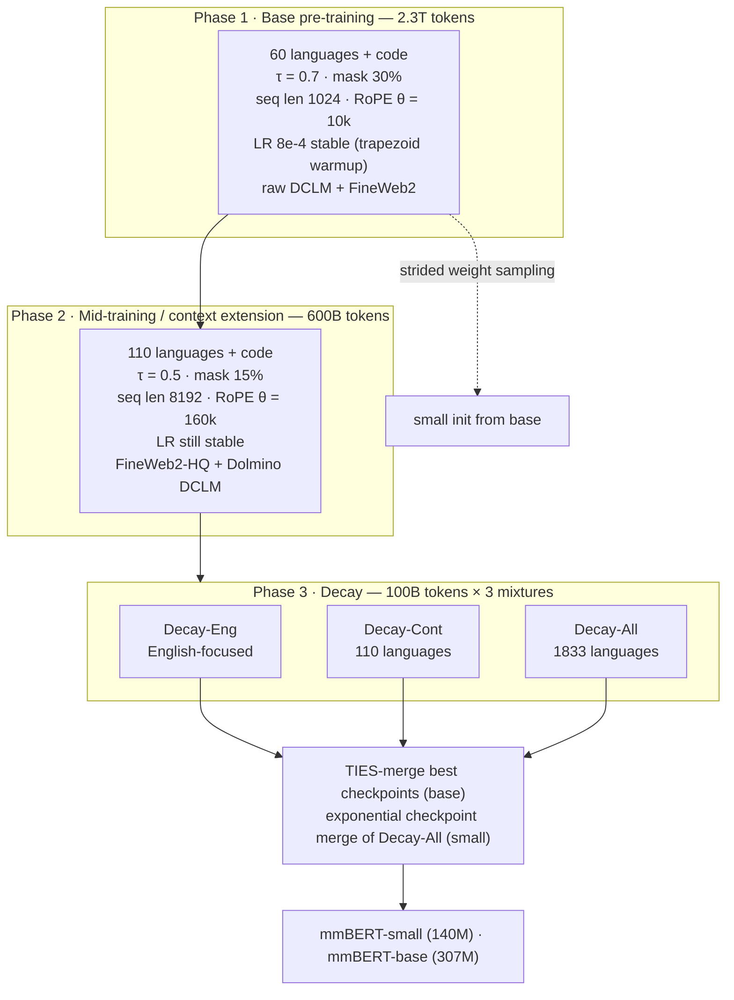

# mmBERT — Marone et al., 2025

> **arXiv:** 2509.06888v1 · **Venue:** preprint (CC BY 4.0, 08 Sep 2025) · **Affiliation:** Johns Hopkins University (CLSP)

## TL;DR
mmBERT is a ModernBERT-architecture multilingual encoder suite (small: 140M total / 42M non-embedding; base: 307M total / 110M non-embedding) trained on 3T tokens covering 1,833 languages. Its central contribution is **cascading annealed language learning**: the language set grows 60 → 110 → 1,833 across the three training phases while the sampling temperature anneals 0.7 → 0.5 → 0.3 and the MLM masking rate anneals 30% → 15% → 5%, so that more than 1,700 low-resource languages are first seen only in the final 100B-token decay phase. That late introduction roughly doubles low-resource QA scores, and on Faroese FoQA the model beats Gemini 2.5 Pro and OpenAI o3. mmBERT is the first model to clearly displace XLM-R (2019) as the default massively multilingual encoder, while also being ~2–4× faster and supporting 8,192-token context.

## Problem & motivation

Encoder-only models never stopped being the workhorse for classification, clustering, and retrieval, where inference cost matters and no generation is required. They did, however, stop being *modernized*: encoders stayed below 1B parameters while decoders scaled to the trillion-parameter range, and the encoder pretraining recipe stagnated for about five years.

The 2024–2025 revival — MosaicBERT, [ModernBERT](bert-modern-encoder_2024_modernbert.md), [NeoBERT](bert-modern-encoder_2025_neobert.md), [Ettin](bert-modern-encoder_2025_ettin-seq-vs-seq.md), EuroBERT — fixed the architecture and data-quality gap but almost entirely in English or in small language sets: *"none of these more recent models have scaled to more than 15 languages"* (per §2). The massively multilingual shelf still contained only mBERT (104 languages, 2019), XLM-R (100 languages, 2019), and mGTE (74 languages, 2024). mGTE improved on XLM-R only slightly while adding longer context, and mBERT is essentially obsolete.

The paper's framing of the pain point is blunt: **XLM-R was still state of the art after six years**, because it was ahead of its time — 6T training tokens, more than any encoder trained since, *including mmBERT* (per §2). The opening mmBERT exploits is not scale but **data quality**: filtered web corpora (DCLM, FineWeb2, FineWeb2-HQ, Dolmino) let the authors beat XLM-R with roughly half the tokens.

A second, subtler problem is specific to massive multilinguality. Low-resource languages have *both* little data *and* lower-quality data, because there is not enough volume to filter aggressively. Under the conventional recipe — a fixed language set with a fixed sampling temperature held for the entire run — those languages must either be heavily upsampled (many epochs over noisy text, which degrades the whole model) or left effectively invisible. mmBERT's answer is to treat language coverage as a *schedule* rather than a *constant*.

## Key idea

Three annealing schedules run in parallel over the three training phases, plus a merge step at the end.

**1. Inverse temperature sampling (more biased → more uniform).** Multilingual corpora are sampled with the usual exponent-smoothing rule. If language $i$ holds $n_i$ tokens out of $N=\sum_j n_j$, its sampling probability is

$$
p_i \;=\; \frac{\left(\dfrac{n_i}{N}\right)^{\tau}}{\displaystyle\sum_{j}\left(\dfrac{n_j}{N}\right)^{\tau}} .
$$

Here $\tau\in(0,1]$ is the sampling temperature: $\tau = 1$ reproduces the natural (English/Russian/Chinese-dominated) distribution and $\tau \to 0$ drives the distribution toward uniform over languages. mmBERT sets $\tau = 0.7 \to 0.5 \to 0.3$ across pre-training, mid-training, and decay (per §3.2 and Appendix D), i.e. it *starts* high-resource-biased and *ends* nearly uniform. This is the opposite ordering from the usual "pick one temperature and hold it".

**2. Cascading language addition (60 → 110 → 1,833).** The language set itself grows at each phase change: 60 languages (broad coverage of families and scripts) plus code; then 110 languages, adding "mid-resource" languages with more than 200M tokens; then everything in FineWeb2 — 1,833 languages spanning 1,895 language/script variants. The stated intuition is transfer-driven: a language introduced late lands on a representation that already contains its typological neighbours, so *"starting with Icelandic and then quickly learning Faroese"* (per §3.2) is cheap. Late introduction also caps the number of epochs over scarce noisy corpora (the paper targets avoiding more than ~5 epochs).

**3. Inverse mask-rate schedule (30% → 15% → 5%).** mmBERT trains with standard masked language modelling,

$$
\mathcal{L}_{\text{MLM}}
= -\frac{1}{|\mathcal{M}|}\sum_{t\in\mathcal{M}} \log p_\theta\!\left(x_t \,\middle|\, \tilde{x}_{\setminus \mathcal{M}}\right),
$$

where $\mathcal{M}$ is the set of masked positions, $\tilde{x}$ is the corrupted sequence, and $x_t$ is the original token at position $t$. The novelty is that $|\mathcal{M}|/L$ — the masking rate — is **progressively lowered at every stage** rather than only dropped once at the end as in EuroBERT and Ettin: 30% during pre-training, 15% during mid-training, 5% during decay. A high rate early yields a denser learning signal per sequence; a low rate late makes each prediction better conditioned, which is closer to how the encoder will be used downstream. (Caveat from footnote 3: compute cost prevented ablating this outside the decay phase, where lower was consistently better.)

**4. Decay-mixture merging.** Rather than choosing one decay corpus, the authors run three and merge the resulting weights, so the final model keeps English/high-resource strength *and* the low-resource gains.

Taken together, the recipe says: spend the large, cheap part of the budget learning strong general representations from high-quality, high-resource data; spend the small, high-leverage decay window spreading that competence over the long tail.

## How it works

### Architecture

mmBERT uses an **architecture identical to ModernBERT**, changing only the tokenizer and hidden width (per §3.1). Key configuration (Table 8, Appendix A):

| Component | Value |
|---|---|
| Layers | 22 (both sizes) |
| Hidden dim | 768 (base) / 384 (small) |
| Intermediate (GLU) dim | 1152 (both sizes, as ModernBERT-base) |
| Vocabulary | 256,000 (Gemma 2 tokenizer) |
| Total params | 307M (base) / 140M (small) |
| Non-embedding params | 110M (base) / 42M (small) |
| Positions | RoPE, base $\theta$ 10k → 160k |
| Attention | alternating local/global; sliding window 128; global attention every 3 layers |
| Norm | pre-norm LayerNorm, $\varepsilon = 10^{-12}$, no norm bias, skip first pre-norm, embedding norm + final norm |
| Biases | none on QKV, attention output, MLP input/output |
| MLP | GLU with GELU activation |
| Dropout | 0.0 everywhere except attention-output dropout 0.1 |
| Padding | unpadded (FlashAttention 2 + unpadding, inherited from ModernBERT) |
| Max sequence length | 1024 → 8192 |

Two consequences of the 256k Gemma 2 vocabulary are worth internalizing. First, **parameter counts are misleading**: mmBERT-base has exactly ModernBERT-base's 110M non-embedding parameters, but 307M total — roughly 197M parameters are the embedding matrix. Comparisons against "similar-sized" models should use the non-embedding count. Second, the paper flags a tokenizer defect: they used the Gemma 2 pre-tokenizer **without prefix spaces**, which they believe costs them NER and POS accuracy, and they explicitly recommend the Gemma 3 tokenizer with a prefix-space fix for future work (footnote 1).

The small model is not trained from scratch: it is **initialized from base by strided sampling** of weights (the DistilBERT-style layer/width subselection of Sanh et al., 2019).

### Three-phase pipeline



**Phase 1 — base pre-training (2.3T tokens).** Warmup plus the stable plateau of a trapezoidal LR schedule. Both learning rate and batch size are warmed up (base: 3B tokens LR warmup, 60B tokens batch-size warmup; small: 4B and 100B). Peak LR $8\times10^{-4}$, weight decay $8\times10^{-5}$, batch 4.7M tokens. Data here deliberately excludes the *filtered* FineWeb2 and higher-quality DCLM — those are held back as a quality upgrade for later. 60 languages, $\tau=0.7$, 30% masking. mmBERT-small plateaued at 1.2T tokens and had its LR and weight decay halved (to 4e-4) and its mask rate dropped to 20% (footnote 4 / Table 8 note).

**Phase 2 — mid-training / context extension (600B tokens).** Three simultaneous upgrades: (a) data quality — switch to filtered FineWeb2-HQ and Dolmino-filtered DCLM; (b) context — RoPE $\theta$ raised to 160k for both global and local layers, supporting 8,192 tokens; (c) coverage — 110 languages, $\tau = 0.5$, mask 15%. The LR stays in its stable phase.

**Phase 3 — decay (100B tokens).** Inverse-square-root decay of the learning rate down to $0.02$ of peak, with mask rate 5% and $\tau = 0.3$. Unlike ModernBERT and Ettin, which run a single decay, mmBERT runs **three** decays from the same mid-training checkpoint:

- **Decay-Eng** — English-focused mixture.
- **Decay-Cont** — the same 110 languages as mid-training (the mixture shown in Table 1).
- **Decay-All** — all 1,833 FineWeb2 languages; this is where the 1,723 newly added low-resource languages appear for the first time.

**Merging.** For base, the best checkpoint of each mixture is combined with **TIES-merging** (Yadav et al., 2023), which trims low-magnitude parameter deltas, resolves sign conflicts by elected sign, and averages the surviving deltas — mitigating interference between an English-heavy and a long-tail-heavy model. For small this failed ("less parameter agreement in the smaller weight space"), so small instead merges an exponential weighting of **Decay-All checkpoints only**.

### What the temperature anneal actually does to the mixture

![Figure 1: inverse temperature sampling across the three phases. Each panel plots the per-language share of the FineWeb2 portion of the mixture for the top ~50 languages, at τ = 0.7 (pre-training), 0.5 (mid-training) and 0.3 (decay). The head shrinks from ~9.5% to ~4.3% for the largest language while the tail thickens — the distribution is visibly flattening, which is exactly the "annealing over languages" mechanism. Note that non-FineWeb2 sources (code, math, Wikipedia, papers) are excluded from this chart and are not temperature-sampled; the 50 mid-training and 1,723 decay-phase additions are also not visualized.](_assets/bert-modern-encoder_2025_mmbert/language-temperature-schedule.png)

## Training / data

**Corpus composition (Table 1, token counts in billions).** Note the table reports dataset token counts per stage; the actual training budget (2.3T / 600B / 100B) is reached by repeating or under-sampling these sources. The decay column shows only the Decay-Cont variant.

| Category | Dataset | Pre-train B (%) | Mid-train B (%) | Decay-Cont B (%) |
|---|---|---|---|---|
| Crawl | FineWeb2 | 1196.6 (60.2) | 506.7 (84.3) | 78.5 (76.0) |
| Crawl | DCLM | 600.0 (30.2) | 10.0 (1.7) | — |
| Crawl | DCLM (Dolmino) | — | 40.0 (6.7) | 2.0 (2.0) |
| Code | StarCoder | 100.6 (5.1) | 17.2 (2.9) | 0.5 (0.5) |
| Code | Code (ProLong) | — | — | 2.8 (2.7) |
| Scientific | ArXiv | 27.8 (1.4) | 5.4 (0.9) | 3.3 (3.2) |
| Scientific | PeS2o | 8.4 (0.4) | 3.2 (0.5) | — |
| Social | StackExchange | 18.6 (0.9) | 3.0 (0.5) | — |
| Social | StackExchange (Dolmino) | 1.4 (0.1) | 2.8 (0.5) | — |
| Instruction | Tulu Flan | 15.3 (0.8) | 3.1 (0.5) | 1.0 (1.0) |
| Math | Dolmino Math | 11.2 (0.6) | 4.3 (0.7) | 0.5 (0.5) |
| Reference | Books | 4.3 (0.2) | 3.9 (0.7) | 2.2 (2.1) |
| Reference | Textbooks (ProLong) | — | — | 3.1 (3.0) |
| Reference | Wikipedia (MegaWika v2) | 4.7 (0.2) | 1.2 (0.2) | 9.5 (9.2) |
| **Total** | | **1989.0** | **600.8** | **103.3** |

The deliberate design decision hiding in this table is the **English share**. XLM-R and mT5 used very little English (mT5: 5.7%). mmBERT inverts that: English is 34.51% of pre-training, falling to 12.14% in mid-training and 10.15% in Decay-All (Table 9). The justification is that the highest-quality filtered corpus (DCLM) only exists in English, so English is used as a quality carrier early and then diluted as coverage widens. Wikipedia's share moves the other way (0.2% → 9.2% of the decay mixture), since MegaWika v2 is one of the few high-quality sources that exists for the long tail. The authors explicitly did **not** use parallel data, calling current parallel corpora "relatively short and noisy" (per §2) — a notable divergence from the EuroBERT line.

**Objective.** Masked language modelling only (no NSP, no RTD). Appendix C argues the RTD choice matters: mDeBERTa, an RTD-trained model, scores 42.5 on multilingual MTEB v2 versus mmBERT's 54.1, and 48.6 on English MTEB v2 — *"RTD-trained models may do well at classification but they do so at the expense of embedding tasks"*.

**Compute.** 8×H100 for ~10 days (small) and ~40 days (base); L40s used mostly for small-model inference (Appendix B).

**Downstream adaptation used for evaluation.** NLU: sweep over LRs {2e-5 … 8e-5} × epochs {1, 2, 3, 5, 10}, batch 32, warmup ratio 0.06, oracle-selected best per task (most models peaked at 2e-5–3e-5). Embeddings: SentenceTransformers on 1.25M MS MARCO hard triplets for one epoch, LR swept over {1e-4, 3e-4, 5e-4, 7e-4} — 1e-4 won for every model except MiniLM.

## Results

### English NLU — GLUE (Table 2)

| Model | Non-embed params | CoLA | SST-2 | MNLI | RTE | **Avg** |
|---|---|---|---|---|---|---|
| mDistilBERT | small | 34.7 | 89.4 | 79.0 | 73.3 | 77.5 |
| Multilingual MiniLM | small | 25.4 | 91.6 | 82.1 | 75.8 | 78.3 |
| **mmBERT small** | 42M | 61.8 | 93.1 | 85.8 | 81.9 | **84.7** |
| EuroBERT 210m | base | 36.8 | 90.6 | 85.3 | 78.3 | 81.2 |
| XLM-R base | base | 54.2 | 93.1 | 85.0 | 78.7 | 83.3 |
| mGTE base | base | 54.7 | 93.3 | 85.3 | 82.3 | 84.0 |
| **mmBERT base** | 110M | 61.9 | 94.0 | 87.7 | 85.6 | **86.3** |
| ModernBERT base (English upper bound) | 110M | 65.3 | 95.3 | 88.8 | 87.7 | 87.4 |

The striking row is mmBERT **small**: at 42M non-embedding parameters it outscores every previous *base*-sized multilingual model on English GLUE. mmBERT base lands within 1.1 points of English-only ModernBERT despite a majority-non-English diet.

### Multilingual NLU — XTREME (Table 3)

| Model | XNLI | PAWS-X | XCOPA | XQuAD | MLQA | TyDiQA | WikiANN | UDPOS | **Avg** |
|---|---|---|---|---|---|---|---|---|---|
| mDistilBERT | 60.8 | 80.2 | 52.7 | 49.4 | 43.5 | 44.2 | 54.5 | 67.1 | 56.5 |
| Multilingual MiniLM | 71.2 | 84.6 | 59.2 | 68.2 | 56.8 | 63.0 | **59.2** | **74.2** | 67.1 |
| **mmBERT small** | 73.6 | 86.7 | 61.8 | 73.0 | 62.5 | 66.7 | 54.3 | 70.6 | **68.6** |
| XLM-R base | 74.6 | 85.9 | 61.2 | 73.4 | 62.1 | 70.5 | **61.4** | **74.3** | 70.4 |
| mGTE base | 73.9 | 86.4 | 63.6 | 75.7 | 64.3 | 69.9 | 60.7 | 74.3 | 71.1 |
| **mmBERT base** | **77.1** | **87.7** | **67.5** | **77.6** | **66.0** | **74.5** | 58.2 | 74.0 | **72.8** |

Sentence-level transfer improves broadly (XNLI +2.5 over XLM-R, TyDiQA +4.0, XCOPA +6.3), but **structured prediction is the exception**: WikiANN NER drops 3.2 points below XLM-R and UDPOS ties. The paper attributes this directly to the missing prefix-whitespace token in the tokenizer — the same defect ModernBERT has — and recommends future work fix it. This is the concrete case where *tokenizer fertility and boundary behaviour*, not semantic quality, dominates token-level F1.

### Retrieval — MTEB v2 English (Table 4) and multilingual (Table 5)

| Model | MTEB v2 English Avg | Model | MTEB v2 Multilingual Avg |
|---|---|---|---|
| Multilingual MiniLM | 48.9 | mDistilBERT | 47.1 |
| mDistilBERT | 49.4 | Multilingual MiniLM | 48.4 |
| **mmBERT small** | **52.1** | **mmBERT small** | **50.7** |
| EuroBERT 210m | 51.9 | XLM-R base | 52.4 |
| XLM-R base | 52.0 | mGTE base | 52.7 |
| mGTE base | 52.7 | **mmBERT base** | **54.1** |
| ModernBERT base | 53.8 | | |
| **mmBERT base** | **53.9** | | |

mmBERT base edges out English-only ModernBERT on English MTEB v2 (53.9 vs 53.8) and leads multilingual MTEB v2 by 1.7 over XLM-R, with the largest sub-scores on bitext mining (59.2 vs XLM-R's 56.6) and reranking (69.9 vs 67.6).

### Code retrieval — CoIR (Table 6)

| Model | CoIR Avg |
|---|---|
| Multilingual MiniLM | 26.0 |
| mDistilBERT | 30.1 |
| XLM-R base | 33.6 |
| mGTE base | 38.9 |
| **mmBERT small** | 41.0 |
| **mmBERT base** | 42.2 |
| EuroBERT 210m | **45.3** |

mmBERT dominates every massively multilingual baseline but loses to EuroBERT-210m, which the authors attribute to EuroBERT's use of the higher-quality but non-public Stack v2 corpus.

### Head-to-head with EuroBERT on EuroBERT's own languages (Table 7)

| Benchmark | EuroBERT 210m | mmBERT small | mmBERT base |
|---|---|---|---|
| XNLI (11 in-distribution langs) | 71.9 | 75.8 | **77.7** |
| PAWS-X (in-distribution langs) | 86.7 | 88.3 | **89.0** |

EuroBERT is excluded from the main multilingual tables because it only covers 15 languages; restricted to *its own* languages it still loses — e.g. Arabic XNLI 66.8 for EuroBERT vs 74.5 for mmBERT base.

### Versus a similar-sized decoder (§4.3)

Gemma 3 270M under the same sweep scores **69.0 XNLI** and **82.9 GLUE avg**, versus mmBERT small's 73.6 / 84.7 — a decoder with roughly twice the parameters losing to the smallest encoder in the suite, consistent with the Ettin and Gisserot-Boukhlef findings. (Footnote 7 caveats that EmbeddingGemma beats these on MTEB, but only after fine-tuning on a proprietary 320B-token set.)

### The headline ablation: does late language introduction work? (§4.4)


| Setting | Effect (per §4.4) |
|---|---|
| Tigrinya (TiQuAD), base, 110 → 1833-language decay | **+12.1 F1 absolute (+68%)** |
| Faroese (FoQA), base, 110 → 1833-language decay | **+15.4 F1 absolute (+26%)** |
| Faroese (FoQA) vs Gemini 2.5 Pro (69.8) | mmBERT **+6.0 F1** |
| Faroese (FoQA) vs OpenAI o3 (67.7) | mmBERT **+8.3 F1** |
| Faroese (FoQA), mmBERT **small** | also beats both frontier LLMs |

This is the paper's most load-bearing evidence: 100B tokens (about 3% of the budget) spread across 1,723 newly added languages is enough to roughly double QA quality on them, because the model already has a strong multilingual base to transfer from. Merging with the English- and high-resource-focused decays costs only a little of that gain.

### Efficiency (§4.5)


- mmBERT base is **>2× faster on variable-length input** and **~4× faster at long context** than prior multilingual encoders.
- mmBERT small is roughly 2× faster than mmBERT base, hence ~2× faster than same-size baselines.
- XLM-R and Multilingual MiniLM **cannot exceed 512 tokens at all**; mmBERT runs to 8,192 and matches their 512-token speed while doing so.

## Limitations & follow-ups

Acknowledged by the authors:

- **The tail is still thin.** Many languages have tiny or zero data, and essentially none have edu-style quality filtering (as in FineWeb-Edu). The paper explicitly leaves long-tail data quality to future work (§6).
- **Tokenizer prefix-space bug.** Training used the Gemma 2 pre-tokenizer without prefix spaces; the authors believe this is why NER/POS lag XLM-R, and recommend re-pretraining with a fixed Gemma 3 tokenizer (footnote 1).
- **The inverse mask schedule is barely ablated.** Compute limits meant it was only tested in the decay phase, where lower masking was consistently better; the 30→15 transition is asserted, not measured (footnote 3).
- **Merging is size-sensitive.** TIES-merging across decay mixtures worked for base but *failed* for small, requiring a different (Decay-All-only, exponentially weighted) merge — so the recipe does not transfer unchanged across scales.

Additional observations worth flagging when adopting the model:

- **Total parameters mislead.** 307M "base" is 110M of Transformer plus ~197M of a 256k-entry embedding table; memory and download size scale with the former's *sum*, but capacity comparisons should use non-embedding counts.
- **No parallel data** was used, in contrast with the EuroBERT line — an open question rather than a settled choice.
- **Code retrieval trails EuroBERT**, plausibly a data-access artifact (Stack v2) rather than a recipe flaw.
- Low-resource evidence rests on **two languages** (Tigrinya, Faroese), simply because high-quality evaluation sets for the long tail barely exist.

Context in the encoder revival: [ModernBERT](bert-modern-encoder_2024_modernbert.md) supplies the architecture, [Ettin](bert-modern-encoder_2025_ettin-seq-vs-seq.md) (overlapping JHU authors) supplies the open-data three-phase recipe and the encoder-vs-decoder framing, [NeoBERT](bert-modern-encoder_2025_neobert.md) is the full-attention English alternative, and EuroBERT is the complementary "few languages, more scale, parallel + code data" design point.

## Links
- **arXiv:** [abs](https://arxiv.org/abs/2509.06888) · [html](https://arxiv.org/html/2509.06888v1) · [pdf](https://arxiv.org/pdf/2509.06888)
- **Code:** [github.com/jhu-clsp/mmBERT](https://github.com/jhu-clsp/mmBERT)
- **Hugging Face:** [jhu-clsp](https://huggingface.co/jhu-clsp) (models, data mixes, and intermediate checkpoints)
- **Project page:** —
- **Blog posts:** —
- **Talks / videos:** —
- **OpenReview / venue page:** —
- **Papers-with-Code:** —
- **BibTeX:**
  ```bibtex
  @article{marone2025mmbert,
    title   = {mmBERT: A Modern Multilingual Encoder with Annealed Language Learning},
    author  = {Marone, Marc and Weller, Orion and Fleshman, William and
               Yang, Eugene and Lawrie, Dawn and Van Durme, Benjamin},
    journal = {arXiv preprint arXiv:2509.06888},
    year    = {2025}
  }
  ```
- **Related / successor papers:** [ModernBERT](bert-modern-encoder_2024_modernbert.md) · [Ettin / Seq vs Seq](bert-modern-encoder_2025_ettin-seq-vs-seq.md) · [NeoBERT](bert-modern-encoder_2025_neobert.md) · [BERT](bert-encoder_2018_bert-pretraining.md) · [EuroBERT](https://arxiv.org/abs/2503.05500) · [XLM-R](https://arxiv.org/abs/1911.02116) · [FineWeb2](https://arxiv.org/abs/2506.20920) · [TIES-merging](https://arxiv.org/abs/2306.01708)
