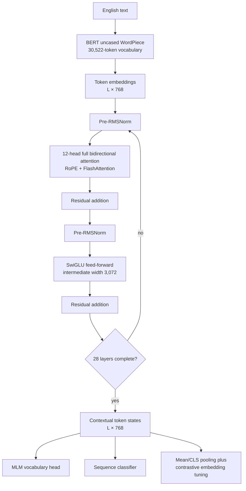
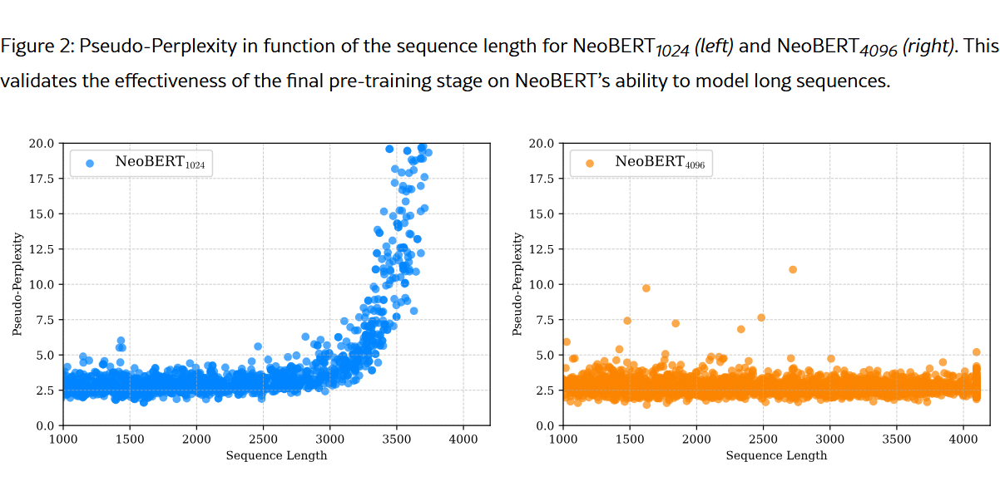
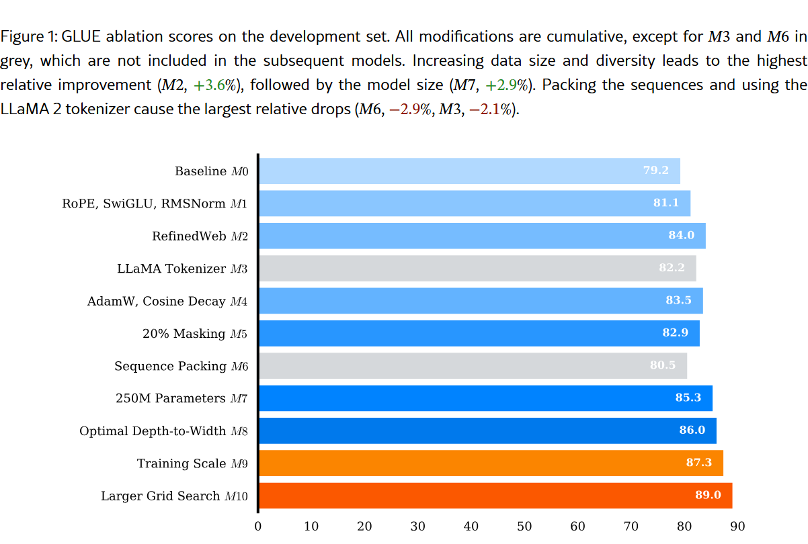
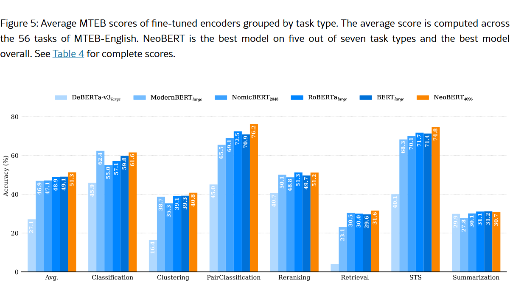
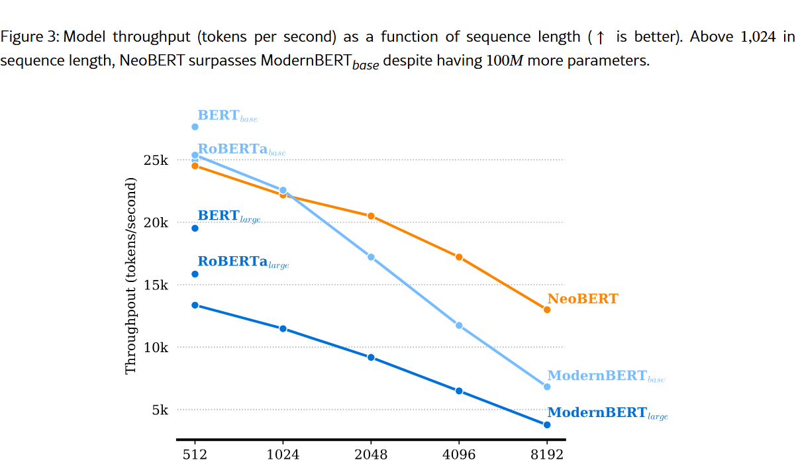

# NeoBERT — Le Breton et al., 2025

> **arXiv:** 2502.19587v2 · **Venue:** preprint submitted to TMLR · **Affiliation:** Chandar Research Lab, Mila, Polytechnique Montréal, Cornell University, and Royal Military College of Canada

## TL;DR
NeoBERT is a 250M-parameter English bidirectional encoder that keeps BERT-base's 768-dimensional interface but deepens it to 28 layers and imports RoPE, pre-RMSNorm, SwiGLU, bias-free projections, FlashAttention, and modern optimization. It is pretrained on RefinedWeb for a theoretical 2.1T tokens, with a final 100B-token continuation extending context from 1,024 to 4,096. Its most useful scientific contribution is a controlled sequence of ten full pretraining runs: newer, broader data and increased model capacity provide the largest GLUE gains, while naive cross-document packing and the tested LLaMA tokenizer hurt.

## Problem & motivation
BERT-like encoders remain central to classification, retrieval, clustering, reranking, and representation learning, but their backbone recipe changed much less than decoder-only language models. BERT and RoBERTa still had more than 110M combined Hugging Face downloads when the paper was written, despite short 512-token contexts, dated corpora, absolute position tables, post-normalized blocks, and GELU feed-forward networks. Much recent embedding progress instead came from increasingly elaborate downstream procedures such as multi-stage contrastive learning, task-specific adapters, and Contextual Document Embeddings (CDE). This makes it difficult to tell whether a leaderboard gain comes from a better pretrained backbone or a stronger adaptation recipe.

NeoBERT targets three connected gaps:

1. **Backbone modernization.** Determine which decoder-era architectural and optimization choices actually transfer to a bidirectional masked-language model.
2. **Controlled evaluation.** Compare pretrained backbones after the same affordable contrastive fine-tuning, rather than comparing unrelated published embedding systems.
3. **Practical compatibility.** Improve capacity and context without changing BERT-base's hidden width, so downstream heads expecting 768-dimensional token states can be reused.

The study is unusually expensive for an ablation paper: it fully pretrains ten cumulative model variants with controlled seeds and dataloader states, then evaluates them on GLUE. This reveals an important negative result: a plausible modern component is not automatically beneficial in a particular finite-data setup. The final system retains AdamW, cosine decay, and 20% masking despite small-run regressions, but rejects the tested LLaMA tokenizer and unsafe sequence packing.

## Key idea
NeoBERT combines a deeper, narrow encoder with modern block mechanics and a data-heavy two-stage curriculum. For token states $X\in\mathbb R^{L\times d}$, each of $H=12$ heads has width $d_h=d/H=64$ and computes full bidirectional attention:

$$
Q=XW_Q,\qquad K=XW_K,\qquad V=XW_V,
$$

$$
\operatorname{Attn}(X)
=\operatorname{softmax}\!\left(
\frac{\widetilde Q\widetilde K^\top}{\sqrt{d_h}}+M
\right)V.
$$

Here $L$ is sequence length, $d=768$ is hidden width, $W_Q,W_K,W_V$ are learned projections, and $M$ masks padding and—when correctly packed—tokens belonging to other source sequences. Unlike causal attention, valid tokens can attend in both directions. FlashAttention changes how exact attention is tiled and stored, not the dense $O(L^2)$ set of token interactions.

Position enters every layer through rotary position embeddings. For coordinate pair $i$ at position $p$,

$$
R_{p,i}=
\begin{bmatrix}
\cos(p\theta_i)&-\sin(p\theta_i)\\
\sin(p\theta_i)&\cos(p\theta_i)
\end{bmatrix},
\qquad
\widetilde q_{p,i}=R_{p,i}q_{p,i},
\qquad
\widetilde k_{p,i}=R_{p,i}k_{p,i},
$$

where $\theta_i$ is the frequency assigned to pair $i$. Because
$R_{p,i}^{\top}R_{r,i}=R_{r-p,i}$, query-key scores encode relative displacement $r-p$ rather than relying on one learned absolute embedding per position. RoPE helps NeoBERT extrapolate beyond its first-stage length, while the second stage explicitly teaches stable behavior through 4,096 tokens.

The feed-forward branch uses SwiGLU:

$$
\operatorname{SwiGLU}(x)
=\operatorname{SiLU}(xW_g)\odot(xW_v),
\qquad
\operatorname{FFN}(x)=\operatorname{SwiGLU}(x)W_o,
$$

with gate, value, and output projections $W_g,W_v,W_o$ and elementwise multiplication $\odot$. The released configuration uses an intermediate width of 3,072. Gating adds a third matrix relative to a plain two-matrix FFN, so the hidden expansion is selected with parameter count and hardware alignment in mind.

## How it works

### Architecture and data flow

### Exact released configuration

| Property | NeoBERT | Source |
|---|---:|---|
| Parameters | 250M | Table 1 |
| Transformer layers | 28 | Table 1; model config |
| Hidden width $d$ | 768 | Table 1; model config |
| Attention heads $H$ | 12 | Table 1; model config |
| Head width $d_h$ | 64 | model config |
| SwiGLU intermediate width | 3,072 | model config |
| Vocabulary | 30,522 | model config |
| Native trained context | 4,096 | §3.2 |
| Normalization | pre-RMSNorm, $\epsilon=10^{-5}$ | §3.1; model config |
| Attention | full, bidirectional | architecture and efficiency sections |
| Linear biases | removed | §3.3 |

A 250M comparison model first scales a BERT-like shape to 16 layers at width 1,056. The next ablation redistributes approximately the same capacity into 28 layers at width 768. This shape preserves BERT-base compatibility and improves the GLUE ablation from 85.3 to 86.0. The paper motivates the change through prior depth-efficiency analysis, but the evidence here is an empirical comparison between these two shapes—not a universal proof of an optimal ratio.

### Pre-normalized residual block

For incoming state $x_\ell$, layer $\ell$ performs

$$
a_\ell=x_\ell+
\operatorname{Attn}_\ell\!\left(\operatorname{RMSNorm}(x_\ell)\right),
$$

$$
x_{\ell+1}=a_\ell+
\operatorname{FFN}_\ell\!\left(\operatorname{RMSNorm}(a_\ell)\right).
$$

RMSNorm scales a vector using its root mean square,

$$
\operatorname{RMSNorm}(x)
=g\odot\frac{x}{\sqrt{d^{-1}\sum_{j=1}^{d}x_j^2+\epsilon}},
$$

where $g$ is a learned scale and $\epsilon=10^{-5}$. Unlike LayerNorm, RMSNorm does not subtract the mean, saving one statistic. Placing normalization before each nonlinear branch makes the residual path direct and improves deep-model optimization.

### Tokenization and sequence boundaries

NeoBERT retains `google-bert/bert-base-uncased` WordPiece and its roughly 30K vocabulary. The controlled LLaMA-tokenizer variant performed worse, so it was not carried into subsequent variants. The appendix attributes possible causes to intertwined differences—BPE versus WordPiece, training corpus, casing, and byte fallback—rather than establishing that WordPiece is intrinsically superior.

Padding may be removed and examples packed for efficiency only if attention remains block diagonal. If examples $a$ and $b$ share a packed tensor, the correct mask is

$$
M_{ij}=
\begin{cases}
0,&i,j\text{ belong to the same source sequence},\\
-\infty,&\text{otherwise}.
\end{cases}
$$

The ablated implementation concatenated examples without preventing cross-sequence attention and dropped sharply. The released code supports boundary-aware unpadding following packing work cited by the paper; the failed ablation is evidence against **naive** packing, not against correct packing.

### Two-stage context extension

The first checkpoint is trained for one million steps with maximum length 1,024. The second continues for 50,000 steps at maximum length 4,096. To avoid filling the continuation with mostly short documents, each batch source is sampled as follows:

| Continuation source | Eligibility | Sampling probability |
|---|---|---:|
| RefinedWeb | original distribution | 20% |
| RefinedWeb 1024+ | documents longer than 1,024 tokens | 40% |
| RefinedWeb 2048+ | documents longer than 2,048 tokens | 40% |

This mixture also limits the distribution shift that would result from selecting only the very longest documents, which tend to be more complex or academic.

The paper evaluates length by independently masking each position in 2,467 long English Wikipedia sequences. If $\ell_i$ is cross-entropy when position $i$ alone is masked, sentence pseudo-perplexity is

$$
\operatorname{PPL}_{\mathrm{pseudo}}(x)
=\exp\!\left(\frac{1}{n}\sum_{i=1}^{n}\ell_i\right).
$$

This is expensive—one masked evaluation per token—but avoids pretending that a bidirectional MLM defines left-to-right likelihood. Appendix E reports useful native generalization to about 6,000 tokens, followed by degradation; lengths beyond the trained 4,096 remain extrapolation rather than guaranteed support.

### Unified embedding adaptation

Raw MLM states are not guaranteed to form a useful cosine space. For controlled MTEB comparison, every backbone is therefore tuned with the same positive-pair dataset and contrastive objective:

$$
\mathcal L_i=-\log
\frac{\exp(s(q_i,d_i^+)/\tau)}
{\exp(s(q_i,d_i^+)/\tau)+
\sum_{d^-\in\mathcal N_i}\exp(s(q_i,d^-)/\tau)},
$$

where $q_i$ is a query, $d_i^+$ its positive document, $\mathcal N_i$ contains optional hard and task-homogeneous in-batch negatives, $s$ is cosine similarity, and $\tau=0.07$. Training data contains about nine million documents and uses task instructions. Dataset $i$ of size $n_i$ is sampled with temperature smoothing

$$
\pi_i=\frac{n_i^{\alpha}}{\sum_{j=1}^{m}n_j^{\alpha}},
\qquad \alpha=0.5.
$$

All compared backbones receive 2,000 fine-tuning steps and float16 MTEB evaluation. This experiment is the cleanest evidence for backbone quality. The separate CDE system is substantially more complex and must not be conflated with either the raw MLM checkpoint or this unified recipe.

## Training / data

### Pretraining corpus and objective

The corpus is the 2.8TB RefinedWeb release, described as about 600B tokens of filtered and deduplicated Common Crawl text. Since NeoBERT's theoretical exposure is 2.1T tokens, data is revisited across training. RefinedWeb is broad and newer than BERT's Wikipedia plus BookCorpus, but it does not impose a narrowly curated domain mixture; the paper explicitly notes that model biases and limitations inherit from this web data.

NeoBERT removes next-sentence prediction and uses only masked-language modeling. Each token is selected independently with probability $0.20$, and every selected token is replaced by `[MASK]` rather than BERT's 80% mask / 10% random / 10% unchanged scheme. For mask set $\mathcal M$,

$$
\mathcal L_{\mathrm{MLM}}
=-\frac{1}{|\mathcal M|}
\sum_{i\in\mathcal M}
\log p_\theta(x_i\mid \widetilde x),
$$

where $x_i$ is the original token and $\widetilde x$ is the sequence with selected positions replaced. Only selected positions contribute to the loss.

### Schedule and compute

| Stage | Steps | Maximum length | Theoretical batch | Theoretical tokens | Source |
|---|---:|---:|---:|---:|---|
| Main pretraining (`NeoBERT1024`) | 1,000,000 | 1,024 | 2M tokens | 2.0T | §3.2–3.3, Appendix A |
| Context extension (`NeoBERT4096`) | 50,000 | 4,096 | 2M tokens | 100B | §3.2–3.3, Appendix A |
| Total | 1,050,000 | 4,096 final | — | 2.1T theoretical | Appendix A |

“Theoretical” matters: examples are padded to the stage maximum, so the count multiplies steps by padded batch capacity and exceeds the number of real non-padding tokens processed. The run used eight H100 GPUs for about 6,000 GPU-hours. At length 1,024, local batch size is 32 with eight gradient-accumulation steps; the second stage adjusts batching to hold theoretical tokens per update constant.

Training uses AdamW with $\beta_1=0.9$, $\beta_2=0.95$, $\epsilon=10^{-8}$, weight decay $0.1$, and gradient-norm clipping at $1.0$. The learning rate warms linearly for 2,000 steps to $6\times10^{-4}$, then follows cosine decay to $6\times10^{-5}$ over 90% of main-stage steps. It remains at that floor for the last 100,000 main-stage steps and throughout the 50,000-step context extension.

DeepSpeed ZeRO shards optimizer state across devices. xFormers fused operators, dimensions divisible by 64, bias-free linear projections, and FlashAttention reduce overhead and memory traffic. These implementation improvements do not make full attention sparse; arithmetic still grows quadratically with sequence length.

### Ablation protocol

The controlled sequence starts from a BERT-base-like pre-LN model without NSP. Successive runs add RoPE/SwiGLU/RMSNorm, RefinedWeb, a tokenizer swap, AdamW/cosine, 20% all-mask corruption, naive packing, 250M capacity, the 28×768 shape, larger-scale training, and finally a larger downstream grid. Each pretraining comparison controls random seed and dataloader state. Most variants receive a limited GLUE sweep over batch sizes $\{16,32\}$ and learning rates $\{10^{-5},2\times10^{-5},3\times10^{-5}\}$; the final score uses a broader grid, so `M10` measures evaluation search rather than a new pretrained backbone.

The figure reports absolute GLUE averages as well as relative changes. The paper's prose and caption differ slightly on the tokenizer/packing percentages (for example, §4 gives −2.1% for the tokenizer while Appendix B says −2.9%); the plotted absolute scores—84.0 to 82.2 for tokenizer and 82.9 to 80.5 for packing—are the safest unambiguous values.

## Results

### GLUE development set

GLUE averages eight tasks and excludes WNLI. NeoBERT tasks are trained for up to ten epochs with early stopping and per-task hyperparameter search; RTE, STS-B, MRPC, and QNLI initialize from the best MNLI checkpoint. Baseline rows are compiled from their source papers, so this table is not as controlled as the unified MTEB experiment.

| Model | Parameters/class | MNLI | QNLI | RTE | CoLA | Average | Source |
|---|---:|---:|---:|---:|---:|---:|---|
| BERT-base | base | 84.0 | 90.5 | 66.4 | 52.1 | 79.6 | Table 3 |
| RoBERTa-base | base | 87.6 | 92.8 | 78.7 | 63.6 | 86.4 | Table 3 |
| ModernBERT-base | base | 89.1 | 93.9 | 87.4 | 65.1 | 88.5 | Table 3 |
| NeoBERT1024 | 250M | 88.9 | 93.9 | 91.0 | 64.8 | 88.8 | Table 3 |
| **NeoBERT4096** | **250M** | **89.0** | **93.7** | **91.3** | **66.2** | **89.0** | Table 3 |
| RoBERTa-large | large | 90.2 | 94.7 | 86.6 | 68.0 | 88.9 | Table 3 |
| ModernBERT-large | 395M | 90.8 | 95.2 | 92.1 | 71.4 | 90.5 | Table 3 |
| DeBERTaV3-large | large | 91.9 | 96.0 | 92.7 | 75.3 | 91.4 | Table 3 |

The long continuation raises the aggregate only from 88.8 to 89.0, but its purpose is length modeling rather than short-task quality. NeoBERT does not win GLUE overall: ModernBERT-large and DeBERTaV3-large remain higher, at greater parameter counts.

### Controlled MTEB-English v1

| Model | Class. | Clust. | Pair class. | Rerank | Retrieval | STS | Summ. | Average | Source |
|---|---:|---:|---:|---:|---:|---:|---:|---:|---|
| BERT-base | 60.6 | 37.0 | 71.5 | 48.9 | 28.3 | 69.9 | 31.1 | 48.1 | Table 4 |
| NomicBERT2048 | 55.0 | 35.3 | 69.0 | 48.8 | 30.5 | 70.1 | 30.1 | 47.1 | Table 4 |
| ModernBERT-base | 58.9 | 38.1 | 63.8 | 48.5 | 21.0 | 66.2 | 30.1 | 45.0 | Table 4 |
| BERT-large | 59.8 | 39.3 | 70.9 | 49.7 | 29.6 | 71.4 | 31.2 | 49.1 | Table 4 |
| ModernBERT-large | 62.4 | 38.7 | 65.5 | 50.1 | 23.1 | 68.3 | 27.8 | 46.9 | Table 4 |
| **NeoBERT4096** | **61.6** | **40.8** | **76.2** | **51.2** | **31.6** | **74.8** | **30.7** | **51.3** | Table 4 |

All rows use the paper's same 2,000-step contrastive recipe. NeoBERT has the best overall average and leads five of seven task families among the plotted models. Its 51.3 average is 4.5% higher relatively than BERT-large's 49.1, the second-best average in Table 4. This supports a stronger backbone under one controlled adaptation, not zero-shot superiority of the MLM checkpoint.

### CDE embedding system

CDE uses two NeoBERT backbones, contextual batch clustering, two-stage gradient caching, 235M noisy query-document pairs per epoch followed by 1.5M high-quality examples, and three epochs in each stage. It is therefore a separate embedding system rather than a simple pooling of the released MLM model.

| CDE backbone | Classification | Clustering | Reranking | Retrieval | STS | Average | Source |
|---|---:|---:|---:|---:|---:|---:|---|
| NomicBERT | 81.72 | 48.32 | 56.75 | 53.27 | 81.64 | 65.00 | Table 5 |
| ModernBERT | 80.62 | 49.48 | 56.94 | 54.19 | **83.30** | 65.68 | Table 5 |
| **NeoBERT** | **82.14** | **50.29** | **57.71** | **56.37** | 82.30 | **66.60** | Table 5 |

The rank-1 claim applies to English MTEB v1 models below 400M parameters as of April 2025. It is time-bounded and recipe-dependent.

### Throughput

Efficiency is measured for maximum-length synthetic inputs of 512, 1,024, 2,048, 4,096, and 8,192 tokens. Batch size is swept from 1 through 512 or until out of memory; each candidate runs for 100 steps on one A100, and the best token throughput is reported. This favors saturated throughput rather than batch-one latency.

NeoBERT uses full attention, yet the plotted throughput remains above ModernBERT-base at longer tested lengths despite about 100M more parameters. The paper attributes this to its simple architecture and efficient kernels. At 4,096 it reports a 46.7% speedup over ModernBERT-base. The curve also includes NeoBERT at 8,192, but that is beyond its trained 4,096 context; processing speed must not be confused with validated representation quality.

## Limitations & follow-ups

- **English and web-data scope.** NeoBERT is an English model trained only on RefinedWeb. The study does not establish multilingual, code, scientific, biomedical, or domain-specialist behavior. Web biases and harmful associations pass into its representations.
- **Data dominates the architecture story.** RefinedWeb provides the largest controlled GLUE jump. Final gains therefore cannot be attributed mainly to RoPE, RMSNorm, or SwiGLU; modern and diverse data is a central intervention.
- **Cumulative rather than factorial ablations.** Each retained change is tested at one point in an ordered chain. Interactions can change signs at other scales, and AdamW/cosine and 20% masking are retained despite short-run regressions based on an unverified expectation that longer training will favor them.
- **Tokenizer comparison is confounded.** The tested tokenizers simultaneously differ in algorithm, corpus, casing, byte behavior, and vocabulary composition. The result does not prove a general WordPiece advantage.
- **Packing failure is implementation-specific.** The harmful variant permits cross-example attention. It cannot support the broader conclusion that correctly boundary-masked packing is harmful.
- **Theoretical token accounting.** The stated 2.1T multiplies padded batch capacity by steps. The paper does not publish the exact count of non-padding tokens, number of RefinedWeb epochs, or document duplication exposure.
- **Dense quadratic attention.** FlashAttention reduces memory traffic but not full attention's $O(L^2)$ arithmetic. NeoBERT is trained to 4,096, shorter than the 8,192 contexts of several neighboring encoder families.
- **Effective-context evidence is narrow.** Long-context validation is pseudo-perplexity on Wikipedia, not long-document retrieval, classification, question answering, multi-hop reasoning, or lost-in-the-middle tests. Appendix extrapolation to about 6,000 is not a new native-context guarantee.
- **Fine-tuning is required for embeddings.** Controlled MTEB scores follow contrastive learning. The 66.60 result follows a much larger two-backbone CDE pipeline; neither characterizes raw `[CLS]` or mean-pooled MLM output.
- **Benchmark and selection caveats.** GLUE is small, entailment-heavy, and receives task-specific search plus MNLI transfer. Published baseline GLUE rows come from different studies. MTEB v1 rank claims are snapshots and can change with benchmark versions and new models.
- **Efficiency scope.** Throughput uses one A100, synthetic fixed-length inputs, 100-step runs, and each model's best fitting batch. No batch-one latency, memory table, CPU, alternative accelerator, energy, quantization, ONNX, or end-to-end serving result is reported.
- **Compute and statistical uncertainty.** The final run costs roughly 6,000 H100-hours, and downstream tables do not report multi-seed means or confidence intervals. Replicating all ten ablation pretrains is considerably more expensive than reproducing one checkpoint.

The closest predecessor is [ModernBERT](bert-modern-encoder_2024_modernbert.md), which trades NeoBERT's all-layer global interaction for alternating local/global attention and 8K context. Later modern-encoder work tracked in the overview studies matched encoder/decoder families and multilingual scaling.

## Links

- **Review thread:** [BERT-family overview](../bert/overview.md#163-the-modern-encoder-revival)
- **arXiv:** [abs](https://arxiv.org/abs/2502.19587v2) · [html](https://arxiv.org/html/2502.19587v2) · [pdf](https://arxiv.org/pdf/2502.19587v2)
- **Code:** [chandar-lab/NeoBERT](https://github.com/chandar-lab/NeoBERT)
- **Hugging Face:** [chandar-lab/NeoBERT](https://huggingface.co/chandar-lab/NeoBERT) · [RefinedWeb](https://huggingface.co/datasets/tiiuae/falcon-refinedweb)
- **Project page:** —
- **Blog posts:** —
- **Talks / videos:** —
- **OpenReview / venue page:** — (the arXiv record says submitted to TMLR)
- **Papers-with-Code:** —
- **BibTeX:** [model-card citation](https://huggingface.co/chandar-lab/NeoBERT#citation)
- **Related papers:** [ModernBERT review](bert-modern-encoder_2024_modernbert.md) · [RefinedWeb](https://arxiv.org/abs/2306.01116) · [CDE](https://arxiv.org/abs/2410.02525) · [Ettin / Seq vs Seq](bert-modern-encoder_2025_ettin-seq-vs-seq.md) · [mmBERT](bert-modern-encoder_2025_mmbert.md) · [EuroBERT](https://arxiv.org/abs/2503.05500)
