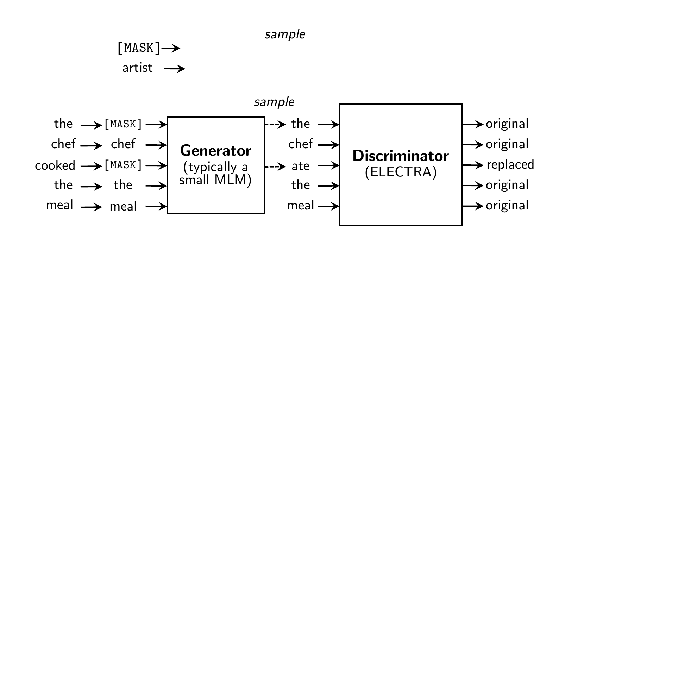
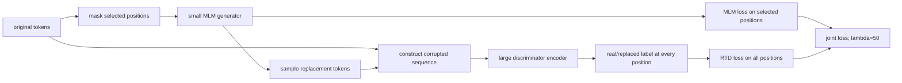
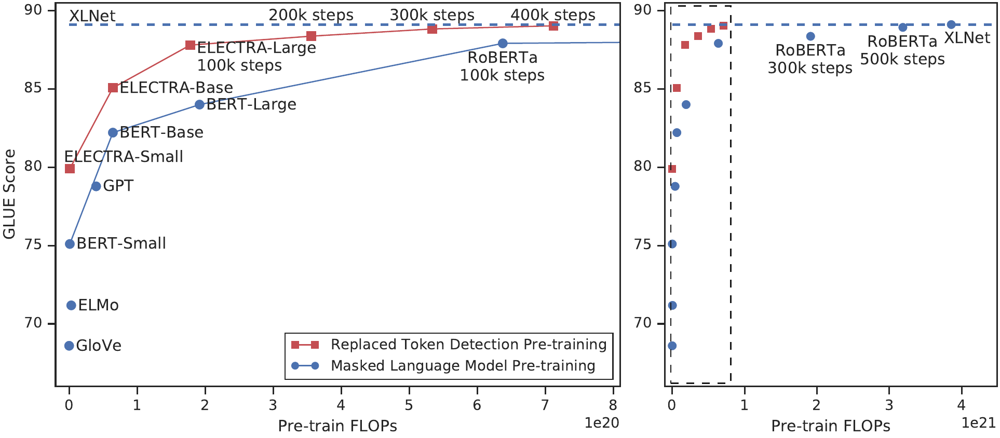
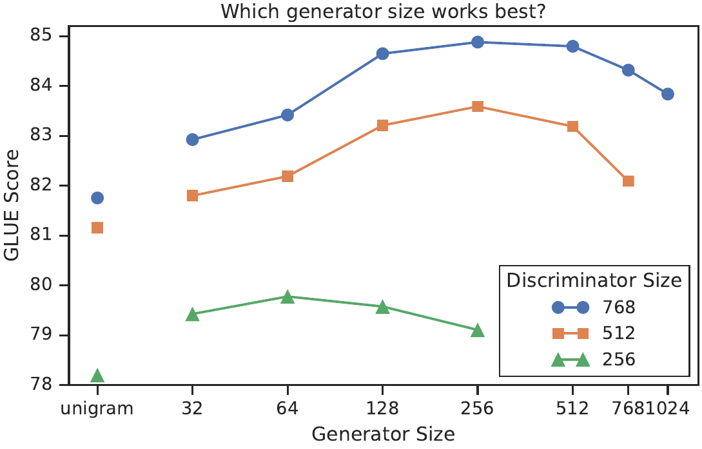

# ELECTRA — Clark et al., 2020

> **arXiv:** 2003.10555v1 · **Venue:** ICLR 2020 · **Affiliation:** Stanford University and Google Brain

## TL;DR
ELECTRA replaces sparse masked-token reconstruction with **replaced-token detection** (RTD): a small masked-language-model generator proposes plausible words, and a discriminator classifies every position as original or replaced. Because the discriminator receives supervision at all tokens rather than only the masked 15%, it learns substantially more from each input and each unit of compute. The generator is discarded after pretraining, leaving a standard Transformer encoder that can be fine-tuned like BERT.

## Problem & motivation
BERT spends a full encoder pass on a sequence but computes MLM loss only at selected positions, normally 15% of the input. Increasing the mask rate gives more targets but removes more context and changes the task. MLM also exposes the model to `[MASK]`, a symbol absent from downstream text.

ELECTRA asks whether pretraining can supervise every contextual state without reconstructing every vocabulary distribution. Its answer resembles negative sampling: use a learned proposal model to create contextually plausible corruptions, then solve a binary discrimination problem at every position. The proposal must be difficult enough to avoid trivial lexical detection, but not so strong that generating corruptions consumes most of the compute or makes discrimination pathological.

## Key idea
For an original sequence $\mathbf{x}=(x_1,\ldots,x_n)$, sample a masked-position set $M$ and form $\mathbf{x}^{\mathrm{mask}}$. A generator $G$ predicts each hidden token:

$$
p_G(x_t\mid\mathbf{x}^{\mathrm{mask}})
=\frac{\exp(e(x_t)^\top h_G(\mathbf{x}^{\mathrm{mask}})_t)}
{\sum_{x'\in\mathcal V}\exp(e(x')^\top h_G(\mathbf{x}^{\mathrm{mask}})_t)}.
$$

Here, $\mathcal V$ is the vocabulary, $e(x)$ is a token embedding, and $h_G(\cdot)_t$ is the generator state at position $t$. Sample $\hat{x}_t\sim p_G$ for each $t\in M$ and replace `[MASK]` with that sample, producing $\mathbf{x}^{\mathrm{corr}}$.

The discriminator predicts whether the observed token equals the original:

$$
D(\mathbf{x}^{\mathrm{corr}},t)
=\sigma\!\left(w^\top h_D(\mathbf{x}^{\mathrm{corr}})_t\right),
$$

where $h_D$ is the discriminator state, $w$ is a learned binary-classification vector, and $\sigma$ is the sigmoid. If the generator samples the correct original word, that position is labeled **real**.

The losses are

$$
\mathcal L_{\mathrm{MLM}}
=-\mathbb E\sum_{t\in M}\log p_G(x_t\mid\mathbf{x}^{\mathrm{mask}}),
$$

$$
\mathcal L_{\mathrm{RTD}}
=-\mathbb E\sum_{t=1}^{n}
\left[y_t\log D_t+(1-y_t)\log(1-D_t)\right],
$$

with $y_t=\mathbb 1[x_t^{\mathrm{corr}}=x_t]$, and the joint objective is

$$
\mathcal L=\mathcal L_{\mathrm{MLM}}+\lambda\mathcal L_{\mathrm{RTD}},
\qquad \lambda=50.
$$

Sampling is discrete, so discriminator gradients do not pass through sampled tokens into the generator. The generator is trained by maximum likelihood, not adversarially.

## How it works

### Corruption algorithm

1. Select approximately 15% of positions dynamically; ELECTRA-large uses 25% because its generator became too accurate at 15%.
2. Replace selected tokens with `[MASK]` for the generator input.
3. Run the generator once and sample one token from its softmax at every selected position.
4. Substitute the samples into the original sequence. Unselected positions remain unchanged.
5. Run the discriminator and classify all $n$ positions.
6. Backpropagate MLM into $G$ and RTD into $D$; shared embeddings receive both signals.
7. At the end of pretraining, discard $G$ and the binary head and fine-tune $D$.

### Generator size and embedding sharing

A generator as large as the discriminator doubles much of the compute and can make the discrimination task unnecessarily hard. A very weak unigram generator creates implausible negatives. Controlled experiments favor generator hidden sizes between one-quarter and one-half of the discriminator's; final small/base/large configurations use multipliers $1/4$, $1/3$, and $1/4$.

Token and positional embeddings are shared between networks. This is particularly useful because generator softmax training densely updates vocabulary embeddings, whereas the discriminator only encounters sampled vocabulary items. In the equal-size ablation, no sharing scores 83.6 GLUE, token-embedding sharing 84.3, and sharing all weights 84.4 (Section 3.2).

### Model configurations

| Discriminator | Layers | Hidden | FFN | Heads | Embedding | Approx. params | Generator multiplier |
|---|---:|---:|---:|---:|---:|---:|---:|
| Small | 12 | 256 | 1024 | 4 | 128 | 14M | $1/4$ |
| Base | 12 | 768 | 3072 | 12 | 768 | 110M | $1/3$ |
| Large | 24 | 1024 | 4096 | 16 | 1024 | 335M | $1/4$ |

All are bidirectional Transformer encoders. The downstream artifact is only the discriminator, so its inference cost is comparable to a same-sized BERT model even though pretraining temporarily maintains two networks.

### Why RTD is efficient

The binary task changes both target coverage and prediction space. The paper separates them with two important ablations: `ELECTRA 15%` computes discriminator loss only at selected positions, while `All-Tokens MLM` predicts vocabulary items at all positions. The former scores 82.4 GLUE, the latter 84.3, and full ELECTRA 85.0 versus BERT's 82.2 (Table 5). Thus, dense supervision supplies most of the gain, while binary discrimination contributes an additional improvement.

Joint training is not a text GAN. A reinforcement-learning adversarial generator achieved only 58% MLM accuracy versus 65% for maximum likelihood and underperformed. Two-stage training also lagged the jointly improving generator, whose increasing quality provides a natural curriculum.

## Training / data

Small and base experiments use English Wikipedia plus BooksCorpus, about 3.3B tokens. Large models use approximately 33B tokens from Wikipedia, BooksCorpus, ClueWeb, Common Crawl, and Gigaword.

| Setting | Small | Base | Large | Source |
|---|---:|---:|---:|---|
| Peak learning rate | $5\times10^{-4}$ | $2\times10^{-4}$ | $2\times10^{-4}$ | Table 6 |
| Batch size | 128 | 256 | 2048 | Table 6 |
| Mask fraction | 15% | 15% | 25% | Table 6 |
| Warmup | 10K | 10K | 10K | Table 6 |
| Adam | $\beta_1=0.9$, $\beta_2=0.999$, $\epsilon=10^{-6}$ | same | same | Table 6 |
| Weight decay | 0.01 | 0.01 | 0.01 | Table 6 |
| Dropout | 0.1 | 0.1 | 0.1 | Table 6 |
| Max length | 512 | 512 | 512 | Table 6 |

Learning rates decay linearly after warmup. ELECTRA-small trains for one million steps, about four days on one V100 and $1.4\times10^{18}$ FLOPs. Base uses 766K updates and approximately $6.4\times10^{19}$ FLOPs. Large is reported at 400K updates ($7.1\times10^{20}$ FLOPs) and 1.75M updates ($3.1\times10^{21}$ FLOPs).

Fine-tuning adds standard classification heads, while SQuAD uses the XLNet QA module. Batch size is 32, warmup is 10% of updates, and learning rates are $3\times10^{-4}$, $10^{-4}$, and $5\times10^{-5}$ for small/base/large, with layerwise decay 0.8/0.8/0.9. Most GLUE tasks train for three epochs, RTE and STS for ten, and SQuAD for two (Table 7). Development results are medians over ten runs; leaderboard results use intermediate MNLI training and ensembles, so they are less controlled.

## Results

| Model | Pretraining FLOPs | Params | GLUE dev average | Source |
|---|---:|---:|---:|---|
| BERT-small | $1.4\times10^{18}$ | 14M | 75.1 | Table 1 |
| **ELECTRA-small** | $1.4\times10^{18}$ | 14M | **80.0** | Table 1 |
| RoBERTa-500K | $3.2\times10^{21}$ | 356M | 88.9 | Table 2 |
| XLNet | $3.9\times10^{21}$ | 360M | 89.1 | Table 2 |
| **ELECTRA-400K** | $7.1\times10^{20}$ | 335M | **89.0** | Table 2 |
| **ELECTRA-1.75M** | $3.1\times10^{21}$ | 335M | **89.5** | Table 2 |

At small scale, ELECTRA gains 4.9 points over the equal-compute BERT-small and exceeds GPT's 78.8 despite GPT using about 30 times more pretraining FLOPs. At large scale, the 400K run nearly matches the longest RoBERTa and XLNet runs with less than one-quarter of their compute.

| Benchmark | ELECTRA-400K | ELECTRA-1.75M | Comparison | Source |
|---|---:|---:|---:|---|
| SQuAD 1.1 dev EM/F1 | 89.9/95.0 | **90.7/95.8** | XLNet 89.7/95.1 | Table 4 |
| SQuAD 2.0 dev EM/F1 | 85.9/89.0 | **88.3/91.0** | XLNet 86.0/89.0 | Table 4 |
| SQuAD 2.0 test EM/F1 | 86.9/89.9 | **90.0/93.0** | XLNet 87.5/90.2 | Table 4 |
| GLUE test score | — | **89.4** | RoBERTa 88.1 | Table 3; ensemble tricks used |

## Limitations & follow-ups

- Pretraining requires a generator and discriminator, so implementation and memory use are higher than a single-network objective even though the generator is small and later discarded.
- Quality depends non-monotonically on generator strength and sampling. The optimal ratio can change with architecture, vocabulary, masking rate, or training duration.
- RTD learns whether a token is consistent with one sampled corruption process, not the complete conditional token distribution. Generator artifacts may become shortcuts.
- Class imbalance is severe because most positions are real; the large discriminator loss weight is empirically chosen.
- The discrete sample blocks end-to-end discriminator gradients into the generator; attempted adversarial reinforcement learning was weaker.
- Large-model comparisons change both corpus and compute, and leaderboard fine-tuning uses ensembles and task-specific tricks.
- [DeBERTa-v3](bert-objective_2021_deberta-v3.md) identifies conflicting shared-embedding gradients and introduces gradient-disentangled sharing. [DeBERTa](bert-attention_2020_deberta.md) combines stronger positional attention with encoder pretraining.

## Links

- **Review thread:** [BERT-family overview](../bert/overview.md#161-from-masked-bidirectionality-to-stronger-encoder-objectives)
- **arXiv:** [abs](https://arxiv.org/abs/2003.10555v1) · [html](https://arxiv.org/html/2003.10555v1) · [pdf](https://arxiv.org/pdf/2003.10555v1)
- **Code:** [google-research/electra](https://github.com/google-research/electra)
- **Hugging Face:** [google/electra-large-discriminator](https://huggingface.co/google/electra-large-discriminator)
- **Project page:** —
- **Blog posts:** [Google Research overview](https://research.google/blog/more-efficient-nlp-model-pre-training-with-electra/)
- **Talks / videos:** —
- **OpenReview / venue page:** [ICLR 2020](https://openreview.net/forum?id=r1xMH1BtvB)
- **Papers-with-Code:** [ELECTRA](https://paperswithcode.com/method/electra)
- **BibTeX:** [OpenReview citation](https://openreview.net/forum?id=r1xMH1BtvB)
- **Related / successor papers:** [BERT](bert-encoder_2018_bert-pretraining.md) · [RoBERTa](bert-training_2019_roberta.md) · [DeBERTa](bert-attention_2020_deberta.md) · [DeBERTa-v3](bert-objective_2021_deberta-v3.md)
