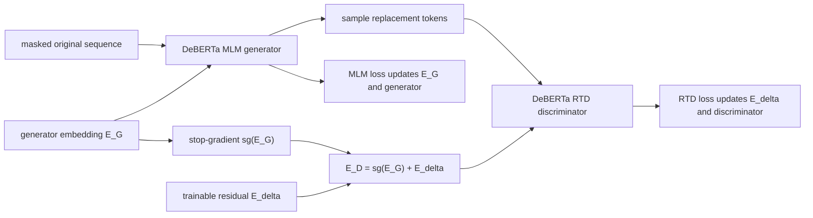
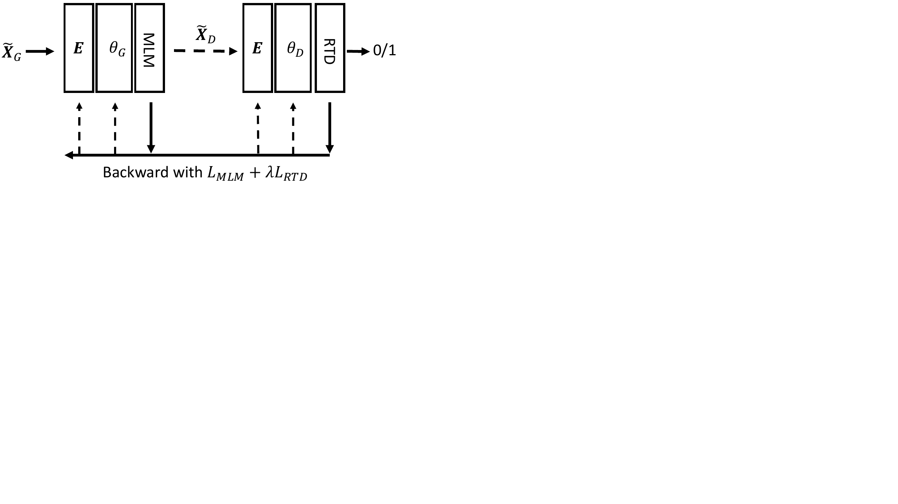
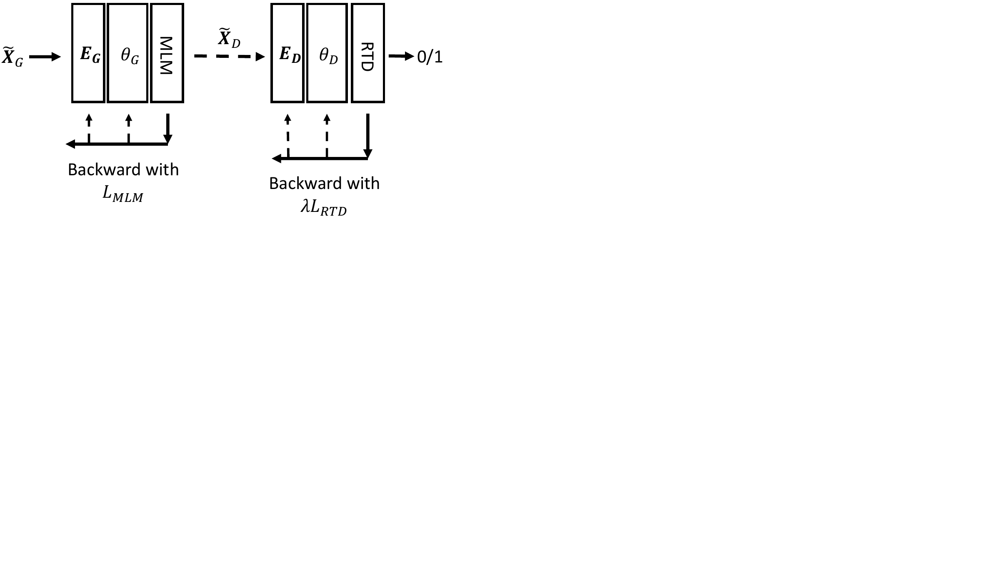
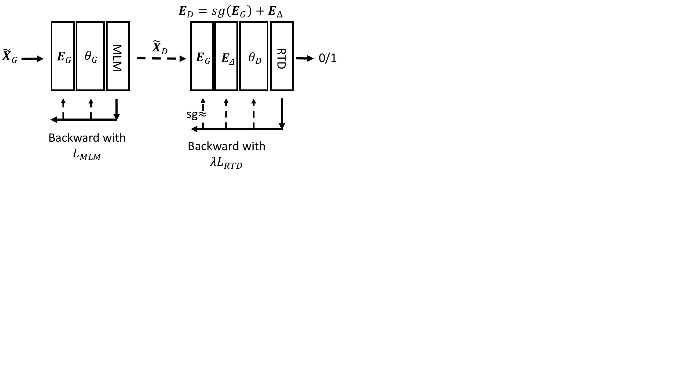
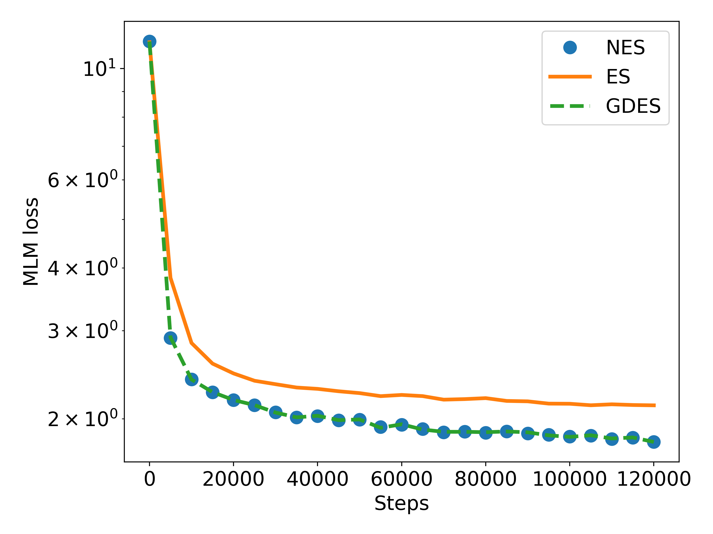

# DeBERTaV3 — He et al., 2021

> **arXiv:** 2111.09543v4 · **Venue:** ICLR 2023 · **Affiliation:** Microsoft Azure AI and Microsoft Research

## TL;DR
DeBERTaV3 combines DeBERTa's disentangled attention with ELECTRA-style replaced-token detection (RTD), then fixes a subtle weakness in ELECTRA's shared embeddings. Generator MLM gradients encourage semantically related words to become similar, whereas discriminator RTD gradients benefit from separating plausible substitutes; updating one embedding table with both creates a “tug-of-war.” **Gradient-disentangled embedding sharing** (GDES) gives the discriminator a stopped-gradient copy of generator embeddings plus a trainable residual, preserving information transfer while isolating conflicting updates. The result improves DeBERTa at large, base, small, and multilingual scales.

## Problem & motivation
[DeBERTa](bert-attention_2020_deberta.md) improves the encoder block, but its original MLM objective still supervises only masked positions. [ELECTRA](bert-objective_2020_electra.md) makes pretraining denser by using a generator to replace masked tokens and a discriminator to identify replacements at every position. ELECTRA's token-embedding sharing is useful because the generator supplies dense vocabulary learning, but it silently couples two unlike objectives.

For MLM, semantically interchangeable words should have related embeddings because they compete to explain similar contexts. For RTD, a plausible replacement must be distinguished from the exact original, which can push those same words apart. If a shared table $E$ receives both losses, its gradient is

$$
g_E=\frac{\partial\mathcal L_{\mathrm{MLM}}}{\partial E}
+\lambda\frac{\partial\mathcal L_{\mathrm{RTD}}}{\partial E}.
$$

This conflict slows generator convergence. Removing sharing avoids the conflict but discards useful semantic structure and weakens downstream fine-tuning. The paper seeks the convergence of separate embeddings with the transfer benefits of sharing.

## Key idea
GDES reparameterizes the discriminator embedding as

$$
E_D=\operatorname{sg}(E_G)+E_\Delta,
$$

where $E_G$ is the generator table, $E_\Delta$ is a discriminator-specific residual, and $\operatorname{sg}$ is the identity in the forward pass but has zero derivative:

$$
\operatorname{sg}(z)=z,
\qquad
\frac{\partial\operatorname{sg}(z)}{\partial z}=0.
$$

Consequently,

$$
\nabla_{E_G}\mathcal L=\nabla_{E_G}\mathcal L_{\mathrm{MLM}},
\qquad
\nabla_{E_\Delta}\mathcal L
=\lambda\nabla_{E_D}\mathcal L_{\mathrm{RTD}}.
$$

The discriminator sees the generator's semantic embedding during its forward pass but cannot rewrite it. Its residual learns whatever RTD-specific adjustment is useful. After pretraining, $E_G+E_\Delta$ is materialized as the discriminator embedding; the generator is discarded.

## How it works

### RTD backbone

Select masked positions $\mathcal C$, feed `[MASK]` at those positions to generator $G$, and optimize

$$
\mathcal L_{\mathrm{MLM}}
=-\mathbb E\sum_{i\in\mathcal C}
\log p_{\theta_G}(x_i\mid\widetilde{\mathbf X}_G).
$$

At each $i\in\mathcal C$, sample a replacement from the generator; preserve the original token elsewhere. The discriminator then optimizes binary labels over all positions:

$$
\mathcal L_{\mathrm{RTD}}
=-\mathbb E\sum_i
\log p_{\theta_D}
\!\left(\mathbb 1[\widetilde x_{i,D}=x_i]\mid
\widetilde{\mathbf X}_D,i\right).
$$

As in ELECTRA, the total objective is $\mathcal L_{\mathrm{MLM}}+50\mathcal L_{\mathrm{RTD}}$. Both networks use DeBERTa's separate content and relative-position representations. The generator has the discriminator's width but half its depth.

### Three embedding designs

The paper compares:

1. **Embedding sharing (ES):** one table receives MLM and RTD gradients; transfer is direct but gradients conflict.
2. **No embedding sharing (NES):** two independent tables; objectives no longer conflict, but the discriminator loses generator semantics.
3. **GDES:** discriminator reads a stopped generator table plus its own residual; gradients are separate but forward information remains shared.

The original Figure 1 is stored as three paper panels below.

| ES | NES | GDES |
|---|---|---|
|  |  |  |

### Why the residual is necessary

Using only $\operatorname{sg}(E_G)$ would prevent RTD from adapting input embeddings at all. $E_\Delta$ restores discriminator capacity without allowing its gradients to damage the generator geometry. Conversely, using two fully independent tables converges quickly but deprives the final encoder of the semantic organization learned by full-vocabulary MLM. GDES is a forward-sharing/backward-isolation compromise rather than ordinary parameter tying.

### Model family

| Variant | Discriminator layers | Hidden | Heads | Generator layers | Approx. discriminator params |
|---|---:|---:|---:|---:|---:|
| XSmall | 12 | 384 | 6 | 6 | 22M backbone; vocabulary excluded in paper comparison |
| Small | 6 | 768 | 12 | 3 | 44M backbone; vocabulary excluded |
| Base | 12 | 768 | 12 | 6 | about 184M including 128K embeddings |
| Large | 24 | 1024 | 16 | 12 | about 435M |
| mBase | 12 | 768 | 12 | 6 | larger embedding table from 250K vocabulary |

Parameter comparisons for Small/XSmall often exclude vocabulary embeddings because DeBERTaV3 uses 128K tokens versus 30K in several baselines. This distinction is essential when interpreting “22M” and “44M.”

## Training / data

English models train on approximately 160GB from Wikipedia, BookCorpus, CC-News, Stories, and OpenWebText. A 128K SentencePiece vocabulary is used. Main runs use sequence length 512, batch size 8,192, 500K updates, 15% masking, 10K warmup steps, linear learning-rate decay, AdamW with $\beta_1=0.9$, $\beta_2=0.98$, $\epsilon=10^{-6}$, weight decay 0.01, gradient clipping 1.0, and dropout 0.1. Peak learning rate is $3\times10^{-4}$ for Large and $6\times10^{-4}$ for Base/Small (Table 14).

GDES ablations use Wikipedia and BookCorpus (16GB), batch 2,048, and 125K steps. Keeping that smaller experiment distinct from final-model training avoids attributing differences in data or duration to embedding sharing.

The multilingual model uses CC100, approximately 2.5TB, a 250K SentencePiece vocabulary shared with mT5, batch 8,192, and 500K updates. It sees one-third as many steps as the cited XLM-R recipe and uses no parallel text.

Fine-tuning searches task-head dropout in $\{0,0.1,0.15,0.3\}$, batches 16–64, warmup 50–1,000 updates, learning rates around $1.5\times10^{-5}$ to $3\times10^{-5}$, and up to ten epochs. Adam fine-tuning uses $\beta_1=0.9$, $\beta_2=0.999$, weight decay 0.01, linear decay, and clipping 1.0 (Table 15).

## Results

### Does GDES solve the conflict?

| Pretraining embedding scheme | MNLI-m/mm | SQuAD 2.0 F1/EM | Source |
|---|---:|---:|---|
| DeBERTa MLM baseline | 86.3/86.2 | 82.5/79.3 | Table 6 |
| ES | 88.8/88.4 | 86.3/83.5 | Table 6 |
| NES | 88.3/87.9 | 85.3/82.7 | Table 6 |
| **GDES** | **89.3/89.0** | **87.2/84.5** | Table 6 |

NES's training curve is fast but its downstream scores fall below ES, supporting the claim that sharing provides useful transfer. GDES improves on both. Applying GDES to an ELECTRA-base reimplementation also raises MNLI-m/mm from 87.9/87.4 to 88.3/87.8 and SQuAD 2.0 from 85.0/82.3 to 85.9/83.1 F1/EM (Table 13), so the mechanism is not specific to disentangled attention.

### English models

| Model | MNLI-m | SQuAD 2.0 F1/EM | Source |
|---|---:|---:|---|
| RoBERTa-base | 87.6 | 83.7/80.5 | Table 9 |
| DeBERTa-base | 88.8 | 86.2/83.1 | Table 9 |
| **DeBERTaV3-base** | **90.6** | **88.4/85.4** | Table 9 |
| DeBERTaV3-small | 88.2 | 82.9/80.4 | Table 9 |
| DeBERTaV3-xsmall | 88.1 | 84.8/82.0 | Table 9 |

| Large model | GLUE dev average | Source |
|---|---:|---|
| RoBERTa-large | 88.82 | Table 7 |
| ELECTRA-large | 89.46 | Table 7 |
| DeBERTa-large | 90.00 | Table 7 |
| **DeBERTaV3-large** | **91.37** | Table 7 |

DeBERTaV3-large records 75.3 CoLA, 91.8/91.9 MNLI-m/mm, 96.0 QNLI, 92.7 RTE, and 92.2 MRPC in Table 7. Beyond GLUE, it reaches 91.5/89.0 SQuAD 2.0 F1/EM, 89.2 RACE accuracy, 92.3 ReCoRD F1, 93.4 SWAG accuracy, and 93.9 CoNLL-2003 NER F1 (Table 8). Gains are especially visible on CoLA, RTE, RACE, and SWAG; near-saturated tasks show smaller changes.

### Multilingual model

| Model | XNLI zero-shot average, 15 languages | Training steps | Source |
|---|---:|---:|---|
| mT5-base | 75.4 | not directly matched | Table 10 |
| XLM-R-base | 76.2 | 1.5M | Table 10 |
| **mDeBERTaV3-base** | **79.8** | 500K | Table 10 |

In the translate-train-all setting, mDeBERTaV3-base averages 82.2 versus XLM-R-base's 79.1 (Table 10). These comparisons support strong cross-lingual transfer but do not isolate objective alone because tokenization and other recipes differ.

## Limitations & follow-ups

- GDES adds an entire residual vocabulary table. With a 128K or 250K vocabulary, embedding memory is substantial even when backbone parameter counts look small.
- The paper argues gradient conflict from convergence and downstream ablations but does not directly measure gradient cosine similarity throughout training.
- Generator sampling remains discrete; GDES isolates embedding gradients but does not make RTD end-to-end differentiable.
- Final results combine DeBERTa architecture, RTD, a large vocabulary, data scale, and GDES. Table 6 isolates sharing on smaller runs, not every final-recipe choice.
- Small-model comparisons exclude vocabulary embeddings and do not use distillation, so they answer a different efficiency question from compressed 30K-vocabulary baselines.
- The multilingual result changes vocabulary, corpus, and objective relative to XLM-R; fewer steps do not imply proportionally less total compute without matched throughput accounting.
- Scaling beyond Large and transfer to objectives other than generator–discriminator RTD remain open.

## Links

- **Review thread:** [BERT-family overview](../bert/overview.md#161-from-masked-bidirectionality-to-stronger-encoder-objectives)
- **arXiv:** [abs](https://arxiv.org/abs/2111.09543v4) · [html](https://arxiv.org/html/2111.09543v4) · [pdf](https://arxiv.org/pdf/2111.09543v4)
- **Code:** [microsoft/DeBERTa](https://github.com/microsoft/DeBERTa)
- **Hugging Face:** [microsoft/deberta-v3-large](https://huggingface.co/microsoft/deberta-v3-large) · [microsoft/mdeberta-v3-base](https://huggingface.co/microsoft/mdeberta-v3-base)
- **Project page:** —
- **Blog posts:** —
- **Talks / videos:** —
- **OpenReview / venue page:** [ICLR 2023](https://openreview.net/forum?id=sE7-XhLxHA)
- **Papers-with-Code:** [DeBERTaV3](https://paperswithcode.com/method/debertav3)
- **BibTeX:** [OpenReview citation](https://openreview.net/forum?id=sE7-XhLxHA)
- **Related / predecessor papers:** [BERT](bert-encoder_2018_bert-pretraining.md) · [ELECTRA](bert-objective_2020_electra.md) · [DeBERTa](bert-attention_2020_deberta.md)
